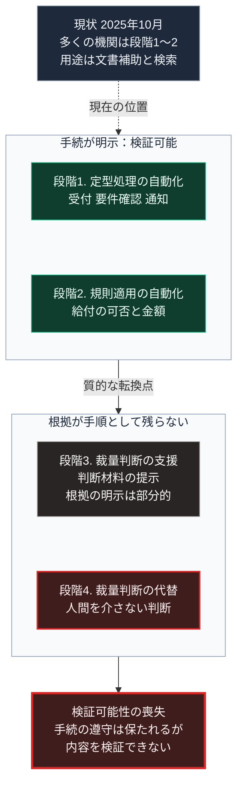

### 序論：本章が扱う範囲

本章は、行政の判断が自動化される過程で、何が維持され、何が変質するかを整理します。

本章は、第Ⅱ部C-8で記述した行政のデジタル化の延長にあります。デジタル化が記録の様式の変更であるのに対し、本章が扱うのは判断そのものの変更です。

本文は、構造の整理に限定します。評価は章末で扱います。

### 1. 自動化の段階

行政における判断の自動化は、次の段階に分けられます。

**段階1：定型的な処理の自動化**。申請の受付、要件の確認、そして通知の発送など、規則が明示されている処理です。

**段階2：規則の適用の自動化**。給付の可否や金額など、規則を個別の事案に適用する判断です。

**段階3：裁量を伴う判断の支援**。規則が一義的に定まらない事案について、判断の材料を提示する処理です。

**段階4：裁量を伴う判断の代替**。段階3の判断そのものを、人間を介さずに行う処理です。

現在、多くの行政機関は段階1から段階2にあります。段階3の導入が一部で進み、段階4は限定的です。

この現状は、公表資料から確認できます。デジタル庁は2025年5月27日、行政での生成AIの調達と利活用に関するガイドラインを決定し、2026年6月に改定しました [ [ 337 ] ](https://www.digital.go.jp/news/3579c42d-b11c-4756-b66e-3d3e35175623) 。総務省が2026年4月24日付で公表した調査によれば、2025年10月末の時点で生成AIを導入済みの団体は、都道府県と指定都市で100%、その他の市区町村で45.6%です [ [ 338 ] ](https://www.soumu.go.jp/main_content/001070295.pdf) 。これらの資料が対象とする用途は、文書作成の補助や情報検索などの段階1と段階3の支援であり、判断の代替ではありません。

### 2. 正統性の供給源との関係

第Ⅰ部B-1で整理したとおり、現代の統治は手続の遵守と構成員の同意によって正統性を調達しています。

行政判断の自動化は、このうち手続の遵守という供給源に作用します。

段階1と段階2においては、手続が明示されているため、自動化された処理が手続に沿っているかを検証できます。

段階3と段階4においては、判断の根拠が明示的な手順として記述されない場合があります。第Ⅰ部C-10で述べたとおり、明示的な手順を持たない処理については、出力の妥当性を手順の検査によって確認できません。

この場合、手続の遵守という事実は保たれても、その手続の内容を検証できなくなります。第Ⅰ部B-1で述べたとおり、正統性の供給源の1つは手続の遵守です。本書ではこれを供給源3と呼びます。供給源3の限界は、手続が遵守されていても結果が受け入れられない場合に現れます。

### 3. 不服申立の制度との関係

行政の決定については、決定の理由を示し、不服を申し立てる制度が整備されています。行政手続法は、第8条で申請を拒否する処分の理由の提示を、第14条で不利益処分の理由の提示を行政庁に義務づけています [ [ 339 ] ](https://laws.e-gov.go.jp/law/405AC0000000088) 。処分に対する審査請求の手続は、行政に関する不服審査の法律である平成26年法律第68号が定めています [ [ 420 ] ](https://laws.e-gov.go.jp/law/426AC0000000068) 。

この制度は、決定の根拠が特定でき、その妥当性を争えることを前提とします。

段階4の自動化において、根拠が明示的な手順として記述されない場合、この前提が満たされません。不服申立の制度は形式上維持されますが、争うべき対象を特定できないため、実質的に機能しにくくなります。

第Ⅱ部C-4で述べたとおり、開発主体の判断について同等の手続は保証されていません。行政判断の自動化が開発主体の提供するシステムに依存する場合、この問題は行政の側にも及びます。

### 4. 第Ⅱ部C-6の枠組みとの関係

第Ⅱ部C-6で整理した4つの分析のうち、ズボフの分析が本章に直接関わります。予測精度を最適化の目標とする処理が、利用者の利益と一致する保証はありません。

行政判断の自動化においても、最適化の目標が何であるかが決定的です。処理速度、費用、あるいは特定の指標の達成が目標である場合、第Ⅰ部C-8で述べたとおり、目標とされた指標が最適化され、指標に載らない側面は軽視されます。

### 🗺️ 図：自動化の段階と、検証可能性の変化

#### 図の読み方

この図は、上から下へ縦に並ぶ形をしています。最上段が現状、その下に2つの枠が縦に並び、最下段が帰結です。上の枠は手続が明示された段階1と段階2、下の枠は根拠が手順として残らない段階3と段階4です。2つの枠をつなぐ矢印が、質的な転換点です。

上の枠の段階1と段階2は、第Ⅰ部C-2で述べた記録の様式の延長にあります。手順が明示されているため、業務は担当者から独立し、かつ検証可能です。この段階の自動化は、正統性の供給に影響しません。最上段の点線が示すとおり、現在の多くの行政機関はこの枠の中にあります。

上の枠から下の枠への移行が、質的な転換点です。ここで失われるのは、判断の速度や精度ではなく、根拠を検証する可能性です。最下段が、その帰結です。

第Ⅳ部-1で述べる「代行から開示へ」という期待の変化は、この転換点に対する応答として理解できます。判断を代行する能力が高まるほど、根拠を開示する仕組みの重要性が高まります。

なお、この図は段階4への移行を否定するものではありません。示しているのは、段階4を採用する場合、根拠の開示と不服申立の実質的な手段が、別途設計されなければならないという点です。

---

### 現代社会構造への射程と本質（本章のまとめ）

本セクションは、著者による解釈です。前節までの記述とは区別して読んでください。

1.  **現代社会構造の原点**

    行政判断の自動化は、第Ⅰ部A-6で記述した中央集権化の延長にあります。中央が定めた基準を全国で均質に執行するという要請が、判断の標準化を求め、標準化された判断が自動化の対象となりました。

2.  **歴史的事実の本質**

    本章から抽出できるのは、次の点です。正統性の供給源としての手続の遵守は、手続の内容が検証可能である限りにおいて機能します。遵守という事実だけでは、正統性は供給されません。

3.  **現代社会の現状と課題**

    第Ⅲ部-4で述べる依存対象の移行は、行政の領域においても生じます。窓口への依存が、判断を自動化するシステムへの依存に置き換わる過程です。

    第Ⅴ部で扱う設計要件のうち、判断の根拠が自動的に提示されること、そして参照した情報源へ到達できることは、本章の構造に対する応答です。行政に限らず、判断を委ねるすべてのシステムに、同じ要件が適用されます。
