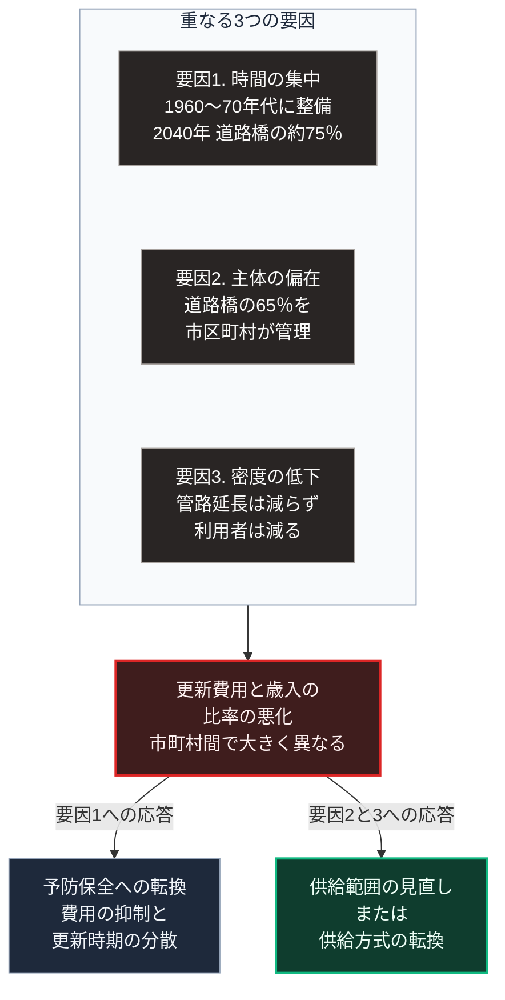

### 序論：本章が扱う範囲

本章は、日本の集約型インフラが設計時に置いていた前提を整理し、そのうえで、公共インフラがどの程度の規模で更新期を迎えているかを確認します。

本章の情報源は、所管官庁と関係機関が公表する資料に限定します。本文は事実の記述に限定し、解釈は章末で扱います。

### 1. 集約型インフラの設計前提

[第Ⅰ部C](innovation-overview)で記述したとおり、集約型のインフラは19世紀から20世紀にかけて成立しました。その設計は、明示的または暗黙的に、次の前提を置いています。

**前提1：外力の分布が変わらないこと**。治水、排水、送電の各設備は、過去の観測統計に基づく外力を想定して設計されます。

この前提は、各分野の設計基準に明示されています。国土交通省の河川に関する技術基準は、計画の対象とする降雨の規模を、降雨量の年超過確率によって評価すると定めています [ [ 287 ] ](https://www.mlit.go.jp/river/shishin_guideline/gijutsu/gijutsukijunn/keikaku/pdf/keikaku_kihon_all_2025.pdf) 。電気設備の技術基準を定める省令は、架空電線路の支持物について、10分間平均で風速40メートル毎秒の風圧荷重を考慮するよう定めています [ [ 288 ] ](https://laws.e-gov.go.jp/law/409M50000400052) 。下水道については、国土交通省のガイドラインが、従来の計画では5年から10年に1回の規模の降雨を一律の整備水準としてきたと記述しています [ [ 289 ] ](https://www.mlit.go.jp/mizukokudo/sewerage/content/001728942.pdf) 。

**前提2：需要が維持または拡大すること**。設備の規模は、整備時点で見込まれた需要に対応しています。利用者1人あたりの費用は、需要が維持される限りにおいて設計値に収まります。

**前提3：財源が継続すること**。設備の維持と更新は、税収または料金収入が継続することを前提とします。

**前提4：供給設備が攻撃の対象とならないこと**。[第Ⅰ部D-4](war-total-war-and-nuclear)で記述したとおり、生活基盤への攻撃を制限する規範が成文化されており、設計はこれを前提としてきました。

### 2. 各前提の現状

**前提1について**。[第Ⅱ部D-7](27_climate-change-physical-catastrophe)で整理するとおり、気象庁は極端な気象現象の長期的な観測結果を公表しており、外力の分布に変化が観測されています [ [ 210 ] ](https://www.data.jma.go.jp/cpdinfo/extreme/extreme_p.html) 。

**前提2について**。[第Ⅱ部A-2](japan-population-decline)で示したとおり、総人口は減少局面にあり、[第Ⅱ部A-4](39_fortressed-cities-vulnerable-wilderness)で示すとおり、その減少は区画ごとに不均等です。

**前提3について**。[第Ⅱ部A-1](japan-current-state)で示したとおり、2026年度の公債依存度は24.2%であり、国と地方の長期債務残高は国内総生産の約194%です [ [ 127 ] ](https://www.mof.go.jp/policy/budget/fiscal_condition/related_data/202604.html) 。

**前提4について**。[第Ⅱ部B-1](report-ukraine-war)で記述するとおり、進行中の武力紛争において、発電設備と送電網を攻撃対象とする事例が観測されています [ [ 148 ] ](https://www.iea.org/reports/ukraines-energy-security-and-the-coming-winter) 。

以下の各節で扱う更新費用の問題は、前提2と前提3が変化した状態のもとで生じています。

### 3. 整備の集中した時期

日本の社会資本の多くは、1960年代から1970年代にかけて集中的に整備されました。道路、橋梁、トンネル、上下水道、港湾、そして河川管理施設です。

整備の時期が集中しているため、更新の時期も集中します。国土交通省は、この状況を「社会資本の老朽化」として整理し、資料を公表しています [ [ 218 ] ](https://www.mlit.go.jp/sogoseisaku/maintenance/02research/02_01.html) 。

### 4. 建設後50年以上を経過する施設の割合

同省の資料によれば、建設後50年以上を経過する施設の割合は、次のとおり推計されています。数値は2024年3月時点のストックに基づきます [ [ 219 ] ](https://www.mlit.go.jp/sogoseisaku/maintenance/_pdf/50year_percentage.pdf) 。

| 施設 | 規模 | 2025年3月 | 2030年3月 | 2040年3月 |
| --- | --- | --- | --- | --- |
| 道路橋（橋長2メートル以上） | 約73万橋 | 約42% | 約54% | 約75% |
| トンネル | 約1万2千本 | 約28% | 約35% | 約52% |
| 河川管理施設 | 約2万8千施設 | 約26% | 約41% | 約64% |
| 水道管路 | 約75万キロメートル | 約10% | 約20% | 約40% |
| 下水道管渠 | 約50万キロメートル | 約7% | 約15% | 約34% |
| 港湾施設（主要な施設） | 約2万5千施設 | 約29% | 約40% | 約64% |

同資料は、この割合が加速度的に高くなると記述しています。また、施設の老朽化は建設年度で一律に決まるものではなく、便宜的に建設後50年で整理したと注記しています [ [ 219 ] ](https://www.mlit.go.jp/sogoseisaku/maintenance/_pdf/50year_percentage.pdf) 。

水道管路については、建設後50年ではなく、法定耐用年数である40年を基準とした統計も公表されています。総務省の資料によれば、2023年度の決算統計に基づく管路経年化率は全国平均で25.4%です。総管路延長773,235キロメートルのうち、196,022キロメートルが法定耐用年数を経過しています。同年度の管路更新率は0.61%です [ [ 290 ] ](https://www.soumu.go.jp/main_content/001022598.pdf) 。

### 5. 政府の対応方針

国土交通省は、2021年度から2025年度を対象とするインフラ長寿命化計画を2021年6月に策定し [ [ 220 ] ](https://www.mlit.go.jp/report/press/content/001409546.pdf) 、2024年4月に改訂しています [ [ 291 ] ](https://www.mlit.go.jp/sogoseisaku/maintenance/_pdf/chozyumyou2kaitei_honbun.pdf) 。同計画の期間は2025年度末で終了しました。同省は2026年2月に、同計画のフォローアップ結果を公表しています [ [ 292 ] ](https://www.mlit.go.jp/report/press/sogo21_hh_000293.html) 。2026年度以降を対象とする後継の計画は、2026年9月2日の時点で公表されていません。

同計画の基本方針は、施設が損傷してから対処する事後保全から、損傷が軽微な段階で対処する予防保全へ転換することです。同計画は、予防保全への転換によって、30年間の維持管理と更新に要する費用を抑制できると推計しています。

同省はまた、点検、診断、措置、記録という一連の手順を維持管理の基本として定めています [ [ 221 ] ](https://www.mlit.go.jp/sogoseisaku/maintenance/) 。

### 6. 費用の負担構造

インフラの維持管理と更新は、国、都道府県、市町村がそれぞれ管理する施設について、各主体が負担します。

国土交通省の道路メンテナンス年報の2026年8月版によれば、約73万橋の道路橋のうち、地方公共団体が管理する橋は約67万橋で9割以上を占めます。管理者別の内訳は、市区町村65%、都道府県19%、政令市6%です。約1万2千箇所のトンネルについては、地方公共団体が約7割を管理し、市区町村の分は18%です [ [ 293 ] ](https://www.mlit.go.jp/road/sisaku/yobohozen/pdf/r07/r07_08maint.pdf) 。すなわち、更新期を迎える施設の相当部分が、財政規模の小さい主体の管理下にあります。

次章の[第Ⅱ部A-4](39_fortressed-cities-vulnerable-wilderness)で示すとおり、人口の減少は区画ごとに不均等な速度で進行します。したがって、更新費用と歳入の比率も、市町村の間で大きく異なります。

### 🗺️ 図：更新期の集中が生む構造

3つの要因の重なりが、どの経路で財政上の課題となるかを示します。

#### 図の読み方

この図は、上段の枠内に3つの要因が縦に並び、中段の1つの帰結へ集まり、下段で左右2つの対応へ分かれる形をしています。

上段の要因1は時間の集中です。整備が集中したため、更新も集中します。これは施設の質とは無関係に、整備の時期から機械的に導かれます。

要因2は主体の偏在です。道路橋の65%を管理する市区町村は、財政規模が小さい傾向にあります。

要因3は人口密度の低下です。[第Ⅱ部A-2](japan-population-decline)で述べたとおり、管路や道路の延長は利用者が減っても短くなりません。

中段の帰結は、3つの要因が重なって生じます。単一の要因では、この帰結には至りません。

下段の左は、政府の対応方針である予防保全への転換です。これは要因1に対する応答です。費用の総額を抑制し、更新の時期を分散させます。

下段の右は、要因2と要因3に対する応答です。これらは費用の抑制だけでは解決しません。負担する主体の能力と、負担を分担する利用者の数が減少しているためです。この点で、供給範囲そのものの見直し、あるいは供給方式の転換が論点となります。

---

### 現代社会構造への射程と本質（本章のまとめ）

本セクションは、著者による解釈です。前節までの記述とは区別して読んでください。

1.  **現代社会構造の原点**

    本章で示した施設群は、[第Ⅰ部A-6](meiji-centralization)で記述した全国一律の供給という設計思想の物理的な帰結です。人口と税収がともに拡大する局面において、全国に同じ水準の施設を整備することは、合理的な選択でした。

    第1節に示した4つの前提も、設計の時点ではいずれも妥当でした。したがって現在の状況は、設計の誤りではありません。設計の前提と実際の条件との乖離です。

    同時に、この整備は将来の更新費用を織り込んでいました。更新費用は整備時点では発生しないため、意思決定において軽く扱われやすい性質を持ちます。[第Ⅰ部C-8](07_politics-of-metering)で述べた計量の問題が、ここにも現れます。

2.  **歴史的事実の本質**

    [第Ⅰ部A-2](03_roman-infrastructure-collapse)で記述したローマの事例では、財政基盤の縮小が維持の断念を通じてインフラの喪失へ至りました。本章の状況は、その初期段階と構造的に対応します。ローマの水道もまた、徴税基盤が維持されるという前提のうえに設計されていました。

    ここから抽出できるのは、次の点です。設計の妥当性は前提の妥当性に依存し、前提は時間とともに変化します。

    [第Ⅰ部A-8](dynastic-cycle-and-corruption)で整理した枠組みに照らすと、前提の変化は余力の逓減として作用します。前提1と前提4は外力の側を変え、前提2と前提3は対応する側の能力を変えます。両者が同時に進行する場合、以前は吸収できた規模の事象を吸収できなくなります。

    ただし決定的な差異があります。現在は、更新期の到来が事前に把握されています。表として示した推計は、対応の余地がある時点で公表されたものです。

3.  **現代社会の現状と課題**

    前提の変化に対する対応は、2つに分かれます。前提を回復する方向と、前提に依存しない構成を追加する方向です。

    前者は、第5節で述べた予防保全への転換や、[第Ⅱ部A-4](39_fortressed-cities-vulnerable-wilderness)で記述する居住の誘導にあたります。後者が、[第Ⅴ部](42_taoist-wu-wei-non-action)で扱う設計です。両者は代替関係ではなく、併用されます。

    [第Ⅲ部-3](event-risk-catalog)で定義する区分A、すなわち進行中の変化は前提1から前提3に対応します。不連続な事象である区分Bは、前提4の供給設備への攻撃と、極端な気象現象の個別の発生に対応します。

    [第Ⅲ部-7](scenario-baseline)で述べるベースラインの経過は、本章の構造から導かれます。更新の延期と縮小が累積し、集約型インフラの維持範囲が段階的に縮小する経路です。

    第Ⅴ部では、維持範囲の外側に置かれる区域において、集約型に代わる供給方式が成立しうるかを検討します。本章の数値は、その検討がどの程度の規模で必要になるかを示しています。
