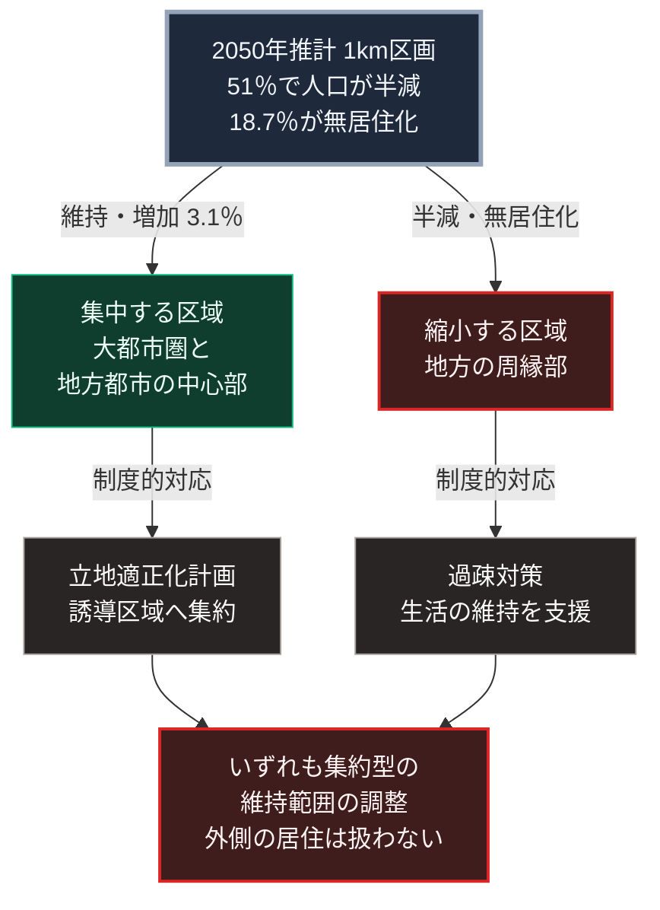

### 序論：本章が扱う範囲

本章は、日本の国土において居住がどのように分布し、今後どのように変化すると推計されているかを、国土交通省の公表資料から整理します。

本文は事実の記述に限定します。解釈は章末で扱います。

### 1. 2050年に向けた推計

国土交通省の国土政策局は、2050年を展望した国土の状況変化に関する推計を公表しています [ [ 225 ] ](https://www.mlit.go.jp/report/press/content/001369177.pdf) 。

同推計は、国土を1キロメートル四方の区画に分け、各区画の人口を推計したものです。基礎とされたのは、総務省の国勢調査と、国立社会保障・人口問題研究所の将来推計人口です。

同推計の参考資料によれば、2015年時点で人が居住していた区画のうち、2050年までに次の変化が見込まれています [ [ 226 ] ](https://www.mlit.go.jp/policy/shingikai/content/001365995.pdf) 。

2015年時点の居住区画全体のうち、約5割にあたる51%で人口が半分以下に減少します。この51%の内訳は、無居住化する区画の18.7%と、人口が50%以上減少する区画の32.3%です。すなわち、居住区画全体の約2割が無居住化します。一方、人口が増加する区画は3.1%であり、それらは都市部と一部の地域に限られます [ [ 226 ] ](https://www.mlit.go.jp/policy/shingikai/content/001365995.pdf) 。

すなわち、全国平均としての人口減少は、区画ごとに見ると、無居住化する区画と人口が維持または増加する区画とへの分化として現れます。

### 2. 都市の側の対応 ―― 立地適正化計画

国土交通省は、都市の機能と居住を一定の区域へ誘導する制度を運用しています。この制度に基づいて市町村が策定する計画は、立地適正化計画と呼ばれます [ [ 227 ] ](https://www.mlit.go.jp/en/toshi/city_plan/compactcity_network.html) 。

同計画は、2つの区域を設定します。第一に、居住を誘導して人口密度を一定以上に維持する居住誘導区域。第二に、医療、福祉、商業などの機能を誘導する都市機能誘導区域です。

同省の手引きによれば、この制度の目的は、人口減少下において生活サービスと公共交通を持続可能な形で維持することにあります [ [ 228 ] ](https://www.mlit.go.jp/en/toshi/city_plan/content/001741220.pdf) 。

### 3. 過疎地域の側の対応

人口の著しい減少に直面する地域については、総務省が過疎対策として支援措置を講じています [ [ 229 ] ](https://www.soumu.go.jp/main_sosiki/jichi_gyousei/c-gyousei/2001/kaso/kasomain0.htm) 。

現行の根拠法は、過疎地域の持続的発展の支援に関する特別措置法です。同法は令和3年法律第19号として2021年4月1日に施行され、2031年3月31日限りで効力を失う時限法です [ [ 294 ] ](https://laws.e-gov.go.jp/law/503AC1000000019) 。

対象となる地域の指定は、人口の減少率と財政力を基準として行われます。

### 4. 2つの対応の関係

前2節の制度は、方向が異なります。

立地適正化計画は、居住と機能を特定の区域へ集約する方向です。過疎対策は、人口の減少した地域における生活の維持を支援する方向です。

両者は矛盾しません。前者は都市の内部における配置の問題であり、後者は都市の外側における維持の問題です。ただし、財政の制約のもとでは、両者への資源配分が競合します。

### 🗺️ 図：分布の分化と、2つの制度的対応

推計が示す分化と、それに対する制度の位置を示します。

#### 図の読み方

この図は、上段の推計から左右2列へ分かれ、下段で再び1つに集まる形をしています。左列は集中する区域、右列は縮小する区域です。各列の2段目に、対応する制度を置いています。

上段が示すのは、人口減少が一様な縮小ではなく、分化として進行するという点です。全国の総人口が減少する中で、区画によっては人口が増加します。逆に、居住者がいなくなる区画も相当数に上ります。全国平均の統計では、この差が見えにくくなります。

分化の帰結として、供給インフラの条件も分化します。第Ⅱ部A-4で示した更新期の施設は、左右どちらの区域にもあります。左列では利用者密度が維持され、右列では低下します。同じ施設であっても、1人あたりの維持費用は大きく異なります。

2段目の制度は、それぞれの区域に対応しています。ただし、下段が示すとおり、いずれも既存の供給方式を前提としています。すなわち、集約型のインフラをどの範囲で維持するかという問いへの回答であり、集約型以外の方式については扱っていません。

前章の第Ⅱ部A-4で述べた更新期の構造に、本章の分化を重ねたものが、第Ⅲ部-9で述べるベースラインの前提です。第Ⅴ部で扱うのは、縮小する区域において、集約型に代わる供給方式が成立しうるかという問いです。

---

### 現代社会構造への射程と本質（本章のまとめ）

本セクションは、著者による解釈です。前節までの記述とは区別して読んでください。

1.  **現代社会構造の原点**

    現在の居住分布は、第Ⅰ部C-5で記述した産業革命期の集約に起源を持ちます。動力の伝達方式という技術的制約が人を集めました。その制約が解除された後も、雇用と対面の交流という別の要因が集中を維持しています。

    したがって、集中の理由は時期によって異なります。技術的制約から始まり、現在は社会的な要因によって維持されています。

2.  **歴史的事実の本質**

    第Ⅰ部A-2で記述したローマの事例においても、統治の後退期に居住の分布が変化しました。広域の供給が途絶した区域から、供給が維持される区域へ人が移動しました。

    本章の推計が示す分化は、これと同型の過程が、緩やかに進行している状態と理解できます。ただし、現在は推計が事前に公表されており、対応の選択肢が存在する点で異なります。

3.  **現代社会の現状と課題**

    2つの制度的対応は、いずれも集約型インフラの維持範囲の調整です。この調整は必要ですが、維持範囲の外側に残る居住については、扱われていません。

    第Ⅴ部では、この外側に対する設計を検討します。そこでの問いは、密度の低い区域において、生活に必要な下限の供給を集約型インフラへ依存せず確保できるかどうかです。
