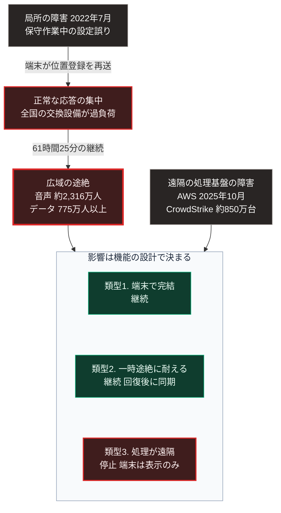

### 序論：本章が扱う範囲

本章は、生活と業務が広域の通信網にどの程度依存しているか、そしてその通信網が途絶した事例で何が観測されたかを記述します。

本章の情報源は、総務省の公表資料と、事業者が公表した事故の検証報告に限定します。本文は事実の記述に限定し、解釈は章末で扱います。

### 1. 依存の構造

現在、多くの機能が広域の通信網を前提として設計されています。

決済、交通の運行管理、物流の追跡、行政手続、医療情報の参照、そして家庭内の機器制御です。これらの機能の多くは、端末の側に処理能力を持たず、遠隔の設備へ通信して結果を受け取る構成を採ります。

この構成は、端末を安価にし、更新を容易にします。第Ⅰ部C-11で記述したとおり、情報の所在と処理が少数の事業者へ集中する構造は、この設計の帰結です。

通信の利用状況と基盤の整備状況については、総務省が年次の白書として公表しています [ [ 222 ] ](https://www.soumu.go.jp/johotsusintokei/whitepaper/) 。

### 2. 観測された事例 ―― 2022年7月の通信障害

2022年7月2日、携帯電話事業者の全国的な通信障害が発生しました。総務省は、この事案について事業者から重大な事故の報告書を受領し [ [ 223 ] ](https://www.soumu.go.jp/menu_news/s-news/01kiban05_02000246.html) 、検証会議による報告書を公表しています [ [ 224 ] ](https://www.soumu.go.jp/main_content/000839847.pdf) 。

検証報告書によれば、事案の概要は次のとおりです。

障害の継続時間は61時間25分でした。影響を受けた利用者は、音声通信について約2,316万人、データ通信について775万人以上とされています [ [ 224 ] ](https://www.soumu.go.jp/main_content/000839847.pdf) 。

原因は、中継網の中核設備における保守作業中の設定誤りでした。一部の通信が途絶した結果、端末が位置登録の信号を繰り返し再送し、全国の交換設備と加入者データベースが輻輳しました。

同報告書は、単一の設定誤りが、輻輳という機序を通じて全国規模へ波及した経過を記述しています。

### 3. 事例が示す構造

この事案は、第Ⅱ部D-5で記述した電力系統の連鎖停止と同型の構造を持ちます。

第一段階として、局所の障害が発生します。第二段階として、その障害への端末側の正常な応答、すなわち再送が集中します。第三段階として、集中した負荷が他の設備を機能不全に陥らせます。

個々の端末の動作は正常でした。正常な動作の集中が、全体の停止を招きました。

第Ⅱ部D-4で整理した判定基準に照らすと、中継網の中核設備は基準3、すなわち影響範囲において最も深刻な単一障害点にあたります。

### 4. 観測された事例 ―― 遠隔の処理基盤の障害

通信経路が正常であっても、処理とデータを置く遠隔の基盤が停止すれば、それに依存する機能は止まります。この類型の事例を2つ記述します。

2025年10月19日から20日にかけて、Amazon Web Servicesの北バージニア地域で障害が発生しました。同社の事後報告によれば、原因はデータベースサービスのDNS管理システムに潜在していた競合状態であり、これによって同サービスの地域エンドポイントのDNS記録が空になりました。障害は太平洋時間の19日23時48分に始まり、主要な影響は20日14時20分に解消しました。影響は同サービスに依存する多数のサービスへ波及しました [ [ 434 ] ](https://aws.amazon.com/message/101925/) 。

2024年7月19日には、セキュリティ企業CrowdStrikeが配信した設定ファイルの欠陥により、世界各地のWindows端末が起動不能となりました。同社の根本原因分析によれば、配信された設定ファイルが想定より1つ多い入力項目を含んでいたことが原因でした [ [ 435 ] ](https://www.crowdstrike.com/wp-content/uploads/2024/08/Channel-File-291-Incident-Root-Cause-Analysis-08.06.2024.pdf) 。Microsoftは、影響を受けた端末を約850万台と推計しています [ [ 436 ] ](https://blogs.microsoft.com/blog/2024/07/20/helping-our-customers-through-the-crowdstrike-outage/) 。

2つの事例に共通するのは、単一の事業者における1つの欠陥が、その事業者に依存する多数の組織へ同時に波及した点です。

### 5. 途絶時に停止する機能の分類

通信が途絶した場合に何が停止するかは、機能の設計によって異なります。次の3類型に分けられます。

**類型1：端末の側で完結する機能**

通信がなくても動作します。端末に処理能力とデータを持つ構成です。

**類型2：通信を前提とするが、一時的な途絶に耐える機能**

途絶の間は最後に取得した情報で動作し、回復後に同期します。

**類型3：通信がなければ動作しない機能**

処理とデータが遠隔にあり、端末は表示のみを担う構成です。

第4節で記述した2つの事例において影響を受けた機能は、いずれも類型3に属します。類型3が増加した理由は、第1節で述べたとおり、端末の費用と更新の容易さにあります。

### 🗺️ 図：通信の途絶が波及する経路

局所の障害が全国規模へ至る機序と、影響の範囲を規定する要因を示します。

#### 図の読み方

この図は、左側に上から下へ3段の連鎖があり、右側に別の1つの枠を置き、両者が下段の枠内へ集まる形をしています。下段の枠内には、機能の3類型が縦に並びます。

左側の3段は、検証報告書が記述した事実の経過です。重要なのは、障害の原因が保守作業中の設定誤りという、特別ではない事象であった点です。攻撃ではなく、災害でもありません。日常的な作業の1つが、全国規模の途絶へ至りました。

右側の枠は、通信経路が正常でも生じる別の類型の障害です。遠隔の処理基盤が停止すれば、それに依存する機能は止まります。

下段で重要なのは、同じ途絶であっても、機能の設計によって影響が異なるという点です。類型1と類型2の機能は継続し、類型3の機能は停止します。左右どちらの障害でも、影響を受けたのは類型3でした。

したがって、通信の途絶に対する備えとは、通信網の冗長化だけを指しません。どの機能を類型3から類型1または類型2へ移すかという、機能側の設計の問題でもあります。

第Ⅰ部C-11で述べたとおり、分散設計は明示的に規定した層でのみ分散を保証します。通信経路が冗長であっても、機能が類型3であれば、途絶時には停止します。

---

### 現代社会構造への射程と本質（本章のまとめ）

本セクションは、著者による解釈です。前節までの記述とは区別して読んでください。

1.  **現代社会構造の原点**

    類型3の機能が増加した背景には、第Ⅰ部C-7およびC-11で記述した経緯があります。処理を集約すれば単位あたり費用は下がり、端末は安価になります。この経済性が、集約を選択させてきました。

    したがって、類型3への集中は設計の誤りではありません。効率を基準とした設計の帰結です。

2.  **歴史的事実の本質**

    本章の事例から抽出できるのは、次の一般則です。集約された系においては、日常的な作業の誤りが、正常な応答の集中を通じて全体へ波及しうる。この波及の速度は、人間が判断して介入できる速度を上回ります。

    第Ⅱ部D-3で述べたとおり、この場合の備えは事後の判断ではなく、事前に定めた切り替えの条件と動作です。

3.  **現代社会の現状と課題**

    第Ⅲ部-11で述べる悲観シナリオは、通信の途絶と供給の停止が重なる状況を扱っています。その状況において、状況を把握し復旧の優先順位を決めるための情報が得られるかどうかが、帰趨を分けます。

    第Ⅴ部では、類型1に属する機能を局所に配置する構成を検討します。通信網の代替ではなく、通信が途絶した期間に生存と判断に必要な最小限の機能を維持する構成です。
