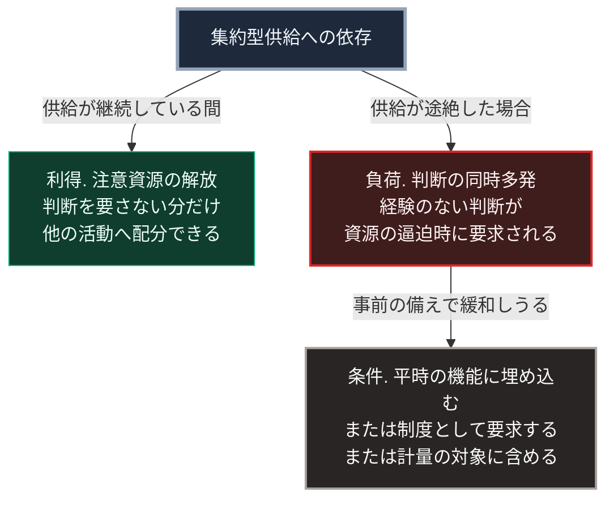

### 序論：本章が扱う範囲

前章では、移行を妨げる心理的条件を整理しました。本章では、その前提となる依存の構造そのものを検討します。

扱う問いは次のとおりです。集約型の供給への依存は、なぜこれほど安定しているのか。そして、その依存が問題として認識されるのはどのような場合か。

本章の前半は、既存の知見の記述です。後半は推論です。

### 1. 依存が安定する理由

**注意という有限の資源**

前章で参照したカーネマンの整理によれば、意識的な判断を担う第二の系は、注意という限られた資源を消費します [ [ 173 ] ](https://openlibrary.org/works/OL15992072W) 。この資源は有限であり、ある課題に配分すれば、他の課題への配分は減少します。

したがって、生活に必要な機能のうち、判断を要さずに済む部分が多いほど、他の活動へ配分できる資源は増加します。

**依存の利得**

この観点から見ると、集約型の供給への依存は、明確な利得を持ちます。

水の確保、電力の確保、そして廃棄物の処理について、利用者は判断を要しません。第Ⅰ部C-6およびC-7で記述したとおり、これらの機能は専門の組織が担い、利用者は対価を支払うのみです。

第Ⅰ部B-2で述べた分業の利得は、まさにこの構造です。各人が自らの専門に注意を集中できるからこそ、生産性が向上します。

すなわち、依存は非効率の結果ではありません。効率の帰結です。

### 2. 依存が問題となる条件

前節の構造は、供給が継続する限り有効に機能します。

問題が生じるのは、供給が途絶した場合です。このとき、次の状況が発生します。

第一に、利用者は当該機能について判断の経験を持ちません。平時に判断を要さなかったためです。

第二に、判断を要する場面が同時多発します。水、電力、通信、そして情報の入手が同時に制約された場合、複数の判断が並行して要求されます。

第三に、この状況は注意という資源が最も逼迫する局面と重なります。

したがって、依存の問題は「依存していること」ではなく、「依存の解除が最も困難な時点に、解除が要求されること」にあります。

### 3. 事前の備えが選ばれにくい理由

前節の構造が理解されている場合でも、事前の備えが選ばれるとは限りません。

その理由は、前章で整理した負荷の非対称にあります。事前の備えは、現時点で注意という資源を消費します。一方、その利得は将来の不確実な事象においてのみ実現します。

第Ⅲ部-1で整理した確度の階層に照らせば、供給の途絶は階層3、すなわち発生時期が特定できない事象です。この階層の事象に対する備えは、費用が確実で、利得が不確実です。

さらに、第Ⅰ部C-8で述べたとおり、計量されない項目は評価の対象になりにくい性質があります。備えの水準は、通常の指標としては計量されません。

### 4. 設計上の帰結

以上から、次の帰結が導かれます。

事前の備えを個人の判断に委ねる設計は、実行段階で機能しにくいと予想されます。これは個人の資質の問題ではなく、費用と利得の時間的な配分に起因します。

したがって、備えを実効的なものにするには、次のいずれかが必要です。

**帰結1：備えを平時の機能に埋め込む**

平時において別の目的で価値を持ち、有事にも機能する構成です。この場合、備えのための追加費用は生じません。

第Ⅳ部-2で述べる「平時において別の目的で価値を持ち、有事において相互援助の基盤としても機能する仕組み」は、この形態にあたります。

**帰結2：備えを制度として義務づける**

個人の判断に委ねず、基準として要求する方式です。建築基準における耐震の要求は、この形態です。

**帰結3：備えを計量の対象に含める**

第Ⅰ部C-8で述べたとおり、計量された指標は最適化の対象となります。備えの水準を評価の項目に含めることで、資源配分の判断に反映されます。

### 🗺️ 図：依存の利得と、途絶時の負荷

同じ構造が、状況によって異なる帰結をもたらすことを示します。

#### 図の読み方

この図が示すのは、依存が利得と負荷の両方を同時に持つという構造です。

利得の側は、平時において実現します。負荷の側は、途絶時においてのみ実現します。両者は同じ構造から生じており、一方だけを取り除くことはできません。

したがって、問題の立て方は「依存をなくすべきか」ではありません。「依存の利得を保ちながら、途絶時の負荷をどう緩和するか」です。

条件として示した3項目は、いずれもこの緩和の方法です。3つに共通するのは、個人の平時の判断に依存しないという点です。

なお、本章は個人の備えを否定するものではありません。備えを個人の判断のみに委ねる設計が、社会全体としては機能しにくいと述べています。

---

### 本章の位置づけ

本セクションは、著者による解釈です。

1.  **本章が主張しないこと**

    本章は、依存を心理的な弱さとして扱いません。前節で示したとおり、依存は分業の帰結であり、注意という有限の資源の合理的な配分です。

2.  **本章の主要な論点**

    最も重要な論点は、依存の問題が時間的な構造にあるという点です。

    依存の利得は継続的に実現し、負荷は稀にしか実現しません。この非対称が、事前の備えを選びにくくします。

3.  **第Ⅴ部への接続**

    第Ⅴ部で扱う設計は、本章で整理した帰結1に対応します。すなわち、平時において別の目的で価値を持ち、有事にも機能する構成です。

    この形態が成立するかどうかが、第Ⅲ部-12で整理する差分2、すなわち供給方式の転換が実際に進むかどうかを規定します。
