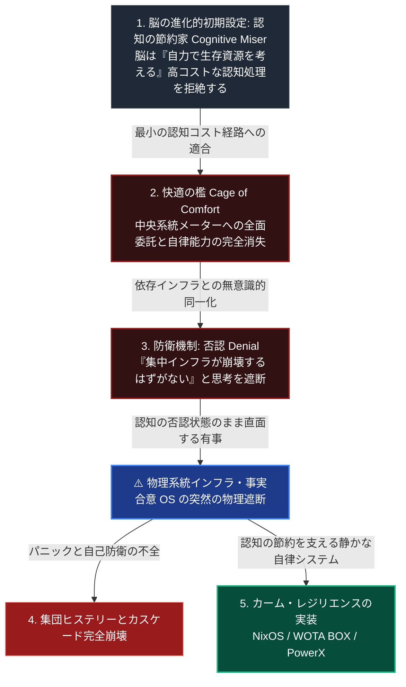

「認知の節約家」という視点があります。この視点からは、依存インフラへの無意識による同一化が考察されます。

私たちが一元管理型インフラ（集中型インフラ社会OS）に無意識のうちに生存のすべてを委ねてしまう心理の背景には、精神医学的な防衛機制だけでなく、人間の根本的な認知特性が深く関わっています。
社会心理学者スーザン・フィスケ（Susan Fiske）らは、 **「認知の節約家（Cognitive Miser：認知のケチ）」** 理論を実証しました [ [ 50 ] ](https://books.google.com/books?id=SocialCognition) 。この理論によれば、人間の脳はエネルギー消費を極限まで低減させます。これは認知コストを節約するためです。そのため、脳は自力での思考や判断を可能な限り避ける傾向があります。そして、デフォルトで用意された最も楽な選択肢（初期設定）を無意識に選び続けます。これは進化の過程で方向づけられたものです。

電力はスイッチ操作によって供給されます。
水は蛇口操作によって給水されます。
これらは集中管理型のインフラの一例です。
脳は、認知負荷を極力避けようとする傾向があります。
このような集中管理型のインフラは、上記の認知負荷回避の心理に対する究極の適合解でした。
これはサービスOSとも表現されます。
人々は、自らの生存に必要な「アトムとビットのコントロール権（主権）」をすべて中央に明け渡しました。その引き換えとして、圧倒的な「快適さ」を獲得したのです。

この「快適の檻（Cage of Comfort）」に長期的に安住すると、人々は単にインフラへ依存するだけではありません。彼らは、 「**中央集権的なインフラと自らの存在そのものを同一化する（無意識的な同一化）**」 という防衛機制（精神分析的な退行）を働かせ始めます。
インフラの破綻を想定することそれ自体が、自身の快適な生存OSの全否定に繋がるため、潜在的な物理的リスク（SPOFのカスケード崩壊の可能性）が目の前に突きつけられていても、それを「発生するはずがない」と否認し、思考を遮断するのです。
これが、インフラ撤退期における大衆の「無関心」と「突然のパニック」を決定づける心理構造です。

---

### 🗺️ 認知のケチ（Cognitive Miser）と依存インフラへの精神分析ループ

人間は「認知の節約」のため、無意識に集権的なインフラに極度に依存します。その結果、インフラの破綻から目を背ける傾向が見られます。この認知と精神分析のダイナミズムを垂直フローで提示します。

#### 【図の設計意図および解説：認知のケチに適合した静かな自律設計】

上図は、人間がその脳の進化的制約（認知のケチ）により、どのように中央系統へ盲目的に依存し、有事の否認（思考停止）を引き起こすかを示しています。

1.  **認知の節約と依存ループ（1〜3）**:
    人間の脳は、毎日水や電気の調達方法を考えるような「高コストな意思決定」に耐えられません。したがって、フィスケの説く通り、認知コストを節約するために「中央のメーターに代金を支払って終わりにする」という極小経路へ無意識に逃げ込みます（2）。
    この結果、依存システムそのものと心理的に同一化し、「系統電線やデータサーバーが物理的に沈黙する有事」の可能性そのものを否認（Denial）して見ようとしなくなります（3）。
2.  **否認状態のままで直面する有事の破滅（4）**:
否認の精神OSが機能している場合、危機に対する適切な備えが困難になります。ある日突然、激甚災害やサイバー攻撃によってインフラが物理的に遮断される可能性があります。その際、人々は代替手段を全く持たない状況に直面します。代替手段がないため、パニックが連鎖的に発生するでしょう。これは、社会崩壊、すなわち集団ヒステリーへと急速に進行する事態を招きます。
3.  **認知を強要しない『カーム・レジリエンス』（5）**:
この心理的な脆弱性を回避する必要があります。私たちが設計すべき自律分散システム（NixOS、SQLite、WOTA、PowerX）は、利用者に日々のエネルギー、水質、データ整合性の管理を強要すべきではありません。もしそのような管理を強要すれば、利用者の脳は認知コストの高騰を負担と認識します。その結果、利用者は元の集権的なインフラへと回帰する可能性があります。
インテグレーターの真の目標は、日常的に人間の脳へ管理コストを一切要求しないことです。有事の物理切断時においても、AIとエッジ自律デバイスは、水や電気をクローズドループによる制御で継続します。これが「**カーム（静かな）自律レジリエンス**」の実装です。

---

### 現代社会構造への射程と本質（本章のまとめ）

#### 1. 現代社会構造の原点（脳のサボり特性をロックインしたビジネスモデル）
現代のあらゆる一元管理型インフラや、クラウド上の巨大プラットフォーム（GAFAM、surveillance capitalism）は、人間の「認知コストを節約したい」という脳の進化的サボり特性を徹底的にロックインした（同一化させた）ビジネスモデルを原点として成立しています。人々は便利さと引き換えに、生存主権（アトムとビット）を無意識に進んで差し出してきたのです。

#### 2. 歴史的事実の本質（有事否認の防衛機制と警告の限界）
フィスケや精神分析学は、ある歴史的な事実を示しています。その本質は、認知システムが持つ、冷徹な限界です。人々が中央インフラへ全面依存している状況を考えます。この時、脳は自己防衛のため、論理的な有事警告を自動的に否認・遮断します。例えば、「2030年代の破綻」といったリスク警告が該当します。このような警告は、人々の行動の自律化を促すきっかけにはなりません。むしろ、快適な檻を肯定する現状維持の傾向が、無意識に強化されます。

#### 3. 現代社会の現状と課題（無意識を前提としたカーム自律インフラの実装）
現代社会のインテグレーターが直面する真の課題は、人々の生存デフォルトを「高い自律主権意識を必要とするシステム」にすることではありません。
人々は依然として「認知の節約家」であり続け、平時には中央メーターに依存し続ける現実を冷徹に受け入れる必要があります。
課題の本質はシステム統合技術です。この技術は、人々の無意識を大前提としています。緊急時においても、脳へ高い管理コスト（ストレス）を一切強要しません。WOTA BOXやローカルRAGエッジノードは、自動で生存を守り抜きます。これが「不壊のオーバーレイ・インフラ」です。このインフラは、日常の下部へ静かに忍び込ませて実装されます。これは知的に隠蔽されたシステム統合の技術です。
