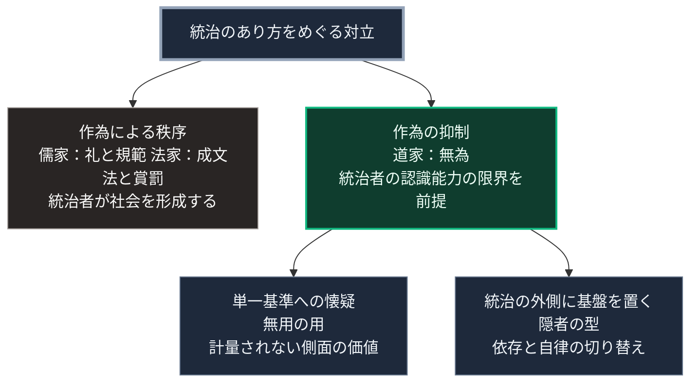

### 序論：本章が扱う範囲

第Ⅴ部では、第Ⅳ部で導かれた要請に対する設計を扱います。本章はその導入として、管理と最適化に対する対抗軸を提示した思想の系譜を整理します。

対象は、古代中国の老荘思想です。本章の情報源は、『道徳経』と『荘子』の原典テキスト、および後漢代の正史に限定します [ [ 29 ] ](https://ctext.org/dao-de-jing) 。

本文は、原典が何を述べているかの記述に限定します。現代の設計への接続は章末で扱います。

### 1. 対抗軸としての成立

紀元前の中国において、統治のあり方をめぐって複数の思想が競合しました。

儒家は、礼と規範による秩序の形成を説きました。法家は、成文法と賞罰による統治を説きました。いずれも、統治者が積極的に社会を形成するという方向を共有しています。

これに対し、『道徳経』は、統治者による作為を減らすことを説きました。同書の第57章には、法令が増えるほど盗賊が増えるという趣旨の記述があります。同書の第60章には、大国を治めることは小魚を煮るようなものであり、かき混ぜてはならないという趣旨の記述があります。

### 2. 「無為」という概念

同書が用いる中心概念は「無為」です。この語は、何もしないことではなく、作為的な介入を避けることを意味します。

同書の第37章には、道は常に無為であって、しかもなさざるはなし、という趣旨の記述があります。すなわち、介入を減らすことによって、かえって全体が機能するという主張です。

この主張は、第Ⅰ部B-3で整理したハイエクの議論と構造的に対応します。ハイエクは、分散した局所知識を中央が集約できないことを根拠に、価格機構による調整を論じました。『道徳経』は、統治者が万物を把握できないことを前提に、介入の抑制を論じています。両者は、2000年以上を隔てて、中央の認識能力の限界という同じ前提を置いています。

### 3. 「無用の用」という概念

『荘子』には、役に立たないとされるものが、それゆえに生き延びるという寓話が複数含まれます。同書の人間世篇には、材木として使えない木が伐られずに大木となる話があります [ [ 347 ] ](https://ctext.org/zhuangzi/man-in-the-world-of-men) 。同篇は、人は有用の用を知るが無用の用を知らない、という趣旨の一文で締めくくられます。

この概念は、有用性の基準が単一ではないこと、そして単一の基準による最適化が脆弱性を生むことを示唆します。

第Ⅰ部C-8で整理した計量の問題との対応は明らかです。計量された指標のみが最適化され、計量されない側面は軽視されます。『荘子』の寓話は、計量されない側面が生存に寄与しうることを指摘しています。

### 4. 隠者という選択

官職を辞して郷里や山中に退く生き方は、中国の正史において逸民として類型化されています。『後漢書』の逸民列伝は、王侯に仕えないことを高尚とする『易経』の句を引き、官職を離れた人物の伝記を集めています [ [ 348 ] ](https://ctext.org/hou-han-shu/yi-min-lie-zhuan) 。

この型を、統治の外側に生活の基盤を置く構成として読むのは、本書による整理です。統治が機能している間はその恩恵を受け、機能しなくなった際には自らの基盤に戻る、という読み方です。

### 🗺️ 図：管理と最適化に対する対抗軸

#### 図の読み方

この図は、第Ⅴ部の設計が依拠する思想的な位置を示しています。

Aの方向は、第Ⅰ部A-5で記述した中央集権化、第Ⅱ部C-8で記述した統合管理の系譜にあたります。Bの方向は、それに対する対抗軸です。

本書はBを採用してAを否定するものではありません。第Ⅱ部C-8で述べたとおり、統合管理は接続が維持されている間、効率と課題解決に寄与します。本書の設計は、Aが機能しなくなった期間に対するものです。

Dとして示した隠者の型は、その設計の原型です。平時は統治の恩恵を受け、途絶時には自らの基盤に戻る。この切り替えを可能にする構成が、第Ⅴ部の各章で扱う内容です。

---

### 現代社会構造への射程と本質（本章のまとめ）

本セクションは、著者による解釈です。前節までの記述とは区別して読んでください。

1.  **現代社会構造の原点**

    現代の統治と企業経営は、圧倒的にAの方向にあります。計測し、最適化し、介入する。この方向は、第Ⅰ部Cで記述した技術の系譜と一体です。

2.  **設計上の要点**

    本章から抽出できるのは、次の点です。中央の認識能力の限界を前提とする思想は、古代から存在していました。それは反知性ではなく、認識の限界に対する認識です。

3.  **現代社会の現状と課題**

    第Ⅴ部-9で扱う能動的不便の実践は、本章の思想を日常の設計に翻訳したものです。第Ⅲ部-6で整理したとおり、負荷の高い選択は選ばれにくいため、翻訳には設計上の工夫を要します。
