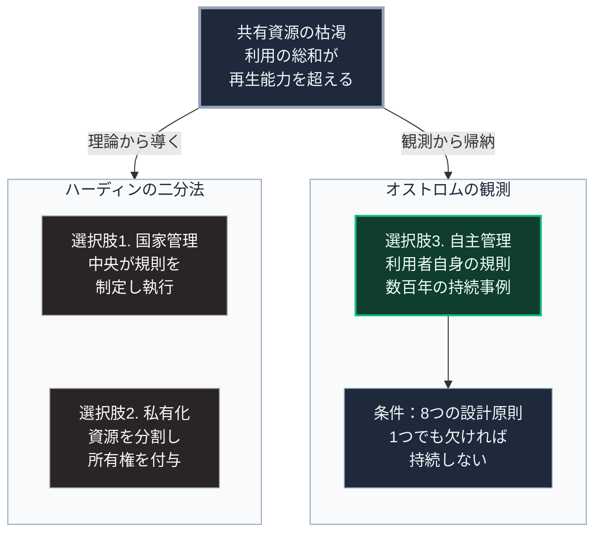

### 序論：本章が扱う範囲

本章は、共有資源が利用者自身によって長期にわたり管理された事例に関する研究を整理します。

本章は、第Ⅴ部-3および第Ⅴ部-3で扱う設計原則の基礎です。また、第Ⅳ部-2で参照した研究の詳細にあたります。

本文は、研究が何を観測し何を主張したかの記述に限定します。評価は章末で扱います。

### 1. 問題の設定

共有資源とは、複数の利用者が共同で利用し、1人の利用が他の利用可能量を減らす資源を指します。漁場、放牧地、灌漑用水、森林がその典型です。

1968年、生物学者ギャレット・ハーディンは、この種の資源が各利用者の合理的な行動によって枯渇するという議論を提示しました。各利用者は自らの利用を増やす誘因を持ち、その総和が資源の再生能力を超える、という論理です。

この議論から導かれる対応は2つでした。資源を国家が管理するか、私有化するかです。

### 2. オストロムの観測

政治学者エリノア・オストロムは、1990年の著作において、この二分法に反する事例を収集しました [ [ 1 ] ](https://doi.org/10.1017/CBO9780511807763) 。

同書が扱う事例には、次のものが含まれます。スイスの山村における放牧地の管理。日本の入会地における山林の管理。スペインの灌漑組合。フィリピンの灌漑組織。これらは、国家の管理や私有化によらず、利用者の自主的な規則によって数百年にわたり維持されていました。

同書はまた、失敗した事例も収集しています。成功と失敗の比較から、持続した事例に共通する条件を抽出しました。

### 3. 抽出された8つの設計原則

同書が抽出した設計原則は、次の8つです。

第一に、資源の境界と利用者の範囲が明確であること。

第二に、利用と提供の規則が地域の条件に適合していること。

第三に、規則の変更へ利用者が参加できること。

第四に、利用状況を監視する仕組みがあり、監視者は利用者に対して責任を負うこと。

第五に、違反に対する制裁が段階的であること。

第六に、紛争を解決する場が低費用で利用できること。

第七に、利用者の自ら組織する権利が、外部の政府によって否定されていないこと。

第八に、大規模な資源については、これらの活動が複数の階層へ入れ子状に組織されていること。

これらは、第Ⅴ部-3および第Ⅴ部-3で個別に扱います。

### 4. 研究の位置づけ

同書は、共有資源の自主管理が常に成功すると主張するものではありません。主張するのは、成功の条件が特定可能であり、それが国家管理と私有化以外の第三の選択肢を構成するという点です。

この研究に対し、2009年にアルフレッド・ノーベル記念経済学スウェーデン国立銀行賞（通称ノーベル経済学賞）が授与されました。

### 🗺️ 図：共有資源の管理をめぐる3つの選択肢

#### 図の読み方

この図は、上段の問題から下の2つの枠へ分かれる形で読みます。左の枠と右の枠の違いは、選択肢が導かれた方法の違いです。

左の枠の選択肢1と選択肢2は、理論から演繹されました。右の枠の選択肢3は、数百年にわたり持続した事例の観測から帰納されました。この方法上の差異が、オストロムの研究の性格を規定しています。

本書にとって重要なのは、右の枠の中で選択肢3の下に条件の箱が付いている点です。8つの設計原則のいずれかが欠ければ、自主管理は持続しません。第Ⅰ部D-6で記述したアメリカ開拓期の鉱山規約が機能したのは、集団の規模が限定され、監視と制裁が実効的であった場合に限られていました。

第Ⅳ部-2で述べたとおり、地域社会に期待される機能が供給の共同維持へ拡張される場合、必要となるのはこの8つの設計原則です。災害直後の相互援助とは異なり、長期の共同管理は制度を要します。
---

### 現代社会構造への射程と本質（本章のまとめ）

本セクションは、著者による解釈です。前節までの記述とは区別して読んでください。

1.  **現代社会構造の原点**

    現代の供給インフラは、選択肢1と選択肢2の組み合わせによって運営されています。上下水道は主として国家管理、電力と通信は規制のもとでの私企業です。選択肢3は、第Ⅰ部C-7で記述した経緯の中で、規模の経済に押されて周縁化されました。

2.  **設計上の要点**

    本章から抽出できるのは、次の点です。自主管理は理念ではなく、条件の問題です。条件を満たす設計があれば持続し、なければ持続しません。

3.  **現代社会の現状と課題**

    第Ⅱ部A-4で記述したとおり、集約型インフラの維持範囲は縮小に向かっています。その外側において、選択肢3が実際の選択肢となる区域が生じます。

    第Ⅴ部-3以降で扱うのは、8つの設計原則を現代の技術で実装する方法です。とりわけ、監視と制裁と紛争解決に要する費用を、技術によってどこまで下げられるかが論点となります。
