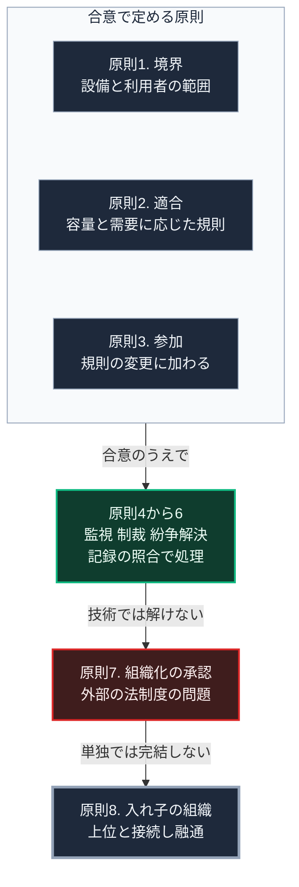

### 序論：本章が扱う範囲

本章は、第Ⅴ部-2で整理した8つの設計原則のすべてを、供給インフラの共同管理に適用する際の設計要件として読み替えます。

前半の4つは、境界の明確化と規則の適合、規則の変更への参加、そして監視です。後半の4つは、段階的な制裁、紛争解決の場、組織化する権利の承認、入れ子状の組織です。

各節の前半は、オストロムの著作における各条件の記述です [ [ 1 ] ](https://doi.org/10.1017/CBO9780511807763) 。後半は、それを現代の供給設備へ適用する際の要件であり、本書による読み替えです。両者を区別して記述します。

### 1. 原則1：境界の明確化

**原著の記述**。資源の物理的な境界と、利用する権利を持つ者の範囲が明確に定められていること。境界が曖昧な場合、外部からの利用を排除できず、利用者は資源を維持する誘因を失います。

**設計要件への読み替え**。局所の電力、水、通信を共同で維持する場合、次の2点を定める必要があります。第一に、設備の物理的な範囲。第二に、利用者の範囲と、加入と離脱の手続です。

利用者の範囲を定める手続は、平時の加入時に行われます。第Ⅱ部C-8で記述した行政の番号制度は、その加入手続における本人確認の一手段にとどまります。途絶時には行政との連携が停止しうるため、利用者の名簿と本人確認の手段は局所で保持する必要があります。

### 2. 原則2：規則と地域条件の適合

**原著の記述**。利用の規則が、地域の資源の性質と、利用者の条件に適合していること。同書は、外部から持ち込まれた画一的な規則が機能しなかった事例を記述しています。

**設計要件への読み替え**。供給設備の運用規則は、設備の容量、地域の需要、そして季節の変動に応じて定められる必要があります。

第Ⅰ部A-6で記述した全国一律の基準は、この原則と緊張関係にあります。集約型インフラの規則は全国で共通ですが、局所の共同管理においては、規則が局所の条件に合わせて調整可能である必要があります。

### 3. 原則3：規則の変更への参加

**原著の記述**。規則の影響を受ける者の大部分が、規則の変更に参加できること。同書は、参加によって規則が実態に合わせて修正され続ける点を重視しています。

**設計要件への読み替え**。運用規則の変更手続が明確で、参加の費用が低いことです。

第Ⅲ部-5で整理したとおり、参加には認知的な負荷が伴います。したがって、参加の形式を頻繁な会議に限定する設計は、実際には機能しにくくなります。設備の状態が自動的に共有され、変更の提案と承認が簡易な手続で行える構成が、この原則を実装する方向です。

### 4. 原則4：監視

**原著の記述**。資源の状態と利用者の行動を監視する仕組みがあり、監視者が利用者自身であるか、利用者に対して責任を負っていること。

**設計要件への読み替え**。この原則は、現代の技術によって最も実装しやすい条件です。

第Ⅰ部C-3で記述したとおり、ローマの水道管理においては、取水量と配分量の照合が不正の検出手段でした。現在、電力、水、通信の使用量は、計器によって自動的に計測できます。

ただし、第Ⅰ部C-8で整理したとおり、計量された指標は最適化の目標となります。監視の対象を何にするかの選択が、共同管理の性格を決めます。また、監視の記録を誰が保持し、誰が参照できるかが、原則3の参加と直結します。

### 5. 原則5：段階的な制裁

**原著の記述**。規則の違反に対する制裁が、違反の程度と反復に応じて段階的であること。同書は、初回の軽微な違反に重い制裁を課す制度が、かえって規則の遵守を損なった事例を記述しています。

**設計要件への読み替え**。供給の共同管理においては、過剰な利用や負担の不履行に対する対応を、警告、制限、そして除外という段階で定めることになります。

原則4の監視が自動化されている場合、初期の段階の対応も自動化できます。使用量の上限に近づいた際の通知や、一時的な制限がこれにあたります。ただし、除外という最終段階は、人間の判断を要します。

### 6. 原則6：紛争解決の場

**原著の記述**。利用者間、および利用者と管理者の間の紛争を解決する場が、低い費用で利用できること。

**設計要件への読み替え**。紛争の多くは、事実の認識の相違から生じます。誰がどれだけ利用し、誰がどれだけ負担したかについての相違です。

原則4の記録が改ざん困難な形で保持され、当事者が参照できる場合、この種の紛争は記録の照合によって解決できます。第Ⅱ部C-6で整理した検証の手段のうち、出典への到達と発信者の同定が、ここで機能します。

記録によって解決できない紛争、すなわち規則の解釈や公平性に関する紛争については、参加者による合議の場が必要です。

### 7. 原則7：組織化する権利の承認

**原著の記述**。利用者が自ら規則を定め組織を作る権利が、外部の政府によって否定されていないこと。同書は、政府が自主的な組織を認めなかったために、機能していた管理が崩壊した事例を記述しています。

**設計要件への読み替え**。この原則は、技術ではなく法制度の問題です。

第Ⅴ部-12で扱うとおり、日本の水道法は、一定規模以上の給水設備に対して規制を課しています。電力についても、系統への接続と売電には規制があります。これらの規制は、供給の安全と品質を確保するためのものであり、その目的自体は正当です。

課題は、規制が集約型の供給を前提として設計されているため、局所の共同管理という形態を想定していない場合がある点です。原則7を満たすには、規制の目的を維持しつつ、共同管理という形態を認める制度の調整が必要になります。

### 8. 原則8：入れ子状の組織

**原著の記述**。大規模な資源については、利用、供給、監視、制裁、紛争解決、統治の各活動が、複数の階層へ入れ子状に組織されていること。

**設計要件への読み替え**。この原則は、第Ⅴ部-7で独立して扱います。要点は、局所の単位が単独で完結するのではなく、上位の単位と接続され、不足時に融通を受ける構成です。

### 🗺️ 図：8つの原則と、実装の性質

8つの原則を、合意で定める段階から技術で支える段階、そして制度と構造の段階へ並べて示します。

#### 図の読み方

この図は、上から下へ、実装の性質が技術から離れていく順に読みます。

最上段の枠には、合意で定める原則が3つ縦に並びます。誰を利用者とし、どの規則で運用するかは、参加者の合意によって定められます。原則3が求める規則の変更への参加も、同じく合意に支えられます。

ただし、原則3については、技術が参加の費用を下げられます。第Ⅲ部-5で整理したとおり、参加には認知的な負荷が伴います。設備の状態が自動的に共有されれば、参加に要する手間は下がります。技術が合意そのものを代替するわけではありません。

枠に続く箱は、原則4から6をまとめたものです。技術によって費用を下げられる部分にあたります。原則4の監視は計器による自動の計測で実装でき、記録は改ざん困難な形で保持できます。原則5の制裁と原則6の紛争解決は、この記録に依存します。記録が正確で参照可能であれば、制裁の初期段階と紛争の多くは、照合によって処理できます。

枠からその箱へ向かう矢印は、実装の順序を表します。共同管理の実装は、技術から合意へ遡る順序ではありません。まず枠の中を合意し、そのうえで技術が支える順序になります。

続く原則7は、性質が異なります。これは共同管理の側ではなく、外部の制度の側の問題です。技術がいかに整っても、制度が形態を認めなければ成立しません。第Ⅰ部A-5で記述した江戸期の幕藩体制は、分権的な統治が上位の承認のもとで長期に持続した事例として参照できます。

最下段の原則8は、第Ⅳ部-2で述べた地域社会への期待の階層と対応します。局所の単位は、災害直後の相互援助から供給の共同維持へ機能を広げる際、単独では完結しません。上位との接続が、持続の条件です。

---

### 現代社会構造への射程と本質（本章のまとめ）

本セクションは、著者による解釈です。前節までの記述とは区別して読んでください。

1.  **現代社会構造の原点**

    集約型インフラにおいて、原則1から4は事業者と規制当局によって担われています。境界は供給区域として、規則は約款として、変更は規制手続として、監視は計量として実装されています。

    したがって、共同管理はこれらを新たに発明するのではなく、担い手を変えることになります。

    現在の規制体系は、第Ⅰ部C-7で記述した経緯のもとで、集約型の供給を前提として整備されました。原則7の課題は、この前提に由来します。

2.  **設計上の要点**

    本章から抽出できるのは、次の点です。8つの設計原則のうち、技術によって費用を下げられるのは原則4から6です。原則1から3と原則7は合意と制度の問題であり、原則8は構造の問題です。

    技術の進歩は、共同管理の費用を下げますが、合意の必要性を消しません。技術は必要条件であって十分条件ではありません。

3.  **現代社会の現状と課題**

    第Ⅴ部-9以降で扱う具体的な設備は、原則4から6を実装する手段を含みます。しかし、それらの設備の導入だけで共同管理が成立するわけではありません。原則1から3に対応する合意と手続が、設備と並行して設計される必要があります。

    原則7については、第Ⅴ部-12で水道法との関係を具体的に扱います。原則8については、第Ⅴ部-7で扱います。
