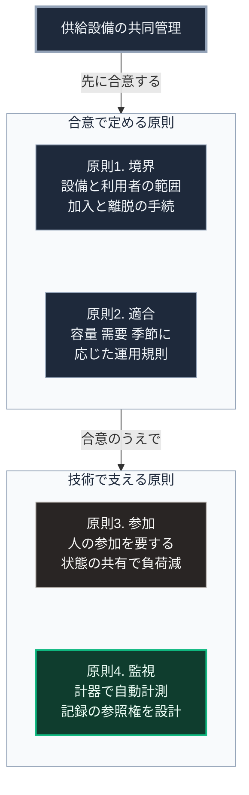

### 序論：本章が扱う範囲

本章は、第Ⅴ部-2で整理した8つの設計原則のうち、最初の4つを、供給インフラの共同管理に適用する際の設計要件として読み替えます。

本文の前半は、オストロムの著作における各条件の記述です [ [ 1 ] ](https://doi.org/10.1017/CBO9780511807763) 。後半は、それを現代の供給設備へ適用する際の要件であり、本書による読み替えです。両者を区別して記述します。

### 1. 原則1：境界の明確化

**原著の記述**。資源の物理的な境界と、利用する権利を持つ者の範囲が明確に定められていること。境界が曖昧な場合、外部からの利用を排除できず、利用者は資源を維持する誘因を失います。

**設計要件への読み替え**。局所の電力、水、通信を共同で維持する場合、次の2点を定める必要があります。第一に、設備の物理的な範囲。第二に、利用者の範囲と、加入と離脱の手続です。

利用者の範囲を定める手続は、平時の加入時に行われます。第Ⅱ部C-9で記述した行政の番号制度は、その加入手続における本人確認の一手段にとどまります。途絶時には行政との連携が停止しうるため、利用者の名簿と本人確認の手段は局所で保持する必要があります。

### 2. 原則2：規則と地域条件の適合

**原著の記述**。利用の規則が、地域の資源の性質と、利用者の条件に適合していること。同書は、外部から持ち込まれた画一的な規則が機能しなかった事例を記述しています。

**設計要件への読み替え**。供給設備の運用規則は、設備の容量、地域の需要、そして季節の変動に応じて定められる必要があります。

第Ⅰ部A-6で記述した全国一律の基準は、この原則と緊張関係にあります。集約型インフラの規則は全国で共通ですが、局所の共同管理においては、規則が局所の条件に合わせて調整可能である必要があります。

### 3. 原則3：規則の変更への参加

**原著の記述**。規則の影響を受ける者の大部分が、規則の変更に参加できること。同書は、参加によって規則が実態に合わせて修正され続ける点を重視しています。

**設計要件への読み替え**。運用規則の変更手続が明確で、参加の費用が低いことです。

第Ⅲ部-6で整理したとおり、参加には認知的な負荷が伴います。したがって、参加の形式を頻繁な会議に限定する設計は、実際には機能しにくくなります。設備の状態が自動的に共有され、変更の提案と承認が簡易な手続で行える構成が、この原則を実装する方向です。

### 4. 原則4：監視

**原著の記述**。資源の状態と利用者の行動を監視する仕組みがあり、監視者が利用者自身であるか、利用者に対して責任を負っていること。

**設計要件への読み替え**。この原則は、現代の技術によって最も実装しやすい条件です。

第Ⅰ部C-3で記述したとおり、ローマの水道管理においては、取水量と配分量の照合が不正の検出手段でした。現在、電力、水、通信の使用量は、計器によって自動的に計測できます。

ただし、第Ⅰ部C-8で整理したとおり、計量された指標は最適化の目標となります。監視の対象を何にするかの選択が、共同管理の性格を決めます。また、監視の記録を誰が保持し、誰が参照できるかが、原則3の参加と直結します。

### 🗺️ 図：原則1から4と、実装の手段

#### 図の読み方

この図は、上の枠から下の枠へ、実装の順序に沿って読みます。上の枠には合意で定める原則が、下の枠には技術で支える原則が、それぞれ縦に並びます。

上の枠の原則1と原則2は、技術ではなく制度の問題です。誰が利用者であり、どの規則で運用するかは、参加者の合意によって定められます。

下の枠の原則4は、技術によって最も実装しやすい条件です。計測は自動化でき、記録は改ざん困難な形で保持できます。

同じ枠の原則3は、技術の支援を受けつつも、人間の参加を要します。ここでの設計課題は、第Ⅲ部-6で整理した負荷の問題です。参加を求めるだけで参加が生じるわけではありません。参加に要する手間を下げる設計が必要です。

したがって、共同管理の実装は下の枠から始めて上の枠へ遡る順序ではなく、上の枠を合意したうえで下の枠を技術で支える順序になります。枠の間の矢印は、この順序を表します。
---

### 現代社会構造への射程と本質（本章のまとめ）

本セクションは、著者による解釈です。前節までの記述とは区別して読んでください。

1.  **現代社会構造の原点**

    集約型インフラにおいて、4つの原則は事業者と規制当局によって担われています。境界は供給区域として、規則は約款として、変更は規制手続として、監視は計量として実装されています。

    したがって、共同管理はこれらを新たに発明するのではなく、担い手を変えることになります。

2.  **設計上の要点**

    本章から抽出できるのは、次の点です。原則4の監視は技術で置き換えられますが、原則1から3は合意を要します。技術の進歩は、共同管理の費用を下げますが、合意の必要性を消しません。

3.  **現代社会の現状と課題**

    第Ⅴ部-10以降で扱う具体的な設備は、原則4を実装する手段を含みます。しかし、それらの設備の導入だけで共同管理が成立するわけではありません。原則1から3に対応する合意と手続が、設備と並行して設計される必要があります。
