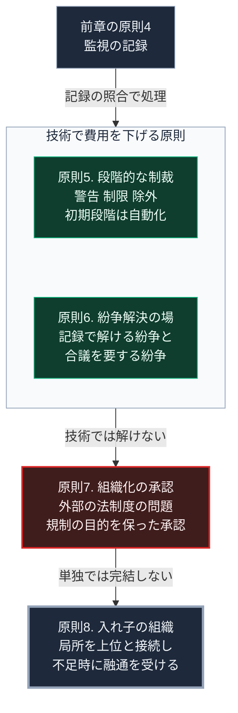

### 序論：本章が扱う範囲

本章は、第Ⅴ部-2で整理した8つの設計原則のうち、後半の4つを設計要件として読み替えます。前章と同様、原著の記述と本書による読み替えを区別します [ [ 1 ] ](https://doi.org/10.1017/CBO9780511807763) 。

### 1. 原則5：段階的な制裁

**原著の記述**。規則の違反に対する制裁が、違反の程度と反復に応じて段階的であること。同書は、初回の軽微な違反に重い制裁を課す制度が、かえって規則の遵守を損なった事例を記述しています。

**設計要件への読み替え**。供給の共同管理においては、過剰な利用や負担の不履行に対する対応を、警告、制限、そして除外という段階で定めることになります。

原則4の監視が自動化されている場合、初期の段階の対応も自動化できます。使用量の上限に近づいた際の通知や、一時的な制限がこれにあたります。ただし、除外という最終段階は、人間の判断を要します。

### 2. 原則6：紛争解決の場

**原著の記述**。利用者間、および利用者と管理者の間の紛争を解決する場が、低い費用で利用できること。

**設計要件への読み替え**。紛争の多くは、事実の認識の相違から生じます。誰がどれだけ利用し、誰がどれだけ負担したかについての相違です。

原則4の記録が改ざん困難な形で保持され、当事者が参照できる場合、この種の紛争は記録の照合によって解決できます。第Ⅱ部C-6で整理した検証の手段のうち、出典への到達と発信者の同定が、ここで機能します。

記録によって解決できない紛争、すなわち規則の解釈や公平性に関する紛争については、参加者による合議の場が必要です。

### 3. 原則7：組織化する権利の承認

**原著の記述**。利用者が自ら規則を定め組織を作る権利が、外部の政府によって否定されていないこと。同書は、政府が自主的な組織を認めなかったために、機能していた管理が崩壊した事例を記述しています。

**設計要件への読み替え**。この原則は、技術ではなく法制度の問題です。

第Ⅴ部-13で扱うとおり、日本の水道法は、一定規模以上の給水設備に対して規制を課しています。電力についても、系統への接続と売電には規制があります。これらの規制は、供給の安全と品質を確保するためのものであり、その目的自体は正当です。

課題は、規制が集約型の供給を前提として設計されているため、局所の共同管理という形態を想定していない場合がある点です。原則7を満たすには、規制の目的を維持しつつ、共同管理という形態を認める制度の調整が必要になります。

### 4. 原則8：入れ子状の組織

**原著の記述**。大規模な資源については、利用、供給、監視、制裁、紛争解決、統治の各活動が、複数の階層へ入れ子状に組織されていること。

**設計要件への読み替え**。この原則は、第Ⅴ部-8で独立して扱います。要点は、局所の単位が単独で完結するのではなく、上位の単位と接続され、不足時に融通を受ける構成です。

### 🗺️ 図：原則5から8と、実装の性質

#### 図の読み方

この図は、上段から下段へ、実装の性質が技術から離れていく順に読みます。

上段の枠にある原則5と原則6は、前章の原則4、すなわち監視の記録に依存します。記録が正確で参照可能であれば、制裁の初期段階と紛争の多くは、記録によって処理できます。枠の見出しのとおり、技術によって費用を下げられる部分です。

中段の原則7は、性質が異なります。これは共同管理の側ではなく、外部の制度の側の問題です。技術がいかに整っても、制度が形態を認めなければ成立しません。第Ⅰ部A-5で記述した江戸期の幕藩体制は、分権的な統治が上位の承認のもとで長期に持続した事例として参照できます。

下段の原則8は、第Ⅳ部-2で述べた地域社会への期待の階層と対応します。局所の単位は、災害直後の相互援助から供給の共同維持へ機能を拡張する際、単独では完結しません。上位との接続が、持続の条件です。
---

### 現代社会構造への射程と本質（本章のまとめ）

本セクションは、著者による解釈です。前節までの記述とは区別して読んでください。

1.  **現代社会構造の原点**

    現在の規制体系は、第Ⅰ部C-7で記述した経緯のもとで、集約型の供給を前提として整備されました。原則7の課題は、この前提に由来します。

2.  **設計上の要点**

    本章から抽出できるのは、次の点です。8つの設計原則のうち、技術によって費用を下げられるのは原則4から6です。原則1から3と原則7は合意と制度の問題であり、原則8は構造の問題です。技術は必要条件であって十分条件ではありません。

3.  **現代社会の現状と課題**

    第Ⅴ部-10以降で扱う設備は、原則4から6の実装を含みます。原則7については、第Ⅴ部-13で水道法との関係を具体的に扱います。原則8については、第Ⅴ部-8で扱います。
