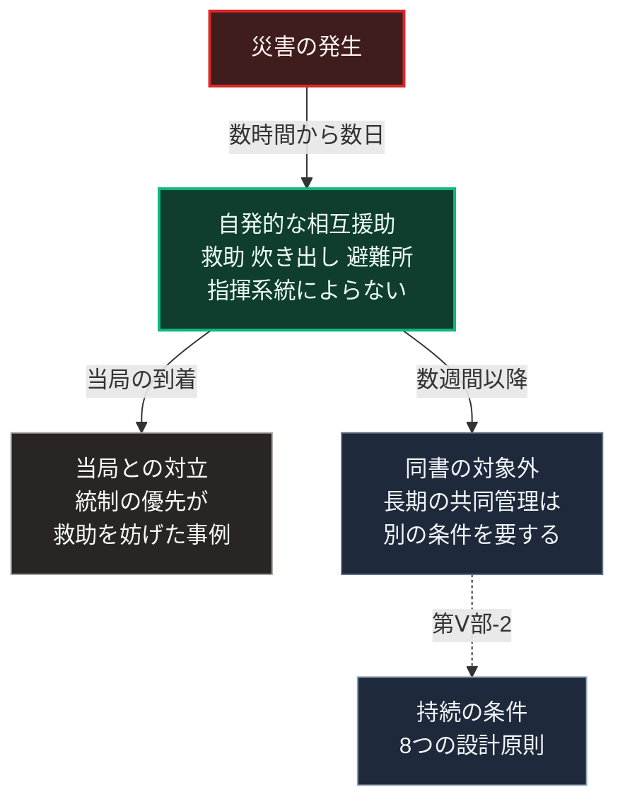

### 序論：本章が扱う範囲

本章は、災害の直後に人々がどう行動したかについて、調査記録に基づいて整理します。

本章の主要な情報源は、複数の災害事例を対象とする調査記録です [ [ 2 ] ](https://openlibrary.org/works/OL15273775W) 。本文は、記録が何を観測したかの記述に限定します。評価は章末で扱います。

### 1. 対象とされた事例

作家レベッカ・ソルニットは、2009年の著作において、5つの災害事例を対象とする調査を公刊しました。

1906年のサンフランシスコ地震。1917年のハリファックス港の爆発。1985年のメキシコシティ地震。2001年のニューヨークにおける攻撃。そして2005年のハリケーン・カトリーナです。

同書は、各事例について、当時の記録、生存者の証言、そして事後の調査を収集しています。

### 2. 観測された行動

同書が各事例に共通して記述するのは、次の行動です。

災害の直後、住民は自発的に救助、炊き出し、避難所の運営、そして物資の分配を組織しました。これらの活動は、行政や軍の到着より前に始まり、公式の指揮系統によらず運営されました。

同書は、このような行動が例外ではなく、調査対象のすべての事例で観測されたと記述しています。

### 3. 観測された対立

同書はまた、住民の自発的な行動と、当局の対応との間に生じた対立も記述しています。

複数の事例において、当局は住民の行動を無秩序と見なし、統制を優先しました。同書は、この統制が住民の救助活動を妨げた場合があったこと、そして当局の側の想定と実際の住民の行動との間に乖離があったことを記述しています。

同書は、この乖離の背景として、災害時には人々が混乱し略奪に走るという想定が、当局および報道の側に広く共有されていた点を指摘しています。

### 4. 観測の限界

同書の観測には、次の限界があります。

第一に、対象は災害の直後、すなわち数日から数週間の期間です。その状態が長期にわたり持続するかどうかは、同書の対象外です。

第二に、対象は特定の5事例であり、すべての災害に一般化できるとは限りません。

第三に、同書は作家による調査記録であり、統計的な手法による研究ではありません。ただし、災害社会学の分野でも、災害時の無秩序という想定が観測と一致しないことは報告されています。たとえば、ハリケーン・カトリーナにおける報道の枠組みと実際の行動を分析した研究があります [ [ 350 ] ](https://doi.org/10.1177/0002716205285589) 。

### 🗺️ 図：災害直後の行動と、時間の経過

#### 図の読み方

この図は、上から下へ時間の経過を表します。矢印の脇の文字が、災害からの経過時間です。

災害の発生後、数時間から数日の間に生じるのが中段の自発的な相互援助です。この段階の観測は、本書にとって重要です。[第Ⅲ部-5](20_autonomous-society-frictions)で整理した心理的な条件、すなわち判断の負荷が高い選択は選ばれにくいという傾向は、災害直後には異なる形で現れます。同書の観測によれば、この段階では相互援助が自発的に生じています。

中段から下段へは、2つの矢印が分かれます。左の箱は当局の到着後に生じた対立であり、設計上の教訓を含みます。当局の想定と住民の行動との乖離は、事前の計画が実際の行動を前提としていなかったことを示します。

右の箱は数週間以降であり、本書の主要な関心です。この段階は同書の対象外です。[第Ⅴ部-2](43_governing-the-commons-rediscovery)で整理したとおり、長期の共同管理には8つの設計原則を満たす制度が必要です。災害直後の相互援助は、その条件なしに生じます。しかし、それが持続するとは限りません。最下段へ向かう破線は、この段階が別の条件に接続される必要を表します。

したがって、[第Ⅳ部-2](implication-community)で述べた地域社会に期待される機能の階層のうち、機能の階層1は同書の観測によって裏づけられ、機能の階層3は別の条件を要します。両者を混同すると、災害直後の観測を根拠に長期の共同管理が自然に成立すると誤認することになります。
---

### 現代社会構造への射程と本質（本章のまとめ）

本セクションは、著者による解釈です。前節までの記述とは区別して読んでください。

1.  **現代社会構造の原点**

    現在の防災計画の多くは、当局による統制を基本としています。同書が記述した当局の想定は、この基本設計に反映されています。

2.  **設計上の要点**

    本章から抽出できるのは、次の点です。災害直後の相互援助は、繰り返し観測されています。それは例外的な美談ではなく、想定に組み込むべき規則性です。同時に、その持続には条件があります。

3.  **現代社会の現状と課題**

    [第Ⅴ部](42_taoist-wu-wei-non-action)の設計は、Aの段階の相互援助を前提とし、それをCの段階へ接続する構成を目指します。接続に必要なのは、意識ではなく、[第Ⅴ部-2](43_governing-the-commons-rediscovery)で整理した条件を満たす仕組みです。

    [第Ⅳ部-2](implication-community)で述べたとおり、関係の構築には時間を要します。災害後に始めるのではなく、平時において別の目的で価値を持つ仕組みが、その基盤となります。
