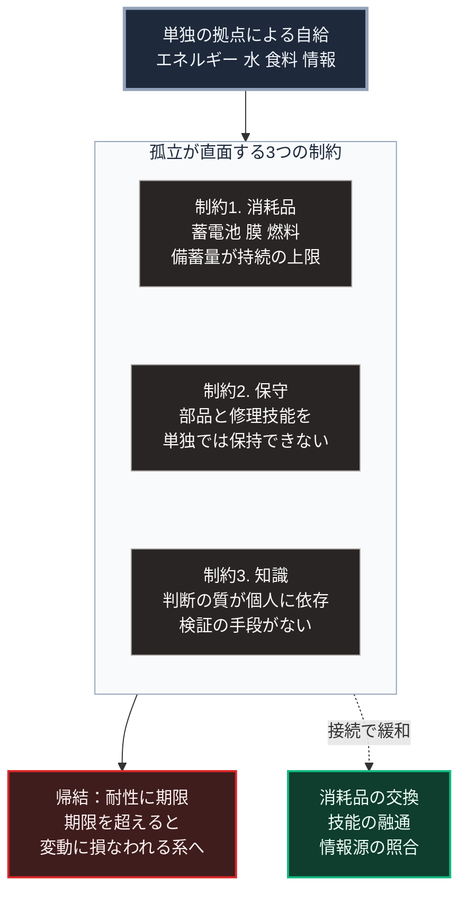

### 序論：本章が扱う範囲

本章は、単独の世帯や拠点が外部との接続を断って自給を試みる構成について、その持続を制約する要因を整理します。

第Ⅴ部の設計は局所の自律を扱いますが、それは孤立と同義ではありません。本章は、両者の差異を明確にするための章です。

本文は、構造の整理に限定します。評価は章末で扱います。

### 1. 自給を構成する要素

外部に依存しない生活を構成する要素は、次の4つに分けられます。

**要素1：エネルギー**。発電、蓄電、そして熱の確保。

**要素2：水と衛生**。取水、浄化、そして排水の処理。

**要素3：食料**。生産、保存、そして調理。

**要素4：情報と判断**。状況の把握と、対処の選択。

これらは、いずれも設備と消耗品と知識を要します。

### 2. 制約1：消耗品

設備は、稼働に伴って消耗品を消費します。

蓄電池は、充放電の繰り返しによって容量が低下し、数年から十数年で交換を要します。浄水の膜と濾材は、処理量に応じて交換を要します。発電機は燃料と潤滑油を要します。

これらの消耗品は、単独の拠点では生産できません。したがって、孤立した自給は、消耗品の備蓄量によって持続期間が上限づけられます。

### 3. 制約2：保守

設備は、故障します。故障の診断と修理には、部品と技能を要します。

単独の拠点において、すべての設備の修理技能を保持することは現実的とは言えません。第Ⅰ部B-2で述べたとおり、分業は生産性の源泉であり、その放棄は生産性の放棄を意味します。

第Ⅱ部C-10で述べたとおり、現在の設備は半導体を用いる機器によって制御されています。これらの機器の修理は、部品の供給と専門の技能に依存します。

### 4. 制約3：知識

第Ⅲ部-7で整理したとおり、依存の利得は、判断を要さない分だけ注意という資源を他へ配分できる点にあります。孤立した自給は、この利得を放棄します。

すべての判断を単独で担う場合、判断の質は個人の知識と経験に制約されます。第Ⅱ部C-6で整理した検証の手段、すなわち出典への到達と独立した情報源の照合は、孤立した状態では利用できません。

### 5. 変動への耐性という観点

リスク研究者ナシーム・ニコラス・タレブは、系を変動に対する応答によって3つに分類しました [ [ 3 ] ](https://openlibrary.org/works/OL16726829W) 。変動によって損なわれる系、変動に耐える系、そして変動から利得を得る系です。

同書の枠組みに照らすと、孤立した自給は、変動に耐える系を目指したものです。しかし、消耗品と保守と知識の制約により、その耐性には期限があります。期限を超えると、変動によって損なわれる系へ転じます。

### 🗺️ 図：孤立した自給を制約する3つの要因

#### 図の読み方

この図は、上段の自給から中段の枠を経て下段の帰結へ、上から下へ読みます。

中段の枠には、3つの制約が縦に並びます。いずれも、単独の拠点では解消できない性質のものです。

下段には2つの箱があります。左の帰結が示すのは、孤立した自給が原理的に不可能だということではありません。持続期間に上限があるという点です。

右の箱へ向かう破線は、3つの制約がいずれも外部との接続によって緩和されることを表します。消耗品は交換によって、保守は技能の融通によって、知識は情報源の照合によって補われます。

したがって、本書が第Ⅴ部で扱う局所自律は、孤立ではなく、次の構成を指します。平時は外部と接続して分業の利得を受け、途絶時は局所の設備で必要最小限を維持し、途絶が長期化する場合は近隣の拠点と融通する。第Ⅴ部-8で扱う入れ子構造は、この融通を制度化したものです。

第Ⅲ部-11で述べた悲観シナリオにおいて、復旧に長期を要する場合、局所の設備の持続期間が帰趨を分けます。その期間を延ばす手段は、単独の備蓄を増やすことではなく、融通の範囲を広げることです。
---

### 現代社会構造への射程と本質（本章のまとめ）

本セクションは、著者による解釈です。前節までの記述とは区別して読んでください。

1.  **現代社会構造の原点**

    第Ⅰ部A-2で記述したローマの事例において、広域の交換が縮小したとき、生産される財の質と種類は低下しました。孤立した自給が直面するのは、この縮小の個人版です。

2.  **設計上の要点**

    本章から抽出できるのは、次の点です。自律と孤立は異なります。自律とは途絶時に機能を維持できることであり、孤立とは接続を断つことです。前者は後者を必要としません。

3.  **現代社会の現状と課題**

    第Ⅴ部-10以降で扱う設備は、いずれも単独では制約1と制約2に直面します。設備の選択と並行して、消耗品の共同備蓄、修理技能の共有、そして記録の相互参照を設計することが、持続期間を延ばす経路です。
