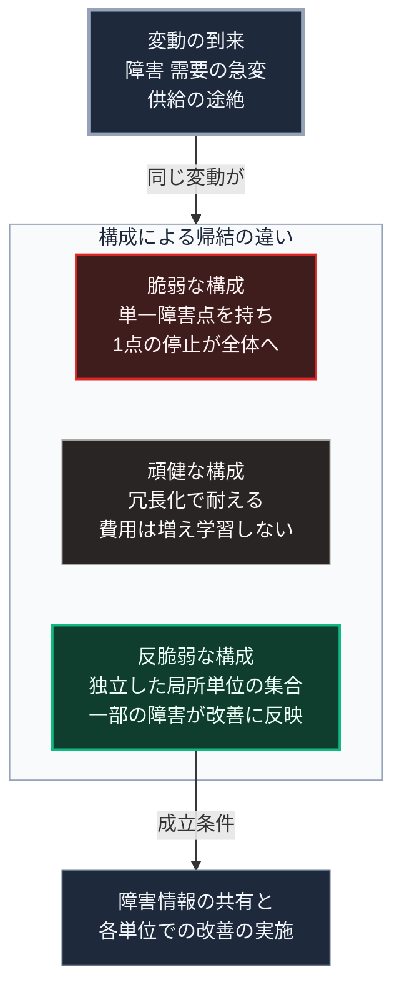

### 序論：本章が扱う範囲

本章は、系が変動に対してどう応答するかによる分類を整理し、それを供給インフラの設計基準として読み替えます。

本章の情報源は、ナシーム・ニコラス・タレブの2012年の著作です [ [ 3 ] ](https://openlibrary.org/works/OL16726829W) 。本文の前半は同書の記述、後半は本書による読み替えです。

### 1. 3つの分類

同書は、系を変動に対する応答によって3つに分類します。

**脆弱な系**。変動によって損なわれる系です。同書は、ガラスの器を例として挙げます。

**頑健な系**。変動に耐え、変化しない系です。

**反脆弱な系**。変動から利得を得る系です。同書は、免疫や筋肉のように、適度な負荷によって強化される系を例として挙げます。

同書の主張は、多くの議論が脆弱と頑健の二分法で行われており、第三の分類が見落とされているという点にあります。

### 2. 分類を規定する構造

同書によれば、系がどの分類に属するかは、変動に対する応答の非対称性によって決まります。

変動によって失うものが得るものより大きい系は脆弱です。両者が等しい系は頑健です。得るものが失うものより大きい系が反脆弱です。

同書はまた、系の規模が分類に影響すると論じています。大規模な系は、1つの障害が全体へ波及するため、脆弱になりやすい。小規模な系の集合は、個々の障害が局所にとどまるため、全体としては反脆弱になりうるという論旨です。同書がその機序として挙げるのは、個々の失敗が全体の淘汰と改善につながることです。

### 3. 設計基準への読み替え

供給インフラの設計において、この分類は次のように読み替えられます。

**脆弱な構成**。第Ⅱ部D-4で整理した単一障害点を持ち、その1点の停止が全体の停止を招く構成です。第Ⅱ部D-5で記述した連鎖停止は、この構成の帰結です。

**頑健な構成**。冗長化によって単一障害点を除去し、変動に耐える構成です。費用は増加しますが、変動から学習することはありません。

**反脆弱な構成**。局所の単位が独立に機能し、一部の単位の障害が他の単位の運用改善に反映される構成です。この構成が成立するには、障害の情報が共有され、改善が各単位で実施される仕組みが必要です。障害の情報共有を成立条件とする点は、同書の記述ではなく本書による読み替えです。

### 4. 同書の枠組みの限界

同書の分類は、設計の方向を示しますが、具体的な設計を導くものではありません。

反脆弱な構成が成立するには、第Ⅴ部-2で整理した条件、とりわけ監視と情報共有が必要です。障害の情報が共有されなければ、生き残った単位は学習しません。

また、同書は変動の規模について限定を置いています。適度な変動から利得を得る系も、系の許容範囲を超える変動によっては損なわれます。第Ⅱ部D-8で記述した規模の事象は、この限定に該当します。

### 🗺️ 図：3つの構成と、変動への応答

#### 図の読み方

この図は、上段の変動が中段の枠に入り、枠内の3つの構成のどれに当たるかで帰結が分かれる形で読みます。

枠内は上から順に、脆弱、頑健、反脆弱の構成です。現在の集約型インフラは、効率を優先した結果として枠内の最上段に近づいています。第Ⅱ部D-4で述べたとおり、これは設計の欠陥ではなく、稼働率を高める選択がもたらした帰結です。

枠内の中段への移行は、冗長化によって達成できます。ただし費用が増加し、第Ⅱ部A-4で示した更新期の負担をさらに重くします。

枠内の最下段の反脆弱な構成は、費用の構造が異なります。局所の単位は、それぞれが平時にも機能する設備であり、冗長化のためだけの設備ではありません。第Ⅲ部-7で述べた「備えを平時の機能に埋め込む」構成が、これにあたります。

ただし、枠の下に付いた成立条件の箱が、この構成の実現を規定します。第Ⅴ部-3で整理した監視と参加の原則が、ここで必要になります。
---

### 現代社会構造への射程と本質（本章のまとめ）

本セクションは、著者による解釈です。前節までの記述とは区別して読んでください。

1.  **現代社会構造の原点**

    集約型インフラの設計は、第Ⅰ部C-7で記述した経緯のもとで、脆弱と頑健の二分法によって評価されてきました。冗長化の費用と障害の確率を比較し、許容できる範囲で冗長化を省く判断です。

2.  **設計上の要点**

    本章から抽出できるのは、次の点です。変動への応答には第三の分類があり、それは規模と情報共有の設計によって実現できます。この分類を考慮しない設計は、頑健化の費用を過大に見積もる結果を招きます。

3.  **現代社会の現状と課題**

    第Ⅴ部-10以降で扱う設備は、局所の単位を構成する要素です。それらが反脆弱な構成を形成するかどうかは、設備そのものではなく、障害情報の共有と改善の仕組みに依存します。第Ⅴ部-8で扱う入れ子構造は、この仕組みの制度的な側面です。
