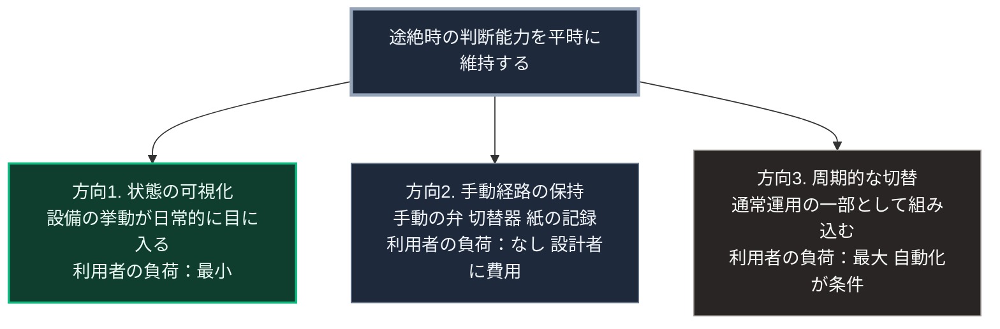

### 序論：本章が扱う範囲

本章は、途絶時に必要となる判断能力を、平時においてどう維持するかを扱います。

第Ⅲ部-7で整理したとおり、依存の問題は、依存の解除が最も困難な時点に解除が要求されることにあります。本章は、この時間的な非対称に対する設計です。

本文は、構造の整理と設計の方向に限定します。評価は章末で扱います。

### 1. 問題の設定

第Ⅴ部-6で整理したとおり、局所の自律を制約する要因の1つは知識です。途絶時に判断を担う経験が、平時には蓄積されません。

この問題に対し、「平時から自給の訓練をすべきである」という規範的な主張は、第Ⅲ部-6に述べたとおり実行段階では機能しません。訓練は認知的な負荷を要し、負荷の高い選択は選ばれないためです。

したがって、設計上の問いは次のようになります。平時の負荷を増やさずに、途絶時に必要な判断能力を維持する構成は可能か。

### 2. 思想的な背景

第Ⅴ部-1で整理した老荘思想は、作為的な介入の抑制と、単一の有用性基準への懐疑を提示しました [ [ 29 ] ](https://ctext.org/dao-de-jing) 。

本章の設計は、この思想を次の形で翻訳します。すべてを自動化して判断を排除するのではなく、判断の機会を意図的に残す。ただし、その機会に要する負荷を低く保つ。

この構成を、本書は能動的不便と呼びます。類似の概念として、不便であることによって初めて得られる利得を設計の対象とする不便益の研究があります [ [ 351 ] ](https://doi.org/10.1007/978-981-19-9588-0_1) 。本書の能動的不便は、その対象を途絶時の判断能力の維持に限定した概念です。

### 3. 設計の方向

能動的不便の設計は、次の3つの方向に分けられます。

**方向1：状態の可視化**。設備が自動で動作している間も、その状態が利用者に提示される構成です。電力の残量、水の処理状況、そして通信の接続状態が、日常的に目に入る形で示されます。これにより、利用者は判断を要求されないまま、設備の挙動に関する経験を蓄積します。

**方向2：手動経路の保持**。自動の経路が停止した場合に用いる手動の経路を、設備から除去しない構成です。手動の弁、手動の切替器、そして紙の記録が、これにあたります。手動経路は平時には使われませんが、その存在が途絶時の選択肢を保ちます。

**方向3：周期的な切替**。平時において、自動から手動へ、接続から局所へ、定期的に切り替える運用です。この切替は訓練ではなく、通常運用の一部として組み込まれます。

### 4. 負荷の観点からの評価

3つの方向は、第Ⅲ部-6で整理した負荷の非対称に対して、それぞれ異なる位置にあります。

方向1は、利用者に行動を求めません。負荷は最小です。

方向2は、設備の設計者に費用を求めますが、利用者には行動を求めません。

方向3は、利用者に周期的な行動を求めます。負荷は3つの中で最大です。したがって、方向3が機能するには、切替が通常運用の一部として自動的に生じる構成が必要です。利用者の意思による実施に依存する場合、第Ⅲ部-6の知見に照らして持続しません。

### 🗺️ 図：能動的不便の3つの方向と負荷

#### 図の読み方

この図は、3つの方向を利用者の負荷によって配置したものです。

本書が第Ⅴ部の設備設計において優先するのは、方向1と方向2です。いずれも利用者に行動を求めず、設計の側で実装できます。

方向3は、効果が最も大きい一方、実現が最も困難です。第Ⅲ部-6で述べた負荷の非対称が、ここでも作用します。したがって方向3は、利用者の意思に委ねるのではなく、設備の運用に組み込まれる形でのみ持続します。たとえば、蓄電池の保守のために定期的に系統から切り離す運用は、方向3を保守という別の目的に埋め込んだ構成です。

第Ⅲ部-7で述べた「備えを平時の機能に埋め込む」という帰結は、ここで具体化されます。

---

### 現代社会構造への射程と本質（本章のまとめ）

本セクションは、著者による解釈です。前節までの記述とは区別して読んでください。

1.  **現代社会構造の原点**

    現在の設備設計は、判断の排除を使いやすさとして追求してきました。第Ⅲ部-5で述べたとおり、判断を減らす設計と、判断を残したまま負荷を下げる設計とは異なります。前者が支配的であった結果、方向2の手動経路は多くの設備から除去されています。

2.  **設計上の要点**

    本章から抽出できるのは、次の点です。判断能力は使用によって維持され、不使用によって失われます。この性質は、第Ⅰ部C-12で整理した技能の習得と同型です。

3.  **現代社会の現状と課題**

    第Ⅴ部-10以降で扱う設備の選定において、方向1と方向2は評価基準となります。状態が可視化されているか、手動経路が保持されているか。この2点を満たさない設備は、平時の効率が高くても、途絶時の判断能力の維持には寄与しません。
