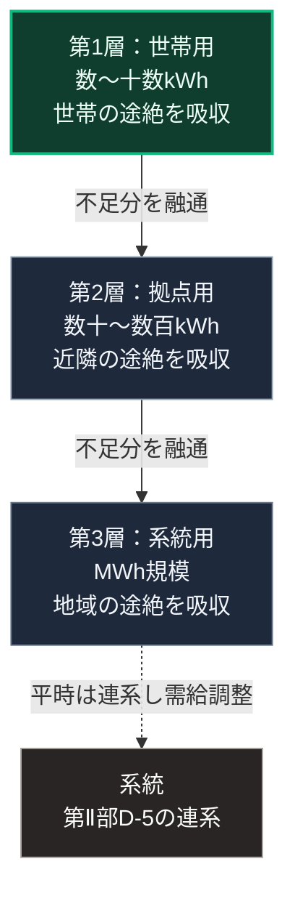

### 序論：本章が扱う範囲

本章から[第Ⅴ部-10](52_vpp-peer-to-peer-load-sharing)までは、[第Ⅴ部-7](49_ostrom-principle-8-nested-commons)で整理した4層構造のうち、電力に関する第1層から第3層を扱います。本章は、その中核をなす蓄電設備を対象とします。

本文は、技術の性質と公表された製品情報の記述に限定します。特定の製品の推奨は行いません。評価は章末で扱います。

### 1. 電力の局所化における蓄電の位置

[第Ⅱ部D-5](26_power-grid-cascade-collapse)で記述したとおり、電力は需給の同時性という制約を持ちます。系統から切り離された局所において、この制約を緩和する手段が蓄電です。

局所の発電は、太陽光を主とする場合、出力が気象と時刻に依存します。需要は別の周期で変動します。蓄電設備は、両者の差を時間的に吸収します。

したがって、蓄電容量は局所の自律性を規定します。容量が大きいほど、発電のない期間を長く維持できます。

### 2. 蓄電設備の分類

蓄電設備は、規模と用途によって次の3つに分けられます。

**世帯用**。数キロワット時から十数キロワット時の容量で、1世帯の夜間需要を賄う規模です。[第Ⅴ部-7](49_ostrom-principle-8-nested-commons)の第1層に対応します。

**拠点用**。数十から数百キロワット時の容量で、避難所や集会施設の需要を賄う規模です。第2層に対応します。

**系統用**。メガワット時の規模で、系統の需給調整や地域の供給維持に用いられます。第3層に対応します。系統用の蓄電システムについて、資源エネルギー庁の検討会は、市場の黎明期にあるとして収益性と導入費用の推移を整理しています [ [ 354 ] ](https://www.meti.go.jp/shingikai/energy_environment/storage_system/pdf/20250307_1.pdf) 。一例として、事業者の公表する製品情報があります [ [ 12 ] ](https://power-x.co/ja/products/megapower/) 。

### 3. 蓄電設備の制約

[第Ⅴ部-5](47_standalone-prepping-vulnerability)で整理したとおり、蓄電設備は消耗品としての性質を持ちます。

充放電の繰り返しによって容量は低下し、一定の年数で交換を要します。この年数は、電池の方式、運用の温度、そして充放電の深さによって変動します。

また、蓄電設備には制御装置が組み込まれています。[第Ⅱ部C-9](33_meti-semiconductor-rapidus)で述べたとおり、この装置は半導体を用いており、その修理と交換は部品の供給に依存します。

さらに、系統との接続には規制があります。系統への逆潮流と売電には、電気事業に関する法制度の遵守が求められます [ [ 206 ] ](https://www.enecho.meti.go.jp/category/electricity_and_gas/electric/summary/) 。

### 4. 設計上の要件

[第Ⅴ部-8](50_intentional-inconvenience-practice)で整理した能動的不便の観点から、蓄電設備には次の要件が導かれます。

**状態の可視化**。残量、充放電の状況、そして劣化の程度が、利用者に日常的に提示されること。

**手動経路の保持**。制御装置が停止した場合にも、限定された負荷へ給電できる手動の切替が存在すること。

**系統からの独立動作**。系統が停止した際に、局所の発電と蓄電のみで動作へ移行できること。この移行は、[第Ⅱ部D-3](23_millisecond-warfare-ooda)で述べたとおり、事前に定めた条件によって自動的に生じる必要があります。

### 5. 費用と反論

**費用の桁**。資源エネルギー庁の検討会が補助事業の実績から推計した2023年度の家庭用蓄電システムの価格は、設備費が1キロワット時あたり約11万円、工事費が約1万円でした [ [ 354 ] ](https://www.meti.go.jp/shingikai/energy_environment/storage_system/pdf/20250307_1.pdf) 。同資料によれば、補助事業を用いない場合の設備費は1キロワット時あたり15万円から20万円程度です。業務用と産業用では、容量の大きい設備ほど1キロワット時あたりの価格は低い傾向にあります。この単価を第2節の容量に当てはめると、世帯用は100万円台、拠点用は1000万円台が目安となります。

**反論1：火災と廃棄**。リチウムイオン電池は強い衝撃や高温に弱く、廃棄物の処理施設などで火災が発生していることを環境省が示しています [ [ 355 ] ](https://www.env.go.jp/recycle/waste/lithium_1/index.html) 。同省は、家庭からの廃棄は市区町村の規則に従い、事業所からの廃棄は処理業者へ委託するよう求めています。本書の設計では、この点を[第Ⅴ部-7](49_ostrom-principle-8-nested-commons)の第2層以上で扱います。設置場所の基準、劣化した設備の回収経路、そして交換費用の積み立てを、設備の導入と同時に定める必要があります。

**反論2：平時の対価がなければ導入されない**。この反論は妥当です。途絶時のためだけの設備は、費用の回収経路を持ちません。次章で扱う系統との接続と対価が、この反論に対する応答です。

### 🗺️ 図：蓄電設備の3規模と4層構造の対応

#### 図の読み方

この図は、上段から下段へ、蓄電設備の規模が大きくなる順に読みます。3つの箱は、[第Ⅴ部-7](49_ostrom-principle-8-nested-commons)の4層構造の第1層から第3層に対応します。

重要なのは、3つの規模が代替関係ではなく補完関係にある点です。上段の世帯用は世帯の途絶を、中段の拠点用は近隣の途絶を、下段の系統用は地域の途絶を、それぞれ異なる時間幅で吸収します。箱の間の実線は、不足分が上位の規模から融通される経路です。

[第Ⅲ部-9](scenario-pessimistic)で述べた悲観シナリオにおいて、系統の復旧に長期を要する場合、上段の世帯用の容量では持続しません。中段と下段への融通経路が、持続期間を延ばします。

最下段へ向かう破線は、系統用の設備が平時には系統と接続され、需給調整に用いられることを表します。[第Ⅲ部-5](20_autonomous-society-frictions)で述べたとおり、備えは平時の機能の中に置かれる必要があります。その構成が、ここで具体化されます。途絶時のためだけの設備ではなく、平時の系統運用に寄与する設備が、途絶時にも機能します。
---

### 現代社会構造への射程と本質（本章のまとめ）

本セクションは、著者による解釈です。前節までの記述とは区別して読んでください。

1.  **現代社会構造の原点**

    [第Ⅰ部C-7](06_electrification-dawn)で記述したとおり、電力事業の構造は、大規模化と高い稼働率によって成立しました。蓄電設備の低廉化は、この前提を部分的に変化させています。小規模でも単位あたり費用が極端に不利にならない設備が、規模の経済の一部を緩和します。

2.  **設計上の要点**

    本章から抽出できるのは、次の点です。局所の自律性は、発電ではなく蓄電によって規定されます。発電の間欠性を吸収する手段がなければ、発電設備は途絶時に機能しません。

3.  **現代社会の現状と課題**

    蓄電設備の導入は、費用負担の問題を伴います。[第Ⅱ部D-4](25_physical-spof-japan)で述べたとおり、冗長性の費用を誰が負担するかが論点です。系統用の設備を平時の需給調整に用いる構成は、この費用を平時の便益で回収する経路の1つです。次章では、この設備を局所間で融通する仕組みを扱います。
