### 序論：本章が扱う範囲

本章は、前章で扱った蓄電設備を、局所の間で融通し、系統と接続する仕組みを扱います。第Ⅴ部-7で整理した4層構造の第2層と第3層に対応します。

本文は、制度と技術の性質の記述に限定します。評価は章末で扱います。

### 1. 系統側の仕組み ―― 仮想発電所

資源エネルギー庁は、分散して設置された設備を通信によって統合し、1つの発電所のように制御する仕組みを仮想発電所として位置づけています。対象となる設備は、発電設備、蓄電設備、需要設備です [ [ 10 ] ](https://www.enecho.meti.go.jp/category/saving_and_new/advanced_systems/vpp/) 。

この仕組みは、系統の需給調整に局所の設備を参加させるものです。需要が供給を上回る時間帯に蓄電設備から放電し、逆の時間帯に充電することで、系統全体の調整に寄与します。

参加した設備の所有者は、設備を束ねる事業者、すなわちアグリゲーターを介して調整力の市場等に参加し、寄与に応じて対価を受け取ります。電気事業法は、分散した設備から集約した電気を供給する事業を特定卸供給の事業と位置づけ、届出を求めています [ [ 353 ] ](https://laws.e-gov.go.jp/law/339AC0000000170) 。これにより、蓄電設備の費用を平時の便益で部分的に回収する経路が生じます。

系統の広域運用については、広域機関が資料を公表しています [ [ 189 ] ](https://www.occto.or.jp/) 。

### 2. 局所側の仕組み ―― 近隣での融通

系統が機能している間、局所の設備は系統を介して融通されます。系統が途絶した場合、局所の設備は系統から切り離され、独立して動作する必要があります。

このとき、近隣の複数の世帯や拠点が設備を相互に接続していれば、1つの単位の不足を他の単位が補えます。第Ⅴ部-7の第2層に対応する構成です。

この接続には、次の2つの方式があります。

**方式1：物理的な接続**。近隣の設備を専用の配線で接続し、1つの局所系統を構成する方式です。系統からの切り離しと局所系統の運用には、電気事業に関する法制度の遵守が必要です [ [ 206 ] ](https://www.enecho.meti.go.jp/category/electricity_and_gas/electric/summary/) 。資源エネルギー庁が定める系統連系の技術要件に関するガイドラインは、系統が停止した状態で分散型電源の運転だけが継続する単独運転を防止するため、周波数リレー等による解列を求めています [ [ 352 ] ](https://www.enecho.meti.go.jp/category/electricity_and_gas/electric/summary/regulations/pdf/keito_renkei_20241201.pdf) 。同ガイドラインは、災害等の長期停電時に系統から切り離して運転する地域独立系統の要件を別に定めており、その開始と解除は系統が停電した後に行うものとされています。したがって、局所系統として運用するには、系統からの解列と局所系統の保護を担う切替装置、および系統運用者との連絡体制が別途必要です。

**方式2：可搬の蓄電設備による融通**。設備を物理的に接続せず、可搬の蓄電設備を持ち回る方式です。制度上の制約は少ない一方、融通の速度と量は限られます。

### 3. 融通の条件

第Ⅴ部-7で述べたとおり、融通には事前の合意が必要です。

第一に、どの条件で融通を開始するか。蓄電残量の閾値、あるいは系統の途絶の検知です。

第二に、どの順序で負荷を制限するか。第Ⅱ部D-5で記述した需要側の強制遮断と同様に、局所においても、優先度の低い負荷から順に切り離す順序を定めます。

第三に、融通の対価をどう記録するか。第Ⅴ部-3の原則4に対応する記録が、後の精算と紛争解決の基礎となります。

これらは、第Ⅱ部D-3で述べたとおり、有事に判断するのではなく、平時に定めておく事項です。

### 5. 費用と反論

**費用の要因**。局所間の融通には、切替装置、局所系統の保護装置、専用の配線、そして計測と記録の装置が必要です。前節で述べた制度上の要件により、公道を横断する配線の敷設と地域独立系統の運用には、電気事業に関する手続が伴います。公表された標準的な費用はなく、本書は桁を示しません。方式2の可搬設備は、これらの費用の大部分を回避する代わりに、融通の速度と量を制限します。

**反論：系統の停止時に局所系統を成立させることの制度上の困難**。この反論は、現行の技術要件に照らして妥当です。分散型電源は系統の停止時に解列することが原則であり、意図的な独立運転には前節で述べた地域独立系統としての要件を満たす必要があります。本書の応答は、第Ⅴ部-3の原則7と同じです。制度の目的である安全と品質を維持したまま、局所系統という形態を制度の側で位置づけることが、設計の前提となります。

### 🗺️ 図：平時と途絶時における設備の役割

```mermaid
flowchart TD
    E[同じ蓄電設備]
    E -->|系統が機能する間| N
    E -->|事前条件で切替| D
    subgraph N[平時：系統が機能]
        direction TB
        A1[仮想発電所に参加<br>需給調整に寄与] ~~~ A2[対価を受け取り<br>設備費用を回収]
    end
    subgraph D[途絶時：系統が停止]
        direction TB
        B1[事前条件で自動解列<br>局所系統として独立] ~~~ B2[近隣の設備と融通<br>可搬設備の持ち回り]
        B2 ~~~ B3[優先度の低い負荷から<br>順に制限し<br>生存の負荷を維持]
    end

    style E fill:#1e293b,stroke:#94a3b8,stroke-width:3px,color:#f1f5f9
    style A1 fill:#0f3d2e,stroke:#10b981,color:#ecfdf5
    style A2 fill:#0f3d2e,stroke:#10b981,color:#ecfdf5
    style B1 fill:#292524,stroke:#a8a29e,color:#fafaf9
    style B2 fill:#292524,stroke:#a8a29e,color:#fafaf9
    style B3 fill:#3f1d1d,stroke:#dc2626,stroke-width:2px,color:#fef2f2
    style N fill:#f8fafc,stroke:#94a3b8,color:#1e293b
    style D fill:#f8fafc,stroke:#94a3b8,color:#1e293b
```

#### 図の読み方

この図は、上段の設備から左右2つの枠へ分かれる形で読みます。左の枠が平時、右の枠が途絶時であり、同じ設備が両方の枠に現れます。

左の枠において、設備は系統の一部として機能し、対価を得ます。右の枠において、設備は局所の供給源として機能します。この二重の役割が、第Ⅲ部-5で述べた構成、すなわち途絶時の備えが平時の便益によって支えられる構成の具体形です。

左の枠から右の枠への移行は、上段から右へ向かう矢印の脇に示したとおり、事前に定めた条件によって自動的に生じる必要があります。第Ⅱ部D-3で述べたとおり、途絶時は注意という資源が最も逼迫する局面であり、複雑な操作を要求する設計は機能しません。

右の枠の最下段にある負荷の優先順位は、第Ⅳ部-1で述べた「下限の保証」の局所版です。すべての需要を維持するのではなく、生存に必要な需要を最後まで維持する設計です。
---

### 現代社会構造への射程と本質（本章のまとめ）

本セクションは、著者による解釈です。前節までの記述とは区別して読んでください。

1.  **現代社会構造の原点**

    仮想発電所の制度は、第Ⅰ部C-7で記述した集約型の電力事業が、分散した設備を取り込む形で拡張されたものです。集約と分散は対立ではなく、制度によって接続されています。

2.  **設計上の要点**

    本章から抽出できるのは、次の点です。局所の設備が持続するには、平時の役割が必要です。途絶時のためだけの設備は、費用の回収経路を持たず、第Ⅲ部-5で述べた理由により導入されにくくなります。

3.  **現代社会の現状と課題**

    融通の制度は、第Ⅴ部-2で整理した8つの設計原則を要します。とりわけ、融通の記録と精算は原則4から6に、局所系統の法的な承認は原則7に対応します。設備の技術的な成熟に比べ、これらの制度の整備は途上にあります。
