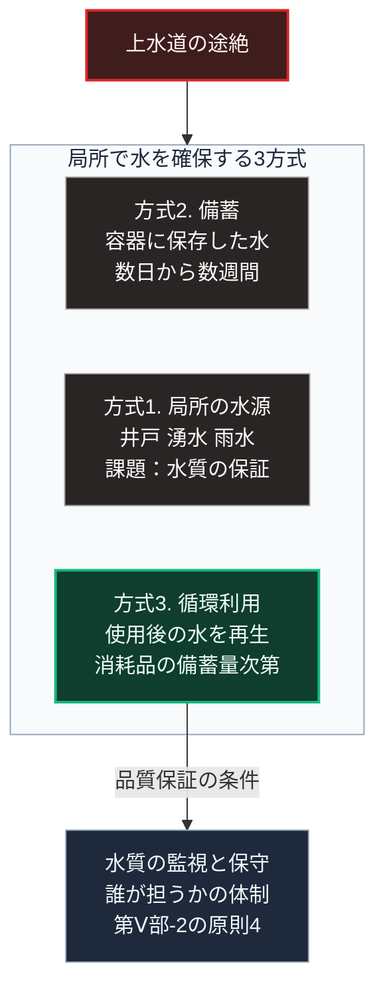

### 序論：本章が扱う範囲

本章から[第Ⅴ部-13](55_wota-jwad-mutual-aid-platform)までは、[第Ⅴ部-7](49_ostrom-principle-8-nested-commons)で整理した4層構造のうち、水に関する部分を扱います。本章は、局所において水を循環利用する設備を対象とします。

本文は、技術の性質と公表された製品情報の記述に限定します。特定の製品の推奨は行いません。評価は章末で扱います。

### 1. 水の局所化における制約

[第Ⅰ部C-6](05_cholera-outbreak-sewage)で記述したとおり、水系感染症の抑制は近代における主要な成果であり、この水準を下回ることは許容されません。したがって、水の局所化は電力の局所化より厳しい制約を持ちます。

局所で水を確保する方式は、次の3つに分けられます。

**方式1：局所の水源からの取水**。井戸、湧水、雨水です。水質の保証が課題です。

**方式2：備蓄**。容器に保存した水です。量が持続期間を規定します。

**方式3：循環利用**。使用した水を処理し、再び使用する方式です。取水と排水を最小化します。

[第Ⅱ部D-8](28_nankai-trough-vulnerability)で記述したとおり、大規模地震の際には上水道の復旧に長期間を要する場合があります。方式2は数日から数週間の期間に対応し、方式3はそれ以上の期間に対応します。

### 2. 循環型の処理設備の公表仕様

循環型の処理設備は、複数の事業者によって製品化されています。本章では、公表されている仕様を1つの事例として記述します [ [ 11 ] ](https://wota.co.jp/wota-box/) 。

同製品の公表資料によれば、100リットルの水を起点として、使用後の水の約98%をその場で再生します。処理は複数のフィルターと、紫外線および塩素による消毒を組み合わせて行われます。水質はセンサーによって監視され、フィルターの交換時期が装置の表示によって案内されます。

同資料によれば、同製品は2024年の能登半島地震において、石川県内の複数の自治体に約100台が配備されました。

### 3. 設備の制約

[第Ⅴ部-5](47_standalone-prepping-vulnerability)で整理した制約が、ここでも当てはまります。

**消耗品**。フィルターと消毒剤は、処理量に応じて交換を要します。備蓄量が持続期間を規定します。

**保守**。センサーと制御装置は半導体を用いており、その修理は部品の供給に依存します。

**規制**。[第Ⅴ部-12](54_water-supply-act-compliance)で扱うとおり、水の供給には水道法による規制があります。設備の用途と規模によって、適用される規制が異なります。

### 4. 設計上の要件

[第Ⅴ部-8](50_intentional-inconvenience-practice)で整理した能動的不便の観点から、次の要件が導かれます。

**状態の可視化**。水質の測定値と、フィルターの残余寿命が、利用者に提示されること。

**手動経路の保持**。センサーと制御が停止した場合にも、煮沸や塩素消毒による手動の処理経路が保持されること。

**共同備蓄**。消耗品を世帯単位ではなく近隣単位で備蓄し、[第Ⅴ部-7](49_ostrom-principle-8-nested-commons)の第2層で融通できること。

### 5. 費用と反論

**費用の要因**。循環型の処理設備の費用は、設備本体、フィルターと消毒剤という消耗品、そして水質の監視と保守の人員から構成されます。本章が参照した製品の価格は公表資料に含まれていないため、本書は桁を示しません。消耗品の費用は処理量に比例し、共同備蓄の規模に応じて単価が変動します。

**反論：循環水と温水設備はレジオネラ属菌の感染源となりうる**。この反論は、公衆衛生上の記録に基づく妥当なものです。厚生労働省の技術上の指針は、入浴設備、冷却塔、給湯設備などに付着する生物膜でレジオネラ属菌が繁殖し、エアロゾルの吸入によって感染することを示しています [ [ 359 ] ](https://www.mhlw.go.jp/content/11130500/001401928.pdf) 。同指針は、循環式の浴槽水について毎日の完全な換水を原則としています。あわせて、ろ過器と配管の生物膜を週1回以上除去し、消毒と定期の水質検査を実施することを求めています。本章の設備を入浴に用いる場合、同指針の措置が設備の運用に組み込まれる必要があります。第4節の水質の可視化と、[第Ⅴ部-2](43_governing-the-commons-rediscovery)の原則4にあたる監視体制は、この反論に対する応答です。飲用については、次章で述べるとおり別の経路を確保します。

### 🗺️ 図：水の局所化の3方式と対応期間

#### 図の読み方

この図は、上段の途絶から中段の枠へ入り、枠内の3つの方式を上から下へ読みます。

枠内の最上段の方式2は最も単純ですが、期間に上限があります。中段の方式1は期間の制約が少ない一方、水質の保証が課題です。最下段の方式3は、消耗品の備蓄量に応じて期間を延ばせますが、品質保証の体制を要します。

枠の下に付いた箱が、方式3の成否を規定する条件です。[第Ⅰ部C-6](05_cholera-outbreak-sewage)で確認したとおり、水質の保証を欠く供給は、感染症の再来を招きます。したがって方式3は、設備の導入だけでは成立しません。水質の監視と保守を誰が担うかという、[第Ⅴ部-2](43_governing-the-commons-rediscovery)の原則4に対応する体制が必要です。

[第Ⅴ部-7](49_ostrom-principle-8-nested-commons)の入れ子構造に照らすと、方式3の設備は第1層または第2層に置かれ、消耗品の備蓄と保守技能は第2層以上で共有されます。
---

### 現代社会構造への射程と本質（本章のまとめ）

本セクションは、著者による解釈です。前節までの記述とは区別して読んでください。

1.  **現代社会構造の原点**

    [第Ⅰ部C-6](05_cholera-outbreak-sewage)で記述したとおり、集約型の上下水道は19世紀の公衆衛生の成果です。本章の設備は、その代替ではなく、途絶時に品質を維持したまま供給を継続する手段です。

2.  **設計上の要点**

    本章から抽出できるのは、次の点です。水の局所化においては、供給量より品質保証の体制が制約となります。[第Ⅰ部C-3](02_ancient-water-infrastructure)で記述したローマの水道管理においても、技術より管理が持続を規定しました。

3.  **現代社会の現状と課題**

    [第Ⅱ部A-3](38_infrastructure-disinvestment-paradox)で参照した国土交通省の資料によれば、水道管路の約41%が2040年3月までに建設後50年を超えます [ [ 218 ] ](https://www.mlit.go.jp/sogoseisaku/maintenance/02research/02_01.html) 。維持範囲が縮小する区域において、本章の設備は選択肢となります。ただし、次章で扱う規制との整合が前提です。
