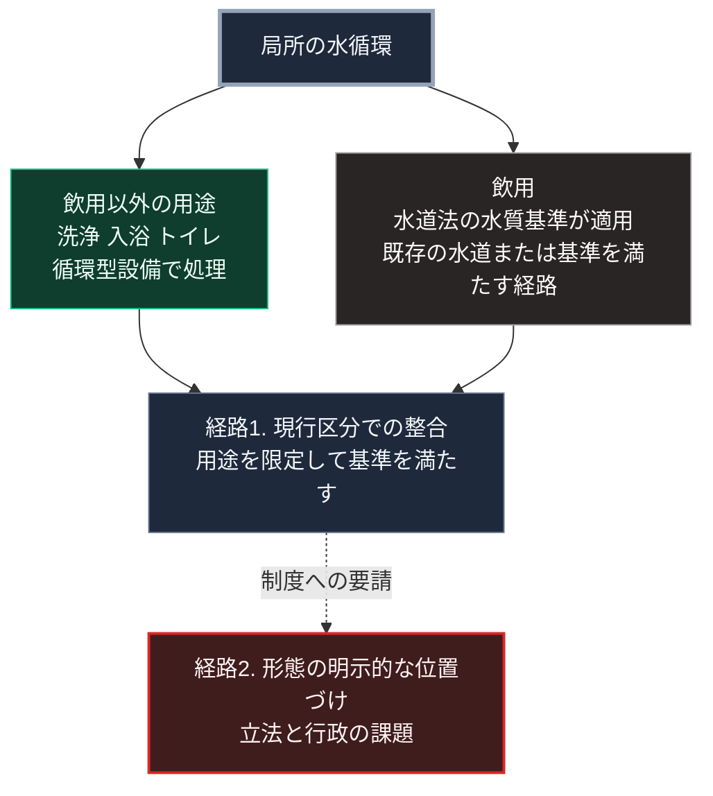

### 序論：本章が扱う範囲

本章は、前章で扱った循環型の処理設備が、日本の水道法とどのように関係するかを整理します。第Ⅴ部-4で述べた原則7、すなわち組織化の承認に対応する章です。

本文は、法令の規定と制度の構成の記述に限定します。本書は、規制の回避を推奨しません。評価は章末で扱います。

### 1. 水道法の目的と構成

水道法は、清浄で豊富かつ低廉な水の供給を図ることを目的として、水道の布設と管理を規律する法律です [ [ 236 ] ](https://laws.e-gov.go.jp/law/332AC0000000177) 。

同法は、水道を規模と形態によって区分しています。第3条によれば、水道とは導管などの工作物により人の飲用に適する水として供給する施設の総体です。水道事業は一般の需要に応じて水道により水を供給する事業であり、給水人口100人以下のものを除きます。専用水道は自家用の水道などのうち、100人を超える者へ居住に必要な水を供給するもの、または1日最大給水量が政令の基準を超えるものです。簡易専用水道は、水道事業の水道から供給を受ける水のみを水源とする水道のうち、政令の基準を超える規模のものです。政令は、専用水道の基準を1日20立方メートル、簡易専用水道の基準を受水槽の有効容量の合計10立方メートルと定めています [ [ 356 ] ](https://laws.e-gov.go.jp/law/332CO0000000336) 。それぞれの区分に、設置の手続、水質の基準、管理の義務が定められています。

水道行政は、2024年度から国土交通省が所管しています [ [ 243 ] ](https://www.mlit.go.jp/mizukokudo/mizsei/index.html) 。水質の基準については、環境省が所管します。

### 2. 規制の目的

同法の規制は、第Ⅰ部C-6で記述した公衆衛生の成果を制度として維持するためのものです。

水質の基準、定期的な検査、そして管理者の責任は、いずれも水系感染症の再来を防ぐ仕組みです。この目的は正当であり、本書の設計はこれを前提とします。

### 3. 循環型設備の位置づけ

前章で扱った循環型の処理設備は、同法の区分において次のように位置づけられます。

同法の水道は、第3条第1項において人の飲用に適する水として供給する施設と定義されています [ [ 236 ] ](https://laws.e-gov.go.jp/law/332AC0000000177) 。したがって、使用後の水を処理して飲用以外の用途に再び用いる設備は、同法の水道にはあたらないと解されます。一方、処理した水を飲用として供給する場合、給水の対象と規模に応じて専用水道などの区分に該当しえます。

飲用以外の用途に適用される基準は、水道法ではなく別の法令にあります。建築物における衛生的環境の確保に関する法律の施行規則は、散水、清掃、水洗便所などに用いる雑用水について基準を定めています [ [ 357 ] ](https://laws.e-gov.go.jp/law/346M50000100002) 。し尿を含む水を原水としないこと、残留塩素の保持、そしてpHや大腸菌などの水質基準と検査の頻度です。この規則は一定規模以上の特定建築物を対象としますが、局所の循環水の基準を設計する際の参照点となります。入浴に用いる場合は、公衆浴場法が衛生措置の基準を都道府県の条例に委ねています [ [ 358 ] ](https://laws.e-gov.go.jp/law/323AC0000000139) 。あわせて、前章で述べたレジオネラ症の指針が関係します。

したがって、局所の水循環を設計する際には、用途を区別し、飲用の供給については同法の基準を満たす経路を別途確保する構成が現実的です。

### 4. 制度との整合という設計要件

第Ⅴ部-4で述べたとおり、原則7は技術ではなく制度の問題です。

同法は、集約型の供給を主たる対象として整備されました。局所の循環利用という形態は、その整備時に主要な想定ではありませんでした。

したがって、局所の水循環を持続的な形態として成立させるには、次の2つの経路があります。

**経路1：現行の区分のもとで、適用される基準を満たす**。用途を限定し、飲用の供給は既存の水道に依存する構成です。第Ⅴ部-8の第2層にあたる数十世帯へ処理水を飲用として供給する場合、居住者100人超という専用水道の要件を満たす可能性が高く、設置の手続と水質の管理義務が生じます。経路1が用途を飲用以外に限定するのは、この閾値を踏まえた判断です。

**経路2：制度の側で、局所の循環利用という形態を明示的に位置づける**。これは立法と行政の課題であり、技術者が単独で実現できるものではありません。

本書は、経路1を当面の設計とし、経路2を制度への要請として位置づけます。

### 5. 費用と反論

**費用の要因**。制度との整合に要する費用は、設備ではなく管理に生じます。水質検査の費用、記録の作成、そして管理者の選任です。専用水道に該当する場合、定期の水質検査と管理の義務が生じ、その費用は継続的に発生します。本書は公表された標準的な費用を確認できなかったため、桁を示しません。

**反論：用途の限定は実効性に欠ける**。飲用以外に用途を限定しても、利用者が処理水を飲用に転用する可能性があるという反論です。この反論は妥当です。応答は、設備の側で経路を分離することです。飲用の経路と処理水の経路を配管と表示によって物理的に区別し、第Ⅴ部-9の状態の可視化によって水質を利用者に示す構成が必要です。

### 🗺️ 図：用途による区分と、制度との整合

#### 図の読み方

この図は、局所の水循環を用途によって区分し、それぞれが制度とどう整合するかを示したものです。

飲用以外の用途は、生活用水の大部分を占めます。この部分を循環型設備で賄うことにより、上水道への依存量を減らし、途絶時の持続期間を延ばせます。

飲用については、水質の基準を満たす経路を別途確保します。平時は既存の水道、途絶時は備蓄と、基準を満たす処理設備の組み合わせです。

経路2は、本書の範囲を超えます。ただし、第Ⅱ部A-4で示した水道管路の更新期と、第Ⅱ部A-5で示した居住の分化を考慮すれば、次の必要は今後高まると考えられます。集約型の維持範囲の外側における供給形態を、制度が位置づけることです。

---

### 現代社会構造への射程と本質（本章のまとめ）

本セクションは、著者による解釈です。前節までの記述とは区別して読んでください。

1.  **現代社会構造の原点**

    水道法の構成は、第Ⅰ部C-6で記述した集約型の衛生インフラの成果を、制度として固定したものです。その目的は現在も有効です。

2.  **設計上の要点**

    本章から抽出できるのは、次の点です。制度は、整備時に主要であった形態を前提として設計されます。新しい形態は、制度の目的と整合する形で位置づけられなければ、持続しません。第Ⅴ部-2で参照したオストロムの観測は、この点を繰り返し示しています。

3.  **現代社会の現状と課題**

    本書は、制度の回避ではなく、制度の目的を維持したうえでの整合を設計要件とします。次章で扱う広域互助は、制度の側と技術の側が協定によって接続された事例にあたります。
