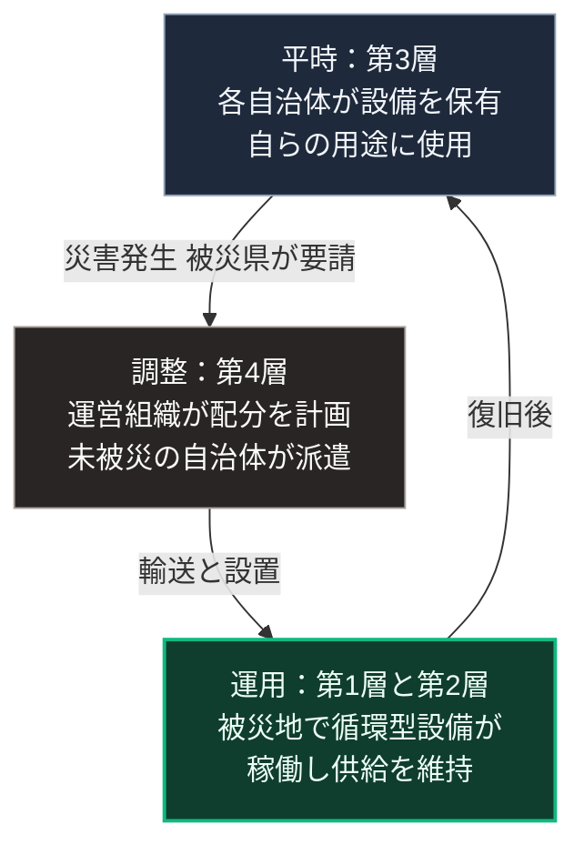

### 序論：本章が扱う範囲

本章は、第Ⅴ部-7で整理した4層構造のうち、水に関する第3層と第4層、すなわち自治体間の広域互助を扱います。

本章の情報源は、当該の枠組みを運営する組織と事業者が公表した資料に限定します。本文は、枠組みの内容の記述に限定し、評価は章末で扱います。

### 1. 枠組みの内容

小規模分散型の水循環設備を、災害時に自治体間で融通する枠組みが、2025年以降に整備されています。運営組織である日本災害水ストレス対策協会（一般社団法人）は、その目的と構成を公表しています [ [ 247 ] ](https://www.jwad.org/) 。

同組織の公表資料によれば、同組織の役割は次の3つです。第一に、平時の体制整備として、設備の事前の分散配備を進め、災害時の集約と配分の体制を整えること。第二に、災害時に被災した都道府県からの要請を一元的に受け、被災を免れた自治体が保有する設備を都道府県単位で集約すること。第三に、断水地域の水需要を把握したうえで、都道府県内の市町村間における設備の最適な配分を計画し支援することです。

事業者は、2025年8月に神奈川県と、この枠組みの構築に向けた協定を締結したと公表しています [ [ 248 ] ](https://wota.co.jp/news-250815/) 。同事業者の公表によれば、その後、複数の都道府県と同種の協定が締結されています。

### 2. 想定されている規模

事業者の公表資料によれば、想定される首都直下地震では2024年の能登半島地震の約50倍、南海トラフ巨大地震では約100倍の規模の断水被害が想定されています [ [ 248 ] ](https://wota.co.jp/news-250815/) 。

第Ⅱ部D-8で整理したとおり、政府の被害想定においても、上水道は影響が想定される項目に含まれています。

運営組織の公表資料によれば、枠組みの構築は3つの段階で計画されています [ [ 247 ] ](https://www.jwad.org/) 。2025年度までに全国的な連携の枠組みを整備し、2026年度から2027年度に平時の訓練と災害時の運用を確立し、2028年度から2030年度に制度化と標準化を進める計画です。

### 3. 第Ⅴ部の枠組みとの対応

この枠組みは、第Ⅴ部-7の入れ子構造における第3層と第4層に対応します。

第1層と第2層にあたる世帯と近隣の設備は、前々章で扱った循環型の処理設備です。第3層にあたる自治体は、平時に設備を保有し、災害時に派遣します。第4層にあたる全国の範囲では、運営組織が自治体間の調整を担います。

第Ⅴ部-7で述べた運用原則、すなわち上位層は下位層を代替せず、不足時にのみ融通するという原則が、ここでも当てはまります。平時において、各自治体の設備はその自治体の用途に用いられます。災害時において、被災していない自治体の設備が被災自治体へ移動します。

### 4. 枠組みが満たす条件

第Ⅴ部-2で整理した8つの設計原則のうち、この枠組みは次の条件に対応します。

**原則7：組織化の承認**。自治体が協定を通じて枠組みを承認しています。事業者は、2025年7月の全国知事会の委員会において賛同が示されたと公表しています [ [ 248 ] ](https://wota.co.jp/news-250815/) 。前章で述べた制度との整合が、協定という形で実現されています。

**原則8：入れ子構造**。自治体という第3層と、全国の運営組織という第4層が、明示的に構成されています。

一方、次の条件は今後の整備に依存します。

**原則4から6：監視、制裁、紛争解決**。設備の状態の共有、派遣の記録、そして費用の精算は、運用の確立に伴って整備されます。

### 5. 費用と反論

**費用の要因**。この枠組みの費用は、各自治体が平時に保有する設備の取得と維持、災害時の輸送と設置、そして運営組織の調整業務から構成されます。運営組織と事業者の公表資料には、これらの費用と負担者の記載がありません。したがって、本書は桁を示しません。第Ⅳ部-3で述べた平時の対価という観点からは、自治体の保有する設備の平時の用途が、費用の正当化を規定します。

**反論：運用の実績がない**。この枠組みは2025年に構築が始まり、災害時の運用実績は蓄積の途上にあります。この反論は妥当であり、本書は後述のとおり成否を評価しません。設備の配置、輸送、そして精算の記録が公表されるかどうかが、評価の前提となります。

### 🗺️ 図：広域互助の構成

#### 図の読み方

この図は、上から下へ進み、下段から上段へ戻る矢印によって循環する形で読みます。上段が平時、中段が災害時の調整、下段が被災地での運用であり、戻る矢印が復旧後の状態を表します。

上段の箱が、第Ⅲ部-5で述べた構成、すなわち平時の用途を持つ設備が途絶時にも機能する構成にあたります。設備は災害時のためだけに保有されるのではなく、平時にも各自治体の用途に用いられます。

中段の箱が、第Ⅴ部-7の第4層に対応します。ここで運営組織が担うのは、設備の所有ではなく調整です。

この枠組みの意義は、第Ⅴ部-5で整理した孤立の制約に対する応答にあります。単一の自治体が保有できる設備には限りがあります。全国の設備を融通することで、下段の被災地における持続期間が延びます。

本書は、この枠組みの成否を現時点で評価しません。整備が段階的に計画されており、運用の実績が蓄積される段階にあるためです。本書が指摘するのは、この枠組みが第Ⅴ部で整理した設計原則と整合する構成を採っているという点です。
---

### 現代社会構造への射程と本質（本章のまとめ）

本セクションは、著者による解釈です。前節までの記述とは区別して読んでください。

1.  **現代社会構造の原点**

    自治体間の相互応援は、災害対策の分野において以前から制度化されています。本章の枠組みは、その対象を集約型設備の復旧支援から、分散型設備の融通へ拡張したものと位置づけられます。

2.  **設計上の要点**

    本章から抽出できるのは、次の点です。分散型の設備は、単独では持続期間に上限があり、融通の枠組みと組み合わせて初めて長期の途絶に対応できます。第Ⅴ部-5と第Ⅴ部-7で整理した論点が、実際の枠組みとして現れています。

3.  **現代社会の現状と課題**

    第Ⅲ部-10で整理した差分2、すなわち供給方式の転換が意図的な設計として行われるかどうかについて、本章の枠組みは観測可能な指標の1つです。協定の締結数、平時の訓練の実施、そして設備の標準化の進捗が、その指標にあたります。
