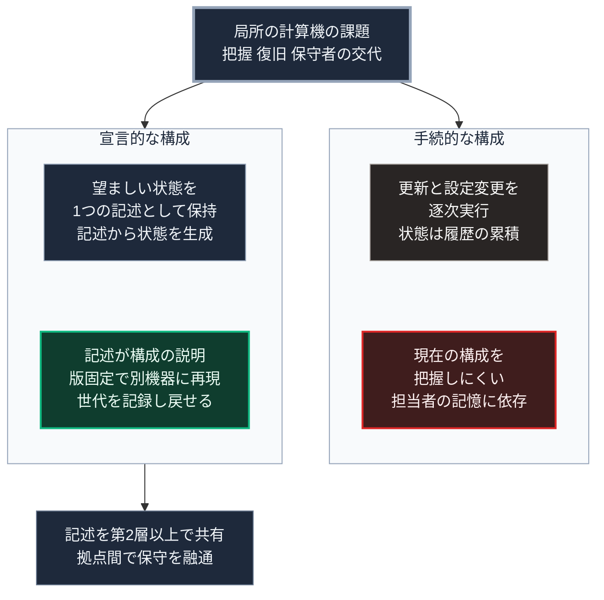

### 序論：本章が扱う範囲

本章から第Ⅴ部-18までは、第Ⅴ部-8で整理した4層構造のうち、情報に関する部分を扱います。本章は、その基盤となる計算機の構成を対象とします。

第Ⅱ部D-6で整理したとおり、通信の途絶時に機能を維持するには、機能を類型1、すなわち端末の側で完結する構成へ移す必要があります。本章は、その前提となる計算機の構成方法を扱います。

本文は、技術の性質と公開された仕様の記述に限定します。評価は章末で扱います。

### 1. 計算機の構成における課題

局所に配置された計算機は、次の課題に直面します。

第一に、構成の把握です。長期にわたり運用された計算機は、更新と設定変更の累積によって、現在の構成を正確に把握しにくくなります。

第二に、復旧です。計算機が故障した場合、同じ構成を別の機器に再現する必要があります。

第三に、保守者の交代です。第Ⅰ部C-2で述べたとおり、業務が担当者の記憶に依存する状態は、担当者の交代によって継続性を失います。

### 2. 宣言的な構成管理

これらの課題に対し、計算機の構成を宣言的に記述する方式が存在します。

この方式では、計算機がどうあるべきかを1つの記述として保持し、その記述から実際の状態を生成します。手順を逐次実行するのではなく、望ましい状態を宣言します。

この方式を採用した基本ソフト（NixOS）は、公式の解説書を公開しています [ [ 13 ] ](https://nixos.org/manual/nixos/stable/) 。同解説書によれば、システムの構成は1つの記述として保持され、変更は世代として記録され以前の世代へ戻せます。同じ記述から同じ構成を再現するには、記述が参照するパッケージ集合の版を固定する必要があります [ [ 346 ] ](https://nix.dev/tutorials/first-steps/towards-reproducibility-pinning-nixpkgs) 。

この方式の基礎となる仕組みについては、学習用の資料が公開されています [ [ 238 ] ](https://nix.dev/) 。

### 3. 方式の性質

宣言的な構成管理は、前節の3つの課題に対して次のように作用します。

構成の把握については、記述そのものが現在の構成の完全な説明となります。

復旧については、版を固定した記述を別の機器に適用することで、同じ構成が再現されます。

保守者の交代については、記述が担当者の記憶に代わる継続性の基盤となります。第Ⅰ部C-2で述べた記録の様式と同じ機能を、計算機の構成について果たします。

### 4. 設計上の要件

第Ⅴ部-9で整理した能動的不便の観点から、次の要件が導かれます。

**状態の可視化**。現在の構成が記述として参照可能であること。

**手動経路の保持**。宣言的な仕組みが機能しない場合にも、以前の世代へ戻す手段が存在すること。

**記述の共有**。構成の記述を、第Ⅴ部-8の第2層以上で共有し、他の拠点で再現できること。これは第Ⅴ部-6で整理した保守の制約に対する応答です。1つの拠点の保守者が不在でも、記述があれば他の拠点の保守者が対応できます。

### 5. 費用と反論

**費用の要因**。本章の方式を実装する基本ソフトは無償で公開されています。費用は、計算機の機器、予備の機器、そして導入時の学習に生じます。学習の費用は、記述の雛形を第2層以上で共有すれば下げられますが、雛形の作成と保守を誰が担うかは制度の問題です。

**反論：宣言的な記述があっても再現は保証されない**。第2節で述べたとおり、記述が参照するパッケージ集合の版を固定しない限り、同じ記述から異なる構成が生成されえます [ [ 346 ] ](https://nix.dev/tutorials/first-steps/towards-reproducibility-pinning-nixpkgs) 。また、記述が参照するパッケージの取得には、外部との接続または局所の複製が必要です。途絶時に再現するには、パッケージ集合の複製を第2層以上に保持しておく必要があります。この点は、第Ⅴ部-6で整理した消耗品の備蓄と同じ性質の制約です。

### 🗺️ 図：手続的な構成と宣言的な構成の対比

#### 図の読み方

この図は、上段の課題から左右2つの枠へ分かれ、それぞれの枠内を上から下へ読みます。右の枠が手続的な構成、左の枠が宣言的な構成です。

右の枠では、上の箱の方式が下の箱の課題を生みます。左の枠では、上の箱の方式が下の箱の性質を生み、上段の3つの課題に応答します。

本書が宣言的な構成を要件とする理由は、性能ではなく継続性にあります。第Ⅴ部-6で整理したとおり、局所の自律を制約する要因の1つは保守です。宣言的な記述は、保守に必要な知識を担当者から記述へ移し、拠点間で共有可能にします。

左の枠の下に付いた箱は、第Ⅴ部-8の入れ子構造を情報基盤に適用したものです。1つの拠点で計算機の故障と保守者の不在が重なっても、記述を持つ他の拠点が復旧を支援できます。

なお、この方式は導入時の学習費用を要します。第Ⅲ部-6で整理した負荷の観点から、この費用は導入の障壁となります。記述の雛形を第2層以上で共有し、各拠点の導入費用を下げることが、実装上の要件です。
---

### 現代社会構造への射程と本質（本章のまとめ）

本セクションは、著者による解釈です。前節までの記述とは区別して読んでください。

1.  **現代社会構造の原点**

    第Ⅰ部C-10で記述したとおり、計算機の汎用性は、手順を書き換えることで機能を変えられる点にあります。同時に、その汎用性は、現在何が動作しているかを外形から判断できないことを意味しました。宣言的な構成は、この判断可能性を回復する方式です。

2.  **設計上の要点**

    本章から抽出できるのは、次の点です。継続性は、担当者の能力ではなく、記録の様式によって保証されます。第Ⅰ部C-2で整理した5000年前の行政文書と、本章の構成記述は、同じ機能を果たしています。

3.  **現代社会の現状と課題**

    本章の計算基盤は、次章以降で扱う記録、判断支援、通信の各機能を載せる土台です。土台が再現可能でなければ、その上の機能も再現できません。
