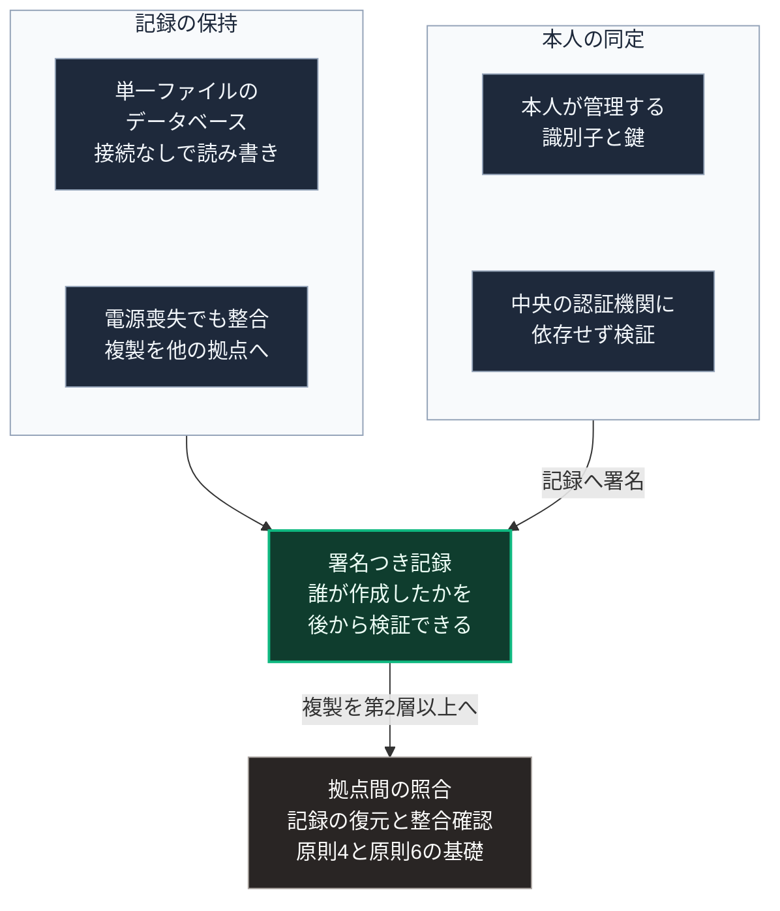

### 序論：本章が扱う範囲

本章は、局所において記録を保持し、記録の当事者を同定する仕組みを扱います。

[第Ⅴ部-3](44_ostrom-principles-1-4-engineering)で整理した原則4、すなわち監視の記録は、共同管理の基礎です。また[第Ⅱ部C-6](30_epistemic-crisis-consensus-collapse)で整理した検証の手段のうち、出典への到達と発信者の同定は、記録の保持と同定の仕組みに依存します。本章は、その技術的な基盤を扱います。

本文は、技術の性質と公開された仕様の記述に限定します。評価は章末で扱います。

### 1. 記録の保持における要件

局所で保持される記録には、次の要件があります。

第一に、外部との接続がなくても読み書きできること。[第Ⅱ部D-6](40_cloud-lockout-wan-cutout)で整理した類型1に対応します。

第二に、電源の喪失や機器の故障によって記録が損なわれないこと。

第三に、記録の複製を他の拠点に置き、必要に応じて照合できること。

### 2. 組み込み型のデータベース

これらの要件を満たす方式の1つが、独立したサーバ処理を要さず、単一のファイルとして記録を保持するデータベースです。この方式の代表的な実装（SQLite）は、公式の文書を公開しています [ [ 14 ] ](https://sqlite.org/) 。

同文書によれば、この実装は次の性質を持ちます。記録は1つのファイルに格納され、他の機器へ複製できます。書き込みの途中で電源が失われた場合にも、記録の整合性が保たれるよう設計されています。この保証の仕組みは、原子的な書き込みに関する文書に記述されています [ [ 344 ] ](https://sqlite.org/atomiccommit.html) 。ただし公式文書は、この保証が記憶装置による書き込み完了の通知が正しい場合に限られると明記しています [ [ 345 ] ](https://sqlite.org/howtocorrupt.html) 。書き込み方式の1つである先行書き込みログについても、文書が公開されています [ [ 237 ] ](https://sqlite.org/wal.html) 。

同実装の公式文書は、この方式が適する用途と適さない用途を明示しています [ [ 249 ] ](https://sqlite.org/whentouse.html) 。多数の利用者が同時に書き込む用途には適さない一方、単一の機器または少数の利用者による記録には適するとされています。[第Ⅴ部-7](49_ostrom-principle-8-nested-commons)の第1層と第2層は、後者に該当します。

### 3. 本人の同定における要件

記録の当事者を同定する仕組みには、次の要件があります。

第一に、中央の認証機関に接続できない状態でも、本人であることを確認できること。

第二に、同定の根拠となる情報を、本人が保持し管理できること。

第三に、記録への署名によって、その記録が誰によって作成されたかを後から検証できること。

### 4. 本人が管理する識別子

これらの要件に対応する技術として、本人が生成し管理する識別子（DID）と、それに紐づく証明（VC）の方式が標準化されています。

識別子については、国際的な標準化団体が仕様を公開しています [ [ 245 ] ](https://www.w3.org/TR/did-core/) 。同仕様によれば、識別子は中央の登録機関を要さずに生成でき、その識別子に対応する検証用の鍵を本人が管理します。

証明については、同団体が別の仕様を公開しています [ [ 246 ] ](https://www.w3.org/TR/vc-data-model-2.0/) 。同仕様によれば、ある主体に関する主張を発行者が署名し、その主張を本人が保持し、検証者が発行者の署名を確認する構成が定められています。

識別子の解決には、通常、識別子が記録された台帳や網からの読み出しを要します [ [ 245 ] ](https://www.w3.org/TR/did-core/) 。鍵を識別子自体に含める方式を用いる場合には台帳を要さず、その仕様は標準化団体の関連組織が公開しています [ [ 343 ] ](https://w3c-ccg.github.io/did-key-spec/) 。したがって、発行者の識別子から鍵を導出できる方式を用い、かつ失効確認を省略する場合に限り、検証時に外部へ接続する必要がありません。一方、本人が鍵を失った場合に回復する中央機関が存在しないため、鍵の複製と保管の設計が別途必要です。識別子の仕様自身が、鍵の紛失時の回復手段を各方式が定めるべき事項として挙げています [ [ 245 ] ](https://www.w3.org/TR/did-core/) 。

### 5. 費用と反論

**費用の要因**。本章のデータベースは公有の著作物として公開されており、利用に費用はかかりません [ [ 361 ] ](https://sqlite.org/copyright.html) 。費用は、記録を保持する機器、複製を置く拠点の機器、そして署名の鍵を管理する運用に生じます。

**反論1：鍵の紛失**。本人が管理する識別子には、鍵を再発行する中央機関がありません。鍵を失えば、その識別子による署名と検証はできなくなります。鍵を識別子自体に含める方式では、鍵の更新自体ができません [ [ 343 ] ](https://w3c-ccg.github.io/did-key-spec/) 。応答は、鍵の複製を第2層以上の拠点に分散して保管し、その保管と回復の手続を[第Ⅴ部-3](44_ostrom-principles-1-4-engineering)の原則1にあたる加入手続に組み込むことです。これは技術ではなく運用の要件です。

**反論2：記憶装置の信頼性**。第2節で述べたとおり、電源喪失時の整合性は記憶装置が書き込み完了を正しく通知する場合に限り保証されます [ [ 345 ] ](https://sqlite.org/howtocorrupt.html) 。応答は、記録の複製を複数の機器と拠点に置き、照合によって破損を検出することです。

### 🗺️ 図：局所における記録と同定の構成

#### 図の読み方

この図は、上段の左右2つの枠が中段の1つの箱に合流し、さらに下段へ続く形で読みます。左の枠が記録の保持、右の枠が本人の同定です。

記録だけでは、誰がその記録を作成したかを検証できません。同定だけでは、検証すべき記録がありません。両者が合流した中段の署名つき記録が、[第Ⅴ部-3](44_ostrom-principles-1-4-engineering)で述べた紛争解決の基礎となります。事実の認識の相違から生じる紛争は、署名つき記録の照合によって処理できます。

下段の拠点間の照合は、[第Ⅴ部-7](49_ostrom-principle-8-nested-commons)の入れ子構造に対応します。記録の複製を第2層以上に置くことで、1つの拠点の記録が失われても復元でき、また複数の拠点の記録を照合して整合性を確認できます。

なお、この構成は[第Ⅱ部C-8](32_digital-agency-administrative-centralization)で記述した行政の番号制度を代替するものではありません。行政との連携が停止した期間において、局所の記録と同定を維持するための構成です。
---

### 現代社会構造への射程と本質（本章のまとめ）

本セクションは、著者による解釈です。前節までの記述とは区別して読んでください。

1.  **現代社会構造の原点**

    [第Ⅰ部C-2](11_writing-administrative-legibility)で記述したとおり、記録は統治と会計のために始まりました。本章の構成は、その記録を中央ではなく局所に置き、当事者自身が保持する形態です。

2.  **設計上の要点**

    本章から抽出できるのは、次の点です。共同管理の基礎は、記録の存在ではなく、記録が誰によって作成されたかを検証できることにあります。[第Ⅰ部C-3](02_ancient-water-infrastructure)で記述したローマの水道管理においても、不正の検出は記録の照合によって行われました。

3.  **現代社会の現状と課題**

    [第Ⅱ部C-5](quantum-computing-impact)で述べたとおり、現在の署名方式の一部は、量子計算に耐性を持つ方式への移行が進められています。本章の構成が長期の秘匿を要する記録を扱う場合、この移行を考慮する必要があります。
