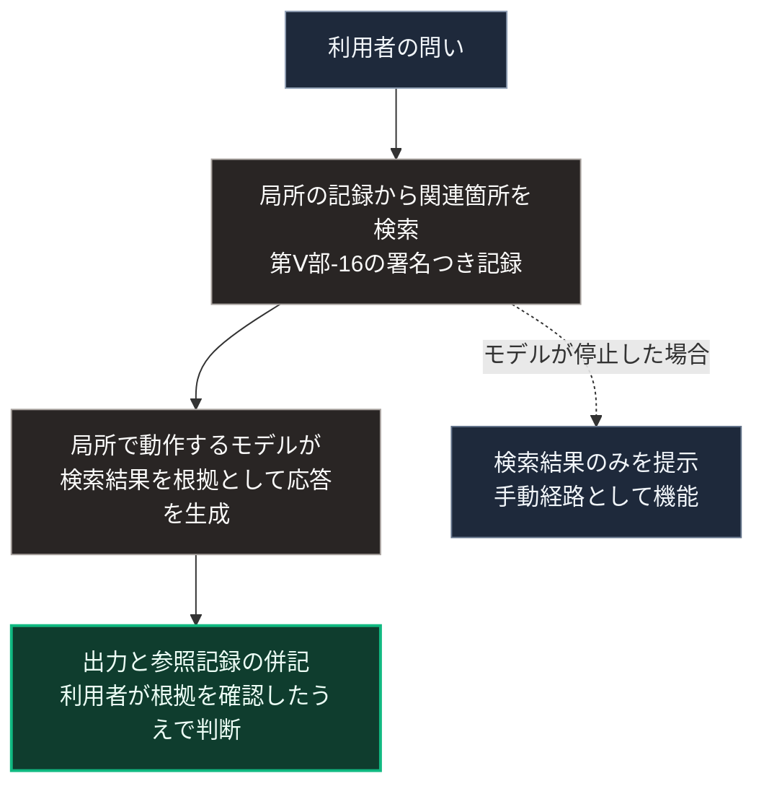

### 序論：本章が扱う範囲

本章は、通信の途絶時においても動作する判断支援の構成を扱います。

第Ⅲ部-5で整理したとおり、判断を委ねるか自ら行うかの区別は、環境の設計に依存します。本章は、判断の主体を利用者に残したまま、その負荷を下げる構成を、局所において実現する方法を扱います。

本文は、技術の性質の記述に限定します。評価は章末で扱います。

### 1. 判断支援における要件

途絶時の判断支援には、次の要件があります。

第一に、外部との接続がなくても動作すること。第Ⅱ部D-6の類型1に対応します。

第二に、判断の根拠が提示され、参照した情報源へ到達できること。第Ⅱ部C-6で整理した検証の手段に対応します。

第三に、利用者がシステムの動作を変更できること。第Ⅲ部-5で述べた依存対象の移行を避けるための要件です。

### 2. 局所で動作する言語モデル

大規模な言語モデルの多くは、遠隔の設備で動作し、通信を介して利用されます。一方、単一の機器で動作する規模のモデルも、開発元によって公開されています。たとえば、計算機や携帯端末で動作することを目的とした公開モデルがあります [ [ 360 ] ](https://deepmind.google/models/gemma) 。それらを局所で実行するための道具（Ollama）も整備されています [ [ 244 ] ](https://ollama.com/) 。

局所で動作するモデルは、遠隔の大規模なモデルに比べて能力が限られます。ただし、途絶時においては、限られた能力であっても動作することが、動作しないことより優先されます。

### 3. 検索による根拠の提示

言語モデルの出力は、学習データに基づく生成であり、その根拠を出力自体から辿ることはできません。この性質は、第Ⅰ部C-10で述べた計算の階層4、すなわち明示的な手順を持たない処理の特徴です。

この課題に対し、モデルの出力を局所の記録に基づかせる構成（検索拡張生成、RAG）があります。利用者の問いに関連する記録を検索し、その記録を根拠としてモデルに提示させる方式です。

この構成では、前章で扱った局所の記録が検索の対象となります。出力には、参照した記録が併記されます。利用者は、出力を受け入れる前に、その記録を確認できます。

### 4. 設計上の要件

第Ⅴ部-9で整理した能動的不便の観点から、次の要件が導かれます。

**根拠の提示**。すべての出力に、参照した記録への経路が付されること。根拠のない出力は、その旨が明示されること。根拠の提示は、出力が記録と一致することを保証しません。一致の照合は利用者が行います。したがって、出力と参照記録を並べて照合できる表示が要件に含まれます。

**動作の変更可能性**。どの記録を検索対象とするか、どのモデルを用いるかを、利用者が変更できること。

**手動経路の保持**。モデルが動作しない場合にも、記録の検索と参照が単独で機能すること。判断支援の停止が、記録への到達の停止を意味しないこと。

### 5. 費用と反論

**費用の要因**。モデルと実行の道具には、無償で公開されているものがあります。費用は、モデルを動作させる計算機の処理能力と記憶容量、そして記録を検索可能な形へ整備する作業に生じます。モデルの規模が大きいほど必要な機器の費用は増し、小さいほど能力は限られます。

**反論1：出力の誤り**。検索結果を根拠として提示しても、モデルが参照記録と異なる内容を生成する可能性は残ります。この反論は妥当であり、第4節の要件はこれを前提としています。判断支援の価値は答えの正しさではなく、利用者が根拠へ到達して照合できる点に置かれます。

**反論2：小型モデルの能力**。局所で動作するモデルの能力は、遠隔の大規模なモデルに及びません。本書は、この構成を平時の代替として提案するものではありません。最低限の要件は、途絶時に手動経路として記録の検索が機能することです。

### 🗺️ 図：局所の判断支援の構成

#### 図の読み方

この図は、判断支援を検索とモデルの2段階に分けることで、根拠の提示と手動経路の保持を同時に満たす構成を示しています。

Oとして示した出力は、第Ⅲ部-5で述べた経路2、すなわち道具としての利用に対応します。判断の主体は利用者に残り、モデルは根拠つきの案を提示するに留まります。

O2として示した手動経路は、第Ⅴ部-9の方向2に対応します。モデルが停止しても、記録への到達は失われません。

なお、局所で動作するモデルの能力は限られます。本書は、この構成が遠隔の大規模なモデルを代替すると主張するものではありません。主張するのは、途絶時において判断の根拠へ到達できる状態を維持できるという点に限られます。

---

### 現代社会構造への射程と本質（本章のまとめ）

本セクションは、著者による解釈です。前節までの記述とは区別して読んでください。

1.  **現代社会構造の原点**

    第Ⅰ部C-10で記述した計算の階層4の外部化は、判断の根拠を辿れないという性質を伴います。本章の構成は、その性質を検索の段階を挟むことで部分的に緩和するものです。

2.  **設計上の要点**

    本章から抽出できるのは、次の点です。判断支援の価値は、答えの正しさではなく、答えの根拠を利用者が検証できることにあります。第Ⅰ部C-4で述べた活版印刷の帰結、すなわち同一の本文を参照して議論できる状態は、この検証可能性の原型です。

3.  **現代社会の現状と課題**

    第Ⅲ部-11で述べた悲観シナリオにおいて、供給の停止と情報環境の機能不全が重なる状況では、状況の把握に用いる情報の検証可能性が帰趨を分けます。本章の構成は、その検証可能性を局所で維持するためのものです。
