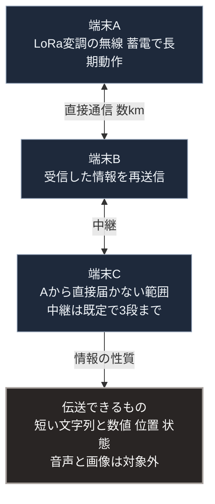

### 序論：本章が扱う範囲

本章は、広域の通信網が途絶した状況において、局所で通信を維持する構成を扱います。

第Ⅱ部D-6で記述したとおり、広域網の途絶は日常的な作業の誤りからも生じます。本章は、その期間に第Ⅴ部-8の第1層と第2層の間で情報を交換する手段を扱います。

本文は、技術の性質と公開された仕様、そして制度の記述に限定します。評価は章末で扱います。

### 1. 局所通信の要件

途絶時の局所通信には、次の要件があります。

第一に、基地局や中継設備を要さず、端末同士で直接通信できること。

第二に、電力の消費が小さく、蓄電設備で長期間動作すること。

第三に、免許を要さず、または簡易な手続で運用できること。

これらの要件は、伝送できる情報量と引き換えになります。高速で大容量の通信は、基地局と電力を要します。局所通信は、低速で少量の情報を、基地局なしで伝えることを目的とします。

### 2. 低電力の広域無線

これらの要件に対応する技術として、低い消費電力で数キロメートルの距離を伝送する無線の変調方式（LoRa）が実用化されています。この変調方式は、半導体事業者が仕様を公開しています [ [ 340 ] ](https://www.semtech.com/lora/what-is-lora) 。なお、同じ変調を用いる広域網の規格（LoRaWAN）は、業界団体が仕様を公開しています [ [ 15 ] ](https://resources.lora-alliance.org/technical-specifications) 。同団体の解説によれば、この規格は端末と中央のサーバの間をゲートウェイが中継する構成を前提とします [ [ 241 ] ](https://lora-alliance.org/about-lorawan/) 。したがって、本章が扱う端末同士の中継網とは構成が異なります。

同方式は、伝送速度が低い代わりに、通信距離と電池の持続時間に優れます。伝送できるのは短い文字列と数値が主であり、音声や画像には適しません。

### 3. 端末同士の中継

この変調方式を用いて、端末同士が互いに中継する網を構成する仕組み（Meshtastic）が、公開の設計として整備されています [ [ 239 ] ](https://meshtastic.org/docs/) 。

この仕組みでは、各端末が受信した情報を再送信し、直接届かない端末へ情報を届けます。基地局は要しません。ただし、中継の段数には上限があり、既定では3段です [ [ 342 ] ](https://meshtastic.org/docs/configuration/radio/lora/) 。また、全端末が再送信する洪水型の中継であるため、端末数の増加は電波の占有率を高めます。同設計は、端末数が40を超えると定期送信の間隔を自動的に延ばす仕組みを備えています [ [ 341 ] ](https://meshtastic.org/docs/overview/mesh-algo/) 。したがって、到達範囲の拡大には限度があります。

第Ⅰ部C-11で記述したインターネットの設計思想、すなわち複数の経路による冗長性が、ここでは局所の規模で実現されます。

### 4. 制度上の条件

無線の利用は、周波数と出力について法令の規制を受けます。日本において、免許を要さずに利用できる無線には、周波数と出力の制限が定められています。総務省は、これらの制度に関する情報を公開しています [ [ 242 ] ](https://www.tele.soumu.go.jp/j/adm/system/ml/index.htm) 。

前節の無線方式を日本で運用する場合、日本向けの周波数と出力の規定に適合した機器を用いる必要があります。この点は、第Ⅴ部-4で述べた原則7、すなわち制度との整合に対応します。

### 5. 費用と反論

**費用の要因**。費用は、端末、電池または蓄電設備、そしてアンテナに生じます。端末は市販の部品で構成され、公表された標準的な価格はないため、本書は桁を示しません。制度上の費用は、日本向けの規定に適合した機器を選ぶことに伴う選択肢の制約として現れます。

**反論：帯域が狭く、端末が増えると通信が成立しなくなる**。この反論は、第3節で述べた中継の仕組みに照らして妥当です。伝送速度が低く、洪水型の中継は端末数に応じて電波を占有します [ [ 341 ] ](https://meshtastic.org/docs/overview/mesh-algo/) 。応答は、用途を限定することです。本章の構成が伝えるのは、安否、位置、設備の状態という短い情報に限られます。第2層の範囲、すなわち数十世帯の規模で運用し、それを超える範囲は別の中継網として分けることが設計上の前提です。

### 🗺️ 図：局所通信の構成と到達範囲

#### 図の読み方

この図は、端末同士の中継によって、基地局なしに到達範囲が広がる構成を示しています。ただし、中継の段数と電波の占有率には、第3節で述べた限度があります。

Lとして示した制約が重要です。この構成で伝えられるのは、安否、位置、設備の状態、そして短い連絡です。第Ⅴ部-3の原則4に対応する監視の記録、たとえば蓄電の残量や水の処理状況は、この範囲に収まります。

したがって、本章の構成は広域網の代替ではありません。途絶時において、第Ⅴ部-8の第2層の範囲で、共同管理に必要な最小限の情報を交換する手段です。

第Ⅲ部-11で述べたとおり、供給の停止と情報の混乱が重なる状況において、近隣の状況を確認できることが対応の前提となります。本章の構成は、その前提を局所で維持するためのものです。

---

### 現代社会構造への射程と本質（本章のまとめ）

本セクションは、著者による解釈です。前節までの記述とは区別して読んでください。

1.  **現代社会構造の原点**

    第Ⅰ部C-11で述べたとおり、通信網は経路の冗長性を保証する設計として成立しました。一方、現在の携帯電話網は基地局に依存し、第Ⅱ部D-6で記述したとおり中核設備の障害が全国へ波及します。本章の構成は、設計思想の原点に立ち返るものです。

2.  **設計上の要点**

    本章から抽出できるのは、次の点です。通信の維持において、容量と到達性はトレードオフの関係にあります。途絶時に必要なのは容量ではなく到達性です。

3.  **現代社会の現状と課題**

    本章の構成は、第Ⅴ部-15から第Ⅴ部-17で扱った計算基盤、記録、判断支援と組み合わされて機能します。次章では、これらを含む第Ⅴ部の設計要件を総括します。
