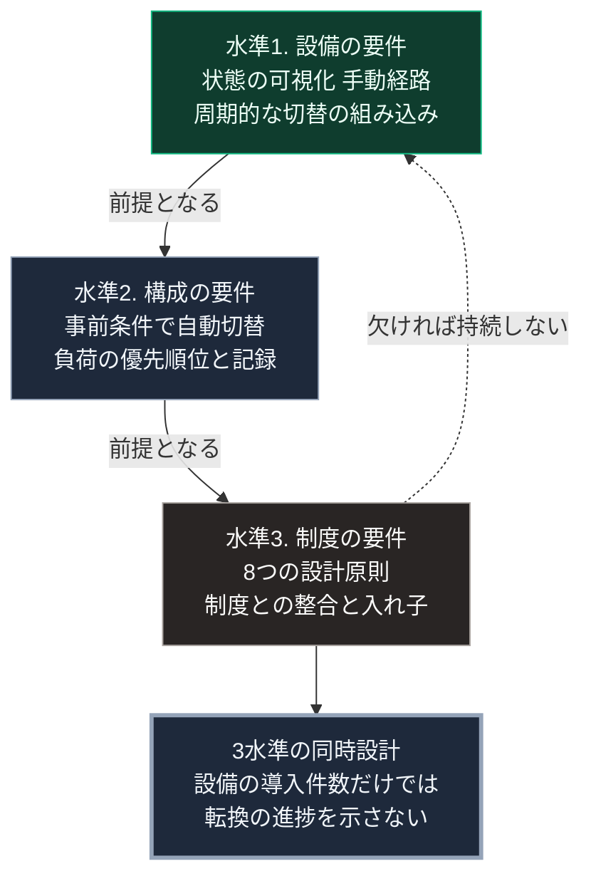

### 序論：本章が扱う範囲

本章は、第Ⅴ部で個別に扱った設計要件を一覧として整理します。第Ⅴ部の各章は、電力、水、情報のそれぞれについて要素を扱いました。本章は、それらに共通する要件を横断的に取り出します。

本文は、要件の整理に限定します。技術者の役割については、別の記事として公開している[付録A](https://zenn.dev/takenori_kusaka/articles/srb-appendix-engineer-role)で扱います。

### 1. 要件の3つの水準

第Ⅴ部の要件は、3つの水準に分けられます。

**水準1：設備の要件**。個々の設備が満たすべき性質です。第Ⅴ部-8で整理した能動的不便の3方向、すなわち状態の可視化、手動経路の保持、そして周期的な切替の組み込みが、ここに属します。

**水準2：構成の要件**。設備を組み合わせて局所の単位を構成する際の性質です。第Ⅱ部D-3で述べた事前の条件設定による自動的な切替、第Ⅴ部-10で述べた負荷の優先順位、そして第Ⅴ部-15で述べた署名つき記録が、ここに属します。

**水準3：制度の要件**。局所の単位を上位へ接続し、持続させるための条件です。第Ⅴ部-2で整理した8つの設計原則、とりわけ原則7の制度との整合と、原則8の入れ子構造が、ここに属します。

### 2. 3水準の関係

3つの水準は、下位が上位の前提となります。

設備が要件を満たさなければ、構成は成立しません。構成が成立しなければ、制度は接続する対象を持ちません。

一方、上位が欠けても下位は無意味になります。第Ⅴ部-5で整理したとおり、制度による融通のない設備は、持続期間に上限があります。

したがって、3つの水準は同時に設計される必要があります。設備の導入から始めて制度を後から整えるという順序は、第Ⅴ部-3で述べたとおり、機能しにくい経路です。

### 3. 平時と途絶時の二重性

第Ⅴ部を通じて繰り返し現れた要件は、設備と構成が平時と途絶時とで異なる役割を担うという点です。

平時において、設備は系統や広域網の一部として機能し、便益を生みます。途絶時において、同じ設備が局所の供給源として機能します。

この二重性が必要な理由は、第Ⅲ部-5で整理した依存の構造にあります。途絶時のためだけの設備は、費用の回収経路を持たず、第Ⅲ部-5で述べた負荷の非対称により導入されにくくなります。平時の便益が、途絶時の備えを支えます。

### 4. 本書が要件としないもの

第Ⅴ部の設計は、次のものを要件としません。

第一に、集約型インフラの廃止。第Ⅱ部C-7で述べたとおり、集約型は接続が維持されている間、効率と課題解決に寄与します。本書の設計は、その下に局所の層を追加するものです。

第二に、外部との接続の遮断。第Ⅴ部-5で述べたとおり、自律と孤立は異なります。

第三に、利用者の意識の変革。第Ⅲ部-5で述べたとおり、規範的な主張だけでは行動の変化を期待しにくいとされます。本書の要件はすべて、設計の側で実装されるものです。

### 🗺️ 図：3水準の要件と、その関係

#### 図の読み方

この図は、上段の設備から下段の制度へ実線をたどり、下段から上段へ戻る破線によって循環する形で読みます。

上から下への実線は、前提の関係です。下から上への破線は、持続の関係です。設備がなければ構成は始まらず、制度がなければ設備は持続しません。

この循環が意味するのは、第Ⅴ部の設計が技術の問題として完結しないという点です。第Ⅴ部-3で述べたとおり、技術は必要条件であって十分条件ではありません。最下段の箱は、この循環から導かれる帰結です。

第Ⅲ部-10で整理した差分2、すなわち供給方式の転換が意図的な設計として行われるかどうかは、この3水準が同時に着手されるかどうかによって判断できます。設備の導入件数だけでは、転換の進捗を示しません。
---

### 現代社会構造への射程と本質（本章のまとめ）

本セクションは、著者による解釈です。前節までの記述とは区別して読んでください。

1.  **現代社会構造の原点**

    集約型インフラにおいて、3つの水準は事業者、規制当局、そして法制度によって分担されてきました。局所自律の設計は、この分担を局所の単位に持ち込むものです。

2.  **設計上の要点**

    本章から抽出できるのは、次の点です。持続した分権的な構成は、いずれも設備、運用、制度の3水準を同時に備えていました。第Ⅰ部A-5の幕藩体制と第Ⅴ部-2のオストロムの事例が、その例です。第Ⅴ部-13の広域互助は、3水準への同時着手を意図した構成であり、その持続はまだ観測されていません。

3.  **現代社会の現状と課題**

    第Ⅳ部の4章に共通する結論、すなわち変化の実現が意識ではなく設計に依存するという命題は、本章の3水準として具体化されます。[付録A](https://zenn.dev/takenori_kusaka/articles/srb-appendix-engineer-role)では、この設計において技術者という職能が何を担うかを扱います。
