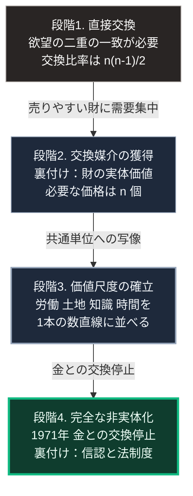

### 序論：本章が扱う範囲

本章は、貨幣と資本主義がどのような経緯で成立し、どの機能を担うようになったかを記述します。次章では、この形態が容易に代替されない理由を、経済学上の議論として扱います。

本文で記述するのは、経済史および経済思想史において確立された事実です。各記述には原典への直接リンクを付します。

### 1. 交換の障壁 ―― 欲望の二重の一致

貨幣が存在しない交換において、取引が成立するには条件があります。取引の当事者双方が、相手の提供する財を同時に必要としていなければなりません。

経済学者ウィリアム・スタンレー・ジェヴォンズは、この条件を「欲望の二重の一致」と定式化しました [ [ 76 ] ](https://openlibrary.org/works/OL4764091W) 。ジェヴォンズが指摘したのは、この条件の成立確率が、財の種類の増加に対して急速に低下する点です。

財の種類がn個ある場合、直接交換に必要な交換比率の組み合わせは、n(n-1)/2 通りになります。財が100種類あれば4,950通り、1,000種類あれば約50万通りです。

### 2. 貨幣の発生に関する説明

カール・メンガーは、貨幣の発生を、中央の指令によるものではなく、個々の取引者の選択の積み重ねとして説明しました [ [ 77 ] ](https://openlibrary.org/works/OL19892246W) 。

その論理は次のとおりです。財のなかには、他の財と比べて売却しやすいものがあります。保存が利き、分割でき、品質の判定が容易な財です。取引者は、自分が直接必要としない場合でも、そうした財を受け取るようになります。後で交換に使えるためです。

この行動が広がると、特定の財に交換需要が集中します。その財は、他の財より一層売却しやすくなり、集中がさらに進みます。この累積過程の帰結が、貨幣です。

歴史的には、貝殻、家畜、穀物、金属などがこの位置を占めました。金属貨幣の鋳造は、紀元前7世紀のリディアにおける事例が最古の部類とされています。

### 3. 貨幣が担う3つの機能

経済学において、貨幣は3つの機能によって定義されます。

第一は、交換の媒介です。前節で述べた欲望の二重の一致という条件を解除します。

第二は、価値の尺度です。すべての財の価値を、単一の単位で表現します。これにより、比較に必要な情報量が大幅に削減されます。財がn種類あるとき、必要な価格は n 個です。前節の直接交換における n(n-1)/2 通りと比べて、情報量は劇的に減少します。

第三は、価値の保蔵です。現在の購買力を将来へ繰り越すことを可能にします。

このうち、第二の機能が本書の議論において重要です。貨幣は、性質の異なるものを1つの数直線上に写像します。労働時間、土地、機械、知識、時間の選好。これらはいずれも本来は比較不能な性質を持ちますが、貨幣という単位を経由することで比較可能になります。

### 4. 分業と市場規模 ―― スミスの議論

アダム・スミスは1776年の著作において、生産性の向上を分業に帰しました [ [ 78 ] ](https://www.gutenberg.org/ebooks/3300) 。

スミスの議論で重要なのは、分業の程度が市場の規模によって制約されるという命題です。専門化した生産者が存立するには、その生産物を吸収する需要がなければなりません。市場が小さければ、生産者は複数の作業を兼ねざるをえず、専門化の利得を得られません。

この命題は、貨幣の普及と分業の進展とを結びつけます。貨幣が交換の障壁を下げるほど、市場は拡大します。市場が拡大するほど、分業は深化します。

### 5. 資本の運動 ―― マルクスの分析

カール・マルクスは、資本主義的な生産様式を、単純な商品交換とは区別しました [ [ 22 ] ](https://www.marxists.org/archive/marx/works/1867-c1/) 。

彼が定式化したのは、次の対比です。単純な商品交換においては、生産者は商品を売って貨幣を得て、その貨幣で別の商品を買います。この運動の目的は、使用価値の獲得です。

これに対し、資本の運動は次の順序をたどります。貨幣で商品を買い、それを用いて生産し、生産物を売って貨幣を得ます。この運動が意味を持つのは、最終的に得られる貨幣が最初の貨幣より大きい場合に限られます。マルクスは、この差額の源泉を労働力の使用に求めました。

この分析が示すのは、資本主義において生産の目的が使用価値ではなく貨幣量の増加になる、という構造です。

### 6. 市場の自律化 ―― ポランニーの分析

経済史家カール・ポランニーは、19世紀ヨーロッパにおける市場の性格変化を分析しました [ [ 34 ] ](https://openlibrary.org/works/OL3617884W) 。

彼の論旨は次のとおりです。市場は古くから存在しましたが、それは社会関係のなかに埋め込まれた形で機能していました。取引の条件は、慣習、身分、宗教的規範によって制約されていました。

19世紀に生じたのは、市場がこれらの制約から分離し、自律的な領域を形成したことです。ポランニーはこの過程を、労働、土地、貨幣という3つのものが商品として扱われるようになった結果として説明しました。彼はこれらを「擬制商品」と呼びます。労働は人間そのもの、土地は自然そのものであり、販売のために生産されたものではないためです。

### 7. 貨幣の非実体化 ―― 20世紀の制度変更

19世紀後半から20世紀前半にかけて、主要国は金本位制を採用していました。この制度のもとでは、通貨は一定量の金との交換を保証されます。

第二次世界大戦の末期にあたる1944年のブレトンウッズ会議において、米ドルを金と結びつけ、他の通貨を米ドルに結びつける体制が構築されました。

1971年8月、アメリカは米ドルと金との交換を停止しました。1973年以降、主要通貨は変動相場制へ移行します。

この変更により、通貨は物理的な裏付けを持たなくなりました。現在の通貨の価値を支えているのは、中央銀行に対する信認と、法定通貨としての強制通用力です。国際決済銀行は、現代の貨幣制度を、中央銀行の負債と商業銀行の負債とが階層をなす構造として記述しています [ [ 264 ] ](https://www.bis.org/publ/arpdf/ar2022e3.htm) 。

### 🗺️ 図：貨幣が獲得した機能の累積

貨幣が、どの段階でどの機能を獲得したかを示します。

#### 図の読み方

この図は上から下へ時系列として読みます。4つの箱は貨幣が機能を獲得した段階で、矢印に添えた語はその段階へ移る契機です。

各箱の2行目または3行目には、貨幣の価値を何が支えていたかを記しました。上から下へ進むほど、この裏付けが実体から離れていきます。この図が示すのは、貨幣の歴史が「実体からの離脱」の過程であったという構造です。

上の2段では、貨幣はまだ実体を持つ財でした。金属としての価値、あるいは装飾品としての価値が、受け取る理由を支えていました。

3段目で貨幣の役割が変質します。ここで貨幣が担うのは、比較不能なものを比較可能にする変換装置としての機能です。1時間の労働と1平方メートルの土地と1件の特許は、物理的には共通点を持ちません。しかし貨幣建てに変換された瞬間、これらは同一の数直線上に並び、加減算が可能になります。

最下段は、この変換装置から物理的な裏付けを取り除いた状態です。ここで重要な逆説があります。貨幣は、実体を失うほど汎用性を増しました。金という実体に縛られている間、通貨の供給量は金の産出量に制約されていました。実体から切り離されたことで、この制約は解除されます。

すなわち、貨幣が「それ自体としては何の価値も持たない」という性質は、欠陥ではありません。あらゆる価値を受け入れる空の器であることが、汎用の共通言語として機能するための条件です。次章では、この性質がなぜ他の資源配分方式による代替を困難にしているかを検討します。

---

### 現代社会構造への射程と本質（本章のまとめ）

本セクションは、著者による解釈です。前節までの記述とは区別して読んでください。

1.  **現代社会構造の原点**

    現代社会において、ほぼすべての意思決定が貨幣建ての評価を経由します。企業の事業判断、公共事業の採否、個人の進路選択。これらはいずれも、異なる選択肢を貨幣という共通単位に変換したうえで比較されます。

    この構造に必然性はありません。貨幣が段階3の機能を獲得したことで初めて可能になった、歴史的な産物です。

2.  **歴史的事実の本質**

    資本主義の本質は、私有財産ではなく、市場競争でもありません。比較不能なものを比較可能にする変換装置が、社会全体で共有されているという状態です。

    この装置が持つ力は、その中立性に由来します。貨幣は、何が価値あるかを規定しません。人々が価値あると見なしたものを、そのまま数値として受け取ります。この判断放棄こそが、あらゆる領域への適用を可能にしました。

3.  **現代社会の現状と課題**

    同時に、この中立性は制約でもあります。貨幣建てに変換できないものは、比較の対象から脱落します。生態系の機能、地域社会の紐帯、災害時の相互扶助の能力。これらは、貨幣単位への変換が困難であるがゆえに、意思決定において軽く扱われます。

    第Ⅲ部および第Ⅳ部では、この脱落する領域が、外部衝撃への耐性に直結するという論点を扱います。
