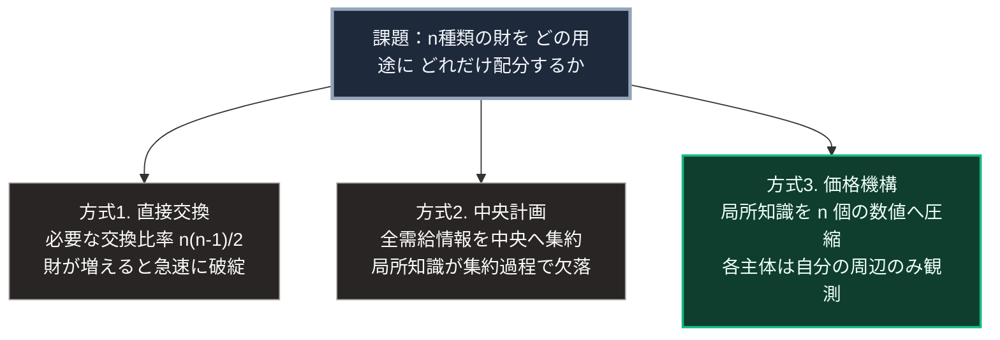

### 序論：本章が扱う範囲

前章では、貨幣が比較不能なものを比較可能にする変換装置として成立した経緯を記述しました。本章では、この装置が他の資源配分方式によって代替されなかった理由を、20世紀の経済学における論争として整理します。

本章が記述するのは、誰が何を主張し、どの反論が提示され、実際の運用がどのような結果を示したかという事実です。本書は、資本主義が望ましい制度であるという立場も、望ましくないという立場も採りません。

### 1. 問いの定式化 ―― 経済計算問題

1920年、経済学者ルートヴィヒ・フォン・ミーゼスは、生産手段の私有を廃した社会において、資源の合理的な配分が可能かという問いを提起しました [ [ 82 ] ](https://mises.org/library/economic-calculation-socialist-commonwealth) 。

彼の論証は次のとおりです。ある工場を建設する際、鉄で作るか、木で作るか、コンクリートで作るかという選択が生じます。この選択を合理的に行うには、それぞれの材料が他の用途で持つ価値を知る必要があります。

市場においては、この情報は価格として与えられます。鉄の価格は、鉄を必要とするすべての用途からの需要と、供給可能量とが均衡した点を示しています。

ミーゼスが指摘したのは、生産手段が取引されない場合、この価格が生成されないという点です。価格がなければ、複数の技術的に可能な生産方法のうち、どれが資源を節約するかを判定できません。

### 2. 情報の分散という論点

フリードリヒ・ハイエクは1945年の論文において、この問題を情報の所在という観点から再定式化しました [ [ 83 ] ](https://www.aeaweb.org/aer/top20/35.4.519-530.pdf) 。

彼の議論の要点は、経済にとって重要な知識の多くが、統計として集計できない形で存在するという点です。特定の機械が今どの程度稼働しているか。ある倉庫の在庫が今日どの状態にあるか。ある地域で明日どれだけの需要が見込まれるか。こうした知識は、その場にいる個人にのみ利用可能であり、中央へ集約する過程で失われます。

ハイエクは、価格の機能をこの文脈で説明しました。ある資源が不足したとき、その原因を知らなくても、価格の上昇という単一の情報だけで、利用者は節約という適切な行動を選択できます。

彼はこの性質を、情報の圧縮として記述しました。分散した膨大な局所知識が、価格という1つの数値に集約され、その数値だけが伝達されます。

### 3. 反論 ―― 市場社会主義の構想

これに対し、経済学者オスカー・ランゲらは次のように論じました。計画当局が価格に相当する数値を設定し、需給の不均衡に応じて調整すれば、同等の配分が達成可能である、という主張です。この立場は、市場社会主義と呼ばれます [ [ 265 ] ](https://doi.org/10.2307/2967660) 。

この構想の要点は、価格を市場が生成する必要はなく、当局が試行錯誤によって探索すればよい、というものです。

ハイエクは1940年の論文でこの構想に反論し、論争の焦点は、この探索が現実的な時間内で収束するかどうかに移りました [ [ 266 ] ](https://doi.org/10.2307/2548976) 。調整すべき価格の数は、財の種類の数に等しくなります。

### 4. 実際の運用が示したこと

ソビエト連邦および東欧諸国において、中央計画に基づく経済運営が数十年にわたり実施されました。この運用実績については、多数の実証研究が蓄積されています。

経済学者リチャード・エリクソンは、この体制の構造的な特徴を整理しています [ [ 84 ] ](https://www.aeaweb.org/articles?id=10.1257/jep.5.4.11) 。

その分析によれば、観測された特徴には次のものが含まれます。第一に、計画の指標が物量で与えられた場合、生産単位は指標の達成を優先し、品質や需要への適合を軽視する傾向を示しました。第二に、生産単位は次期の目標引き上げを避けるため、自らの生産能力を過少に報告する動機を持ちました。第三に、部門間の調整に要する情報量が、計画当局の処理能力を超えました。

これらは、いずれも計画者の能力や意図の問題ではなく、情報の伝達構造に起因するものとして分析されています。

### 5. 資本主義に対する別種の批判 ―― シュンペーターの予測

経済学者ヨーゼフ・シュンペーターは、資本主義が存続困難になるという予測を提示しましたが、その理由は経済的な非効率ではありませんでした [ [ 85 ] ](https://openlibrary.org/works/OL1295326W) 。

彼の論旨は次のとおりです。資本主義は、既存の生産方式を破壊しながら新しい方式を導入する過程によって成長します。彼はこれを「創造的破壊」と呼びました。

しかしこの成功が、副産物を生みます。企業規模の拡大は、革新を個人の営為から組織的な業務へ変えます。同時に、教育水準の上昇によって、批判的な知識層が拡大します。この層は、資本主義の成果を享受しながら、その正統性を疑問視する傾向を持ちます。

シュンペーターの予測は、資本主義が経済的に失敗するのではなく、社会的な支持を失うことによって変質するというものでした。

### 🗺️ 図：代替方式が直面する情報処理の制約

各方式が、資源配分を決定するために必要とする情報量を比較します。

#### 図の読み方

この図が示しているのは、資本主義の代替されにくさが、道徳的な優位や政治的な力関係ではなく、情報処理の構造に由来するという論点です。

方式1（直接交換）は、財の種類が増えるにつれて必要な情報量が二乗で増加します。

方式2（中央計画）は、必要な情報を1箇所へ集める設計です。この方式の制約は、計算能力ではありません。集約の過程で、集計になじまない局所知識が失われることにあります。ある現場の担当者が持つ「この機械は今日調子が悪い」という知識は、報告書式に載りません。

方式3（価格機構）は、情報を集約しません。各主体は、自分の周辺の価格だけを観測し、それに応じて行動します。全体の需給状況は、誰も把握していないまま、価格の変動を通じて調整されます。

ここで、前章の論点が再び現れます。貨幣が「それ自体としては何の価値も持たない」という性質は、この圧縮を可能にする条件です。もし貨幣が特定の実体と結びついていれば、その実体の性質が変換に制約を課します。空の器であることが、あらゆる種類の局所知識を単一の数値へ変換することを可能にしています。

なお、この図は方式3が優れていることを示すものではありません。方式3は、貨幣建てに変換できない情報を、構造的に無視します。第Ⅲ部および第Ⅳ部では、この無視される領域が持つ意味を扱います。

---

### 現代社会構造への射程と本質（本章のまとめ）

本セクションは、著者による解釈です。前節までの記述とは区別して読んでください。

1.  **現代社会構造の原点**

    資本主義が広範に採用されている理由は、この体制が公正だからでも、支持されているからでもありません。膨大な種類の財を扱う経済において、実行可能な配分方式が他に見当たらないという、消去法の帰結です。

    この認識は、資本主義への批判を無効にするものではありません。批判が有効であるためには、同等の情報処理能力を持つ代替方式を提示する必要がある、ということを意味します。

2.  **歴史的事実の本質**

    20世紀の論争が明らかにしたのは、資源配分の問題が本質的に情報処理の問題である、という点です。誰が資源を所有するかという問いは、実は二次的です。一次的な問いは、誰が何を必要としているかという分散した情報を、どう伝達するかです。

    この認識は、現代において特有の意味を持ちます。計算能力と通信能力が飛躍的に向上した現在、ハイエクが前提とした技術的制約の一部は緩和されています。ただし、彼の論点の核心は計算能力ではなく、集計になじまない知識の存在でした。この部分が緩和されたかどうかは、別途検討を要します。

3.  **現代社会の現状と課題**

    本章の枠組みは、第Ⅱ部および第Ⅲ部で次の2点に適用されます。

    第一に、大規模なプラットフォーム企業が保有するデータは、ハイエクが集約不能とした局所知識に、どこまで接近しているのか。第二に、生成AIによる情報処理は、中央計画が直面した制約をどの程度解除しうるのか。

    これらは、資本主義が今後も代替されないかどうかを判断するうえで、決定的な論点となります。
