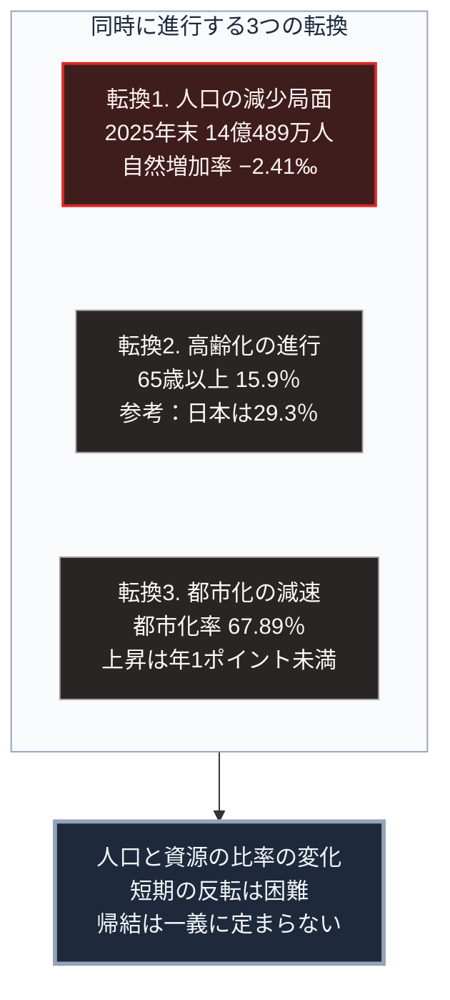

### 序論：本章が扱う範囲

本章は、中華人民共和国の現状を、同国政府が公表する統計と公式文書から整理します。

本章の情報源は、原則として中国国家統計局の公表資料および国務院の公式文書に限定します。第三者による推計や解説は、本文では扱いません。これは、本書が採る「当該政府が公表している公式資料を参照する」という規範に従うものです。

なお、公式統計の精度については学術的な議論が存在します。本章では、公表された数値をそのまま記述し、その解釈は図の読み方および章末で扱います。

### 1. 人口

国家統計局は2026年2月、2025年の国民経済社会発展統計公報を公表しました。同公報によれば、2025年末の総人口は14億489万人です。2024年末から339万人の減少にあたります [ [ 140 ] ](https://www.stats.gov.cn/english/PressRelease/202602/t20260228_1962661.html) 。

同公報によれば、2025年の出生数は792万人、出生率は千人あたり5.63です。死亡数は1,131万人、死亡率は千人あたり8.04です。自然増加率は千人あたりマイナス2.41となりました。

年齢構成については、60歳以上が23.0%、65歳以上が15.9%を占めます [ [ 140 ] ](https://www.stats.gov.cn/english/PressRelease/202602/t20260228_1962661.html) 。

常住人口の都市化率は67.89%であり、前年末から0.89ポイント上昇しています [ [ 140 ] ](https://www.stats.gov.cn/english/PressRelease/202602/t20260228_1962661.html) 。

### 2. 経済規模

同公報によれば、2025年の国内総生産は140兆1,879億元であり、前年比5.0%の増加です [ [ 140 ] ](https://www.stats.gov.cn/english/PressRelease/202602/t20260228_1962661.html) 。

### 3. 統治機構の構成

中国の統治機構は、中国共産党による指導を憲法上の原則とする体制です。全国人民代表大会が最高国家権力機関と位置づけられ、国務院が行政を担当します。

政策の方向性は、5年ごとに策定される国民経済社会発展の計画によって示されます。この計画は、産業構造、技術開発、地域開発、環境目標などの領域について、具体的な指標を含みます。

現行の計画は、2026年から2030年を対象とする第15次5か年計画です。2026年3月12日に全国人民代表大会が採択しました。同計画は、国内総生産の成長率について数値目標を明示せず、合理的な区間に保つとしています。研究開発費の年平均7%以上の増加、都市部の調査失業率5.5%未満、国内総生産あたりの二酸化炭素の排出量の17%削減を主要な目標として掲げています [ [ 306 ] ](http://www.npc.gov.cn/npc/c2/c30834/202603/t20260313_453198.html) 。

国務院新聞弁公室は、外交、国防、経済、人権などの領域について白書を公表しています [ [ 141 ] ](https://english.www.gov.cn/archive/whitepaper/) 。

### 4. 資源配分の方式

第Ⅰ部B-5で整理した分類に照らすと、現在の中国の経済運営は、中央計画と価格機構とを併用する形態です。

価格の大部分は市場で形成されます。同時に、計画が指定する重点領域については、国有金融機関を通じた資金供給、土地の供給条件、そして補助金による誘導が行われます。

この方式の特徴は、政策目標として指定された産業へ、短期間に大規模な資源を投入できる点にあります。

### 5. 対外関係の枠組み

外交部は、対外政策の公式見解を公表しています [ [ 142 ] ](https://www.fmprc.gov.cn/eng/) 。

### 🗺️ 図：中国が直面する3つの転換

現在進行している構造変化を整理します。

#### 図の読み方

この図は、上段の枠内で縦に並ぶ3つの転換が、下段の1つの状態へ集まる形をしています。3つは別々の指標ですが、同じ方向を指しています。

上段が示すのは、中国が日本や欧州と同種の人口転換に入っているという事実です。ただし、その進行段階と経済水準の組み合わせが異なります。

転換1について、自然増加率がマイナスであるという事実は、総人口の減少が今後も継続することを意味します。移動による補填がない限り、この傾向は年齢構成によって規定されます。

転換2について、65歳以上の割合15.9%という水準は、日本の29.3%と比べて低い段階にあります。ただし、上昇の速度が問題となります。人口規模が大きいため、同じ割合の変化がもたらす絶対数の変化は日本より大きくなります。

転換3について、都市化率は2024年に0.84ポイント、2025年に0.89ポイント上昇しました。上昇は続いていますが、その幅は年1ポイント未満です。都市化率67.89%という水準は、都市化による生産性向上の余地が縮小しつつあることを示唆します。農村から都市への労働移動が、生産性の高い部門への再配置として経済成長を支えてきました。この移動の余地が縮小した場合、成長の源泉は別のところへ求められます。

下段が示すとおり、これら3つの転換は同時に進行しています。第Ⅰ部A-8で整理した観測項目のうち、人口と資源の比率という項目に該当します。

なお、本書はこの状況から特定の帰結を導きません。同種の転換に直面した他国の経験は、日本と欧州にあります。しかし、経済水準と統治形態が異なるため、同じ経過をたどるとは限りません。第Ⅲ部では、複数の可能性をシナリオとして扱います。

---

### 現代社会構造への射程と本質（本章のまとめ）

本セクションは、著者による解釈です。前節までの記述とは区別して読んでください。

1.  **公式統計の扱いについて**

    本章は、中国政府の公表値をそのまま記述しました。これは本書の規範に従った結果です。

    ただし、読者は次の点に留意する必要があります。いかなる国の統計についても、集計方法と定義が結果に影響します。国際比較の際には、定義の差異を確認する必要があります。

    本書が公式資料に限定する理由は、その数値が正確だからではありません。当該政府が公式に何を主張しているかを確認するためです。政策判断は、この公式見解に基づいて行われます。

2.  **数値が示していること**

    人口に関する3つの数値、すなわち総人口の減少、自然増加率のマイナス、そして65歳以上の割合の上昇は、いずれも同じ方向を指しています。

    これらは、政策によって短期的に反転させることが困難な指標です。第Ⅱ部A-2で日本について述べたのと同じ理由によります。出生数を規定するのは、出生率と出産可能な年齢層の人口の積であり、後者は既に確定しています。

3.  **日本にとっての含意**

    中国の人口転換は、日本にとって2つの意味を持ちます。

    第一に、経済的な意味です。中国は日本にとって最大の貿易相手国の1つです。同国の需要構造が変化すれば、日本の輸出構成に影響します。

    第二に、安全保障上の意味です。第Ⅰ部D-1で整理した枠組みによれば、開戦の判断には将来の力関係に関する予測が作用します。人口動態の変化は、この予測の入力となります。ただし、その作用の方向を一義的に定めることはできません。この論点は、戦争発生リスクを扱う章で検討します。
