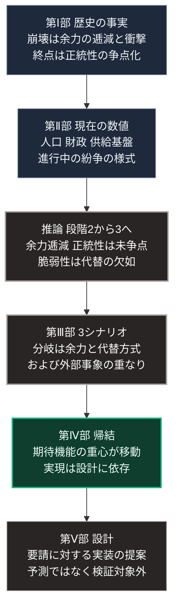

### 本章の位置づけ

本章は、本書全体を1本の推論として提示します。

[第Ⅰ部](01_sovereign-state-os)で整理した事実、[第Ⅱ部](japan-current-state)で確認した現状、そして[第Ⅲ部](future-method)と[第Ⅳ部](implication-state)で展開した推論を接続し、どの前提からどの結論が導かれるかを明示します。

読者が本書のいずれかの段階に同意しない場合、その段階以降の結論は変わります。本章は、その分岐点を特定できる形で構成します。

### 1. 歴史から言えること

[第Ⅰ部](01_sovereign-state-os)で整理した4系列の事実から、次の5点が導かれます。

**（1）組織の崩壊は、外部衝撃の大きさではなく、衝撃到来時の余力によって規定される**

[第Ⅰ部A-8](dynastic-cycle-and-corruption)で参照した4つの研究は、いずれも同じ方向を示しました。イブン・ハルドゥーンの連帯意識の減衰、テインターの限界収益逓減、ターチンらのエリート過剰生産と実質賃金の低下、そしてアセモグルらの制度の性質です。

これらが共通して記述するのは、余力の逓減という過程です。崩壊は、この過程の末に外部衝撃が加わったときに顕在化します。

**（2）崩壊の最終段階は、資源の枯渇ではなく正統性の争点化として現れる**

ローマにおける帝位継承、オスマンにおける帰属の基礎の転換、江戸幕府における条約の勅許。いずれの事例でも、転換点となったのは経済的な破綻や軍事的敗北ではありません。統治の前提が否定される事象でした。

**（3）統治形態の優劣は環境依存であり、絶対的な最適解は存在しない**

[第Ⅰ部B-7](isms-failure-comparison)で整理したとおり、各統治形態は異なる条件で失効します。速度と分散はトレードオフの関係にあり、環境が変われば望ましい配分も変わります。

**（4）技術は、その性能ではなく費用構造を通じて社会を変える**

[第Ⅰ部C-1](innovation-overview)および[第Ⅰ部D-2](war-technology-evolution)で整理したとおり、技術の社会的な帰結を規定するのは破壊力や処理能力ではありません。誰がその技術を保有し運用できるかという費用の側です。

**（5）短期決着の成立条件は、対抗手段の普及によって失われる**

[第Ⅰ部D-5](war-blitzkrieg-doctrine)で整理したとおり、機動による短期決戦は4つの条件の積として成立します。監視技術と精密誘導と対抗兵器の低廉化により、この条件は満たされにくくなっています。

### 2. 現状として確認されたこと

[第Ⅱ部](japan-current-state)で公的資料から確認した事実のうち、推論の入力となるものは次のとおりです。

日本の総人口は2024年10月時点で1億2,380万2千人 [ [ 124 ] ](https://www.stat.go.jp/data/jinsui/2024np/index.html) 、65歳以上が29.3%です [ [ 125 ] ](https://www8.cao.go.jp/kourei/whitepaper/w-2025/html/zenbun/s1_1_1.html) 。2025年の出生数は671,236人、自然減は918,253人でした [ [ 131 ] ](https://www.mhlw.go.jp/toukei/saikin/hw/jinkou/geppo/nengai25/index.html) 。公式推計では2070年の総人口が8,700万人、65歳以上が38.7%です [ [ 62 ] ](https://www.ipss.go.jp/pp-zenkoku/j/zenkoku2023/pp_zenkoku2023.asp) 。

2026年度の一般会計歳出は122兆3,092億円、公債依存度は24.2%です。普通国債残高は2026年度末に1,145兆円、国と地方の長期債務残高は1,344兆円で、国内総生産に対して約194%です [ [ 127 ] ](https://www.mof.go.jp/policy/budget/fiscal_condition/related_data/202604.html) 。

エネルギー自給率は15.3%、発電の68.6%が火力です [ [ 128 ] ](https://www.meti.go.jp/press/2025/04/20250425004/20250425004.html) 。食料自給率は供給熱量ベースで38%です [ [ 129 ] ](https://www.maff.go.jp/j/press/kanbo/anpo/251010.html) 。

ホルムズ海峡を通過する石油は日量約2,000万バレル、世界の消費の約20%にあたります [ [ 152 ] ](https://www.eia.gov/todayinenergy/detail.php?id=65504) 。通過するLNGの83%がアジア市場向けです [ [ 153 ] ](https://www.eia.gov/todayinenergy/detail.php?id=65584) 。

進行中の武力紛争において、発電設備と送電網を攻撃対象とする事例が観測されています [ [ 148 ] ](https://www.iea.org/reports/ukraines-energy-security-and-the-coming-winter) 。

### 3. 現状と歴史を接続すると何が言えるか

前2節を接続すると、次の推論が成立します。

**推論A：日本は、[第Ⅰ部A-8](dynastic-cycle-and-corruption)の枠組みにおける段階2の末期から段階3への移行期に位置している**

段階3の指標のうち、[第Ⅱ部](japan-current-state)で確認できたのは、人口と資源の比率の悪化と財政の逼迫です。エリート層の規模および実質賃金の推移については、本書は公的統計によって確認していません。したがって、段階3への移行が完了したとは判定できません。

段階4、すなわち正統性の争点化には、現時点で至っていません。

**推論B：日本の脆弱性は、依存の量ではなく代替の欠如にある**

エネルギー自給率15.3%という水準は、資源小国に共通します。日本に固有なのは、輸入経路が限定された要衝を通ることと、国内の受入設備および発電設備が集約されていることです。

**推論C：武力紛争が長期化する条件下では、供給基盤が標的に含まれうる**

推論の根拠は、[第Ⅰ部D-5](war-blitzkrieg-doctrine)の技術的条件と、[第Ⅱ部B](report-ukraine-war)の2つの事例です。監視技術によって秘匿と速度の条件が満たされない環境では、紛争は長期化しえます。ウクライナの事例では、長期化の後に攻撃が後方の供給基盤へ向かいました。中東の事例は、短期の交戦においても生産設備と輸送経路が攻撃対象に含まれたことを示します。1991年の湾岸戦争のように、航空優勢が一方的に確立された場合には短期決着が成立しており、この推論は条件つきです。

### 4. 未来について何が言えるか

[第Ⅲ部](future-method)で提示した3つのシナリオのうち、成立に要する意図的な行為と外部事象の条件が最も少ないのはベースラインです。本書はこれを確率の高さとしてではなく、条件の数の少なさとして位置づけます。

条件の比較は、次の2点です。

第一に、楽観シナリオの成立には4つの条件、すなわち組織の適応速度、制度の追随速度、供給方式の転換、そして判断の主体を残す設計の普及が必要です。これらはいずれも意図的な行為を要し、自然には成立しません。

第二に、悲観シナリオの成立には、区分Bの複数の事象が近接して発生する必要があります。個々の事象の発生は否定できませんが、複数が近接する条件は、単一事象より満たされにくいと考えられます。

ただし、この判断は確率の推定ではありません。3つのシナリオが要求する条件の数と性質を比較した結果です。

**ベースラインにおいて予測される主要な変化**

供給方式が地域によって分化します。集約型インフラが維持される区域と、そうでない区域とが併存します。

社会保障の給付と負担の関係が、現行とは異なる形に再定義されます。

職能の構成が変化し、定型的な知的労働の比重が低下します。

意思決定の速度と環境変化の速度との差が拡大します。ただし、制度の枠組み自体は維持されます。

### 🗺️ 図：本書全体の推論の連鎖

どの前提からどの結論が導かれるかを示します。

#### 図の読み方

この図は、本書の主張を1本の線として示したものです。

各段階には、異なる性質の記述が含まれます。[第Ⅰ部](01_sovereign-state-os)と[第Ⅱ部](japan-current-state)は、出典を持つ事実です。推論の段階から先は、明示された前提に基づく推論です。

読者がこの線のどこかで異なる判断を採る場合、そこから先の結論も変わります。

たとえば、崩壊の構造に関する第Ⅰ部の整理を採らない場合、現在が段階3への移行期にあるという推論は成立しません。武力紛争において供給基盤が標的となるという推論を採らない場合、[第Ⅴ部](42_taoist-wu-wei-non-action)の設計要件は変わります。

本書が意図したのは、この分岐点を明示することです。結論への同意を求めるのではなく、どこで判断が分かれるかを可視化することが目的でした。

なお、この図の最後にある「実現は意識ではなく設計に依存する」という命題は、[第Ⅳ部](implication-state)の4章に共通する結論です。この命題が、第Ⅴ部の出発点となります。

**第Ⅴ部の位置づけ**

第Ⅴ部は、第Ⅳ部で導いた要請に対する設計の提案であり、未来に関する予測ではありません。提案の妥当性は、実装と運用の観測によって事後に評価されるものであり、本書の推論の連鎖には含めません。したがって、第Ⅰ部から第Ⅳ部までの推論に同意する読者にも、第Ⅴ部の設計を採ることは要請されません。図の末尾にこの部を置いたのは、検証の対象外であることを明示するためです。

---

### 残された問い

本書が答えていない問いを、明示します。

**問い1：段階3から段階4への移行は、どの時点で不可逆になるのか**

[第Ⅰ部A-8](dynastic-cycle-and-corruption)で整理したとおり、限界点の指標は水準ではなく応答特性の変化です。ただし、その変化を事前に検知する手法を、本書は提示できていません。

**問い2：意図的な行為は、誰が始めるのか**

[第Ⅳ部](implication-state)の結論は、変化の実現が設計に依存するというものでした。しかし、その設計を誰が着手するのかという問いには、答えていません。

制度の変更には正統性の調達が必要であり、正統性の調達には時間がかかります。時間がかかる間に、余力はさらに逓減します。

**問い3：本書の推論が外れる場合、どこから外れるのか**

最も可能性が高いのは、[第Ⅲ部-4](risk-ai-and-dependency)で述べた生成AIの影響に関する推論です。この分野の観測データは蓄積が始まった段階にあり、5年後には現在とは異なる知見が得られている可能性があります。

これら3つの問いは、本書の限界です。読者が本書を超えて考える際の出発点として、明示しておきます。
