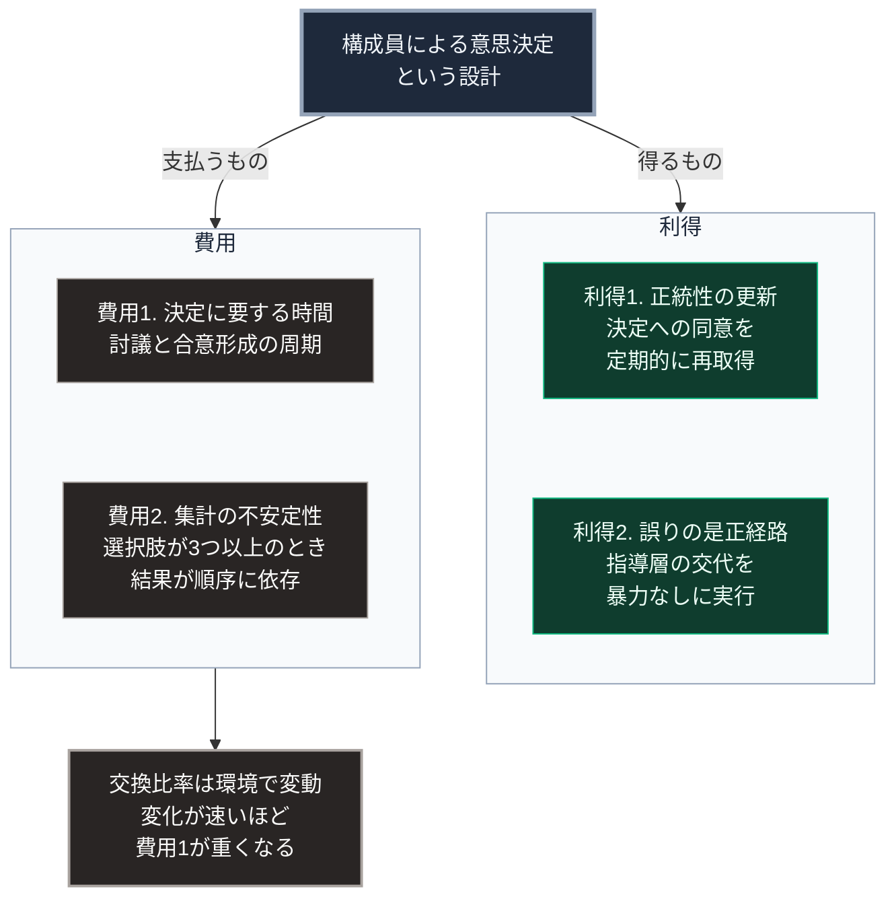

### 序論：本章が扱う範囲

本章は、多数の構成員による意思決定という統治形態が、どのような形で成立し、どのような制約に直面してきたかを記述します。本文は事実の記述に限定します。解釈は章末で扱います。

### 1. 古代アテナイにおける実装

紀元前5世紀のアテナイでは、成年男子市民の参加する民会が最高議決機関として機能しました。この体制において、政策の決定、開戦の可否、そして公職者の選出が、参加者の投票によって行われます。

歴史家トゥキュディデスは、ペロポネソス戦争の記録のなかで、この体制における意思決定の過程を記述しました [ [ 86 ] ](https://www.gutenberg.org/ebooks/7142) 。彼の記録には、民会が短期間のうちに相反する決定を下した事例が複数含まれています。

この体制における参加資格は限定的でした。市民権を持つ成年男子のみが参加し、女性、在留外国人、そして非自由民は除外されます。参加資格を持つ人口は、アテナイの総人口の1割から2割の範囲と推定されています。

公職の多くは選挙ではなく抽選によって充当されました。これは、特定の個人への権力集中を回避するための設計と説明されています。

### 2. 中世から近世における議会の形成

近代の議会は、古代の民会を直接の起源としません。その起源は、君主が課税の同意を得るために招集した身分制の会議にあります。

1215年のマグナ・カルタは、イングランド王が貴族に対して、一定の課税に同意を要することを認めた文書です。13世紀後半には、貴族に加えて騎士と市民の代表が招集されるようになりました。

この経緯が示すのは、議会の成立動機が構成員の権利保障ではなく、君主による財源調達であったという点です。同意を得ることで徴収の実効性が高まるという、実務的な理由が先行しました。

### 3. 主権の所在に関する理論的転換

18世紀の政治思想において、統治権力の所在をめぐる議論が展開されました。[第Ⅰ部B-1](isms-overview)で言及したロックとルソーの議論は、いずれも主権を被統治者の側に置くものです。

この理論的転換が制度として実装されたのが、1776年のアメリカ独立宣言と、1789年のフランス人権宣言です。両者はいずれも、政治権力の正統性が被統治者の同意に由来すると規定しています。

### 4. 参政権の段階的な拡大

19世紀から20世紀にかけて、参政権の範囲は段階的に拡大しました。

イギリスでは、1832年、1867年、1884年の3度の選挙法改正により、有権者の範囲が拡大します。財産資格による制限は、1918年および1928年の改正を経て撤廃されました。

アメリカでは、1870年の憲法修正第15条が人種による選挙権の制限を禁じ、1920年の修正第19条が性別による制限を禁じました。ただし、実質的な参政権の保障は、1965年の投票権法まで課題として残りました。

日本では、1889年の制度において有権者は総人口の約1.1%でした [ [ 263 ] ](https://www.ndl.go.jp/portrait/pickup/024) 。1925年の改正により、満25歳以上の男子に選挙権が付与されます。女性を含む普通選挙は、1945年の改正によって実現しました。

### 5. 制度としての限界に関する理論的発見

20世紀半ば、集合的な意思決定に関する数学的な分析が進展しました。

経済学者ケネス・アローは1951年、複数の選択肢に対する個人の選好を集計して社会全体の選好順序を導く手続について、一定の条件を同時に満たすものが存在しないことを証明しました [ [ 87 ] ](https://plato.stanford.edu/entries/arrows-theorem/) 。

この定理が示すのは、多数決による集計が常に一貫した結果を与えるとは限らないという点です。選択肢が3つ以上ある場合、投票の順序や方式に応じて結果が変化しうる点も、形式的に示されました。

政治学者ロバート・ダールは、現実の民主的な体制を、理念型としての民主主義とは区別して分析しました [ [ 88 ] ](https://openlibrary.org/works/OL1890980W) 。彼は、現実の体制を評価する基準として、公職者への選挙、表現の自由、代替的な情報源の存在、結社の自律性などの条件を挙げています。

### 6. 決定に要する時間という制約

民主的な意思決定は、複数の段階を要します。争点の設定、情報の共有、討議、そして投票です。

政治学および行政学の研究において、この過程に要する時間は、意思決定の質と正統性を担保する費用として理解されてきました。フランスの観察者アレクシ・ド・トクヴィルは、19世紀のアメリカを観察した記録のなかで、民主的な体制が対外政策において不利を負う可能性を指摘しています [ [ 89 ] ](https://www.gutenberg.org/ebooks/815) 。

彼の指摘は、この体制が持続性と秘匿性を要する決定において困難を抱えるというものでした。

### 🗺️ 図：民主主義が交換している2つの価値

この統治形態が、何を得るために何を支払っているかを示します。

#### 図の読み方

この図は、最上段の設計から左右2つの枠へ分かれる形をしています。左の枠が得るもの、右の枠が支払うものです。民主主義を制度の良否という軸ではなく、何と何を交換する設計なのかという軸で表現しています。

左の枠で縦に並ぶ利得1と利得2は、いずれも[第Ⅰ部A-8](dynastic-cycle-and-corruption)で扱った崩壊の構造と対応します。オスマン帝国と江戸幕府の事例では、正統性の供給が途絶えた段階で崩壊が発生しました。民主的な体制は、正統性を周期的に再取得する手続を制度として備えています。また、指導層の交代を暴力によらず実行する経路を用意しています。

右の枠で縦に並ぶ費用1と費用2は、この設計に伴う制約です。費用1は速度の問題であり、費用2は集計の一貫性の問題です。

右の枠の下にだけ箱を置いたのは、費用の側が外部環境によって変動するためです。外部環境の変化が緩やかであれば、費用1は問題になりません。変化が加速すると、決定周期が環境の変化に追随できなくなります。

[第Ⅱ部](japan-current-state)および[第Ⅲ部](future-method)では、現在の技術変化と国際環境の速度が、この費用1をどの程度押し上げているかを検討します。

---

### 現代社会構造への射程と本質（本章のまとめ）

本セクションは、著者による解釈です。前節までの記述とは区別して読んでください。

1.  **現代社会構造の原点**

    現代の民主的な体制は、古代の民会の直接的な継承ではありません。その主要な構成要素は、君主への課税同意という実務から派生した議会と、18世紀の主権理論と、19世紀以降の参政権拡大とが結合した産物です。

    この由来は、現在の制度設計に痕跡を残しています。予算の議決が議会の中核的な権能とされているのは、議会の成立動機が財源調達への同意にあったためです。

2.  **歴史的事実の本質**

    民主主義の本質は、多数の意見が正しい結果を導くという想定ではありません。アローの定理が示すように、集計手続自体に形式的な限界があります。

    この形態が持つ機能は、別の場所にあります。決定を誤った場合、その決定を下した層を暴力によらず交代させられること。そして、交代の可能性そのものが決定者の行動を制約すること。この2点です。

3.  **現代社会の現状と課題**

    現在、この形態は2つの方向から圧力を受けています。

    1つは速度です。技術変化と国際環境の変化速度が、決定周期を上回る局面が増加しています。

    もう1つは、情報環境です。討議が成立するには、参加者が共通の事実を前提としている必要があります。この前提が成立しなくなった場合、討議は合意形成の機能を果たしません。この論点は、[第Ⅱ部](japan-current-state)で扱います。
