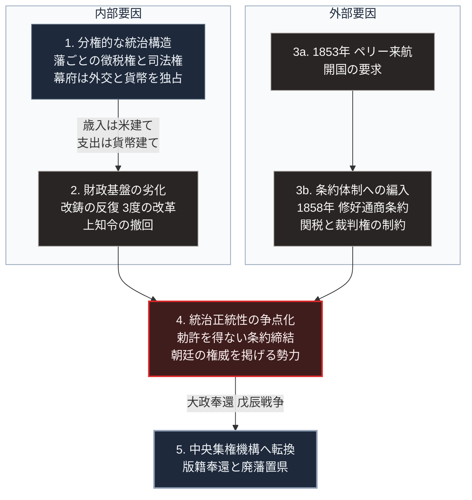

### 序論：本章が扱う範囲

本章は、1603年から1868年までの日本を対象とします。徳川氏を頂点とする統治機構がどのように設計され、どのような経過をたどって解体したかを時系列に沿って記述します。本文は事実の記述に限定します。現代との関連については、章末の独立したセクションで扱います。

### 1. 幕藩体制の成立と権力の配分

1600年の関ヶ原の戦いを経て、徳川家康は1603年に征夷大将軍の宣下を受けました。これにより、江戸に幕府が開かれます。

この統治機構の基本単位は「藩」でした。全国は、幕府の直轄領と、大名に与えられた領地とに分割されます。幕府直轄領はおよそ400万石であり、旗本領を加えた幕府の直接支配地は全国の約4分の1に相当しました。残る領地は、およそ260から300の大名家に分与されました。

各大名は、自領における徴税権、司法権、家臣団の編成権を保持しました。年貢の徴収基準、村落の管理、そして領内の裁判は、原則として各藩が独自に運用します。幕府が藩の内政に日常的に介入することはありませんでした。

一方で、幕府は次の権能を独占しました。外交権、貨幣の鋳造権、主要鉱山の管理権、そして大名の改易・転封に関する裁量権です。

### 2. 統制の技術 ―― 法度、参勤交代、対外関係の限定

幕府は、分権的な構造を維持したまま大名を統制するため、複数の制度を組み合わせました。

1615年、幕府は武家諸法度を発布しました。これは大名の行動規範を定めた法令であり、居城の無断修築の禁止、大名家相互の婚姻に対する許可制などを規定しています。同法度は将軍の代替わりごとに発布され、寛永・寛文・天和・宝永の各令で改訂されました [ [ 63 ] ](https://www.digital.archives.go.jp/file/3142769.html) 。1717年（享保2年）以降は、天和令の文面が踏襲されています。同年、朝廷に対しても法度が発布されます。禁中並《きんちゅうならびに》公家諸法度と呼ばれるもので、天皇および公家の活動範囲を規定しました。

1635年の武家諸法度の改訂（寛永令）により、参勤交代が制度として明文化されました。大名は原則として1年ごとに江戸と自領とを往復し、正室と嫡子を江戸に居住させることが義務づけられます。この制度は、大名家の財政に恒常的な支出を課しました。同時に、人質を江戸に置く効果を持ちます。

対外関係については、1630年代を通じて段階的な制限が加えられました。1639年のポルトガル船来航禁止をもって、貿易相手はオランダ、中国、朝鮮、琉球、そしてアイヌとの限定的な窓口に絞られます。この体制は、幕府が対外情報と貿易利益とを独占的に管理する構造を形成しました。

### 3. 人口と経済の推移 ―― 成長期から定常期へ

17世紀の日本は、耕地の拡大と新田開発によって人口が増加しました。1600年前後の推計人口は1,200万人から1,800万人の範囲とされます。1721年に幕府が実施した全国人口調査では、約3,128万人が記録されました [ [ 64 ] ](https://www.jstage.jst.go.jp/article/economics1986/38/4/38_4_290/_pdf) 。

18世紀以降、全国の総人口は約3,000万人前後で推移し、幕末まで大きな増加を示しませんでした。この停滞は、全国集計としては横ばいですが、地域別に見ると増加地域と減少地域とが併存していたことが、歴史人口学の研究によって示されています [ [ 64 ] ](https://www.jstage.jst.go.jp/article/economics1986/38/4/38_4_290/_pdf) 。

経済面では、貨幣経済と全国的な流通網が発達しました。大坂には諸藩の蔵屋敷が置かれ、年貢米が換金されます。江戸は18世紀に人口100万人規模の都市に成長しました。一方で、都市人口が総人口に占める比率は、後期においても12%程度にとどまりました [ [ 64 ] ](https://www.jstage.jst.go.jp/article/economics1986/38/4/38_4_290/_pdf) 。

### 4. 財政の劣化と改革の反復

幕府の歳入は、直轄領からの年貢を主たる基盤としていました。年貢は石高、すなわち米の生産量を基準として算定されます。しかし、貨幣経済の浸透により、幕府の支出は貨幣建てで増大しました。この収入構造と支出構造との乖離が、財政の恒常的な逼迫を生みます。

1695年、幕府は金銀貨の品位を引き下げる改鋳を実施しました。これにより、幕府は差益を得ましたが、貨幣価値の下落を招きます。改鋳はその後も複数回にわたって繰り返されました。

18世紀以降、幕府は3度の大規模な財政再建を試みました。享保の改革（1716年から1745年）、寛政の改革（1787年から1793年）、そして天保の改革（1841年から1843年）です。いずれも支出の抑制と物価統制を共通の柱とし、享保の改革はこれに新田開発の奨励を加えました。天保の改革では、江戸と大坂の周辺を幕府直轄領に組み替える上知令が出されましたが、大名と旗本の反対により撤回されています。

### 5. 外部衝撃 ―― 開国と条約体制への編入

1853年、アメリカ東インド艦隊のペリー提督が浦賀に来航し、開国を要求しました。翌1854年、幕府は日米和親条約を締結し、下田と箱館を開港します。

1858年には、日米の修好通商条約が締結されました。同条約は、5港の開港、自由貿易の開始とともに、領事裁判権の承認と、関税率の協定制を含んでいました。同様の条約が、オランダ、ロシア、イギリス、フランスとも順次締結されます。1866年の改税約書により、輸入関税率は一律5%へ引き下げられました。これらの条約と関連文書は、アジア歴史資料センターおよび国立公文書館のデジタルアーカイブで公開されています [ [ 250 ] ](https://www.jacar.go.jp/)  [ [ 251 ] ](https://www.digital.archives.go.jp/) 。

条約の締結にあたり、幕府は朝廷の勅許を得ることができませんでした。この経緯は、幕府の統治正統性に対する公然の異議を発生させます。以後、朝廷の権威を掲げる政治勢力が台頭しました。

### 6. 解体の経過

1860年代を通じて、幕府と、薩摩藩および長州藩を中心とする勢力との対立が激化しました。1866年には薩長同盟が成立します。

慶応3年10月14日（1867年11月9日）、第15代の将軍である徳川慶喜は、統治権を朝廷へ返上する上表を提出しました。大政奉還です。同年12月9日（1868年1月3日）には王政復古の大号令が発せられ、幕府の廃止と新政府の樹立が宣言されました。

1868年1月の鳥羽・伏見の戦いを起点として、旧幕府勢力と新政府軍との武力衝突が発生します。この戊辰戦争は、明治2年5月（1869年6月）の箱館の戦いをもって終結しました。

1869年、新政府は版籍奉還を実施します。大名は、領地と領民とを朝廷へ返上しました。1871年の廃藩置県により、藩は廃止され、府県が設置されます。各府県には、中央政府の任命による府知事・県令（以下、府県長官）が派遣されました。これにより、260余年にわたって維持された分権的な統治構造は、中央集権的な行政機構へと置き換えられました。

### 🗺️ 図：幕藩体制の解体プロセス

分権構造がどの経路をたどって中央集権構造へ転換したかを示します。

#### 図の読み方

この図は、上段の左右2つの枠が下段の1つの箱に合流する形をしています。2つの独立した要因が1点で結合したという構造を表します。

左の枠「内部要因」は、1から2へ進む系列です。歳入の算定基準と支出の建て値とが乖離し、財政の調整能力が低下していく過程を表します。この劣化は、外部との接触がなくとも進行していました。

右の枠「外部要因」は、3aから3bへ進む系列です。ペリー来航と条約締結は、幕府の内部事情とは独立した事象でした。

2つの枠から出る矢印が合流する4の箱に注目してください。ここで発生したのは財政問題ではなく、軍事的敗北でもありません。統治の正統性が争点化したという、性質の異なる問題です。

条約の締結に勅許を得られなかったことにより、幕府が最終的な決定権を持つという前提そのものが公然と否定されました。内部の劣化と外部の衝撃とが正統性という接点で結合したこと。これが、最下段の5への移行を可能にした構造です。

---

### 現代社会構造への射程と本質（本章のまとめ）

本セクションは、著者による解釈です。前節までの事実記述とは区別して読んでください。

1.  **現代社会構造の原点**

    現在の日本が持つ中央集権的な行政構造は、江戸期の分権体制から自動的に発展したものではありません。1871年の廃藩置県によって、意図的かつ短期間に置き換えられた結果です。府県長官が中央政府によって任命される仕組み、全国一律の徴税制度、そして国が定めた基準に基づく行政サービスは、いずれもこの転換に起源を持ちます。

    重要なのは、この転換が「効率が良いから選ばれた」のではないという点です。条約体制の下で国家としての交渉主体を早急に確立する必要があったこと。これが直接の動機の1つでした。諸藩の財政破綻と軍事力の統合という内部要因も、並行して作用していました。すなわち、現在の中央集権的な行政構造は、19世紀の国際環境という特定の外部条件に対する適応の産物です。

2.  **歴史的事実の本質**

    幕藩体制の解体が示すのは、分権構造それ自体が脆弱だったということではありません。この体制は260年以上にわたり、大名間の戦争が発生しない状態を維持しました。

    解体の直接の要因は、外部との交渉権限を独占していた主体が、その交渉において自らの正統性を担保できなくなったことにあります。分権的な内政と、集権的な外交。この2つを組み合わせた構造は、外部環境が安定している限り機能しました。しかし外部からの圧力が高まった局面において、外交を担う主体の正統性が問われた瞬間に、構造全体が崩れます。

    ここから抽出できる一般則は次のとおりです。システムの崩壊は、最も負荷の高い部位ではなく、正統性を供給する部位から始まります。

3.  **現代社会の現状と課題**

    現代の日本も、内政と外交とを異なる原理で運用しています。地方自治は制度上分権的である一方、外交、防衛、通貨、そして通商交渉は国が独占しています。

    江戸期との構造的な差異は、現代では正統性が選挙によって周期的に更新される点にあります。しかし、更新の周期は数年単位です。外部環境の変化速度がこの周期を上回る場合、意思決定の正統性と、意思決定に要求される速度との間に緊張が生じます。この論点は、第Ⅱ部および第Ⅲ部で、現在の国際環境と技術変化の速度に照らして再度検討します。
