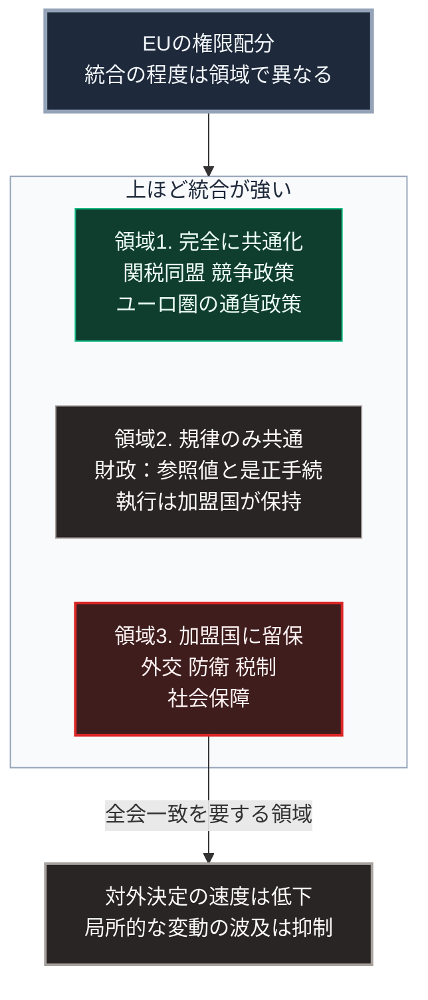

### 序論：本章が扱う範囲

本章は、欧州連合の現状を、EUの機関が公表する統計と公式文書から整理します。

EUを独立した章として扱う理由は、その制度設計にあります。EUは、経済政策の一部を共通化しながら、財政と外交と防衛の権限を加盟国に残しています。この構成は、第Ⅰ部B-6で扱った権限分散の設計が、現代においてどう機能するかの事例を提供します。

本文は事実の記述に限定します。解釈は章末で扱います。

### 1. 構成と権限の配分

EUは、条約に基づいて設立された国家連合です。加盟国は27か国です。

主要な機関は次のとおりです。欧州委員会が立法提案と執行を担当します。欧州議会は加盟国の市民が直接選出する議員で構成されます。理事会は加盟国の閣僚で構成されます。司法裁判所がEU法の解釈を担当します。

権限の配分は、条約によって領域ごとに定められています。関税同盟、競争政策、通貨政策など一部の領域はEUの排他的な権限とされます。他の多くの領域では、EUと加盟国が権限を共有します。外交、安全保障、税制、社会保障などの領域では、加盟国の権限が維持されています。

### 2. 人口

欧州統計局の公表によれば、2025年1月1日時点のEUの人口は4億5,060万人と推計されています。65歳以上の割合は22.0%です。人口の年齢中央値は44.9歳です [ [ 143 ] ](https://ec.europa.eu/eurostat/statistics-explained/index.php?title=Population_structure_and_ageing) 。

同資料によれば、高齢者従属人口指数は2025年の34.5%から2100年に59.7%へ上昇すると見込まれています。80歳以上の割合は、2025年の6.2%から2100年に15.3%へ上昇するとの見通しが示されています。

### 3. 財政に関する共通規律

EUは、加盟国の財政について共通の規律を設けています。この枠組みは、安定成長協定と呼ばれます [ [ 144 ] ](https://economy-finance.ec.europa.eu/economic-and-fiscal-governance/stability-and-growth-pact_en) 。

この枠組みは、財政赤字と債務残高について参照値を定め、それを超える加盟国に対して是正の手続を規定するものです。

同時に、財政の執行権限は加盟国が保持しています。したがってこの枠組みは、加盟国の予算そのものを決定するのではなく、加盟国が守るべき範囲を規定する形式を採ります。

### 4. 政策の優先領域

欧州委員会は、任期ごとに政策の優先領域を公表しています。現在の委員会の任期は2024年から2029年です [ [ 303 ] ](https://commission.europa.eu/priorities-2024-2029_en) 。

同委員会が掲げる7つの優先領域には、持続可能な繁栄および競争力、欧州の防衛および安全保障の新時代、民主主義の保護、そして食料・水・自然の安全が含まれます [ [ 303 ] ](https://commission.europa.eu/priorities-2024-2029_en) 。前期の委員会が掲げた気候中立とデジタル領域の規制は、前者の領域に引き継がれています [ [ 145 ] ](https://commission.europa.eu/strategy-and-policy/priorities-2019-2024_en) 。

### 5. 安全保障の枠組み

EU加盟国の多くは、北大西洋条約機構にも加盟しています。同機構の加盟国は、2025年6月25日のハーグ首脳会議宣言で、2035年を期限として国内総生産の5%を国防と安全保障関連の支出へ充てることに合意しました [ [ 297 ] ](https://www.nato.int/en/about-us/official-texts-and-resources/official-texts/2025/06/25/the-hague-summit-declaration) 。

EU自身も、安全保障と防衛に関する戦略文書を採択しています。2022年3月には、理事会が安全保障と防衛に関する戦略的コンパスを採択しました [ [ 304 ] ](https://www.eeas.europa.eu/eeas/strategic-compass-security-and-defence-1_en) 。2025年3月19日には、欧州委員会と外務・安全保障政策の上級代表が、2030年までの防衛準備を掲げる欧州防衛白書を提示しました [ [ 305 ] ](https://defence-industry-space.ec.europa.eu/eu-defence-industry/white-paper-european-defence-readiness-2030_en) 。ただし、防衛に関する決定は加盟国の権限に属し、EUの決定には全会一致を要する領域が残っています。

### 🗺️ 図：統合の程度が領域によって異なる構造

どの領域が共通化され、どの領域が加盟国に残っているかを示します。

#### 図の読み方

この図は、上段の1つの枠から、枠内で縦に並ぶ3つの領域へ下りる形をしています。枠内の並びは、上ほど統合が強く、下ほど加盟国の権限が残る順です。最下段の領域3だけが、さらに下の帰結へつながります。

領域1では、決定が単一の主体に集約されています。関税率や競争政策の判断について、加盟国ごとの差は生じません。

領域2は、中間的な形態です。財政については、共通の規律が存在する一方、実際の歳入と歳出の決定は加盟国が行います。この構成は、第Ⅰ部A-5で扱った江戸期の幕藩体制と形式的な類似を持ちます。すなわち、共通の規則を上位が定め、実務は下位の単位が担う構造です。

領域3では、決定が加盟国に留保されています。ここに外交と防衛が含まれる点は重要です。

最下段の帰結は、この配分から生じる特徴です。領域3に属する事項について、EUとして一致した対応を採るには、加盟国間の合意が必要になります。第Ⅰ部B-6で整理した速度と分散のトレードオフが、ここに現れています。

一方で、この配分には利点もあります。領域3が加盟国に残されているため、ある加盟国の政治的な変動が、EU全体の制度を直ちに変更することはありません。分散が、局所的な変動の波及を抑制しています。

第Ⅲ部では、外部からの圧力が高まった局面において、この配分がどう作用するかを検討します。

---

### 現代社会構造への射程と本質（本章のまとめ）

本セクションは、著者による解釈です。前節までの記述とは区別して読んでください。

1.  **現在の構造がどこから来たか**

    EUの制度は、第二次世界大戦後の欧州において、加盟国間の武力紛争を構造的に困難にすることを目的として設計されました。経済的な相互依存を深めることによって、紛争の費用を高めるという発想です。

    この目的については、加盟国間で武力紛争が発生していないという事実がある一方、因果の特定は困難です。ただし、制度設計の意図がここにあったことは、条約の記述から確認できます。

2.  **数値が示していること**

    人口に関する数値は、日本と同じ方向を示しています。65歳以上が22.0%、年齢中央値が44.9歳という水準は、日本の29.3%に比べれば低いものの、上昇の傾向は共通です。

    したがってEUもまた、第Ⅱ部A-2で整理した3つの制約に直面します。労働投入量、社会保障の収支、そして地域の維持費用です。

3.  **日本にとっての含意**

    EUの構造は、日本にとって参照可能な事例を提供します。とりわけ、権限を複数の層に分散させたまま、共通の規律を機能させる設計です。

    第Ⅴ部で扱う自律分散型システムの設計において、この構造は参考になります。すなわち、局所の裁量を残しながら、全体としての整合性をどう確保するかという問題です。EUの経験は、その利点と制約の双方を示しています。
