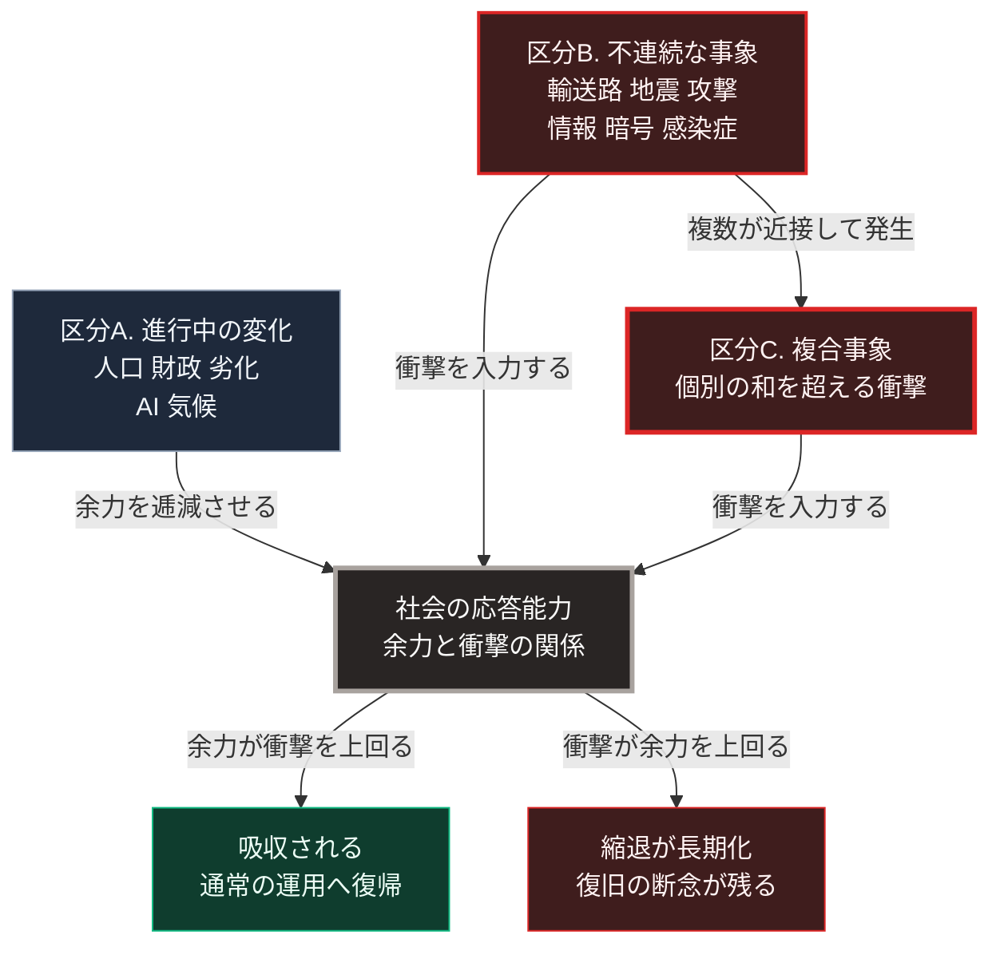

### 序論：本章が扱う範囲

本章は、第Ⅲ部のシナリオ構築において入力となるイベントを、一覧として定義します。

各イベントについて、次の4項目を記述します。定義、前章で整理した確度の階層、影響が及ぶ供給基盤、そして観測可能な早期警戒指標です。

本章は、各イベントの発生確率を提示しません。第Ⅲ部-1で述べたとおり、根拠を示せない確率は記載しないためです。提示するのは、発生した場合の影響と、発生の接近を示す指標です。

### 1. 一覧の構成

イベントを、発生の性質によって3つの区分に分けます。

**区分A：進行中の変化**

既に開始しており、今後も継続すると見込まれるものです。確度の階層1または階層2に属します。

**区分B：不連続な事象**

発生の有無が不確実であり、発生した場合に急激な変化をもたらすものです。階層3に属します。

**区分C：複合事象**

区分Bの複数が近接して発生した場合の状態です。個別の影響の単純な和とは異なる帰結をもたらす可能性があります。

### 2. 区分A：進行中の変化

**A-1　人口の減少と高齢化**

確度：階層1。既に確定した年齢構成から導かれます。

影響：労働投入量、社会保障の収支、インフラ維持費用の1人あたり負担。

早期警戒指標：出生数の実数、労働力人口、市町村別の人口密度。

**A-2　財政負担の累積**

確度：階層2。現行制度の継続を前提とします。

影響：歳出の裁量余地、金利変動に対する感度。

早期警戒指標：公債依存度、利払費が歳出に占める割合、国債の平均償還年限。

なお、国債金利の不連続な上昇は、独立した区分Bの事象としては扱いません。それは外部から到来する衝撃というより、A-2の累積に対する市場の応答として生じるためです。本書はこれを、A-2の金利感度として扱います。

**A-3　インフラの経年劣化**

確度：階層1に近い。設置年次から更新時期が算定可能です。

影響：上下水道、道路、橋梁、送電網の維持可能性。

早期警戒指標：更新時期を迎える施設の割合、自治体別の更新費用と歳入の比率。

**A-4　生成AIの普及**

確度：階層2。普及の速度には幅がありますが、方向はこれまでの観測において一貫しています。

影響：知的労働の構成、技能の習得過程、情報の生成量。

早期警戒指標：職種別の求人構成、業務における導入率、生成された情報の流通量。

**A-5　気候の変化**

確度：階層2。国際的な評価報告が複数の経路を提示しています [ [ 170 ] ](https://www.ipcc.ch/report/ar6/syr/) 。

影響：農業生産、水資源、極端気象の頻度、沿岸部の設備。

早期警戒指標：年平均気温、極端降水の発生頻度、海面水位。

### 3. 区分B：不連続な事象

**B-1　海上輸送路の制約**

定義：特定の海峡または航路が、武力行使または封鎖により通行不能または大幅に制約される状態。

確度：階層3。

影響：エネルギー供給、食料供給、部材供給。第Ⅱ部B-2で示したとおり、代替経路の容量は限定的です。

早期警戒指標：当該海域における艦船の展開、保険料率、迂回航路を選択する船舶の比率。

**B-2　大規模地震および津波**

定義：想定される震源域における大規模な地震の発生。

確度：階層3。政府の防災機関が被害想定を公表しています [ [ 171 ] ](https://www.bousai.go.jp/jishin/nankai/index.html) 。

この事象については、他の区分Bと異なり、政府機関が根拠つきの確率を公表しています。政府の地震本部による長期評価は、南海トラフでマグニチュード8から9の地震が今後30年以内に発生する確率を、2つのモデルで示しています。すべり量依存BPTモデルでは60%から90%程度以上、BPTモデルでは20%から50%です [ [ 324 ] ](https://www.jishin.go.jp/regional_seismicity/rs_kaiko/k_nankai/) 。本書はこの数値を、モデルという手法上の前提とともに参照します。2つのモデルで値が大きく異なること自体、前提への依存を示しています。

影響：人的被害、住宅、産業設備、輸送網、そして電力および水道の供給。

早期警戒指標：地殻変動の観測値、前震活動。ただし、これらの指標から発生時期を特定する手法は確立していません。

**B-3　インフラへの意図的な攻撃**

定義：発電設備、送電網、通信設備、水道施設に対する物理的またはサイバー的な攻撃。

確度：階層3。第Ⅱ部B-1で示したとおり、他地域では既に発生しています。

影響：広域かつ長期の供給停止。復旧に要する期間は、設備の代替可能性に依存します。

早期警戒指標：周辺地域における同種事案の発生、重要設備に対する探索的なアクセスの検知。

**B-4　情報環境の機能不全**

定義：生成された情報の量と質により、事実に関する共通認識の形成が困難になる状態。

確度：階層3から階層4。

影響：合意形成の速度、災害時の情報伝達、制度への信頼。

早期警戒指標：情報源の分散度、制度に対する信頼度の調査結果。

**B-5　暗号方式の移行に伴う障害**

定義：既存の公開鍵暗号から新方式への移行が完了する前に、当該方式の安全性が損なわれる状態。

確度：階層3。RSA-2048の解読に要する資源は、2021年時点の見積もりでは約2,000万個の雑音のある量子ビットでした。2025年の見積もりは、これを100万個未満へ引き下げています [ [ 325 ] ](https://arxiv.org/abs/2505.15917) 。第Ⅱ部C-5で示した実証規模は105個であり、現在の装置との開きは約4桁です。見積もりの縮小が続いていること自体を、早期警戒指標の1つとして扱います。

影響：電子商取引、行政の電子手続、通信の秘匿。

早期警戒指標：誤り訂正された論理素子の実装規模、必要資源の見積もりの改訂、標準への移行率。

**B-6　感染症の広域流行**

定義：新たな病原体または既知の病原体の変異により、複数の国にまたがる流行が生じ、移動と接触の制限が実施される状態。

確度：階層3。2020年の事例では、労働投入、物流、そして医療の供給が同時に制約されました。世界保健機関は、2020年1月30日に国際的に懸念される公衆衛生上の緊急事態を宣言しました [ [ 326 ] ](https://www.who.int/news/item/30-01-2020-statement-on-the-second-meeting-of-the-international-health-regulations-%282005%29-emergency-committee-regarding-the-outbreak-of-novel-coronavirus-%282019-ncov%29) 。

影響：労働投入量、物流、医療の供給能力。区分Aの人口減少と重なった場合、労働投入の制約が増幅されます。

早期警戒指標：世界保健機関による緊急事態の宣言、各国の渡航制限の発出状況、国内の医療機関の受け入れ余力。

### 4. 区分C：複合事象

**C-1　自然災害と供給制約の同時発生**

大規模地震の発生時に、海上輸送路が制約されている状態です。復旧に必要な資材と燃料の調達が、同時に困難になります。

**C-2　インフラ攻撃と情報環境の機能不全の同時発生**

供給停止と、その状況に関する情報の混乱が重なる状態です。復旧作業と避難行動の双方に影響します。

**C-3　財政制約と災害復旧需要の同時発生**

大規模な復旧需要が生じた時点で、財政の裁量余地が限定されている状態です。

### 🗺️ 図：イベントの影響が及ぶ経路

各区分が社会の応答能力に作用し、余力と衝撃の関係で帰結が分かれる構造を示します。

#### 図の読み方

上段に2つの区分が並びます。左の区分Aは進行中の変化、右の区分Bは不連続な事象です。区分Bの下には区分Cがあり、区分Bが複数近接して発生した状態を指します。

3つの区分から出る矢印は、中段の社会の応答能力へ集まります。ただし矢印の意味は異なります。区分Aは衝撃を与えるのではなく、衝撃を吸収する余力を逓減させます。区分Bと区分Cは、外部からの衝撃を入力します。

中段から下段へは、矢印が2本に分かれます。余力が衝撃を上回れば左の吸収へ、衝撃が余力を上回れば右の縮退へ至ります。

この図は、第Ⅰ部A-8で整理した崩壊の構造を、現在の日本に適用したものです。区分BのB-1からB-6までの6つの事象は、いずれも発生時期を特定できません。

帰趨を決めるのは、衝撃の大きさそのものではありません。衝撃が到来した時点における余力との関係です。同じ規模の地震であっても、帰結は状態によって異なります。財政に余裕があり労働力と資材を確保できる状態で発生する場合と、そうでない状態で発生する場合とを比べれば明らかです。

したがって、本書が第Ⅲ部で扱う分岐は、次の形を取ります。区分Aによる余力の逓減がどの程度進行した時点で、区分Bのどの事象が発生するか。この組み合わせが、シナリオを分けます。

区分Cが独立の区分として必要なのは、複合事象が個別事象の和として評価できないためです。復旧には資材、燃料、人員、そして資金が必要です。これらの調達経路が同時に制約された場合、単独の事象であれば数週間で復旧しうるものが、数か月に延びる可能性があります。

次章以降では、これらのイベントのうち影響が大きいものについて、個別に検討します。その後、3つのシナリオへ統合します。

---

### 本章の位置づけ

本セクションは、著者による整理です。

1.  **確率を示さない理由**

    本章は、武力紛争およびインフラ攻撃について、発生確率を示しませんでした。統計的な基準率を構成する母集団を定義できないためです。

    地震については、B-2の項で政府機関の長期評価を参照しました。この数値は根拠を持ちますが、モデルという手法上の前提に依存します。本書はこの数値を、前提とともに引用する形で扱います。

    根拠のない数値を提示することは、読者に誤った確実性を与えます。本書はこれを避けます。根拠のある数値については、その根拠の前提を併記します。

2.  **代わりに示すもの**

    確率の代わりに本書が示すのは、早期警戒指標です。読者は、自らこれらの指標を追跡できます。

    この方法の利点は、時間の経過とともに判断を更新できる点にあります。予測は執筆時点で固定されますが、指標は現在の状態を反映します。

3.  **次章以降の構成**

    次章では、影響の大きいイベントについて個別に検討します。その後、3つのシナリオを構築し、最後に分岐条件を一覧として整理します。
