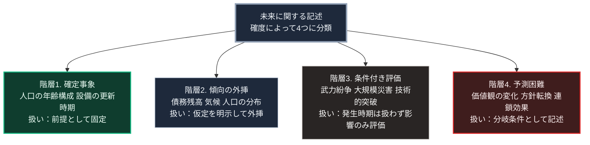

### 序論：本章が扱う範囲

第Ⅲ部からは、推論の領域に入ります。第Ⅰ部と第Ⅱ部では、事実の記述に徹してきました。ここから先は、前提を置いたうえでの推論となります。

本章では、その推論の方法を先に開示します。どの手続によって結論を導くのか。どの範囲で妥当性を主張するのか。そして、どのような場合に本書の推論が外れるのか。これらを明示することが、本章の目的です。

この開示の目的は、検証可能性の確保にあります。前提と手続が明示されていれば、読者は異なる前提を置いて自ら推論をやり直すことができます。結論のみを提示する予測は、この検証を不可能にします。

### 1. 予測の確度は対象によって異なる

未来に関する事象は、予測の確度によって階層化できます。

**階層1：既に確定している事象**

人口の年齢構成がこれに該当します。20年後に50歳となる人々は、すでに30歳です。この層の規模は、今後の出生率によって変化しません。変化するのは、死亡と国際移動による分のみです。

インフラの物理的な劣化も、この階層に近い性質を持ちます。設置年次が判明していれば、更新が必要となる時期は算定可能です。

**階層2：傾向が持続する場合に導かれる事象**

財政の債務残高、気候の平均的な変化、都市への人口集中などがこれに該当します。これらは、現行の制度と行動が継続するという仮定のもとで外挿できます。

この階層の予測は、仮定が明示されている限り検証可能です。仮定が破られた場合、予測は外れます。

**階層3：発生の有無が不確実な事象**

武力紛争の発生、大規模災害の発生、技術的な突破がこれに該当します。

この階層について、発生時期の特定は不可能です。ただし、発生した場合の影響は評価できます。したがって、この階層は「予測」ではなく「条件付きの影響評価」として扱う必要があります。

**階層4：予測が原理的に困難な事象**

社会的な価値観の変化、政治的な指導者の交代がもたらす方針転換、そして複数の要因が連鎖した場合の帰結がこれに該当します。

### 2. 予測精度に関する実証研究

政治的な事象に関する専門家の予測精度については、長期の実証研究があります。

心理学者フィリップ・テトロックは、専門家による予測を長期にわたり収集し、実際の結果と照合しました [ [ 168 ] ](https://openlibrary.org/works/OL5737028W) 。

その研究が報告した結果によれば、専門家の予測精度は、単純な外挿による予測を大きくは上回りませんでした。また、単一の理論的枠組みに強く依拠する予測者よりも、複数の枠組みを併用する予測者のほうが高い精度を示す傾向も観測されています。

後続の研究では、予測精度を向上させる手続が検討されました [ [ 169 ] ](https://openlibrary.org/works/OL18233878W) 。報告された有効な手続には、問いを分解すること、外部の基準率を出発点とすること、新しい情報に応じて段階的に更新すること、そして予測を数値として記録し事後に照合することが含まれます。

本書は、このうち問いの分解、基準率の参照、そして指標による更新の3つを採用します。予測を数値として記録する手続は採用しません。第Ⅲ部-4で述べるとおり、本書が扱う事象の多くは基準率を構成できないためです。数値の記録は、観測可能な指標の追跡へ置き換えます。

### 3. 本書が採る手続

**手続1：問いを分解する**

「20年後の社会はどうなるか」という問いは、そのままでは評価できません。本書はこれを、供給基盤、財政、労働、地域、情報環境、そして制度という6つの側面に分解します。第Ⅲ部-9から第Ⅲ部-11の各シナリオは、この6軸に沿って記述します。

**手続2：階層を明示する**

各記述について、それが前節のどの階層に属するかを明示します。階層1の記述と階層3の記述は、確度が根本的に異なります。

明示の単位は2つです。事象の単位では、第Ⅲ部-4の一覧において各事象に階層を付します。シナリオの単位では、第Ⅲ部-9から第Ⅲ部-11の各項目の冒頭に【階層n】の表示を付します。階層2は前提の継続を仮定した外挿、階層3は区分Bの事象の発生を条件とした影響評価、階層4は制度や行動の選択に依存する分岐を指します。

**手続3：複数のシナリオを併置する**

単一の予測ではなく、3つのシナリオを提示します。ベースライン、楽観、悲観です。

ここで重要なのは、シナリオの内容そのものではありません。それぞれのシナリオへ分岐する条件を特定することです。

**手続4：早期警戒指標を定義する**

各分岐条件について、観測可能な指標を定義します。読者は、この指標を追跡することで、どのシナリオへの移行が進行しているかを自ら判断できます。

**手続5：外れる条件を明示する**

本書の推論が成立しなくなる条件を記述します。

### 🗺️ 図：確度の階層と、扱い方の対応

各階層をどう扱うかを示します。

#### 図の読み方

この図が示すのは、未来に関する記述をすべて同じ確度で扱ってはならないという原則です。

4つの階層は分類であり、順序ではありません。階層1の事象が階層2の事象を引き起こすという関係を示すものではなく、同じ時点の記述が異なる階層に並存します。

多くの未来予測が信頼性を失う理由は、この混同にあります。階層1の確実性を根拠として、階層3や階層4の主張が展開される。読者は前半の確実さから後半も同程度に確実だと受け取る。しかし両者の確度は根本的に異なります。

本書は、この混同を避けるため、各記述に階層を明示します。

同時に、階層3と階層4を扱わないという選択も採りません。実務上の判断において重要なのは、しばしばこれらの階層に属する事象だからです。

扱い方が異なります。階層3については、発生時期ではなく、発生した場合の影響と、影響を軽減する準備を検討します。階層4については、その事象がどちらへ振れた場合にどの経路をたどるかを、分岐として記述します。

階層3の事象について影響の評価を優先する理由は、もう1つあります。法学者キャス・サンスティーンは、強い感情を伴う事象について、人が発生確率の大小を判断に反映しにくいことを整理しました [ [ 320 ] ](https://doi.org/10.2307/1562234) 。発生確率を提示しても、備えの判断はそれに比例して変わるとは限りません。第Ⅲ部-6および第Ⅲ部-7で扱う負荷の非対称は、この点と接続します。

---

### 本章の位置づけ

本セクションは、著者による方法論上の宣言です。

1.  **本書が主張しないこと**

    本書は、特定の未来が到来すると主張しません。3つのシナリオのいずれかが実現すると主張することもありません。

    実際の経過は、3つのシナリオの中間、あるいはそのいずれとも異なる形を取る可能性があります。シナリオは、可能性の範囲を把握するための道具です。

2.  **本書が主張すること**

    本書が主張するのは、次の2点に限られます。

    第一に、第Ⅰ部および第Ⅱ部で記述した事実は、示された出典によって裏づけられています。

    第二に、それらの事実と、明示された前提からは、第Ⅲ部で示す推論が導かれます。前提を受け入れるならば、結論も受け入れられるはずです。前提を受け入れないならば、結論も変わります。

3.  **読者に求めること**

    本書は、結論への同意を求めません。求めるのは、前提と推論経路の検証です。

    各シナリオには、それが外れる条件を併記します。読者が自らの判断で異なる条件を設定するならば、そこから異なる結論が導かれます。それは本書の失敗ではなく、本書が意図した使われ方です。
