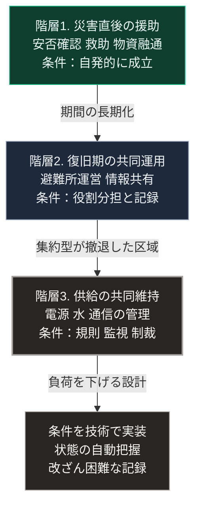

### 序論：本章が扱う範囲

本章は、地域社会と近隣の関係が、今後どのような機能を期待されるようになるかを検討します。

前章で述べたとおり、国家に期待される内容は「一律の水準」から「下限の保証」および「継続性の保証」へ移る可能性があります。この変化が生じる場合、下限を維持する担い手の分布が問題となります。

本章の記述は推論です。ただし、その前提には、災害時の相互行動に関する既存の研究があります。

### 1. 前提となる観測 ―― 災害時の行動

災害の直後に人々がどう行動するかについては、社会学および災害研究の分野に蓄積があります。

作家レベッカ・ソルニットは、複数の災害事例における住民の行動を調査し、報告しました [ [ 2 ] ](https://openlibrary.org/works/OL15273775W) 。

その報告が記述するのは、災害直後において、住民が自発的に相互の援助を組織した事例です。この記述は、災害時に無秩序と略奪が支配的になるという想定とは異なる観測を示しています。

ただし、この観測から一般則を導く際には注意が必要です。同書が記述するのは主として災害直後の短期間であり、その状態が長期にわたり持続するかどうかは別の問題です。

### 2. 共有資源の管理に関する研究

長期にわたる共同管理については、政治学者エリノア・オストロムの研究があります [ [ 1 ] ](https://doi.org/10.1017/CBO9780511807763) 。

同研究は、灌漑用水、漁場、森林、放牧地といった共有資源について、長期にわたり持続した管理の事例を収集し、共通する条件を抽出しました。

抽出された条件には、次のものが含まれます。資源の境界と利用者の範囲が明確であること。利用規則が地域の条件に適合していること。規則の変更に利用者が参加できること。利用状況を監視する仕組みがあること。違反に対する制裁が段階的であること。紛争を解決する場が低費用で利用できること。より大きな単位との関係において自治が承認されていること。そして、規模の大きい資源では、管理の単位が複数の階層へ入れ子状に組織されていることです。

この研究が示すのは、共同管理が自然に成立するのではなく、これらの条件を満たす制度が必要だという点です。

### 3. 期待の変化に関する推論

前2節の観測から、次の推論が導かれます。

**推論1：短期の相互援助と、長期の共同管理は、異なる条件を要します**

災害直後の相互援助は、比較的自発的に生じます。一方、供給設備を長期にわたり共同で維持することは、前節で述べた条件を必要とします。

したがって、地域社会に期待される機能が「災害時の助け合い」から「供給の共同維持」へ拡張される場合、必要な制度も変わります。

**推論2：期待される範囲は、居住地の条件によって分化します**

第Ⅲ部-7で述べたとおり、人口密度の低下は不均等に進行します。集約型インフラが維持される区域と、そうでない区域とが併存します。

後者において、地域社会に期待される機能は前者より大きくなります。この差は、地域間の格差として現れます。

**推論3：関係の再構築には時間がかかります**

第Ⅲ部-4で整理した心理的な条件は、地域の関係にも作用します。近隣との関係の構築と維持には、認知的な負荷が伴います。この負荷は、必要が生じていない時点では回避されます。

したがって、必要が生じてから関係を構築しようとしても、間に合わない可能性があります。

### 4. 制度と技術による負荷の低減

推論3が妥当であれば、地域社会の機能を確保する方法は、意識の変革を求めることではありません。関係の維持に要する負荷を下げることです。

第Ⅲ部-4で述べた設計の方向性が、ここでも適用されます。すなわち、判断の主体を各人に残したまま、そのための手間を減らす設計です。

具体的には、次のようなものが該当します。共有される設備の状態が自動的に把握され、利用者に提示されること。利用の記録が改ざん困難な形で保持され、紛争時に参照できること。そして、規則の変更手続が明確で、参加の費用が低いことです。

これらは、前節で述べたオストロムの条件を、技術によって実装したものと理解できます。

### 🗺️ 図：期待される機能の階層

地域社会に期待される機能を、必要な条件の重さの順に上から並べます。

#### 図の読み方

4つの箱が上から順に縦に並びます。上の3つが地域社会に期待される機能の階層であり、下へ行くほど必要な条件が重くなります。各箱の3行目に、その条件を記しています。最下段の箱は、階層3の条件を技術で実装する方向を示します。

この図が示すのは、地域社会に期待される機能が単一ではないという点です。

階層1は、既に多くの地域で成立しています。前節で参照した観測が示すとおり、災害直後の相互援助は比較的自発的に生じます。

階層2は、矢印に記したとおり、期間が長期化した場合に必要となります。ここでは役割の分担と記録が要求されます。多くの自治体において、この階層の準備は訓練として実施されています。

階層3は、性質が異なります。ここで扱うのは、災害時だけでなく平時から継続する共同管理です。前節で述べたオストロムの条件が、この階層に対応します。

階層2から階層3への矢印には「集約型が撤退した区域」と記しています。階層3が必要となるのは、集約型インフラが維持されない区域に限られます。維持される区域において階層3を求める必要はありません。この点で、期待される機能は地域の条件に依存します。

最下段の箱は、本文第4節に対応します。階層3の条件を満たすには関係の維持に負荷が伴うため、その負荷を技術によって下げる設計が必要になります。

第Ⅲ部で提示した3つのシナリオのうち、楽観シナリオにおいて実装されるのは階層3です。ベースラインにおいては、階層1と階層2にとどまります。悲観シナリオの組み合わせ2、すなわち情報環境の機能不全の重なる場合には、安否確認と物資融通に必要な情報は流通せず、階層1の成立は遅れる可能性があります。

---

### 本章の位置づけ

1.  **本章が主張しないこと**

    本章は、地域社会が国家の機能を代替すべきであるとは主張しません。

    前章で述べたとおり、下限の保証は国家の機能として残ります。地域社会が担いうるのは、その下限が一時的に割り込んだ期間を埋めることです。

2.  **本章の主要な論点**

    最も重要な論点は、推論3です。関係の構築には時間がかかり、必要が生じてからでは間に合いません。

    同時に、必要が生じていない時点で関係の維持を求めることは、認知的な負荷の観点から困難です。

    この矛盾を解く方向は、意識ではなく設計にあります。平時において別の目的で価値を持ち、有事において相互援助の基盤としても機能する仕組みです。

3.  **次章への接続**

    次章では、企業が何を期待されるようになるかを扱います。地域における供給の共同維持は、住民のみによって担われるとは限りません。事業として成立させる設計が、次章の論点の1つです。
