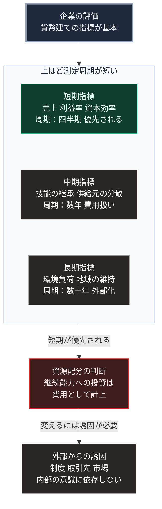

### 序論：本章が扱う範囲

本章は、企業という組織が今後どのような基準で評価されるかを検討します。

現在、企業の主要な評価指標は、売上高、利益率、そして資本効率です。第Ⅰ部B-2で整理したとおり、これらはいずれも貨幣建ての指標であり、比較不能なものを比較可能にする変換装置を経由しています。

本章では、この評価基準が変化するかどうかを検討します。あわせて、変化する場合の方向を論じます。

### 1. 現行の評価基準が成立する条件

貨幣建ての指標が有効な評価基準として機能するには、条件があります。

第一に、企業が用いる投入と、生み出す産出の双方が、価格を通じて評価されていることです。

第二に、評価の対象となる期間において、事業環境が継続することです。

第三に、価格に反映されない費用と便益が、支配的でないことです。

第Ⅰ部B-3で整理したとおり、価格機構は、貨幣建てに変換できない情報を構造的に無視します。この無視が許容されるのは、無視される部分が小さい場合に限られます。

### 2. 条件の変化に関する推論

前節の3条件は、第Ⅱ部で確認した現状において、次のような圧力を受けています。

**条件2に対する圧力**

第Ⅱ部Bで整理したとおり、供給基盤を攻撃対象とし、輸送路を制約する事例が観測されています。

この場合、事業環境の継続という前提が確実ではなくなります。継続を前提とした最適化、すなわち在庫の最小化や供給元の集約は、平時の効率を高める一方、途絶時の脆弱性を高めます。

**条件3に対する圧力**

環境負荷、地域の維持、そして技能の継承は、いずれも価格に十分に反映されにくい項目です。

第Ⅲ部-4で述べたとおり、生成AIの導入が技能の習得過程に影響する場合、企業にとって短期的には費用の削減となる一方、中期的には自らの供給能力を損なう可能性があります。この時間差が、価格に反映されにくい構造を作ります。

### 3. 評価基準の変化に関する推論

以上から、次の推論が導かれます。

**推論1：継続能力が評価項目として比重を増す可能性があります**

売上と利益は、過去および現在の成果を示します。継続能力は、環境が変化した場合に事業を維持できるかを示します。

両者は独立ではありませんが、同一でもありません。在庫を最小化し供給元を集約した企業は、平時の利益率が高くなる一方、途絶時の継続能力は低くなります。

**推論2：評価は貨幣建ての指標を離れるのではなく、指標が追加される形になります**

第Ⅰ部B-3で整理したとおり、貨幣という共通単位を代替する仕組みは、現時点で存在しません。したがって、貨幣建ての評価が放棄されることは考えにくいと言えます。

生じうるのは、貨幣建ての指標に、継続能力に関する指標が追加されることです。金融庁は2023年1月に企業内容等の開示に関する内閣府令を改正し、法定の開示書類にサステナビリティ情報の記載欄を新設しました [ [ 329 ] ](https://www.fsa.go.jp/news/r4/sonota/20230131/20230131.html) 。同記載欄では、ガバナンスとリスク管理の開示が必須とされています。継続能力に関する情報は、この経路で開示の対象に含まれつつあります。

**推論3：時間軸の異なる指標の併存が課題となります**

売上と利益は、四半期または年次で測定されます。継続能力は、数年から数十年の時間軸で意味を持ちます。

この時間軸の差が、評価の実務における課題となります。短期の指標が優先される場合、継続能力への投資は費用としてのみ計上されます。

### 4. 事業として成立させる条件

前章で述べたとおり、集約型インフラが維持されない区域において、供給の共同維持が必要となります。

この維持を、住民の自発的な労力のみに依存させることには限界があります。持続には、事業として成立する設計が必要です。

事業として成立させる条件は、次の2点です。

第一に、平時において対価を得られること。有事にのみ機能する設備は、投資の回収経路を持ちません。

第二に、有事における機能が、平時の機能から自然に導かれること。切り替えに特別な操作を要する仕組みは、実際の有事において機能しません。

この2条件は、第Ⅴ部で扱う具体的な設計の要件となります。

### 🗺️ 図：評価指標の時間軸

3つの指標を測定周期の短い順に上から並べ、資源配分の判断への作用と、それを変える誘因を示します。

#### 図の読み方

上段の箱が企業の評価です。そこから矢印が中段の枠へ入り、枠の中では3つの指標が測定周期の短い順で縦に並びます。各箱の3行目には周期と、資源配分で受ける扱いを記しています。枠から下段へは矢印が1本に集約され、資源配分の判断へ至ります。最下段は、その判断を変える誘因です。

この図が示すのは、評価指標の問題が「何を測るか」ではなく「どの周期で測るか」であるという点です。

枠内の3つの指標は、いずれも重要性が認識されています。問題は、測定周期の差により、資源配分の判断で最上段の短期指標が優先されることです。

この構造は、企業の意思決定者の資質の問題ではありません。四半期ごとに評価される立場において、数十年の時間軸の指標へ資源を配分することは、その立場を危うくします。誘因の構造がそうなっています。

第Ⅰ部B-5で整理した計画経済の分析が、ここで再び有効です。そこで観測された不具合は、指導者の資質ではなく誘因の構造に起因していました。同じ論理が、ここにも適用されます。

したがって、評価基準を変えるには、指標を追加するだけでは不十分です。追加された指標が、実際の資源配分の判断に反映される誘因が必要になります。

最下段の箱に記したとおり、その誘因を作る方法は3つあります。制度による義務づけ、取引先や資金提供者による要求、そして市場における評価です。いずれも外部からの作用であり、企業内部の意識の変化に依存しません。

---

### 本章の位置づけ

1.  **本章が主張しないこと**

    本章は、利益の追求が誤りであるとは主張しません。第Ⅰ部B-2およびB-4で整理したとおり、貨幣建ての評価は、比較不能なものを比較可能にする有効な仕組みです。

    主張するのは、その仕組みが構造的に無視する領域が存在し、その領域が事業の継続能力に直結する場合があるという点です。

2.  **本章の主要な論点**

    最も重要な論点は、測定周期の差です。この差が存在する限り、意識の変革や理念の共有によって配分が変わることは期待しにくいと言えます。

3.  **次章への接続**

    次章では、個人が何を求められるようになるかを扱います。本章で述べた誘因の構造は、個人の職業選択と技能形成にも作用します。
