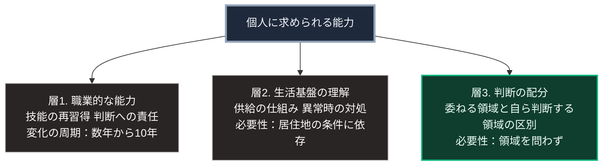

### 序論：本章が扱う範囲

本章は、個人という単位が今後どのような能力と役割を求められるかを検討します。

本章の記述は推論です。前提は、第Ⅲ部で提示した3つのシナリオに共通する部分、すなわち人口の年齢構成の変化と、生成AIの普及です。

なお本章は、特定の職業を推奨しません。第Ⅲ部-1で述べたとおり、職能の構成は階層3または階層4に属し、個別の予測は困難です。本章が扱うのは、シナリオを横断して共通する要請です。

### 1. 現在の前提が変化する部分

現在、個人の職業生活は、次の前提のもとで設計されています。

第一に、若年期に技能を習得し、その技能を職業生活を通じて用いるという前提です。

第二に、生活基盤の供給は外部から提供され、その内容と方式を個人が意識する必要はないという前提です。

第三に、専門的な判断は専門職に委ね、個人はその結果を受け取るという前提です。

第Ⅱ部および第Ⅲ部で確認した変化は、これら3つの前提に作用します。

### 2. 技能に関する推論

**推論1：技能の陳腐化と再習得の周期が短くなります**

第Ⅰ部C-1で整理した4段階モデルによれば、技術の効果が職能の再編として現れるまでには15年から20年を要します。

複数の技術が並行して普及する場合、この周期が重なります。結果として、職業生活の期間中に複数回の再編が生じることになります。

**推論2：習得の過程そのものが変化します**

第Ⅲ部-5で述べたとおり、初級の作業が自動化された場合、その反復による技能習得の経路が失われます。

この場合、技能の習得は、業務の遂行を通じてではなく、意図的な訓練として設計される必要があります。

**推論3：判断の責任を引き受ける能力の比重が高まります**

自動化されにくいのは、判断の内容ではなく、判断の責任です。現行の法制度のもとでは、責任は機械に帰属させられません。

したがって求められるのは、生成された案を評価して採否を決め、その結果に責任を負う能力です。

### 3. 生活基盤に関する推論

**推論4：供給の仕組みに関する理解が必要となる場合があります**

第Ⅲ部-9で述べたとおり、集約型インフラの維持されない区域が生じます。その区域において、供給は個別方式または共同方式へ転換されます。

この場合、居住者は供給の仕組みについて一定の理解を持つ必要があります。これは、全員が技術者になるという意味ではありません。異常時に何が起きているかを把握し、適切な対処を選べる水準です。

**推論5：関係の維持が実利を持つようになります**

第Ⅳ部-2で述べたとおり、供給の共同維持には制度と関係が必要です。

現在、近隣との関係は主として選択の対象です。関係を持つかどうかは、各人の選好に委ねられています。この状態は、生活基盤が外部から確実に供給される前提のもとで成立しています。

前提が変化する区域において、関係の維持は実利を伴うようになります。

### 4. 判断に関する推論

**推論6：判断を委ねるか自ら行うかの選択が、頻繁に生じます**

第Ⅲ部-5で整理したとおり、生成AIの普及は、判断を委ねる選択肢を広範に提供します。

この選択は、意識的に行われるとは限りません。負荷の低い選択肢が自動的に選ばれる傾向があるためです。

したがって求められるのは、判断を委ねないことではありません。どの領域で委ね、どの領域で自ら判断するかを、意識的に区別する能力です。

### 🗺️ 図：求められる能力の3層

個人に求められる能力を、性質によって分けます。

#### 図の読み方

この3層のうち、最も基礎的なのは層3です。

層1と層2は、いずれも状況に依存します。職業や居住地によって、求められる内容が異なります。

層3は、状況に依存しません。どの職業においても、どの居住地においても、判断を委ねるか自ら行うかの選択は生じます。

そして、この選択は個人の意志のみでは制御しにくいものです。第Ⅲ部-5で整理したとおり、負荷の低い選択肢が選ばれる傾向を、意志のみに依存して持続的に克服することは困難です。

したがって、層3の能力を実際に発揮するには、環境の側の設計が必要になります。判断の根拠が提示される仕組み、情報源へ到達できる経路、そしてシステムの動作を変更できる余地です。

この点で、個人に求められる能力の議論は、環境の設計の議論と分離できません。個人の努力のみを求める議論は、負荷の非対称という条件を無視しています。

なお、本章の推論はいずれも、第Ⅲ部の3つのシナリオに共通します。シナリオによって異なるのは、これらの能力が求められる程度と、それを支える環境の整備状況です。

---

### 本章の位置づけ

1.  **本章が主張しないこと**

    本章は、個人が自立すべきであるとは主張しません。第Ⅰ部B-2で整理したとおり、分業と交換は豊かさの源泉であり、依存の解消それ自体は目的になりません。

    主張するのは、依存の対象と方式について、選択の余地を保持することの意味です。

2.  **本章の主要な論点**

    最も重要な論点は、層3に関するものです。判断を委ねるか自ら行うかの区別は、能力の問題であると同時に、環境の設計の問題です。

    個人にできることは、この区別を意識することです。環境にできることは、区別のための費用を下げることです。両者が揃って初めて、選択の余地が実質的なものになります。

3.  **第Ⅳ部の総括と次部への接続**

    第Ⅳ部では、国家、地域社会、企業、個人のそれぞれについて、期待される機能の変化を検討しました。

    4章に共通する論点があります。いずれの主体についても、変化の実現は意識ではなく設計に依存するという点です。

    第Ⅴ部では、この設計を具体的に扱います。既存の制度理論と実在する技術を接続し、局所的な供給と判断の主体性を確保する構成を提示します。
