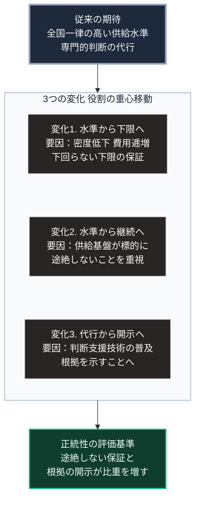

### 序論：本章が扱う範囲

第Ⅳ部では、[第Ⅲ部](future-method)で推論した3つのシナリオに共通して現れる要請を扱います。

本章の対象は、国家です。国民が国家に対して何を期待するのか、その内容がどう変化するかを検討します。

本章の記述は推論です。ただし、その推論は[第Ⅰ部](01_sovereign-state-os)で整理した歴史的事実と、[第Ⅱ部](japan-current-state)で確認した現状に基づきます。前提を明示したうえで論じます。

### 1. 国家が担ってきた機能の整理

[第Ⅰ部A-6](meiji-centralization)で整理したとおり、近代日本の中央集権化は4つの機能の集約として実施されました。人事、財政、武力、そして人材規格です。

この集約によって、国家は次の機能を担うようになりました。

第一に、安全の保証です。外部からの攻撃と、内部における暴力の双方に対する保護。

第二に、供給の保証です。エネルギー、水、食料、そして交通と通信の基盤を、全国において一定水準で提供すること。

第三に、生活の保証です。医療、教育、そして所得の保障を、制度として提供すること。

第四に、判断の代行です。専門的な知識を要する領域について、基準を定め、審査し、決定を下すこと。

### 2. 各機能が直面する制約

前節の4機能は、いずれも[第Ⅱ部](japan-current-state)で確認した制約に直面します。

**安全の保証**：[第Ⅱ部B-1](report-ukraine-war)および[第Ⅲ部-6](risk-war-probability)で整理したとおり、武力紛争が長期化した場合、攻撃対象は供給基盤へ拡大します。この場合、安全の保証と供給の保証は分離できません。

**供給の保証**：[第Ⅱ部A-2](japan-population-decline)で整理したとおり、人口密度の低下は、利用者1人あたりのインフラ維持費用を上昇させます。全国一律の供給水準を維持する費用が、逓増します。

**生活の保証**：社会保障の給付は年齢構成に連動し、負担は労働力人口に連動します。両者が逆方向に動くため、現行の給付水準の維持には制度上の調整が必要です。

**判断の代行**：[第Ⅲ部-4](risk-ai-and-dependency)で整理したとおり、専門的な判断を支援する技術が普及した場合、国家が判断を代行する必然性が低下します。同時に、代行の対象が民間の事業者へ移動する可能性があります。

### 3. 期待の変化に関する推論

前節の制約から、次の推論が導かれます。

**推論1：一律の供給水準という期待は、維持されにくくなります**

全国どこでも同じ水準の供給を受けられるという期待は、人口の増加と密度の上昇が続く局面において成立しました。密度が低下する局面において、この期待を維持する費用は逓増します。

したがって、期待の内容そのものが変化しうると考えられます。「どこでも同じ水準」から「どこでも一定の下限を下回らない」への変化です。

**推論2：保証の対象が、水準から継続性へ移る可能性があります**

現在の期待は、平時における供給水準に関するものです。この期待は、供給が途絶しないという前提のもとで成立します。

[第Ⅱ部B](report-ukraine-war)で確認したとおり、供給基盤が攻撃対象となる事例が観測されています。この認識が広がる場合、期待の内容は「高い水準」から「途絶しないこと」へ移る可能性があります。

**推論3：判断の代行に対する期待は、根拠の開示に移る可能性があります**

[第Ⅲ部-4](risk-ai-and-dependency)で述べたとおり、判断を支援する技術が普及すると、個人が直接に判断材料を得られるようになります。

この場合、国家に期待されるのは判断そのものではなく、判断の前提となる情報の正確性と、決定の根拠を開示する手続になります。

### 4. 正統性の供給という観点

[第Ⅰ部B-1](isms-overview)で整理したとおり、統治形態を区別する決定的な要素は、正統性の供給源です。

現在の日本において、正統性は選挙による同意と、手続の遵守によって供給されています。

前節の推論が妥当であれば、この供給に変化が生じます。

供給が途絶しない状態を保証できるかどうか。決定の根拠を開示できるかどうか。この2点が、正統性の評価基準として比重を増します。

[第Ⅰ部A-8](dynastic-cycle-and-corruption)の枠組みでは、正統性が争点化しない限り段階4には至らないと整理しました。この枠組みに従う限り、余力の逓減は縮退として処理されます。ただし、これは枠組み内の含意であり、正統性の供給が崩壊を防ぐ十分条件であると主張するものではありません。

### 🗺️ 図：期待される機能の重心の移動

従来の期待から3つの変化を経て、正統性の評価基準が移る構造を示します。

#### 図の読み方

上段の箱が従来の期待です。そこから矢印が中段の枠へ入り、枠の中に3つの変化が縦に並びます。各箱の2行目には変化を促す要因を記しています。枠から出る矢印は下段の1つの箱へ集約され、正統性の評価基準の変化を示します。

中段の3つの変化は、いずれも国家の役割が縮小することを意味しません。枠の見出しに記したとおり、役割の重心が移動することを意味します。

変化1について。下限の保証は、一律の水準の提供より容易とは限りません。人口密度の低い地域において下限を保証するには、集約型とは異なる方式が必要になるためです。

変化2について。継続性の保証は、平時の効率と対立します。冗長性の確保には費用がかかり、平時にはその費用が無駄として見えます。この対立をどう扱うかが、制度設計の課題となります。

変化3について。根拠の開示は、判断の代行より高い透明性を要求します。決定の過程が検証可能でなければ、開示は形式的なものになります。

下段の箱は、本文第4節に対応します。3つの変化が1つの箱へ収束する形は、いずれの変化も同じ帰結へ向かうことを示します。途絶しない供給の保証と、決定の根拠の開示です。この2点が、正統性の評価基準として比重を増します。

[第Ⅰ部A-6](meiji-centralization)で整理した4機能の集約に照らせば、これらの変化はいずれも集約の解体ではありません。集約された機能を、どの水準でどう提供するかの再定義です。

---

### 本章の位置づけ

1.  **本章の推論の限界**

    本章で述べたのは、期待の変化に関する推論です。実際に期待が変化するかどうかは、社会の側の認識に依存します。

    [第Ⅲ部-4](risk-ai-and-dependency)で整理した心理的な条件に照らせば、期待の変化は容易には生じません。現状維持が選ばれやすく、認知的な負荷の低い選択が優先されるためです。

    [第Ⅰ部C-6](05_cholera-outbreak-sewage)で記述したとおり、19世紀の下水道整備はコレラの流行という途絶の後に進みました。期待の変化も、この事例と同じく事後的に生じる場合が多いと考えられます。

2.  **本章から導かれる論点**

    以上から、次の論点が導かれます。期待の変化が事後的にしか生じないのであれば、事前の備えは誰が行うのか。

    この問いは、第Ⅳ部の残りの章、すなわち地域社会、企業、そして個人を扱う章で検討します。

3.  **次章への接続**

    次章では、地域社会と隣人関係が何を期待されるようになるかを扱います。本章で述べた「下限の保証」と「継続性の保証」は、国家のみによって実現されるとは限りません。その担い手の分布が、次章の主題です。
