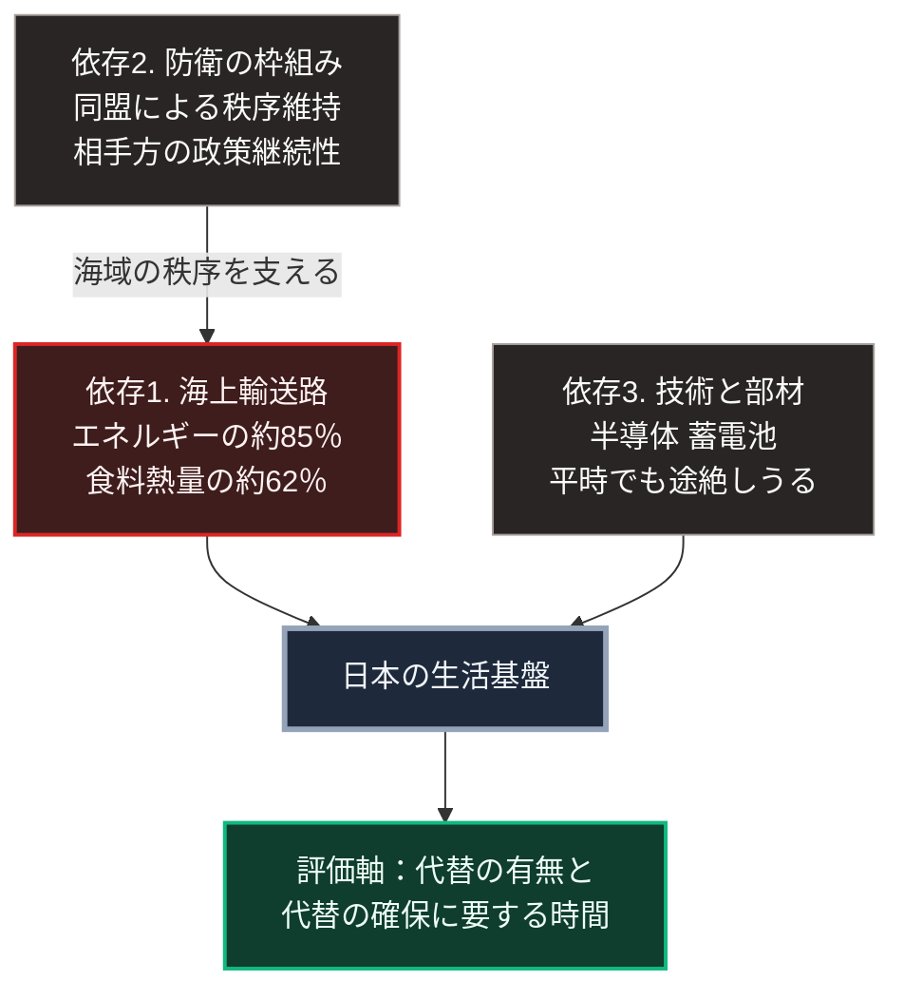

### 序論：本章が扱う範囲

本章は、日本が置かれている国際環境を、公的文書に基づいて整理します。扱うのは、安全保障上の枠組み、多国間の協力関係、そして経済的な相互依存の3つです。

本章の目的は、外交政策の是非を論じることではありません。日本の供給基盤と防衛体制が、どの外部条件に依存しているかを特定することです。この特定は、第Ⅲ部でシナリオを構築する際の前提となります。

### 1. 安全保障上の基本枠組み

日本の安全保障政策は、2022年12月に閣議決定された3つの文書によって規定されています。国家安全保障戦略、国家防衛戦略、そして防衛力整備計画です [ [ 130 ] ](https://www.cas.go.jp/jp/siryou/221216anzenhoshou.html) 。

防衛省は、日米安全保障体制に関する説明資料を公表しています [ [ 155 ] ](https://www.mod.go.jp/j/approach/anpo/index.html) 。同省が2026年8月4日に公表した令和8年版の防衛白書は、防衛装備の移転に関する三原則の改正と、前記3文書の前倒し改定を行う年の白書として位置づけられています [ [ 317 ] ](https://www.mod.go.jp/j/press/wp/wp2026/pdf/R08zenpen.pdf) 。

米国国務省は、2025年1月20日付の資料において、日米同盟を60年以上にわたるインド太平洋地域の平和と安定の礎と位置づけています [ [ 156 ] ](https://www.state.gov/u-s-security-cooperation-with-japan/) 。

外務省は、国際情勢の認識と日本の外交政策を、外交青書として毎年公表しています [ [ 157 ] ](https://www.mofa.go.jp/mofaj/gaiko/bluebook/) 。

### 2. 多国間の枠組み

防衛省は、各国との防衛協力および交流の状況を公表しています [ [ 158 ] ](https://www.mod.go.jp/j/approach/exchange/area/index.html) 。

近年の枠組みには、次のものが含まれます。日本、アメリカ、オーストラリア、インドによる協議の枠組み。日本、アメリカ、韓国による協議。そして日本と欧州各国との個別の協力枠組みです。

これらの枠組みは、いずれも条約による同盟ではなく、協議と協力を基礎とするものです。したがって、参加国の政権交代による方針変更の影響を受けやすい構造にあります。

### 3. 経済的な相互依存

日本の経済活動は、輸入と輸出の双方において特定の相手国への集中を伴います。

エネルギーについては、第Ⅱ部A-1およびB-2で示したとおり、自給率が15.3%であり、輸入の相当部分が特定の海上経路を通過します。

食料については、供給熱量ベースの自給率が38%です。

貿易の相手国については、財務省の貿易統計が示しています。2025年の輸出総額は110兆4,005億円、輸入総額は113兆3,301億円でした。相手国別では、輸出はアメリカが20兆3,744億円、中国が18兆7,780億円です。輸入は中国が26兆6,999億円、アメリカが12兆9,102億円、中東が11兆5,398億円です [ [ 318 ] ](https://www.customs.go.jp/toukei/shinbun/trade-st/2025/2025_117.pdf) 。総額に対する比率を算出すると、輸出の上位2か国で約36%、輸入の上位2か国で約35%を占めます。

これらの数値が意味するのは、日本の生活基盤が、海上輸送路の維持と貿易相手国との関係の安定という2つの外部条件に依存しているという状態です。

### 4. 経済安全保障に関する制度

日本政府は、重要物資の供給確保と基幹インフラの安全確保に関する制度を整備しています。根拠法は、経済施策を一体的に講ずることによる安全保障の確保の推進に関する法律、通称は経済安全保障推進法です。同法は令和4年法律第43号として2022年5月11日に成立し、同月18日に公布されました [ [ 319 ] ](https://www.cao.go.jp/keizai_anzen_hosho/suishinhou/suishinhou.html) 。

同法に基づき、政府は特定重要物資を政令で指定しています。2022年12月に半導体、蓄電池、天然ガス、重要鉱物など11物資が指定され、2024年2月に先端電子部品が追加されました。2025年12月には、人工呼吸器、無人航空機、人工衛星、ロケットの部品が追加されています [ [ 400 ] ](https://www.cao.go.jp/keizai_anzen_hosho/suishinhou/supply_chain/supply_chain.html) 。この制度は、供給網の脆弱性を特定し、代替の確保や備蓄を支援する枠組みを含みます。

経済産業省は、半導体を含む重要産業の政策を公表しています [ [ 9 ] ](https://www.meti.go.jp/policy/mono_info_service/joho/semiconductor/) 。

### 🗺️ 図：日本の外部依存の構造

日本の生活基盤が、どの外部条件に依存しているかを整理します。

#### 図の読み方

この図は、左右2列の依存が中段の生活基盤へ集まり、下段の評価軸へ下りる形をしています。左列は依存2から依存1へ縦につながる2段、右列は依存3の1段です。列の形の違いが、依存の性質の違いを表します。

左列の2段は、直接結びついています。海上輸送路の安全は、その海域における秩序維持によって支えられています。この秩序維持の相当部分を、同盟関係が担ってきました。したがって、上段の依存2が変化すれば、下段の依存1の前提も変化します。

右列の依存3は、性質が異なります。これは、平時においても供給の途絶が生じうる依存です。輸出規制、事故、自然災害、あるいは相手国の産業政策の変更によって影響を受けます。

第Ⅰ部A-8で整理した崩壊の構造に照らすと、これらは外部衝撃の入力経路にあたります。前章までに整理した内部条件、すなわち人口動態と財政と、この外部依存とが同時に作用したときに何が起こるか。これが第Ⅲ部の主題です。

本書は、この依存が直ちに危機を意味するとは述べません。依存それ自体は、分業と交換の帰結であり、第Ⅰ部B-2で述べたとおり、豊かさの源泉でもあります。

下段の評価軸が示すとおり、問うべきは依存の有無ではなく、依存先が途絶した場合の代替の有無と、代替の確保に要する時間です。この評価軸を、第Ⅲ部および第Ⅴ部で用います。

---

### 現代社会構造への射程と本質（本章のまとめ）

本セクションは、著者による解釈です。前節までの記述とは区別して読んでください。

1.  **現在の構造がどこから来たか**

    現在の日本の外部依存は、戦後の国際秩序を前提として最適化された結果です。海上輸送の安全が保証され、貿易相手が安定し、通貨の交換が円滑であるという条件のもとで、国内の生産は比較優位に従って特化しました。

    この特化は経済的に合理的な選択でした。同時に、特化の程度が高いほど、前提条件の変化に対する感度も高くなります。

2.  **本質**

    本章から抽出できるのは、次の点です。日本の脆弱性は、依存の量ではなく、代替の欠如にあります。

    エネルギー自給率が15.3%であること自体は、他の資源小国にも共通します。問題は、輸入経路が限定された要衝を通ることと、国内の受入設備が集約されていることです。

3.  **次章以降の位置づけ**

    第Ⅱ部の残りでは、技術と情報の環境、そして国内インフラの現状を扱います。

    第Ⅲ部では、本章で特定した3つの依存について、それぞれが制約された場合の影響を評価し、3つのシナリオへ統合します。
