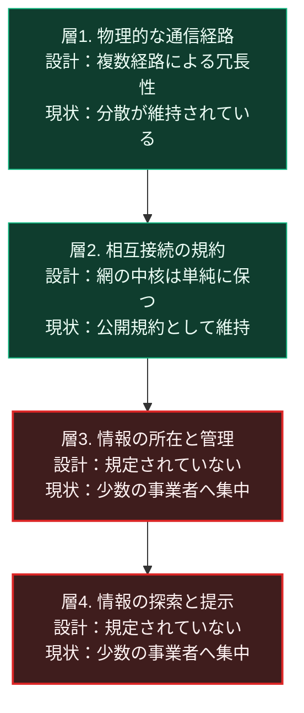

### 序論：本章が扱う範囲

本章は、インターネットの設計思想がどのような要求から生まれ、実装され、その後どのような構造変化を経たかを記述します。

この章が本書において重要なのは、次の理由によります。インターネットの基盤となった規約は、中央の障害に耐えるというバランの構想と、異種の網を相互接続するという要求とを継承しています。しかし現在の情報流通は、少数の事業者に集中しています。設計思想と実際の構造とがなぜ乖離したのか。この経緯は、分散設計一般が直面する条件を示しています。

本文は事実の記述に限定します。解釈は章末で扱います。

### 1. 分散通信網の構想

1964年、ランド研究所の技術者ポール・バランは、通信網の構成に関する報告書を公表しました [ [ 119 ] ](https://www.rand.org/pubs/research_memoranda/RM3420.html) 。

この報告書が扱った課題は、通信網の一部が破壊された場合にも通信を維持する方式です。

バランは、通信網の構成を3つの類型に整理しました。中央集中型、複数の拠点を階層的に結ぶ分権型、そして各ノードが多重に接続された分散型の網状構造です。彼の分析によれば、中央集中型の網は、中央の障害によって全体が機能を停止します。一方、各ノードが複数の経路で接続された網状構造は、相当数のノードが失われても通信経路を維持します。

同報告書はまた、通信内容を小さな単位に分割して個別に送信し、受信側で再構成する方式を提案しました。この方式は、各単位が異なる経路を通ることを可能にします。

### 2. 相互接続のための規約

1969年、複数の研究機関を接続する実験網が稼働を開始しました。同年、この網に関する技術文書の第1号が公表されています [ [ 120 ] ](https://www.rfc-editor.org/rfc/rfc1.html) 。この文書系列は、以後の技術規約の公開形式として定着しました。

1974年、ヴィントン・サーフとロバート・カーンは、異なる方式の通信網を相互に接続する規約を提案しました。この提案の要点は、各網の内部方式を統一せず、網と網の境界で変換する設計にあります。

この設計は、後に2つの層へ分離されました。1981年に規定された下位の規約は、データの単位を宛先へ届ける機能を担います [ [ 121 ] ](https://www.rfc-editor.org/rfc/rfc791) 。同年に規定された上位の規約は、順序の保証と再送を担います [ [ 122 ] ](https://www.rfc-editor.org/rfc/rfc793) 。

この分離が持つ性質は、網の中核が単純に保たれる点にあります。信頼性の確保は、通信する両端の機器が担当します。網は、単位を運ぶことのみを担います。

### 3. 文書の相互参照という応用

1989年、欧州原子核研究機構の研究者ティム・バーナーズ＝リーは、機関内の文書を相互に参照する仕組みを提案しました [ [ 123 ] ](https://info.cern.ch/Proposal.html) 。

この提案は、文書に一意の所在表示を与え、文書内から他の文書を直接参照できるようにするものです。1991年、この仕組みは機関外へ公開されました。

### 4. 商用化と利用者の拡大

1990年代を通じて、この網は研究用途から商用および一般用途へ拡大しました。

利用者数の増加に伴い、情報の所在を探索する需要が生じます。この需要に応える事業として、検索サービスが成立しました。

同時に、情報の掲載場所として、個別の事業者による運営の場が広く用いられるようになります。この形態では、利用者は自ら情報の所在を管理せず、事業者の設備上に情報を置きます。

### 5. 集中の再形成

2000年代以降、情報流通は少数の事業者へ集中する傾向を示しました。

この集中には、複数の要因が指摘されています。第一に、利用者が多いほど当該サービスの価値が高まるという性質です。第二に、利用データの蓄積が推薦の精度を高め、それがさらに利用を集めるという循環です。第三に、大規模な設備投資に伴う費用の逓減です。

構造上、この集中は網の設計と矛盾しません。バランの設計が保証したのは、通信経路の冗長性です。通信の内容がどこに蓄積され、誰がそれを管理するかについては、規定していません。

### 🗺️ 図：設計の階層と、集中が生じた層

分散設計が維持された層と、集中が形成された層を区別します。

#### 図の読み方

この図が示しているのは、分散と集中が異なる層で同時に成立しているという構造です。

層1と層2は、設計どおり分散が維持されています。物理的な通信経路は複数存在し、規約は公開され、誰でも実装できます。

層3と層4において、集中が形成されました。ここで重要なのは、この集中が層1と層2の設計に違反して生じたのではないという点です。設計は、これらの層について何も規定していませんでした。

この構造から抽出できるのは、次の一般則です。分散設計は、それが明示的に規定した層においてのみ分散を保証します。規定されなかった層では、経済的な誘因に従って構造が決まります。

そして、利用者にとっての実質的な依存は、層3と層4に存在します。通信経路が冗長であっても、情報の所在を管理する事業者が停止すれば、利用者はその情報へ到達できません。

この論点は、本書が第Ⅴ部で扱う自律分散システムの設計に直結します。ある層で分散を実現しても、規定しなかった層で集中が再形成されるならば、全体としての耐性は向上しません。

---

### 現代社会構造への射程と本質（本章のまとめ）

本セクションは、著者による解釈です。前節までの記述とは区別して読んでください。

1.  **現代社会構造の原点**

    現代の情報インフラが持つ二重の性格は、この経緯に由来します。通信経路の冗長性は、単一の障害では止まらないことを意味します。ただし、国境の中継点と事業者への命令による遮断は、複数の国で実施されています。一方で、情報の所在は集中しており、少数の事業者の判断が広範な影響を持ちます。

    この二重性は、しばしば混同されます。「インターネットは分散しているから止まらない」という理解は、層1と層2については正しく、層3と層4については正しくありません。

2.  **歴史的事実の本質**

    本章から抽出できるのは、分散設計の保証範囲に関する一般則です。設計が規定しない層では、規模の経済と利用者集積の効果が働き、集中が形成されます。

    この機序は、インターネットに固有のものではありません。第Ⅰ部C-1で整理した汎用技術の性質、すなわち補完的な革新の誘発という性質が、集中を生む方向にも作用します。

3.  **現代社会の現状と課題**

    第Ⅱ部では、この集中が現在どの程度進行しているかを扱います。第Ⅲ部では、集中した層に障害が生じた場合の影響を、シナリオとして評価します。

    第Ⅴ部では、層3と層4における分散をどう設計しうるかを検討します。そこでの要件は、通信経路の冗長性ではなく、情報の所在と探索を利用者側に保持する仕組みです。
