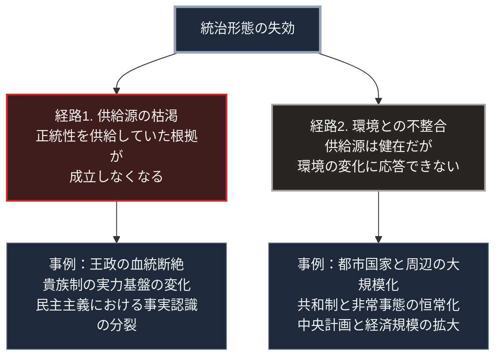

### 序論：本章が扱う範囲

第Ⅰ部Bでは、統治形態を正統性の供給源によって分類し、それぞれの成立と運用を記述してきました。本章では、それらを横断して比較します。

比較の目的は、優劣の判定ではありません。各形態がどの条件下で機能を停止したか、そして複数の形態に共通する失効の様式が存在するかを確認することです。

### 1. 比較の軸

本章では、次の4つの軸で比較します。

第一の軸は、正統性の供給源です。従うべき理由をどこから調達しているか。

第二の軸は、決定の速度です。方針の転換に要する時間。

第三の軸は、誤りの是正経路です。決定が誤っていた場合に、それを修正する手続が制度内に存在するか。

第四の軸は、失効条件です。どのような事象が発生したとき、その形態が機能を停止するか。

### 2. 各形態の整理

以下の整理は、第Ⅰ部B-1からB-6の記述を著者が4軸に要約したものです。失効条件の一部、とりわけ資本主義と民主主義の項目は、歴史的に観測された事象ではなく本書の仮説を含みます。

**王政**：正統性は継承規則から供給されます。決定は速く、是正経路は制度内に存在しません。失効条件は、血統の断絶、または継承規則そのものへの疑義の発生です。

**貴族制**：正統性は身分と土地の保有から供給されます。決定は遅く、是正経路は有力者間の力関係の変化として働きます。失効条件は、有力者の実力基盤が変化することです。ヨーロッパにおいては、火器の普及と常備軍の成立が、騎士による軍事的な優位を失効させました。

**共和制**：正統性は権力分割の手続から供給されます。決定は遅く、是正経路は任期と選出の仕組みに組み込まれています。失効条件は、非常事態が恒常化し、権限集中が常態となることです。

**都市国家**：正統性は構成員の直接参加から供給されます。決定は比較的速く、是正経路は参加者の合議として働きます。失効条件は、周辺により大規模な統治単位が成立することです。

**資本主義**：これは統治形態ではなく資源配分の方式ですが、比較の対象に含めます。配分の正統性は、価格機構による情報処理の結果として供給されます。調整は速く、是正経路は価格の変動として働きます。失効条件は、価格に反映されない費用や便益が支配的になることです。

**民主主義**：正統性は構成員の同意から供給され、周期的に更新されます。決定は遅く、是正経路は選挙として制度化されています。失効条件は、討議の前提となる事実認識が共有されなくなることです。

**中央計画**：正統性は計画の合理性から供給されます。決定は形式上速いものの、情報収集の遅延により実質的には遅くなります。是正経路は制度内に限定されます。失効条件は、局所知識の欠落と誘因の歪みが累積することです。

### 🗺️ 図：失効に至る2つの経路

各形態の失効条件を、2種類に分類します。

#### 図の読み方

この図は、失効を2つの経路に分けています。

経路1は、正統性の供給源そのものが成立しなくなる場合です。王政において血統が断絶すれば、継承規則は正統性を供給できません。貴族制において軍事的な優位が失われれば、身分に基づく統治権の根拠が弱まります。

民主主義における事実認識の分裂は、この経路に該当します。同意という供給源は、参加者が同じ事実を前提に判断していることを条件とします。この条件が崩れると、同意の集計結果が正統性を供給しなくなります。

経路2は、供給源は健在でありながら、環境の変化に応答できなくなる場合です。都市国家の体制は、内部的には正常に機能していました。しかし周辺に大規模な統治単位が成立したことで、防衛という要請に応えられなくなりました。

中央計画の失効も、この経路です。計画の合理性という正統性は維持されていましたが、経済規模の拡大に対して情報処理が追いつきませんでした。

重要なのは、この2つの経路が独立ではないという点です。第Ⅰ部A-6で整理したとおり、環境との不整合（経路2）が長期化すると、正統性への疑義（経路1）を誘発します。統治の失敗が繰り返されれば、その統治の根拠そのものが問われるためです。

したがって、失効の予兆として観測すべきは、次の順序です。まず、環境変化への応答遅延が観測されます。次に、その遅延が繰り返されます。そして、遅延の原因が個別の判断ミスではなく制度そのものにあるという認識が広がります。この第三段階に達したとき、経路1への転化が始まります。

---

### 現代社会構造への射程と本質（本章のまとめ）

本セクションは、著者による解釈です。前節までの記述とは区別して読んでください。

1.  **現代社会構造の原点**

    現代の主要国は、複数の形態を重ねて運用しています。資源配分には価格機構を用い、統治の正統性は選挙による同意から調達し、日常の決定は手続きの遵守によって正当化します。

    この重層構造は、単一形態の失効条件を分散させる効果を持ちます。1つの層が機能を落としても、他の層が補完します。

2.  **歴史的事実の本質**

    本章の比較から抽出できるのは、次の一般則です。統治形態は、内部の劣化単独で崩壊するのではなく、余力を失った状態に環境変化が重なったときに崩壊します。

    このことは、統治形態の評価が環境依存であることを意味します。ある環境で最適だった形態が、環境の変化によって不適合になります。そして、形態の変更には時間がかかるため、不適合の期間が必ず発生します。

3.  **現代社会の現状と課題**

    現在の環境変化として、本書が第Ⅱ部で扱うのは次の4点です。技術的断絶、国際秩序の再編、物理環境の変化、そして人口動態の反転です。

    第Ⅲ部では、これらの変化に対して現行の重層構造がどの程度の応答遅延を示すかを検討します。本章で整理した失効の順序に照らせば、観測すべきは遅延の有無ではなく、遅延の反復とその認識の広がりです。
