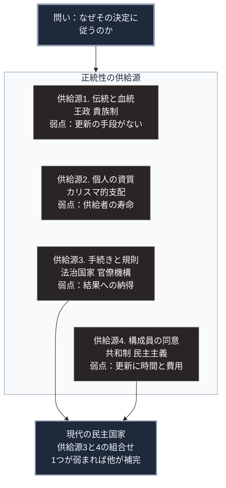

### 序論：本章が扱う範囲

本章は、統治の形態を分類するための枠組みを整理します。以降の各章では、それぞれの形態について、成立の経緯、機能した条件、そして機能しなくなった条件を個別に記述します。

本文で扱うのは、政治思想史において確立された分類と、その提唱者が実際に何を述べたかという事実です。各記述には原典への直接リンクを付します。

### 1. なぜ統治形態を「OS」として扱うのか

本書は、統治形態を計算機の基本ソフトになぞらえて記述します。この比喩を採る理由は、次の3点を同時に扱う必要があるためです。

第一に、資源の配分規則です。誰が何をどれだけ受け取るかを決定する手続き。

第二に、実行権限の管理です。誰が決定を下し、誰がそれに従う義務を負うかの規定。

第三に、正統性の供給源です。なぜその決定に従わなければならないのかという問いへの回答。

このうち第三の項目が、統治形態を区別する決定的な要素です。資源配分と権限管理の具体的な設計は、同じ正統性の供給源のもとでも多様でありえます。しかし、正統性の供給源が変わるとき、統治形態そのものが別種のものになります。

### 2. 古典的な分類 ―― 支配者の数による三分法

統治形態を支配者の数で分類する枠組みは、古代ギリシアに遡ります。アリストテレスは『政治学』において、統治形態を支配者の数と、統治が誰の利益のために行われるかという2つの軸で分類しました [ [ 71 ] ](https://www.gutenberg.org/ebooks/6762) 。

この分類では、1人による統治、少数による統治、多数による統治のそれぞれについて、公共の利益に資する形態と、支配者の利益に資する形態とが区別されます。

前者はそれぞれ王政、貴族制、共同体的な統治と呼ばれます。後者は僭主制、寡頭制、衆愚制と呼ばれます。

この枠組みが提示したのは、支配者の数それ自体は統治の良否を決定しないという論点です。同じ数の支配者による統治が、目的の違いによって異なる評価を受けます。

### 3. 正統性の供給源による分類

社会学者マックス・ウェーバーは、支配の正統性について、3つの類型を提示しました [ [ 72 ] ](https://plato.stanford.edu/entries/weber/) 。

第一の類型は、伝統に基づく正統性です。「以前からそうであった」という事実が、従うべき理由として機能します。世襲王政がこれに該当します。

第二の類型は、指導者個人の資質に基づく正統性です。ウェーバーはこれをカリスマ的支配と呼びました。この類型は、指導者の死去または資質の喪失によって直ちに不安定化します。

第三の類型は、成文化された規則に基づく正統性です。決定が規則に沿って行われたという手続的な事実が、従うべき理由となります。近代の官僚機構と法治国家がこれに該当します。

ウェーバーの枠組みが示すのは、カリスマ的支配が持続するためには、伝統的または規則的な正統性へ転換する必要があるという点です。この転換を、ウェーバーは「カリスマの日常化」と呼びました。

### 4. 統治権力の由来に関する近代の議論

17世紀から18世紀のヨーロッパでは、統治権力の由来を個人の同意に求める議論が展開されました。

トマス・ホッブズは、統治権力が存在しない状態を仮定し、そこでの生活がどのようなものになるかを論じました [ [ 73 ] ](https://www.gutenberg.org/ebooks/3207) 。彼の結論は、統治権力への服従は、その状態を回避するための合理的な選択である、というものです。

ジョン・ロックは、統治権力の目的を、生命、自由、および財産の保全に限定しました [ [ 74 ] ](https://www.gutenberg.org/ebooks/7370) 。この限定から、統治権力がその目的に反した場合の抵抗権が導かれます。

ジャン＝ジャック・ルソーは、統治の正統性を、構成員全体の意思に求めました [ [ 75 ] ](https://www.gutenberg.org/ebooks/46333) 。彼が用いた「一般意志」という概念は、個々の構成員の利益の総和とは区別されます。

これら3者の議論に共通するのは、統治権力の正統性を、超越的な根拠ではなく、被統治者の側に求めたという点です。この転換が、近代における統治形態の議論の基礎を形成しました。

### 🗺️ 図：正統性の供給源による統治形態の配置

各統治形態が、どこから従うべき理由を調達しているかを示します。

#### 図の読み方

この図は、最上段の問いへの4種類の回答を、中段の枠の中で縦に並べたものです。枠内の4つの箱は順序を持たない並列の分類で、上下の位置に優劣の意味はありません。

供給源1から3はウェーバーの類型に対応します。供給源4は、節4で述べた社会契約論の系譜から、本書が独立の区分として追加したものです。

各箱の3行目には、その供給源が枯渇する条件を「弱点」として記しました。この配置を採る理由は、[第Ⅰ部A](01_sovereign-state-os)で記述したオスマン帝国と江戸幕府の崩壊が、いずれも正統性の争点化を通じて発生したためです。

供給源1は供給が安定している一方、更新の手段を持ちません。血統の断絶や伝統への疑義が生じた場合、代替の供給源がありません。供給源2は供給の強度が最も高い一方、供給者の寿命に依存します。

供給源3は形式化されているため安定します。ただし、手続が遵守されていても結果が受け入れられない場合、供給が機能しません。供給源4は周期的な更新が可能ですが、更新には時間と費用がかかります。

枠の下の箱には、供給源3と供給源4から矢印が伸びています。現実の統治機構は複数の供給源を組み合わせ、1つが弱まった際に他が補完する構造を持ちます。現代の民主国家は、この2つの組み合わせで運用されています。

供給源4の更新周期と外部環境の変化速度との関係が、[第Ⅲ部](future-method)の主要な論点の1つとなります。

---

### 現代社会構造への射程と本質（本章のまとめ）

本セクションは、著者による解釈です。前節までの記述とは区別して読んでください。

1.  **現代社会構造の原点**

    現代の民主国家は、供給源3（手続き）と供給源4（同意）を組み合わせて運用されています。選挙によって同意を周期的に更新し、その間の決定は手続きの遵守によって正当化されます。

    この二重構造は、それぞれの弱点を補い合うように設計されています。同意の更新には時間がかかるため、その間は手続きが正統性を供給します。手続きが結果への納得を生まない場合は、次の選挙で同意が更新されます。

2.  **歴史的事実の本質**

    政治思想史が繰り返し扱ってきたのは、統治の「良し悪し」ではなく、正統性の調達経路の設計です。アリストテレスの分類も、ウェーバーの類型論も、社会契約に関する議論も、いずれもこの問いに対する異なる角度からの回答でした。

    ここから導かれるのは、統治形態を評価する基準は、効率でも公正さでもないという点です。評価すべきは、その形態が、正統性の供給が途絶えた場合にどう振る舞うかという応答特性です。

3.  **現代社会の現状と課題**

    現代において、この二重構造には2つの圧力が加わっています。

    1つは速度です。外部環境の変化速度が、同意の更新周期を上回る場合、更新された同意が現実に追いつきません。

    もう1つは、手続きの自動化です。行政の決定過程がアルゴリズムに委ねられる度合いが高まると、手続きの遵守という事実は保たれても、その手続きの内容を構成員が検証できなくなります。この論点は、[第Ⅱ部](japan-current-state)で扱います。
