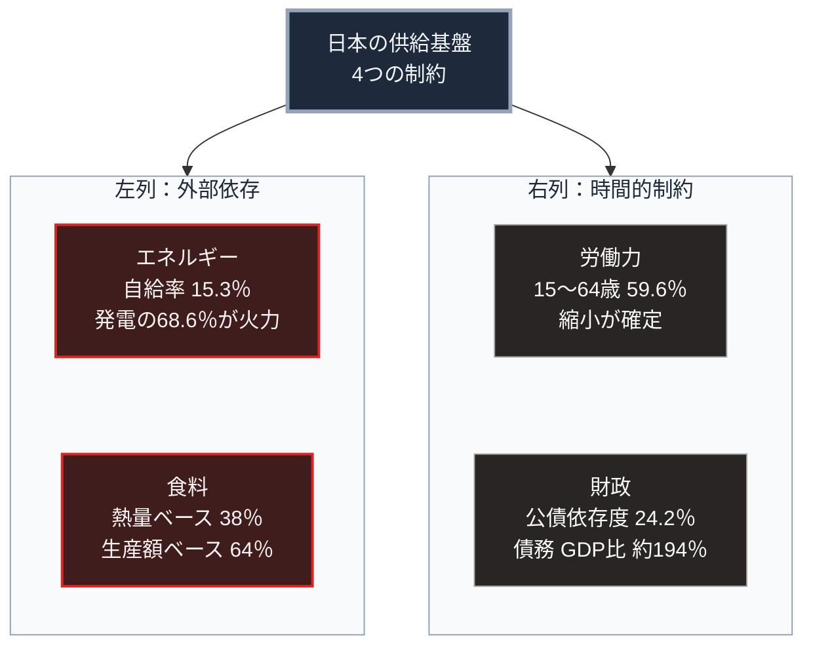

### 序論：本章が扱う範囲

第Ⅱ部では、砂時計のくびれにあたる「現在」を記述します。本章はその起点として、日本の現状を公的統計から整理します。

本章の記述は、すべて政府機関が公表している数値に基づきます。各数値には、公表元への直接リンクを付します。推計値については、その前提を明示します。

第Ⅰ部A-8で整理した崩壊の早期警戒指標は、人口と資源の比率、財政の健全性、制度の複雑性、そして正統性の4つでした。本章は、この4つの観測項目を構成に反映させています。

### 1. 統治機構の構成

日本の統治機構は、立法、行政、司法の三権分立を基本とします。国会は衆議院と参議院の二院で構成され、内閣は国会に対して連帯して責任を負います。

地方自治については、都道府県と市町村の二層制が採られています。総務省の公表によれば、市町村数は1,718です。内訳は市が792、町が743、村が183です [ [ 280 ] ](https://www.soumu.go.jp/kouiki/kouiki.html) 。

意思決定の周期は、衆議院議員の任期が4年、参議院議員の任期が6年です。この任期は日本国憲法の第45条と第46条に定められています [ [ 281 ] ](https://laws.e-gov.go.jp/law/321CONSTITUTION) 。ただし衆議院は解散が可能であり、実際の選挙間隔はこれより短くなる傾向があります。

### 2. 人口 ―― 確定した与件

総務省統計局の推計によれば、2024年10月1日現在の総人口は1億2,380万2千人です。同時点の自然増減は、89万人の減少でした [ [ 124 ] ](https://www.stat.go.jp/data/jinsui/2024np/index.html) 。

年齢構成については、65歳以上の人口が3,624万人であり、総人口に占める割合は29.3%です。15歳から64歳の層が占める割合は59.6%です [ [ 125 ] ](https://www8.cao.go.jp/kourei/whitepaper/w-2025/html/zenbun/s1_1_1.html) 。

将来の推計については、国が公式に用いる人口推計において、2070年の総人口が8,700万人、65歳以上の割合が38.7%と見込まれています [ [ 62 ] ](https://www.ipss.go.jp/pp-zenkoku/j/zenkoku2023/pp_zenkoku2023.asp) 。

この推計の性質について、2点を確認しておく必要があります。

第一に、2070年時点で50歳以上となる人々は、すでに全員が生まれています。したがって、その層の規模は出生率の変動によって変わりません。

第二に、推計には出生と死亡と国際移動に関する仮定が含まれます。仮定を変えれば結果は変わります。ただし、変化しうる範囲は、既に確定した年齢構成によって制約されます。

### 3. 財政

財務省の資料によれば、2026年度の一般会計歳出は122兆3,092億円です [ [ 127 ] ](https://www.mof.go.jp/policy/budget/fiscal_condition/related_data/202604.html) 。

歳出の内訳のうち、上位の項目は次のとおりです。社会保障関係費が39兆559億円で全体の31.9%。国債費が31兆2,758億円で25.6%。地方交付税交付金等が20兆8,778億円で17.1%。防衛関係費が8兆9,843億円で7.3%です [ [ 127 ] ](https://www.mof.go.jp/policy/budget/fiscal_condition/related_data/202604.html) 。

歳入については、租税および印紙収入が83兆7,350億円で全体の68.5%を占めます。公債金は29兆5,840億円であり、歳出に対する公債依存度は24.2%です [ [ 127 ] ](https://www.mof.go.jp/policy/budget/fiscal_condition/related_data/202604.html) 。

債務残高については、2026年度末の普通国債残高が1,145兆円に達する見込みです。国と地方を合わせた長期債務残高は1,344兆円であり、これは国内総生産の約194%に相当します [ [ 127 ] ](https://www.mof.go.jp/policy/budget/fiscal_condition/related_data/202604.html) 。

### 4. エネルギー供給

経済産業省が公表した2023年度の確報値によれば、エネルギー自給率は15.3%です。この水準は、2011年以降で最も高い値にあたります [ [ 128 ] ](https://www.meti.go.jp/press/2025/04/20250425004/20250425004.html) 。

発電電力量の構成は、再生可能エネルギーが22.9%、原子力が8.5%、火力が68.6%です。非化石電源の比率は31.4%であり、2011年以降で初めて30%を超えました [ [ 128 ] ](https://www.meti.go.jp/press/2025/04/20250425004/20250425004.html) 。

この構成が意味するのは、電力供給の約7割が輸入燃料に依存しているという状態です。

### 5. 食料供給

農林水産省の公表によれば、2024年度の食料自給率は次のとおりです。供給熱量ベースで38%、生産額ベースでは64%です [ [ 129 ] ](https://www.maff.go.jp/j/press/kanbo/anpo/251010.html) 。

供給熱量ベースの数値は、長期にわたり40%前後で推移しています [ [ 129 ] ](https://www.maff.go.jp/j/press/kanbo/anpo/251010.html) 。

### 6. 安全保障政策の枠組み

2022年12月16日、政府は3つの文書を閣議決定しました。国家安全保障戦略、国家防衛戦略、そして防衛力整備計画です [ [ 130 ] ](https://www.cas.go.jp/jp/siryou/221216anzenhoshou.html) 。

国家安全保障戦略は、日本を取り巻く安全保障環境について記述したうえで、防衛力の抜本的な強化、経済安全保障の推進、そして同盟国および同志国との連携強化を方針として掲げています。

### 7. 制度の複雑性と正統性の指標

第Ⅰ部A-8が挙げた残る2つの観測項目についても、公的な数値を示します。

制度の複雑性については、法令の総量を指標とします。政府の法令検索システムに登録されている現行の法律は2,101本です。政令は2,308本、府省令は4,098本です [ [ 282 ] ](https://laws.e-gov.go.jp/registdb/) 。この数値は2026年9月2日の閲覧時点のものです。

正統性については、選挙の投票率を指標とします。2026年2月8日の衆議院選挙における小選挙区の投票率は56.26%でした [ [ 283 ] ](https://www.soumu.go.jp/main_content/001061492.pdf) 。2025年7月20日の参議院選挙における選挙区の投票率は58.51%でした [ [ 284 ] ](https://www.soumu.go.jp/main_content/001021472.pdf) 。

なお、A-6が挙げたもう1つの正統性の指標である制度への信頼度の調査結果は、調査ごとに設問が異なるため、本章では扱いません。

### 🗺️ 図：4つの供給基盤と自給水準

生存に直結する4つの供給基盤を、依存の性質によって左右2列に分けて示します。

#### 図の読み方

この図は、上段の1つの枠から、下段の左右2列へ分かれる形をしています。左列は外部依存、右列は時間的制約です。列の違いが、制約の性質の違いを表します。

左列の2つは、海上輸送を経て国内に入る供給です。エネルギーの15.3%という数値は、国内で得られる量を示します。残る約85%は輸入です。したがって、この依存は海上輸送路の維持を前提とします。

食料の38%という数値は、供給熱量を基準としたものです。生産額ベースでは64%です。この差は、国内生産が熱量あたりの単価が高い品目に偏っていることを示します。また、熱量ベースの数値には、家畜の飼料を輸入に依存する分が反映されています。

右列の2つは、外部への依存ではなく、時間軸に沿った制約です。労働力人口の縮小は、既に生まれた世代の年齢構成から導かれます。債務残高は、将来の歳入に対する先取りとして機能します。

左列の依存は、輸送路と取引相手が維持される限り解消の必要がありません。右列の制約は、放置すれば必ず悪化します。この違いが、2列に分けた理由です。

第Ⅰ部A-8で整理した4つの観測項目に照らすと、次の対応関係が成立します。人口と資源の比率については、労働力人口の縮小と社会保障給付の増加という形で現れています。財政の健全性については、公債依存度24.2%と債務残高の対国内総生産比194%という数値が該当します。制度の複雑性については、現行の法律2,101本という法令の総量が該当します。正統性については、直近の国政選挙の投票率が56%から59%の水準にあるという事実が該当します。

これらが同時に進行している状態が、現在の日本です。ただし、この状態が直ちに機能不全を意味するわけではありません。第Ⅰ部A-8で述べたとおり、限界点の指標は水準そのものではなく、外部衝撃に対する応答特性の変化です。この点は、第Ⅲ部で扱います。

---

### 現代社会構造への射程と本質（本章のまとめ）

本セクションは、著者による解釈です。前節までの記述とは区別して読んでください。

1.  **現在の構造がどこから来たか**

    本章で示した数値の多くは、第Ⅰ部A-6で記述した明治期の制度設計に由来します。予測可能な貨幣収入を前提とした財政運営、全国一律の行政サービス、そして中央による基準設定です。

    これらの設計は、人口の増加と経済の拡大が続く局面において機能しました。歳入の自然増が、制度の拡張を支えたためです。人口が減少する局面において、同じ設計が同じように機能する保証はありません。

2.  **数値が示していること**

    4つの供給基盤のうち、エネルギーと食料は外部依存であり、労働力と財政は時間的制約です。この2種類の制約は、性質が異なります。

    外部依存は、輸送路と取引相手が維持される限り解消の必要がありません。時間的制約は、放置すれば必ず悪化します。

    したがって、優先度の判断において問われるのは、外部依存の前提がどの程度安定しているかです。この評価は、第Ⅱ部の後半で扱う国際環境の分析に依存します。

3.  **次章以降の位置づけ**

    次章では、人口動態をより詳細に扱います。その後、アメリカ、EU、中国について、同じ枠組みで現状を整理します。そのうえで、これらの国と地域の関係が、日本の外部依存の前提にどう作用するかを検討します。
