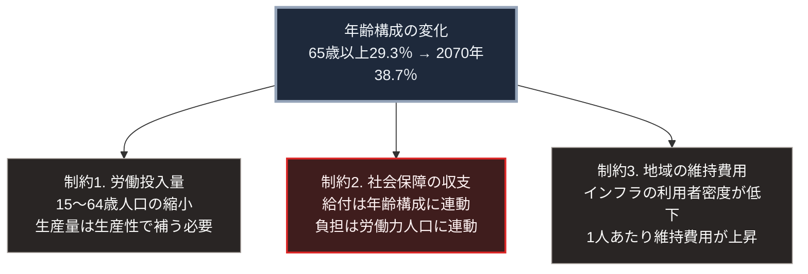

### 序論：本章が扱う範囲

本章は、日本の人口動態について、公表された統計と公式推計から現状を整理します。

人口動態を独立した章として扱う理由は、その予測精度にあります。経済成長率、技術の普及速度、国際情勢の推移は、いずれも大きな不確実性を伴います。これに対し、人口の年齢構成は、既に生まれた世代について確定しています。20年後に50歳となる人々は、すでに30歳です。

したがって人口動態は、第Ⅲ部で扱う諸シナリオのうち、最も分岐の少ない前提として機能します。

### 1. 出生と死亡の直近の実績

厚生労働省が公表した2025年の人口動態統計月報年計（概数）によれば、同年の実績は次のとおりです [ [ 131 ] ](https://www.mhlw.go.jp/toukei/saikin/hw/jinkou/geppo/nengai25/index.html) 。

出生数は671,236人です。前年の686,173人から14,937人の減少であり、減少率は2.2%です [ [ 131 ] ](https://www.mhlw.go.jp/toukei/saikin/hw/jinkou/geppo/nengai25/index.html) 。

死亡数は1,589,489人です。前年の1,605,378人から15,889人減少しています [ [ 131 ] ](https://www.mhlw.go.jp/toukei/saikin/hw/jinkou/geppo/nengai25/index.html) 。

自然増減は918,253人の減少です。前年の919,205人減とほぼ同水準です [ [ 131 ] ](https://www.mhlw.go.jp/toukei/saikin/hw/jinkou/geppo/nengai25/index.html) 。

合計特殊出生率は1.14です。前年の1.15から低下しました [ [ 131 ] ](https://www.mhlw.go.jp/toukei/saikin/hw/jinkou/geppo/nengai25/index.html) 。

婚姻件数は489,119組であり、前年から4,027組増加しています [ [ 131 ] ](https://www.mhlw.go.jp/toukei/saikin/hw/jinkou/geppo/nengai25/index.html) 。

### 2. 出生数の長期的な推移

同統計によれば、出生数の記録上の最多は1949年の2,696,638人です。第2の山は1973年の2,091,983人でした [ [ 131 ] ](https://www.mhlw.go.jp/toukei/saikin/hw/jinkou/geppo/nengai25/index.html) 。

2016年に出生数が100万人を下回り、以後も減少が続いています。2025年の671,236人は、1949年の約25%の水準にあたります [ [ 131 ] ](https://www.mhlw.go.jp/toukei/saikin/hw/jinkou/geppo/nengai25/index.html) 。

### 3. 年齢構成の現状

総務省統計局の推計によれば、2024年10月1日現在、65歳以上の人口が総人口に占める割合は29.3%です。15歳から64歳の層が占める割合は59.6%です [ [ 124 ] ](https://www.stat.go.jp/data/jinsui/2024np/index.html) 。

労働力の状況については、総務省が労働力調査として毎月公表しています [ [ 132 ] ](https://www.stat.go.jp/data/roudou/index.html) 。2026年1月30日に公表された2025年平均の結果によれば、労働力人口は7,004万人で前年から47万人の増加です。就業者数は6,828万人です [ [ 285 ] ](https://www.stat.go.jp/data/roudou/sokuhou/nen/ft/index.html) 。

### 4. 将来推計

国が公式に用いる将来推計人口によれば、2070年の総人口は8,700万人、65歳以上の割合は38.7%と見込まれています [ [ 62 ] ](https://www.ipss.go.jp/pp-zenkoku/j/zenkoku2023/pp_zenkoku2023.asp) 。

この推計における38.7%という数値は、国民の2.6人に1人が65歳以上となる状態を意味します [ [ 125 ] ](https://www8.cao.go.jp/kourei/whitepaper/w-2025/html/zenbun/s1_1_1.html) 。

### 5. 社会保障給付の規模

社会保障の給付規模については、国の研究機関が毎年集計しています。2023年度の社会保障給付費は135兆4,928億円です。国際基準による社会支出は139兆8,561億円です [ [ 133 ] ](https://www.ipss.go.jp/ss-cost/j/fsss-R05/fsss_R05.html) 。

前章で示したとおり、2026年度の一般会計における社会保障関係費は39兆559億円です。給付費の統計は2023年度、予算は2026年度であり、両者には3年度の差があります。したがって、この2つの数値は直接には比較できません。

給付費の財源については、同じ研究機関が統計を公表しています。2023年度の社会保障財源の総額は198兆77億円です。内訳は、社会保険料が80兆1,101億円で40.5%、公費負担が57兆9,681億円で29.3%、資産収入が53兆6,509億円で27.1%です [ [ 286 ] ](https://www.ipss.go.jp/ss-cost/j/fsss-R05/R05-houdougaiyou.pdf) 。同資料は、資産収入が公的年金の運用実績によって大きく変動すると注記しています。

### 🗺️ 図：人口動態が規定する3つの制約

年齢構成の変化が、どの制約として現れるかを示します。

#### 図の読み方

この図が示しているのは、人口動態が単一の問題ではなく、性質の異なる3つの制約として現れるという構造です。

制約1は、生産の側です。労働投入量が減少する場合、同じ生産量を維持するには、1人あたりの生産性を向上させる必要があります。この論点は、生成AIによる生産性向上の議論と直結します。第Ⅲ部で扱います。

制約2は、分配の側です。社会保障の給付は年齢構成に連動し、負担は労働力人口に連動します。両者が逆方向に動くため、収支の均衡には制度上の調整が必要になります。

制約3は、インフラの側です。この制約は、他の2つと性質が異なります。上下水道、道路、送電網といったインフラの維持費用は、利用者数に比例しません。管路の延長は、そこに住む人が減っても短くなりません。したがって、人口密度が低下すると、利用者1人あたりの維持費用が上昇します。

この制約3は、本書の後半で重要な位置を占めます。第Ⅱ部では、インフラの維持と更新の現状を扱います。第Ⅴ部では、密度が低下した地域において、集約型インフラに代わる供給方式が成立しうるかを検討します。

なお、これら3つの制約はいずれも、外部からの衝撃ではありません。既に確定した年齢構成から導かれる、内部条件です。第Ⅰ部B-7で整理した失効の2経路に照らせば、これは環境との不整合が生じる条件、すなわち経路2に該当します。

---

### 現代社会構造への射程と本質（本章のまとめ）

本セクションは、著者による解釈です。前節までの記述とは区別して読んでください。

1.  **現在の構造がどこから来たか**

    現在の社会保障制度、地方財政の仕組み、そしてインフラの整備水準は、いずれも人口が増加する局面において設計されました。

    人口増加を前提とする制度には、共通の特徴があります。将来の負担者が現在の負担者より多いという想定です。この想定のもとでは、現在の給付を将来の収入で賄う設計が成立します。

    人口が減少する局面において、この想定は逆転します。制度そのものに欠陥があったのではなく、制度が前提とした条件が変化しました。

2.  **数値が示していること**

    本章で示した数値のうち、最も重要なのは合計特殊出生率が1.14であるという点ではありません。重要なのは、出生数が671,236人であるという絶対数です。

    出生率は、政策によって変動しうる指標です。しかし、出生数を規定するのは、出生率と、出産可能な年齢層の人口の積です。後者は、すでに生まれた世代の規模によって確定しています。

    したがって、仮に出生率が短期間に上昇したとしても、出生数の回復には長い時間を要します。この構造が、人口動態を予測精度の高い前提としています。

3.  **本書における位置づけ**

    第Ⅲ部で提示する3つのシナリオは、いずれもこの人口動態を共通の前提とします。シナリオを分けるのは、この制約に対して社会がどう応答するかです。

    具体的には、制約1に対する生産性向上の程度、制約2に対する制度調整の実施時期、そして制約3に対する供給方式の転換の有無です。これらの組み合わせが、シナリオの分岐を構成します。
