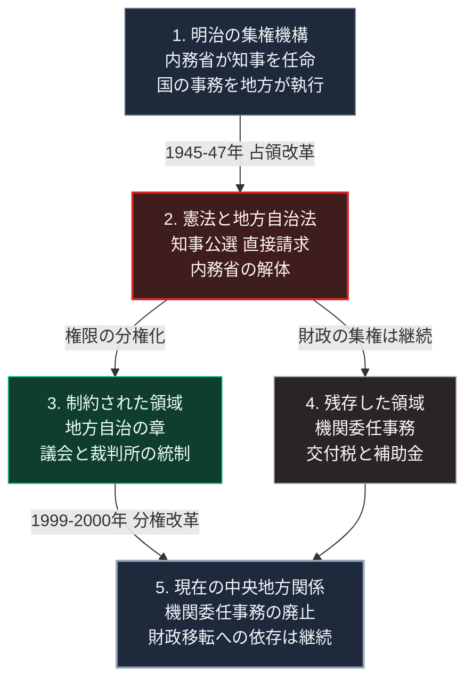

### 序論：本章が扱う範囲

本章は、1945年の敗戦から2000年代初頭までの日本を対象とします。[第Ⅰ部A-6](meiji-centralization)で記述した明治の中央集権機構が、占領下の改革によってどのように再設計され、その後の分権改革と市町村合併を経てどのような中央地方関係に到達したかを時系列に沿って記述します。本文は事実の記述に限定します。現代との関連については、章末の独立したセクションで扱います。

なお、本章が到達点とする2000年代以降の統治の現状については、[第Ⅱ部A-1](japan-current-state)で公的統計に基づいて扱います。

### 1. 敗戦と占領 ―― ポツダム宣言の受諾と指令による統治

1945年7月26日、アメリカ、イギリス、中国の3か国は日本に対して降伏条件を示すポツダム宣言を発表しました。日本政府は8月14日にこの宣言を受諾し、9月2日には降伏文書へ調印します [ [ 519 ] ](https://www.archives.go.jp/ayumi/kobetsu/s20_1945_04.html) 。

ポツダム宣言は、日本の統治機構を通じて占領政策を実施する方針を前提としていました。連合国軍の最高司令官マッカーサーが率いる総司令部（GHQ）は日本政府に指令を発し、日本政府がそれを法令として実施する間接統治の形式が採られます [ [ 520 ] ](https://www.ndl.go.jp/constitution/gaisetsu/01gaisetsu.html) 。

この形式のもとで、日本の中央官庁は廃止されずに存続しました。占領政策は、既存の機構へ指令を送る方法で実施されます [ [ 520 ] ](https://www.ndl.go.jp/constitution/gaisetsu/01gaisetsu.html) 。改革が可能になった条件は、敗戦という外部からの衝撃と、この間接統治の形式でした。

1945年10月、GHQは政治犯の釈放と治安維持法の廃止を命じる指令を発しました。同月、婦人の解放、労働組合の結成奨励、教育の自由主義化、圧政的諸制度の撤廃、そして経済機構の民主化という5項目の改革が日本政府に指示されます。これらの指令は、以後の憲法改正、農地改革、財閥解体、労働立法の出発点となりました [ [ 521 ] ](https://www.ndl.go.jp/modern/cha5/description03.html) 。

### 2. 日本国憲法 ―― 統治の原理の再設計

1946年2月、GHQは日本政府に憲法の草案を提示しました。政府はこれに基づいて改正案を作成し、6月に帝国議会へ提出します。改正案は衆議院と貴族院の審議を経て、1946年11月3日に日本国憲法として公布されました。施行は1947年5月3日です [ [ 522 ] ](https://www.ndl.go.jp/constitution/etc/history.html) 。

日本国憲法は、前文において主権が国民に存することを宣言しました。天皇は国政に関する権能を持たない象徴と規定されます。国会は国権の最高機関であり、内閣は国会の信任に基づいて成立し、衆議院で不信任が決議された場合には総辞職または解散を選択します。この議院内閣制の規定は第66条から第69条に置かれました [ [ 523 ] ](https://laws.e-gov.go.jp/law/321CONSTITUTION) 。

第81条は、最高裁判所が法律、命令、規則、処分の憲法適合性を決定する終審裁判所であると定めました。大日本帝国憲法には存在しなかった司法審査の権限です。そして第8章「地方自治」は、第92条から第95条までの4か条を割き、地方公共団体の組織と運営を地方自治の本旨に基づいて法律で定めること、そして地方公共団体の長と議会の議員を住民が直接選挙することを規定しました [ [ 523 ] ](https://laws.e-gov.go.jp/law/321CONSTITUTION) 。

### 3. 地方自治法と内務省の解体

1947年4月17日、地方自治法が公布されました。施行は日本国憲法と同じ5月3日です。同法は、東京都制、道府県制、市制、町村制という4つの法律を統合し、都道府県と市町村を同じ法律のもとで規定しました [ [ 524 ] ](https://www.archives.go.jp/ayumi/kobetsu/s22_1947_04.html) 。

地方自治法は、都道府県知事を官吏ではなく住民が選挙する公選職と定めました。知事以下の都道府県の職員も、国の官吏から地方公務員へ身分が改められます。あわせて、住民による条例の制定改廃請求、議会の解散請求、長の解職請求といった直接請求の制度が設けられました [ [ 525 ] ](https://laws.e-gov.go.jp/law/322AC0000000067) 。

明治以来、府県知事の任命権を持ち、地方行政と警察を統括していたのは内務省でした。1947年4月の知事公選の実施を経て、内務省は同年12月31日に廃止されます。その機能は、地方行政については内事局を経て1949年設置の地方自治庁へ、警察については国家地方警察と自治体警察へ分割されました [ [ 526 ] ](https://www.jstage.jst.go.jp/article/jspa1962/1992/27/1992_221/_article/-char/ja/) 。

一方、地方自治法は、都道府県知事と市町村長を国の機関として国の事務を執行させる機関委任事務の仕組みを継承しました。この仕組みのもとでは、知事は当該事務について主務大臣の指揮監督を受け、地方議会はその事務に関与できません。機関委任事務の範囲は、その後の個別法の制定によって拡大していきます [ [ 525 ] ](https://laws.e-gov.go.jp/law/322AC0000000067) 。

### 4. 農地改革、財閥解体、労働三法

1945年12月、政府は農地調整法を改正して第1次農地改革に着手しました。GHQはこれを不十分として再検討を求め、1946年10月に自作農の創設を目的とする特別措置法が制定されます。この第2次農地改革では、不在地主の全貸付地と、在村地主の一定面積を超える貸付地とを国が強制的に買収し、小作農に売り渡しました。買収と売渡は1947年から1950年にかけて実施されます [ [ 527 ] ](https://www.archives.go.jp/ayumi/kobetsu/s21_1946_05.html) 。

財閥の解体は、1945年11月の持株会社の解体指令から始まりました。1947年4月には独占禁止法が制定され、持株会社の設立禁止と、私的独占および不当な取引制限の禁止が恒久的な法律として定められます。同年12月には、巨大企業の分割を可能にする法律が公布されました [ [ 528 ] ](https://www.archives.go.jp/ayumi/kobetsu/s22_1947_03.html) 。

労働立法については、1945年12月に労働組合法が制定され、労働者の団結権、団体交渉権、争議権が法律で保障されました。1946年9月には労働争議の調整手続を定める法律が、1947年4月には労働条件の最低基準を定める労働基準法が制定されます。この3つの法律を総称して労働三法と呼びます [ [ 529 ] ](https://www.archives.go.jp/ayumi/kobetsu/s20_1945_07.html) 。

### 5. 地方財政の制度 ―― シャウプ勧告と地方交付税

1949年8月、アメリカの財政学者カール・シャウプを団長とする使節団が、日本の税制に関する勧告を公表しました。この勧告は、国税と地方税の分離、市町村を優先する事務配分、そして地方団体間の財政力の格差を調整する交付金制度の創設を提言しています [ [ 530 ] ](https://www.jstage.jst.go.jp/article/jspa1962/2012/47/2012_134/_article/-char/ja/) 。

この勧告に基づき、1950年に平衡交付金の制度が導入されました。各地方団体について基準となる財政需要額と収入額を算定し、その差額を国が交付する仕組みです。1954年、この制度は地方交付税へ改められました。地方交付税は、所得税、法人税、酒税という国税の一定割合を原資とし、地方団体の財源の均衡化を目的とすると法律に定められています [ [ 531 ] ](https://laws.e-gov.go.jp/law/325AC0000000211) 。

地方交付税の配分は、人口の少ない団体ほど住民1人あたりの交付額が大きくなる構造を持ちました。この配分構造が戦後の地方行財政に与えた影響については、地理学と財政学の分野で実証的な分析が行われています [ [ 532 ] ](https://www.jstage.jst.go.jp/article/grj2002/76/9/76_9_645/_article/-char/ja/) 。

#### 占領の終結と1950年代の制度の再編

1951年9月8日、日本と連合国の各国はサンフランシスコで平和条約に署名しました [ [ 560 ] ](https://www.archives.go.jp/ayumi/kobetsu/s26_1951_01.html) 。この条約は1952年4月28日に発効し、占領は終結します [ [ 561 ] ](https://www.archives.go.jp/ayumi/kobetsu/s27_1952_01.html) 。

占領の終結の後、1940年代の改革の一部は法律の改正によって再編されました。1954年6月8日に公布された警察法は、1947年の警察法の全部を改正し、都道府県に都道府県警察を置くと定めます。警察の組織は、市町村の単位から都道府県の単位へ改められました [ [ 562 ] ](https://laws.e-gov.go.jp/law/329AC0000000162) 。

教育の行政についても同様の改正が行われます。1948年の教育委員会法は、教育委員を住民が選挙すると定めていました [ [ 563 ] ](https://www.mext.go.jp/b_menu/hakusho/html/others/detail/1318136.htm) 。1956年6月30日に公布された地方教育行政の組織及び運営に関する法律は、この教育委員会法を同年9月30日限りで廃止し、教育委員を長が議会の同意を得て任命すると定めました [ [ 564 ] ](https://laws.e-gov.go.jp/law/331AC0000000162) 。

### 6. 1955年体制 ―― 政党の再編と長期政権

1955年10月、左右に分裂していた日本社会党が統一しました。これに対抗して、同年11月15日、自由党と日本民主党が合同して自由民主党を結成します。この保守合同によって、自由民主党が衆議院の過半数を占め、日本社会党が第2党として対抗する政党配置が成立しました [ [ 533 ] ](https://www.ndl.go.jp/modern/cha6/description07.html) 。

保守合同が成立した条件は、左右に分かれていた社会党が合同する動きと、経済界からの期待でした [ [ 533 ] ](https://www.ndl.go.jp/modern/cha6/description07.html) 。

この配置は、1993年に自由民主党が下野するまで38年間にわたって継続しました。この期間の政党政治は、1955年体制と呼ばれます。

この期間の中央地方関係には、2つの構造的な課題がありました。1つは、地方団体の財源が地方交付税と国庫補助金という国からの移転に依存したことです [ [ 531 ] ](https://laws.e-gov.go.jp/law/325AC0000000211) 。もう1つは、機関委任事務の範囲が個別の法律によって広がり、地方議会の関与が及ばない領域も増えたことです [ [ 525 ] ](https://laws.e-gov.go.jp/law/322AC0000000067) 。

この配置が終わる過程は、2つの出来事として現れます。1993年6月3日、衆議院は本会議において地方分権の推進に関する決議を可決しました [ [ 565 ] ](https://kokkai.ndl.go.jp/txt/112605254X03019930603) 。参議院も翌6月4日の本会議で同名の決議を可決します [ [ 566 ] ](https://kokkai.ndl.go.jp/txt/112615254X02219930604) 。同年8月9日、細川護熙を首班とする内閣が成立しました [ [ 567 ] ](https://www.kantei.go.jp/jp/rekidainaikaku/index.html) 。

### 7. 高度成長期 ―― 中央主導の再配分

1960年12月、政府は10年間で国民所得を2倍にすることを目標とする所得倍増計画を閣議決定しました。1962年10月には、国土全体を対象とする総合開発計画（全総）が閣議決定されます。全総は、太平洋沿岸の工業地帯に集中する開発を全国へ波及させるため、地方に拠点となる工業地区を指定する拠点開発方式を採用しました [ [ 534 ] ](https://www.archives.go.jp/ayumi/kobetsu/s37_1962_01.html) 。

この時期、国は公共事業と補助金を通じて、地方への資源の再配分を主導しました。道路、港湾、工業用水といった基盤整備は、国が計画を定め、地方団体が国の補助を受けて実施する形式で進められます。地方団体が国の事務を執行する機関委任事務の範囲も拡大し、都道府県の事務の多くがこれへ該当するようになりました。1991年の地方自治法の改正では、機関委任事務に関する職務執行命令の訴訟制度と長の罷免制度が廃止されています [ [ 535 ] ](https://www.soumu.go.jp/main_sosiki/jichi_gyousei/bunken/history.html) 。

拠点開発方式のもとでは、地方団体の事業は国の計画と補助の決定に従います。地方交付税の原資は国税の一定割合と定められているため、再配分に充てられる財源の規模は国税の収入に連動しました [ [ 531 ] ](https://laws.e-gov.go.jp/law/325AC0000000211) 。

### 8. 地方分権改革 ―― 機関委任事務の廃止

1990年代に入ると、国と地方の財政は悪化します。地方債の現在高は1992年度末以降に急増し、普通会計が負担すべき借入金の残高は2004年度末に201兆4,096億円へ達しました [ [ 568 ] ](https://www.soumu.go.jp/menu_seisaku/hakusyo/chihou/18data/18czb1-2.html) 。国が発行する普通国債の残高も累増しています [ [ 569 ] ](https://www.mof.go.jp/tax_policy/summary/condition/a02.htm) 。人口の分布にも偏りが続き、東京圏は日本人の移動者について30年連続の転入超過となっています [ [ 570 ] ](https://www.stat.go.jp/data/idou/2025np/jissu/youyaku/index.html) 。

以下に述べる分権改革と市町村の合併は、この財政の状況のもとで進められました。市町村の合併については、住民に身近な行政の主体である市町村の行財政の基盤を強化することが目的とされています [ [ 571 ] ](https://www.soumu.go.jp/menu_seisaku/hakusyo/chihou/18data/18czb3-3.html) 。

1995年、地方分権を推進する法律が制定され、内閣に推進委員会が設置されました。委員会は1996年から1998年にかけて5次にわたって勧告し、機関委任事務の廃止を中心とする改革の方向を示します [ [ 536 ] ](https://www.cao.go.jp/bunken-suishin/ayumi/ayumi-index.html) 。

この勧告に基づき、1999年7月に地方分権に関する一括法が成立しました。同法は475本の法律を一括して改正するもので、2000年4月1日に施行されます。改正後の地方自治法は、機関委任事務の制度を廃止し、地方団体の事務を自治事務と法定受託事務の2種類に再編しました。法定受託事務についても地方議会の関与が認められ、国の関与は法律に根拠を持つものに限定されます [ [ 535 ] ](https://www.soumu.go.jp/main_sosiki/jichi_gyousei/bunken/history.html) 。

この改革は、第1次分権改革と呼ばれます。その後、2001年から2004年にかけて分権改革の推進会議が、2007年から2010年にかけて分権改革の推進委員会が設置され、事務と権限の移譲、そして国の関与の見直しが継続されました [ [ 536 ] ](https://www.cao.go.jp/bunken-suishin/ayumi/ayumi-index.html) 。

### 9. 平成の大合併 ―― 市町村数の削減

分権改革と並行して、市町村の合併が推進されました。1999年の合併特例法の改正により、合併した市町村に対する地方交付税の算定の特例と、合併特例債の発行が認められます。1999年3月31日時点で3,232あった市町村は、2010年3月31日時点で1,727へ減少しました。2014年4月時点の市町村数は1,718です [ [ 537 ] ](https://www.soumu.go.jp/gapei/gapei2.html) 。

この合併は、明治の大合併（1888年から1889年）、昭和の大合併（1953年から1961年）に続くものとして、平成の大合併と呼ばれます。明治の大合併では約71,000の町村が約15,000へ、昭和の大合併では約9,900の市町村が約3,500へ統合されました [ [ 537 ] ](https://www.soumu.go.jp/gapei/gapei2.html) 。

合併を進めた手段は、財政上の誘因でした。国は、普通交付税の算定の特例、合併の直後の臨時的な経費に対する措置、そして合併の準備の経費に対する措置を用意しています [ [ 571 ] ](https://www.soumu.go.jp/menu_seisaku/hakusyo/chihou/18data/18czb3-3.html) 。

### 10. 2001年の省庁再編と内閣機能の強化

1998年、中央省庁の再編と内閣機能の強化を定める基本法が制定されました。この法律に基づき、2001年1月6日、1府22省庁は1府12省庁へ再編されます。同法は、内閣総理大臣が閣議において基本方針を発議する権限を明文化し、内閣官房の企画立案機能を強化することを定めました [ [ 538 ] ](https://laws.e-gov.go.jp/law/410AC0000000103) 。

同時に内閣府が設置され、内閣総理大臣を長として、各省より一段高い立場から政策の総合調整を担うこととされました。内閣府には経済財政に関する諮問会議などの合議制機関が置かれ、予算編成の基本方針を審議します [ [ 539 ] ](https://laws.e-gov.go.jp/law/411AC0000000089) 。

分権改革と並行して、国と地方の財政の関係も見直されました。2002年6月25日に閣議決定された基本方針は、国庫の補助負担金、税源移譲を含む税源の配分、そして地方交付税の3つを一体で検討する方針を示します。この方針に基づく見直しは、三位一体の改革と呼ばれました [ [ 572 ] ](https://www.soumu.go.jp/menu_seisaku/hakusyo/chihou/18data/18czb3-1.html) 。

三位一体の改革は、2004年度から2006年度にかけて実施されます。国庫の補助負担金については約4.7兆円の改革が行われ、税源移譲は約3兆円の規模となりました。地方交付税と地方債についても、あわせて見直しが行われています [ [ 572 ] ](https://www.soumu.go.jp/menu_seisaku/hakusyo/chihou/18data/18czb3-1.html) 。

以上の経過を経て、日本の統治機構は、憲法上の地方自治と法律上の分権を備えた一方で、財政面では地方交付税と国庫補助金を通じた国からの移転へ依存する構造に到達しました。この構造の現状については、[第Ⅱ部A-1](japan-current-state)で人口、財政、行政の公的統計に基づいて検討します。

### 11. 各局面の成立条件・統治体系・課題・転換の発露

本節は、前節までに記述した事実を局面ごとに整理した一覧です。

| 局面（時期） | 成立を可能にした条件 | 統治体系の要点 | 構造的な課題 | 転換として発露した現象 |
| --- | --- | --- | --- | --- |
| 占領改革（1945年から1952年） | 敗戦という外部からの衝撃と、間接統治の形式 | 憲法と地方自治法による知事の公選と直接請求 | 改革が人事と正統性に集中し、財政の集約は残存 | 1952年の平和条約の発効による占領の終結 |
| 独立回復後の再編（1952年から1955年） | 占領の終結による立法の裁量の回復 | 国の法律による警察と教育の制度の再編 | 分権化された組織が都道府県の単位へ再集約 | 1954年の警察法と1956年の教育の法律 |
| 1955年体制と高度成長（1955年から1973年） | 社会党の合同への対抗と経済の成長 | 保守政党の長期政権と中央が主導する再配分 | 財源の国への依存と機関委任事務の拡大 | 1993年の国会の決議と細川内閣の成立 |
| 低成長と財政悪化（1973年から1999年） | 安定成長への移行と既存の移転の仕組み | 補助金と公共事業による地方への財源の移転 | 国と地方の債務の増大、東京圏への人口の集中 | 1990年代の債務の累増と財政の悪化 |
| 分権改革と合併以降（2000年から） | 国会の決議と一括法の成立 | 自治事務と法定受託事務の2区分 | 権限は分権、財源は国への依存という合成 | 2000年代の三位一体の改革 |

### 🗺️ 図：戦後の統治設計 ―― 集権機構への制約と残存

明治の集権機構が占領改革によってどの部分で制約され、どの部分で残存したかを、垂直フローで示します。

#### 図の読み方

この図は、占領改革が明治の集権機構を一様に解体したのではなく、機能ごとに異なる扱いをしたという構造を示しています。

2の段階で行われた改革は、人事と正統性の領域に集中しました。知事の任命権を持つ内務省が解体され、知事は住民の選挙によって選ばれるようになります。憲法は地方自治の章を設け、法律は住民の直接請求を認めました。3はこの制約された領域です。

一方、4の領域は改革の対象になりませんでした。国の事務を地方の長に執行させる機関委任事務は地方自治法に継承され、高度成長期にはその範囲が拡大します。財政については、シャウプ勧告の提言した交付金制度が地方交付税として定着し、国庫補助金とあわせて国から地方への移転が地方財政の主要な構成要素となりました。

5の段階で、1999年の分権改革は4のうち機関委任事務を廃止しました。しかし財政移転の構造は残ります。したがって現在の中央地方関係は、権限の面では分権化が進み、財政の面では国への依存が継続するという、2つの系列の合成として理解できます。

[第Ⅰ部A-6](meiji-centralization)の図が示した明治の4つの集約（人事、財政、武力、人材規格）と対照すると、戦後の改革が制約したのは主として人事の集約であり、財政の集約は形式を変えて継続したことになります。

---

### 現代社会構造への射程と本質（本章のまとめ）

本セクションは、著者による解釈です。前節までの事実記述とは区別して読んでください。

1.  **戦後体制は、集権機構を「地方自治」と「議会統制」で制約する設計だった**

    占領下の改革は、明治の集権機構を廃止したのではなく、それに制約を加えました。知事公選と内務省の解体は、人事の集約を断ち切ります。憲法の地方自治の章と司法審査は、国の決定を法律と裁判所の統制のもとに置きました。議院内閣制は、行政の正統性を選挙で構成された議会に依存させます。

    しかし、財政の集約は残りました。地方交付税と国庫補助金は、国が徴収した税を地方へ再配分する仕組みです。この仕組みは、地域間の格差を調整する機能を持つ一方で、地方団体の財政を国の決定に依存させます。機関委任事務の廃止によって権限の分権化が進んだ後も、この財政の構造は継続しています。[第Ⅰ部A-6](meiji-centralization)で示した4つの集約のうち、財政の集約だけが形式を変えて残ったという点が、現在の中央地方関係の出発点です。

2.  **正統性の供給源は「手続と規則」と「構成員の同意」へ移った**

    [第Ⅰ部A-4](japan-premodern-governance)で扱った前近代の日本では、統治の正統性は朝廷からの任命によって供給されていました。明治国家は、この供給源を天皇に集約し、憲法によって成文化しました。日本国憲法は、この供給源を国民の主権へ置き換えます。

    ここで重要なのは、正統性が単一の主体からではなく、2つの経路から供給されるようになった点です。1つは、憲法と法律という手続と規則です。国の行為は、法律に根拠を持ち、裁判所の審査に耐える場合にのみ正当とされます。もう1つは、選挙を通じた構成員の同意です。内閣は議会の信任に、知事と市町村長は住民の投票に、それぞれ正統性を依存します。統治OSの正統性がどこから供給されるかという論点は、[第Ⅰ部B-1](isms-overview)で定式化します。本章の事例は、その供給源が制度設計によって意図的に移転された例にあたります。

    この2経路の設計は、いずれか一方の機能不全に対して他方が残るという冗長性を持ちます。他方で、2つの経路は異なる結論を出すことがあります。法律上は適法である一方で有権者の支持を失った決定や、支持はあるものの法的根拠を欠く決定がその例です。このとき、どちらを優先するかは制度上自動的には決まりません。

3.  **分権改革と合併は、人口減少とインフラ維持の前提条件を形成した**

    1999年の分権改革と平成の大合併は、いずれも人口減少が本格化する直前に実施されました。日本の総人口が減少に転じたのは2008年です。この2つの改革は、その後の20年間における地方の統治単位と権限の配置を確定しました。

    分権改革は、地方団体に自治事務としての決定権を与えました。合併は、統治単位の数を半減させ、1つの単位が担う面積と施設の数を増やしました。この2つが組み合わさった結果、各地方団体は、広域化した区域のインフラを、自らの決定と責任において維持することになります。その一方で、財源は地方交付税と補助金を通じて国に依存したままです。

    したがって、[第Ⅱ部A-2](japan-population-decline)から[第Ⅱ部A-4](39_fortressed-cities-vulnerable-wilderness)で扱う人口減少とインフラの維持という課題は、この前提条件のもとで発生しています。すなわち、決定の権限は地方にあり、財源の決定は国にあります。そして維持すべき施設の総量は、合併前の水準のままです。この配置が外部衝撃に対してどの程度の余力を持つかは、[第Ⅲ部](future-method)のシナリオにおいて検討します。

4.  **各局面は、再配分の原資が増え続けることを前提に設計されていた**

    本章で記述した各局面は、配分できる財源が増え続けるという前提のうえに設計されていました。高度成長期の公共事業と補助金は、経済の成長にともなう税収の増加を原資とします。地方交付税の原資が国税の一定割合と定められている以上、この連動は制度の構造そのものです。

    そして原資が細ったとき、転換は外部からの衝撃としてではなく、財政の配分の行き詰まりとして現れました。1990年代に生じた債務の累増は、その後の分権改革へ、市町村の合併へ、さらに三位一体の改革へと接続します。いずれも、配分できる財源の制約から出発した制度の変更です。

    この構造は、第Ⅰ部A-4で扱った前近代の各政権と同型です。前提とした資源が尽きたときに、配分の失敗として体制が転換するという形が共通しています。異なるのは、転換の現れ方が武力ではなく財政の数字であるという点にすぎません。

    そして現在は、人口の減少によって原資がさらに細る局面にあたります。この局面における人口、財政、行政の状態は、[第Ⅱ部A-1](japan-current-state)以降で公的統計に基づいて検討します。
