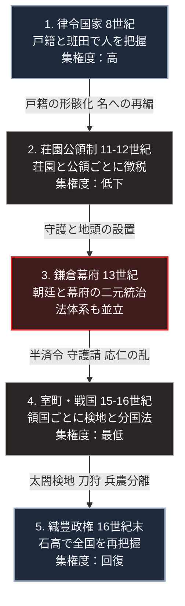

### 序論：本章が扱う範囲

本章は、8世紀初頭から16世紀末までの日本を対象とします。中央集権的な律令国家がどのように成立し、その土地と人民の把握がどのように分散し、最終的に織豊政権によって再統合されたかを時系列に沿って記述します。本文は事実の記述に限定します。現代との関連については、章末の独立したセクションで扱います。

なお、本章と対をなす近現代の統治機構の変遷は、第Ⅰ部A-7で扱います。また、統治機構が分権化と再統合とを反復する周期については、第Ⅰ部A-8で扱う枠組みに沿って章末で検討します。

### 1. 律令国家の成立 ―― 大宝律令と全国一律の把握

701年（大宝元年）、大宝律令が完成しました。律は刑罰の規定、令は行政組織と租税の規定にあたります。この法典は、唐の律令を範として編纂され、日本で初めて律と令とがそろって施行された体系法です [ [ 500 ] ](https://openlibrary.org/works/OL8318872W) 。大宝律令の制定過程については、史学雑誌に掲載された研究が詳細に検討しています [ [ 501 ] ](https://www.jstage.jst.go.jp/article/shigaku/122/12/122_KJ00009001451/_article/-char/ja/) 。

中央の官制は、神祇官と太政官の二官を頂点とし、太政官の下に八省を配置しました。地方は国・郡・里に区分され、国には中央から国司が派遣されます。郡司には在地の有力者が任じられ、里には里長が置かれました。この国郡里制により、中央政府は全国を同一の行政単位で把握する体制を整えました [ [ 502 ] ](https://openlibrary.org/works/OL12098438W) 。

人民の把握は、戸籍と計帳によって行われました。戸籍は6年ごとに作成され、計帳は毎年作成されます。班田収授法は、この戸籍に基づいて6歳以上の男女に口分田を支給し、死亡時に収公する制度です。班田は6年に1度実施されました [ [ 503 ] ](https://www.jstage.jst.go.jp/article/shigaku/86/3/86_KJ00003672383/_article/-char/ja/) 。

租税は租・庸・調の3種を基本としました。租は口分田の面積に応じて課される田租です。庸は都での労役の代わりに納める布、調は各地の産物です。庸と調は成年男子を単位として課され、都まで運搬する義務も課されました。この体系は、土地ではなく人を課税の単位とする点に特徴があります [ [ 500 ] ](https://openlibrary.org/works/OL8318872W) 。

### 2. 摂関政治と荘園公領制 ―― 徴税単位の変容

9世紀以降、戸籍に基づく人身把握は次第に実態から乖離しました。偽籍の増加、浮浪と逃亡、そして班田の遅延が各地で記録されています。10世紀に入ると、班田は事実上停止しました [ [ 504 ] ](https://openlibrary.org/works/OL25713498W) 。

中央では、藤原氏が天皇の外戚として摂政・関白の地位を独占しました。10世紀後半から11世紀前半にかけて、この摂関政治は最盛期を迎えます。地方行政については、国司の筆頭者である受領に徴税の請負が委ねられました。受領は一定額を中央へ納める代わりに、国内の徴税方法について裁量を持ちます [ [ 504 ] ](https://openlibrary.org/works/OL25713498W) 。

この時期、課税の単位は人から土地へ移行しました。国衙は田地を「名」という単位に編成し、有力農民に耕作と納税を請け負わせます。この請負人は負名と呼ばれました。課税は戸籍上の個人ではなく、名という土地の区画に対して行われます [ [ 505 ] ](https://openlibrary.org/works/OL127902W) 。

並行して、荘園が拡大しました。11世紀には、開発領主が所領を中央の貴族や寺社に寄進し、その権威によって国衙からの課税免除を得る形式が広まります。荘園に対しては、租税の免除（不輸）と国司の立ち入り拒否（不入）の特権が認められました。1069年、後三条天皇は延久の荘園整理令を発し、券契を審査する記録所を設けて基準に合わない荘園を停止しました [ [ 505 ] ](https://openlibrary.org/works/OL127902W) 。

12世紀には、荘園と国衙領（公領）とが並存する体制が確立しました。国衙領も郡・郷・保といった単位に再編され、在庁官人がその管理にあたります。これを荘園公領制と呼びます。中央政府が全国を一律に把握する体制は、荘園ごと、公領ごとに徴税権が分割された体制へ置き換わりました [ [ 506 ] ](https://openlibrary.org/works/OL27310W) 。

### 3. 院政 ―― 上皇による統治と知行国

1086年、白河天皇は皇位を堀河天皇に譲り、上皇として政務を執りました。これ以後、上皇が院庁を通じて政治を主導する院政が続きます。院政は、天皇の父または祖父という血縁上の地位を根拠とする統治であり、律令の官制上に明文の規定を持ちませんでした [ [ 504 ] ](https://openlibrary.org/works/OL25713498W) 。

院政期には知行国の制度が広まりました。知行国は、特定の貴族や寺社に一国の支配権を与え、その国からの収益を取得させる制度です。知行国主は近親者を国司に任命し、国衙領からの収入を得ました。知行国の分布と推移については、法制史の分野で実証研究が蓄積されています [ [ 507 ] ](https://www.jstage.jst.go.jp/article/jalha1951/1984/34/1984_34_236/_article/-char/ja/) 。

### 4. 武家政権の成立 ―― 二元的統治と御成敗式目

1180年に挙兵した源頼朝は、1185年に平氏を滅ぼしました。同年、頼朝は朝廷から諸国に守護、荘園と公領に地頭を設置する権限を認められます。守護は国内の御家人の統率と治安維持を担い、地頭は荘園と公領における年貢の徴収と土地の管理を担いました [ [ 508 ] ](https://openlibrary.org/works/OL4093584W) 。

1192年、頼朝は征夷大将軍に任じられました。鎌倉幕府は、御家人に対して所領を安堵し、新たな所領を給与しました。御家人は軍役によってこれに応えます。この関係は御恩と奉公と呼ばれました。ただし、幕府の権限は全国の土地に及んだわけではありません。荘園と公領の領有権は、引き続き朝廷、貴族、寺社が保持しました [ [ 508 ] ](https://openlibrary.org/works/OL4093584W) 。

この結果、朝廷と幕府とが並存する二元的な統治が成立しました。朝廷は官位の授与、暦の制定、そして西国を中心とする荘園と公領の支配を担いました。幕府は御家人の統制と東国の支配を担い、地頭を通じて荘園と公領の内部に浸透します。1221年の承久の乱で幕府が朝廷に勝利した後も、この二元的な構造は解消されませんでした。幕府は京都に六波羅探題を設置し、朝廷の監視と西国の統治にあたります [ [ 509 ] ](https://openlibrary.org/works/OL11793761W) 。

1232年（貞永元年）、執権北条泰時は御成敗式目を制定しました。全51条からなるこの法典は、御家人間の紛争処理と裁判の基準を定めたものです。守護と地頭の職務、所領の相続、そして20年間の知行による所有権の確定などが規定されました。式目の原文と注釈は、江戸時代以降も繰り返し刊行されています [ [ 510 ] ](https://ndlsearch.ndl.go.jp/books/R100000092-I2324_414234) 。

御成敗式目は、その適用範囲を幕府の管轄する武家社会に限定していました。朝廷の管轄下では引き続き律令に基づく公家法が、荘園領主の管轄下では本所法が適用されます。1つの国土に3つの法体系が並立し、それぞれの法廷が管轄を分け合う状態が続きました [ [ 509 ] ](https://openlibrary.org/works/OL11793761W) 。

### 5. 建武の新政と室町幕府 ―― 守護の領国化と分権

1333年、鎌倉幕府は滅亡しました。後醍醐天皇は建武の新政を開始し、天皇による直接統治の回復を試みます。しかし1336年、足利尊氏が京都を制圧し、建武式目を定めて新たな幕府の方針を示しました。1338年、尊氏は征夷大将軍に任じられます [ [ 511 ] ](https://openlibrary.org/works/OL19342017W) 。

室町幕府は、南北朝の内乱を通じて守護の権限を拡大しました。1352年に発布された半済令は、守護が軍費調達のために荘園と公領の年貢の半分を徴収し、配下の武士に分与することを認めました。当初は特定の国と期間に限定されていましたが、その後恒常化します。守護はさらに、荘園領主から年貢の徴収を請け負う守護請を通じて、領国内の土地に対する支配を強めました [ [ 512 ] ](https://www.jstage.jst.go.jp/article/sehs/17/2/17_KJ00002438841/_article/-char/ja/) 。

守護は、国衙の機能を吸収し、国内の武士を家臣として組織しました。このように一国または数か国を領国として支配する守護は、守護大名と呼ばれます。幕府は守護大名の連合体という性格を強め、将軍の権力は守護大名の勢力均衡の上に成り立ちました [ [ 511 ] ](https://openlibrary.org/works/OL19342017W) 。

1467年、将軍の継嗣問題と有力守護家の家督争いとが結びつき、応仁の乱が始まりました。戦乱は1477年まで続き、京都の大部分が焼失します。この過程で、幕府の命令が守護の領国に及ぶ範囲は縮小しました。守護が在京して幕政に参加する体制も崩れ、各守護は領国へ下向します。応仁の乱以後の在地社会の変容については、荘園の現地における実証研究が蓄積されています [ [ 513 ] ](https://www.jstage.jst.go.jp/article/shigaku/123/3/123_KJ00009323525/_article/-char/ja/) 。

### 6. 戦国大名 ―― 分国法、検地、城下町

15世紀末から16世紀にかけて、守護大名、守護代、そして国人といった多様な出自の勢力が、それぞれ独立した領国支配を確立しました。これらの領主は戦国大名と呼ばれます。戦国大名は、幕府や朝廷の任命に依存せず、自らの実力によって領国を支配しました [ [ 514 ] ](https://openlibrary.org/works/OL19565427W) 。

戦国大名の多くは、領国内にのみ適用される法典を制定しました。これを分国法と呼びます。1526年の今川仮名目録、1536年の伊達氏の塵芥集、1547年の武田氏の甲州法度などが現存します。分国法は、家臣間の紛争を大名の裁定に委ねること、家臣の私的な戦闘を禁じること、そして領国内の土地と年貢を大名が把握することなどを規定しました [ [ 514 ] ](https://openlibrary.org/works/OL19565427W) 。

戦国大名は、領国内の土地について検地を実施しました。多くは家臣や村に耕地面積と収穫高を申告させる指出という方式です。この検地に基づいて、大名は家臣の所領の規模を把握しました。

また、戦国大名は居城の周囲に家臣と商工業者を集住させました。これが城下町です。家臣を城下に集めることは、在地における家臣の独自の勢力基盤を弱め、大名への軍事的な集中を可能にしました。同時に、城下町は領国の経済の中心となります [ [ 514 ] ](https://openlibrary.org/works/OL19565427W) 。

### 7. 織豊政権による統合 ―― 太閤検地、刀狩、兵農分離

1568年、織田信長は京都に入りました。1573年、信長は将軍足利義昭を京都から追放し、室町幕府は事実上終わります。1582年に信長が本能寺で死去した後、豊臣秀吉がその勢力を継承しました。秀吉は1585年に関白、翌1586年には太政大臣へ任じられました。そして1590年、全国の統一を完成させます [ [ 515 ] ](https://openlibrary.org/works/OL3909282W) 。

秀吉は、1582年から全国的な検地を実施しました。これを太閤検地と呼びます。太閤検地は、統一された面積の単位と統一された枡（京枡）を用い、田畑を等級に分けて1段あたりの標準的な収穫量（石盛）を定めました。土地の生産力は、米の容積である石高によって表示されます。検地帳には、1つの土地について1人の耕作者のみを登録しました。これを一地一作人の原則と呼びます [ [ 515 ] ](https://openlibrary.org/works/OL3909282W) 。太閤検地の実施過程を示す検地帳や関連文書は、各地の文書館に現存しています [ [ 516 ] ](https://www.jstage.jst.go.jp/article/fukuiarchives/7/0/7_95/_article/-char/ja/) 。

この検地によって、荘園制のもとで重層化していた土地の権利関係は整理されました。荘園領主、地頭、名主、そして耕作者が同一の土地に重ねて持っていた権利は、検地帳に登録された耕作者の権利と、大名が取得する年貢とに単純化されます。大名の領地の規模も石高で表示され、それに応じた軍役が課されました。この体系が石高制です [ [ 515 ] ](https://openlibrary.org/works/OL3909282W) 。

1588年（天正16年）7月8日、秀吉は刀狩令を発しました。この法令は、百姓が刀、脇差、弓、槍、鉄砲などの武具を所持することを禁じ、没収した武具は大仏の建立に用いるとしています。同日には海賊停止令も発せられました。両法令の作成過程と公布状況については、朱印状の原本に基づく研究が公表されています [ [ 517 ] ](https://ndlsearch.ndl.go.jp/books/R100000136-I1390295447136871296) 。

1591年、秀吉は武家奉公人、町人、百姓の身分の移動を禁じる法令を発しました。翌1592年には、全国の戸口調査を命じます。この一連の政策によって、武士は城下町に居住して軍役を担い、百姓は村に居住して年貢を負担するという身分の分離が進みました。これを兵農分離と呼びます。兵農分離の制度としての性格については、近世史の研究において継続的に検討されています [ [ 518 ] ](https://www.jstage.jst.go.jp/article/shigaku/110/12/110_KJ00008992261/_article/-char/ja/) 。

以上の政策によって、全国の土地は石高という単一の尺度で把握され、武士と百姓とは居住地と職分において分離されました。この体制は、1603年に成立する江戸幕府へ継承されます。江戸幕藩体制の設計と解体については、第Ⅰ部A-5で扱います。

### 🗺️ 図：土地把握の単位と統治の集権度の変遷

律令国家から織豊政権までの約900年間について、中央政府が土地と人民を把握する単位と、それに対応する統治の集権度とを垂直の時系列で示します。

#### 図の読み方

この図は、統治の集権度を「中央政府がどの単位で土地と人民を把握しているか」という観点から配置したものです。

1の律令国家は、戸籍という全国一律の台帳によって個人を把握し、それを課税の単位としました。把握の単位が全国で同一であるため、中央の命令は同じ形式で末端まで届きます。

2から4にかけて、把握の単位は分割されていきます。まず課税の単位が人から土地へ移り、次に徴税権そのものが荘園と公領ごとに分割されました。3の段階では、朝廷と幕府という2つの中央が並立し、法体系も3つに分かれます。4の段階に至ると、土地の把握は領国ごとに閉じ、中央と呼べる主体が事実上存在しなくなりました。

5の織豊政権が行ったのは、把握の単位の再統一です。石高という単一の尺度、京枡という単一の計量器、そして一地一作人という単一の登録原則を全国に適用しました。これによって、律令国家とは異なる方式でありながら、全国を同一の形式で把握する体制が回復します。

注目すべきは、集権度の低下が1から4まで連続的に進行した一方で、その回復は5において短期間に達成された点です。分散は数百年をかけて進み、再統合は数十年で完了しました。この非対称性は、第Ⅰ部A-8で扱う枠組みにおいて再度検討します。

---

### 現代社会構造への射程と本質（本章のまとめ）

本セクションは、著者による解釈です。前節までの事実記述とは区別して読んでください。

1.  **徴税単位と土地把握の可読性が、集権度を規定した**

    本章の900年間を通じて、統治の集権度を規定した変数は、軍事力の所在でも君主の個性でもありませんでした。中央政府が、土地と人民をどの単位で、どの精度で把握できていたかという条件です。本書はこの条件を「可読性」と呼びます。可読性の概念と、それが文字と行政の関係にどう根ざしているかについては、第Ⅰ部C-2で扱います。

    律令国家の戸籍が形骸化した時点で、中央は個人を課税の単位として把握する能力を失いました。その後の荘園公領制は、把握の単位を土地へ移すことで徴税を継続しましたが、その把握は荘園領主ごとに分割されていました。守護の領国化は、この分割された把握を中央から切り離す過程です。太閤検地が行ったのは、把握の単位と尺度の再統一でした。

    ここから抽出できる一般則は、次のとおりです。統治の集権度は、命令の強さではなく、台帳の精度と統一性に比例します。台帳を持たない中央は、命令を発しても末端の実態を確認できません。この観点は、第Ⅱ部で現代の行政機構の情報基盤を検討する際に、再度用います。

2.  **二元的統治は、正統性の供給源を分離した**

    鎌倉幕府の成立以降、日本には朝廷と幕府という2つの統治主体が並立しました。この構造で注目すべきは、正統性の供給源が分離された点です。幕府は実力によって御家人を統制しましたが、その地位の正当化は朝廷からの征夷大将軍の任命に依存していました。一方、朝廷は軍事力を持ちませんでしたが、官位の授与という正統性の供給機能を独占し続けました。

    実力の保持者と正統性の供給者とが分離している場合、実力の保持者は正統性の供給者を廃止できません。廃止した瞬間に、自らの地位の根拠を失うためです。この構造は、鎌倉幕府から江戸幕府まで、約700年にわたって維持されました。そして第Ⅰ部A-5で扱うとおり、幕府が朝廷の勅許を得られなかった時点で、この構造は幕府の側から崩れます。

    統治の正統性がどこから供給されるかという問いは、第Ⅰ部B-1で統治OSの構成要素として定式化します。本章の事例は、正統性の供給源が実力の所在から分離しうること、そしてその分離が長期の安定と最終的な脆弱性の双方をもたらすことを示しています。

3.  **分権化と再統合の周期は、第Ⅰ部A-8の枠組みに対応する**

    本章の時系列は、集権的な統治機構が徐々に分権化し、ある時点で急速に再統合されるという周期を示しています。第Ⅰ部A-8で扱う枠組みは、統治機構の劣化を、複雑性の維持費用の増大と、正統性の争点化という2つの段階で記述します。

    律令国家の形骸化は、戸籍の作成と班田の実施という維持費用の高い制度が、その費用に見合う利得を生まなくなった過程として読めます。荘園公領制は、維持費用の低い分割された把握へ制度を切り替える調整でした。守護の領国化と応仁の乱は、中央の正統性が争点化し、調整能力を喪失した段階に対応します。

    再統合は、分権化とは異なる速度で進みました。この非対称性が示唆するのは、分権化した状態が安定した均衡ではなく、再統合を可能にする条件が整った時点で短期間に転換しうるということです。現代の日本における中央と地方の関係、そして人口減少のもとでの行政単位の再編が、この周期のどの位相にあるのかは、第Ⅱ部A-1以降で公的資料に基づいて検討します。
