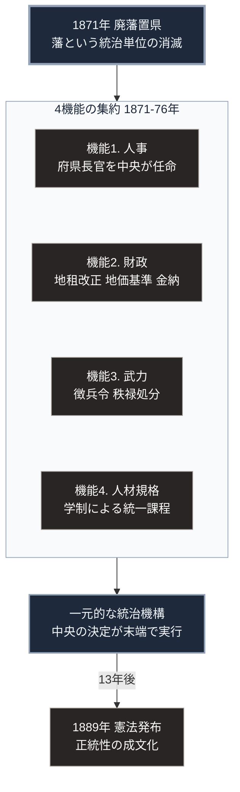

### 序論：本章が扱う範囲

本章は、1868年から1890年代までの日本において、分権的な幕藩体制がどのような制度設計によって一元的な中央集権機構へ転換したかを記述します。本文は事実の記述に限定します。解釈は章末のセクションで扱います。

### 1. 行政機構の一元化

1869年の版籍奉還により、大名は領地と領民とを朝廷へ返上しました。ただし、この段階では旧大名が知藩事として引き続き統治にあたっており、実質的な支配関係に変化はありませんでした。

1871年の廃藩置県によって、藩は法的に廃止されます。旧大名は東京への居住を命じられ、府県には、中央政府の任命による府知事・県令（以下、府県長官）が派遣されました。設置当初の府県数は3府302県でした。同年中に3府72県へ統合され、1888年には3府43県となります。

この改編により、地方行政の人事権が中央政府に集約されました。府県の長は、地域の代表ではなく、中央政府の代理人として位置づけられます。

### 2. 財政基盤の再設計 ―― 地租改正

幕藩体制下の歳入は、米による現物納が基本でした。この方式では、収穫量と米価の変動が、そのまま歳入の変動として財政に反映されます。

1873年、政府は地租改正条例を公布しました。この制度改革は、次の3点を規定しています。第一に、課税基準を収穫量から地価へ変更すること。第二に、納税を米ではなく貨幣で行うこと。第三に、納税義務者を耕作者ではなく土地所有者とすることです。

地租の税率は、当初地価の3%と定められました。1877年には2.5%へ引き下げられます。地租改正条例（明治6年の太政官布告 第272号）の原本は国立公文書館に所蔵され、同館がその内容と制定経緯の解説を公開しています [ [ 261 ] ](https://www.archives.go.jp/ayumi/kobetsu/m06_1873_03.html) 。

この改革により、政府は収穫の変動から独立した、予測可能な貨幣収入を確保しました。同時に、土地の所有権が法的に確定され、売買の対象となります。

### 3. 軍事力の一元化 ―― 徴兵令

幕藩体制下では、軍事力は各藩が独自に保持していました。1873年、政府は徴兵令を公布します。これにより、身分にかかわらず満20歳の男子を対象とする兵役義務が定められました。

同時に、武士身分の解体が進行します。1876年の廃刀令により帯刀が禁止され、同年の秩禄処分により、旧武士層に対する家禄の支給が公債への一括交換によって打ち切られました。

### 4. 人材供給の標準化 ―― 学制

1872年、政府は学制を公布しました。全国を8大学区に分け、各大学区を32中学区、各中学区を210小学区に区分する構想です。計算上、全国に53,760校の小学校を設置する設計でした。

この制度は、地域や身分にかかわらず、統一された教育課程を通じて人材を供給することを目的としています。就学率は当初低い水準にとどまりましたが、1900年代には90%を超えました [ [ 195 ] ](https://www.mext.go.jp/b_menu/hakusho/html/others/detail/1317552.htm) 。

### 5. 統治正統性の成文化 ―― 憲法と議会

1889年2月11日、大日本帝国憲法が発布されました。同憲法は、天皇を統治権の総攬者と規定したうえで、立法権の行使に帝国議会の協賛を要すること、そして臣民の権利を法律の範囲内で保障することを定めています [ [ 262 ] ](https://www.ndl.go.jp/constitution/etc/j02.html) 。

1890年、第1回帝国議会が召集されました。衆議院議員の選挙権は、直接国税15円以上を納める満25歳以上の男子に限定され、有権者は総人口の約1.1%にとどまりました [ [ 263 ] ](https://www.ndl.go.jp/portrait/pickup/024) 。

### 6. 対外的な地位の回復

1858年に締結された修好通商条約は、領事裁判権と協定関税制を含んでいました。政府は、この条約の改正を継続的な外交課題としました。

1894年、日英通商航海条約が締結され、領事裁判権の撤廃が合意されます。同条約は1899年に発効しました。関税自主権の完全な回復は、1911年の条約改正まで待つことになります。

### 🗺️ 図：中央集権化を構成した4つの制度

分権構造から一元構造への転換が、どの機能を集約することで達成されたかを示します。

#### 図の読み方

この図は上から下へ4段で読みます。最上段が起点となる法令、2段目の枠が集約された4つの機能、3段目がその帰結、最下段が後続した正統性の成文化です。

最上段の廃藩置県は、藩という単位を法的に消滅させました。しかし、それだけで統治が成立するわけではありません。

2段目の枠の中に4つの箱を縦に並べたのは、これらが順序を持たない並列の制度であることを示すためです。誰が地方を運営するのか（人事）、運営費用をどこから得るのか（財政）、実力をどこが保持するのか（武力）、人員をどう供給するのか（人材規格）。この4つが、それぞれ別個の制度によって中央へ移されました。

枠の見出しに記したとおり、4つの制度は1871年から1876年という短期間に集中しています。この同時性は偶然ではありません。1つでも欠けた場合、旧来の権力基盤が残存し、集約が完了しないためです。

3段目から最下段へ向かう矢印には「13年後」と記しました。統治の正統性を成文化する憲法は、実務的な集約の完了から13年後に発布されました。実力の集約が先行し、正統性の成文化が後続したという順序が、この転換の性格を示しています。

---

### 現代社会構造への射程と本質（本章のまとめ）

本セクションは、著者による解釈です。前節までの事実記述とは区別して読んでください。

1.  **現代社会構造の原点**

    現在の日本の行政機構は、この時期に確定した設計を基本的に継承しています。国が基準を定め、地方がそれを執行する構造。全国一律の教育課程。土地に対する所有権と、それを基礎とする課税。これらはいずれも、1870年代の制度設計に直接の起源を持ちます。

    とりわけ重要なのは、地租改正が確立した「予測可能な貨幣収入」という財政原理です。現代の国家財政は、収穫や景気の変動から独立した安定収入を前提として支出計画を組み立てます。この前提は、地租改正において初めて成立しました。

2.  **歴史的事実の本質**

    明治期の中央集権化から抽出できるのは、集権化とは4つの機能の同時的な集約である、という一般則です。人事、財政、武力、人材規格。このいずれか1つでも分散したままであれば、中央の決定は末端で実行されません。

    もう1つの本質は、順序です。実力の集約が先行し、正統性の成文化が後続しました。これは、制度の正統性が、その制度の成立要因ではなく、成立後の安定要因として機能したことを意味します。

3.  **現代社会の現状と課題**

    現代において、この4機能の集約は、いずれも異なる方向の圧力にさらされています。

    人事については、地方分権改革により権限の一部が移譲されました。財政面では、地方交付税を通じた再配分が、地域間の格差調整と中央依存の双方を生んでいます。人材規格については、産業構造の変化速度に対して、統一課程の更新速度が追随できていないという指摘があります。

    [第Ⅱ部](japan-current-state)では、これらの機能が現在どの程度有効に働いているかを、公的統計に基づいて検討します。[第Ⅲ部](future-method)では、いずれかの機能が失効した場合に何が起こるかを、シナリオとして扱います。
