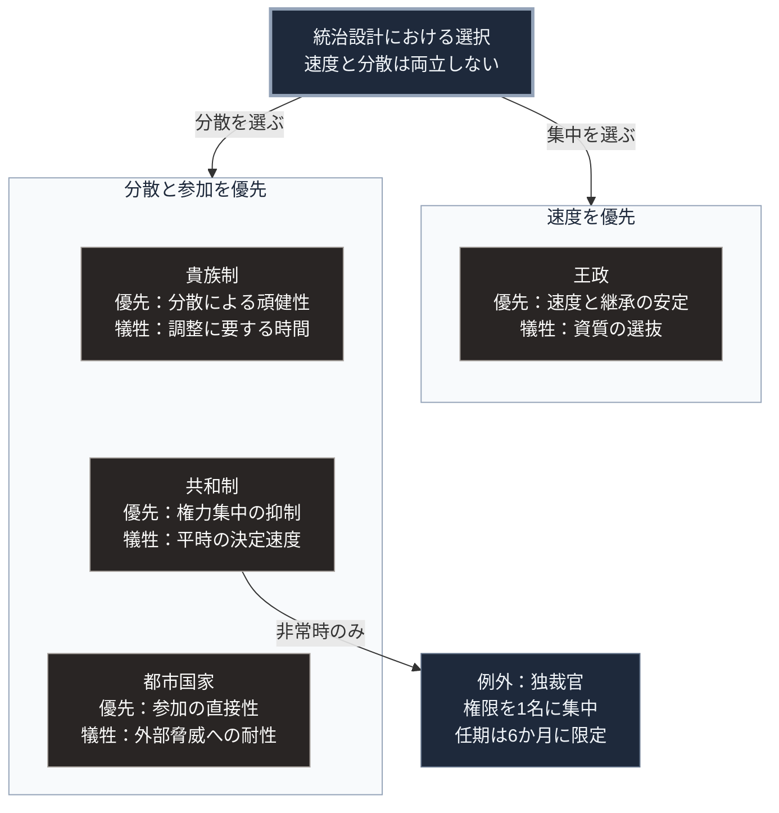

### 序論：本章が扱う範囲

本章は、近代の主権国家が成立する以前に運用されていた統治形態を整理します。対象は、王政、貴族制、共和制、そして都市国家です。

これらは過去の形態として扱われがちですが、その設計原理の一部は現代の制度に継承されています。本章では、それぞれが何を解決し、何を解決できなかったかを記述します。

### 1. 王政 ―― 継承による正統性の供給

王政の中核にある設計は、統治権の継承規則です。次の統治者があらかじめ決まっていることにより、権力移行のたびに争いが生じる事態を回避します。

この設計の利点は、意思決定の速度にあります。討議と同意調達を要しません。

制約は2点あります。第一に、継承規則が機能するには血統の連続が必要です。断絶した場合、正統性の供給源が失われます。第二に、統治者の資質が選抜されません。継承順位は能力と無関係に決まります。

ヨーロッパにおいては、王権の根拠を神による授権に求める議論が展開されました。17世紀イングランドのロバート・フィルマーは、王権をアダムに由来する家父長の権威として基礎づけています [ [ 268 ] ](https://openlibrary.org/works/OL4809894W) 。この議論は、王権が教会や貴族の同意に依存しないことを主張するものです。この主張に対する反論として、[第Ⅰ部B-1](isms-overview)で扱った社会契約に関する議論が提示されました。

### 2. 貴族制 ―― 分散した実力の連合

貴族制は、複数の有力者が統治権を分有する形態です。ヨーロッパの封建制においては、土地の保有と軍事的な奉仕とが結びつき、階層的な主従関係が形成されました [ [ 269 ] ](https://openlibrary.org/works/OL284442W) 。

この形態の利点は、権力の分散にあります。単一の失敗が全体に波及しにくい構造を持ちます。

制約は、調整費用にあります。有力者間の利害が対立した場合、決定に至るまでの時間と費用が増大します。外部からの脅威に対して迅速な動員を要する局面では、この制約が顕在化しました。

### 3. 共和制 ―― 権力の分割と相互の抑制

共和制の設計原理は、統治権を複数の機関へ分割したうえで相互の抑制を働かせる点にあります。

ローマ共和政においては、政務官、元老院、民会がそれぞれ異なる権能を持ちました。政務官の任期は原則1年とされ、同一の職には複数名を就ける形が採られます。

歴史家ポリュビオスは、ローマの体制を、王政的要素、貴族制的要素、民主制的要素を組み合わせた混合形態として記述しました [ [ 97 ] ](https://www.gutenberg.org/ebooks/44125) 。ポリュビオスの分析によれば、各要素が他の要素を抑制することで、単一形態に固有の劣化傾向を相殺できます。

この設計は、18世紀の議論に影響を与えました。権力を立法、行政、司法に分割する構想は、この系譜に位置します。

制約は、やはり速度です。相互の抑制は、決定の速度を意図的に低下させる仕組みです。ローマ共和政においては、非常時に権限を1名に集中させる独裁官の制度が設けられていました。任期は6か月に限定されます [ [ 271 ] ](https://www.gutenberg.org/ebooks/19725) 。

### 4. 都市国家 ―― 規模の限定による直接性

古代ギリシアの都市国家、および中世イタリアの都市共和国は、統治の単位を都市とその周辺に限定した形態です。

この限定により、構成員が相互に認知可能な規模が維持されます。討議への直接参加が現実的な範囲に収まります。

制約は、外部との関係にあります。単独では防衛力に限界があるため、同盟の形成や外部勢力への従属が必要になります。ギリシアの都市国家群は、ペルシアとの戦争において同盟を形成しました [ [ 270 ] ](https://www.gutenberg.org/ebooks/2707) 。しかし、その後の相互の戦争によって消耗しました [ [ 86 ] ](https://www.gutenberg.org/ebooks/7142) 。イタリアの都市共和国も、周辺の大規模な国家が台頭した局面で自律性を失っています。

### 🗺️ 図：4形態が最適化した対象

各形態が、何を優先し、何を犠牲にしたかを示します。

#### 図の読み方

この図は、最上段の選択が左右2つの枠に分かれる形をしています。左の枠が権力の集中によって速度を得る側、右の枠が分散を維持して速度を犠牲にする側です。

4つの形態に共通する軸は2つあります。1つは決定の速度、もう1つは権力の集中度です。この2つはおおむね逆の関係にあり、速度を得るには集中が必要で、集中を避ければ速度は低下します。左右に分けたのは、この対立を示すためです。

各箱の2行目が優先した対象、3行目が犠牲にした対象です。優れた形態と劣った形態があるのではなく、何を優先して何を犠牲にするかの配分が異なります。

右の枠の中で共和制の箱からだけ矢印が出て、下の「例外」の箱につながっています。ローマ共和政の独裁官は、平時は分散を維持し、非常時のみ集中を許し、ただし期間を限定するという設計でした。この構造は、現代の非常事態条項に継承されています。

右の枠の最下段にある都市国家が示すのは、参加の直接性が規模と両立しないという制約です。構成員が相互に認知できる規模を超えると、直接参加は代表による参加へ置き換えられます。ただし近代議会の制度的な起源は、[第Ⅰ部B-4](democracy-history)で記述したとおり、君主による課税同意の会議にあります。

---

### 現代社会構造への射程と本質（本章のまとめ）

本セクションは、著者による解釈です。前節までの記述とは区別して読んでください。

1.  **現代社会構造の原点**

    現代の統治機構は、これら4形態の要素を組み合わせた構造を持ちます。権力の分割と相互抑制は共和制から、非常事態における権限集中はローマの独裁官の制度から、それぞれ系譜をたどることができます。代表による参加という原理は、都市国家が直面した規模の制約に対応します。ただし近代議会の制度的な起源は、[第Ⅰ部B-4](democracy-history)で記述した課税同意の会議にあります。

2.  **歴史的事実の本質**

    本章から抽出できるのは、速度と分散のトレードオフが、統治設計における恒常的な制約であるという点です。この制約は、技術の進歩によって解消されていません。

    情報伝達の速度は飛躍的に向上しました。しかし、合意形成に要する時間は、伝達速度ではなく参加者の数と意見の分布によって決まります。

3.  **現代社会の現状と課題**

    [第Ⅱ部](japan-current-state)および[第Ⅲ部](future-method)では、この制約が現在どのように現れているかを扱います。とりわけ、外部環境の変化速度が高まった局面で、分散を維持したまま速度を確保する設計が可能かという問いは、本書の中心的な論点の1つです。
