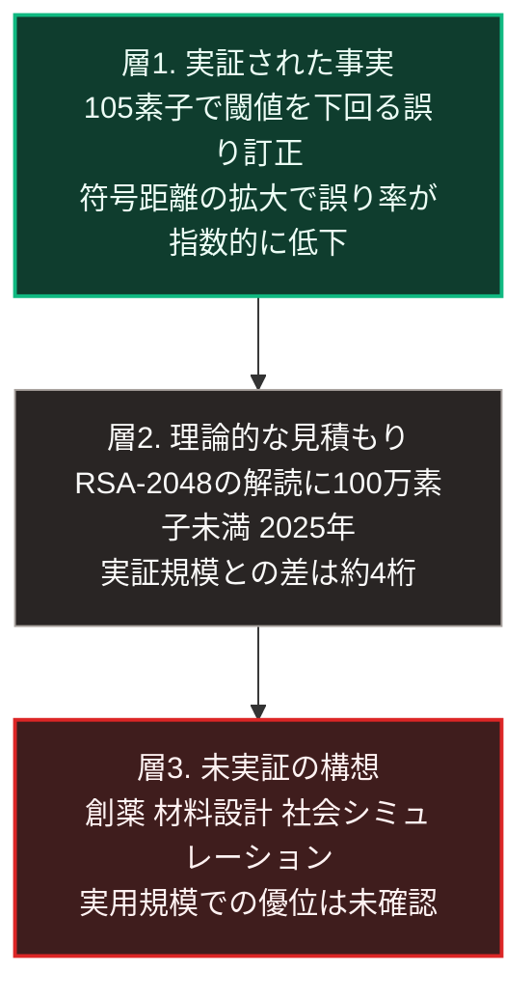

### 序論：本章が扱う範囲

本章は、量子計算の技術的な現状を、査読を経た論文と標準化機関の公表資料から整理します。

この分野では、能力に関する主張と実際の到達点との間に大きな開きが生じやすくなっています。したがって本章では、次の3点を厳密に区別します。第一に、実験によって実証された事実。第二に、理論的に見積もられた必要資源。第三に、現時点では実証されていない構想です。

なお本章は、量子計算を扱いますが、生命科学における近年の進展の多くは古典的な計算によるものです。この区別も本文で明示します。

### 1. 誤り訂正に関する実証

量子計算の実用化における中心的な課題は、演算の誤りです。物理的な素子は環境との相互作用によって状態を失うため、演算の途中で誤りが蓄積します。

この課題に対する理論的な解決策は、複数の物理素子を束ねて1つの論理素子を構成し、誤りを検出して訂正する方式です。この方式が機能するには、物理素子あたりの誤り率が一定の閾値を下回る必要があります。

2024年、研究チームがこの閾値を下回る動作を実証した論文を公表しました [ [ 160 ] ](https://www.nature.com/articles/s41586-024-08449-y) 。

この実験では、105個の物理素子を用いた装置において、符号の距離を3、5、7と拡大した際に、論理素子の誤り率が指数的に低下することが観測されました。報告された結果によれば、符号距離を2つ増やすごとに論理誤り率が約2.14分の1に低下しています。距離7の符号では、訂正サイクルあたりの誤り率が0.143%と報告されています [ [ 160 ] ](https://www.nature.com/articles/s41586-024-08449-y) 。

この結果が持つ意味は、装置を大型化すれば誤り率が改善するという関係が、実験的に確認された点にあります。

### 2. 暗号解読に必要な資源の見積もり

現在広く用いられている公開鍵暗号の一部は、大きな整数の素因数分解が困難であることを安全性の根拠としています。その代表がRSA方式であり、鍵の長さが2,048ビットのものはRSA-2048と呼ばれます。量子計算を用いた素因数分解の算法は1994年に提示されており、これが実行可能になれば、当該方式の安全性は失われます。

実行に必要な資源については、複数の見積もりが公表されています。2021年に公表された研究は、2,048ビットの整数を約8時間で素因数分解するために、およそ2,000万個の物理素子が必要になるとの見積もりを示しました [ [ 161 ] ](https://quantum-journal.org/papers/q-2021-04-15-433/) 。

この見積もりは、物理素子あたりの誤り率を1,000分の1、符号サイクル時間を1マイクロ秒とする前提に基づいています。

2025年5月に公表された研究は、同じ前提のもとで、この見積もりを大きく更新しました。同研究は、2,048ビットの整数を100万個未満のノイズ付き物理素子によって1週間未満で素因数分解できると見積もっています [ [ 325 ] ](https://arxiv.org/abs/2505.15917) 。誤り率と符号サイクル時間の前提は2021年の研究と同じであり、算法と誤り訂正の構成の改良によって必要素子数が約20分の1に減少しました。

前節で述べた実証実験の規模は105個です。2025年の見積もりが示す100万個との間には、約4桁の開きがあります。なお、2021年から2025年までの4年間で見積もりが1桁以上変動したという事実は、この種の見積もりが前提と算法の改良によって大きく動くことを示しています。

### 3. 標準化の動向

前節の開きにもかかわらず、暗号の移行は既に開始されています。

その理由は、暗号化されたデータが将来解読される可能性にあります。現在傍受されて保存されたデータが、将来の装置によって解読されうるためです。したがって、長期の秘匿を要するデータについては、装置の完成を待たずに移行する必要があります。

米国国立標準技術研究所は2024年8月、量子計算に耐性を持つ暗号方式の標準を確定しました。鍵カプセル化の方式 [ [ 162 ] ](https://csrc.nist.gov/pubs/fips/203/final) 、および2種類の電子署名方式 [ [ 163 ] ](https://csrc.nist.gov/pubs/fips/204/final)  [ [ 164 ] ](https://csrc.nist.gov/pubs/fips/205/final) です。

同研究所は、移行に関する情報を継続的に公表しています [ [ 165 ] ](https://csrc.nist.gov/projects/post-quantum-cryptography) 。

### 4. 生命科学における計算の進展

タンパク質の立体構造予測については、2021年に大きな進展が報告されました [ [ 166 ] ](https://www.nature.com/articles/s41586-021-03819-2) 。予測された構造は、公開のデータベースとして提供されています [ [ 167 ] ](https://alphafold.ebi.ac.uk/) 。

ここで重要な区別があります。この進展は、量子計算によるものではありません。古典的な計算機上で動作する深層学習の手法によって達成されました。

したがって「量子計算によって創薬が加速する」という記述を、現時点で実証された事実として扱うことはできません。実際に生じているのは、古典的な機械学習による予測精度の向上です。

量子計算が化学計算において優位を持つという主張には理論的な根拠があります。分子の電子状態は量子力学に従うため、量子的な系による模擬が原理的に効率的でありうるためです。ただし、実用的な規模での優位は、現時点で実証されていません。

### 🗺️ 図：実証・見積もり・構想の3層

量子計算に関する主張を、確度によって分類します。

#### 図の読み方

この3層の区別は、本書の記述規範に直結します。

層1は、査読を経た実験結果です。ここに記載した数値は、追試の対象となりうる形で公表されています。

層2は、明示された前提のもとでの計算です。前提が変われば結果は変わります。実際に、2021年の約2,000万個という見積もりは、2025年には100万個未満へ更新されました。見積もりは前提と算法の改良によって1桁以上変動します。したがって、この見積もりは「必要資源の桁を示すもの」として扱うべきであり、実現時期の予測ではありません。

なお、本章の層1から層3は主張の実証度による区別です。第Ⅲ部-1で定義する階層1から階層4は、事象の発生時期の予測可能性による区別であり、別の体系です。両者を併読する際は、混同しないよう注意が必要です。

層3は、現時点では構想です。実現しうる根拠は存在しますが、実用規模での優位は実証されていません。

未来予測において重要なのは、この3層を混同しないことです。層1の成果を根拠として層3を主張することは、推論として成立しません。

同時に、層3が実現しないという断定も成立しません。第Ⅰ部C-1で整理した4段階モデルに照らせば、量子計算は効果1、すなわち作業の代替の段階にも到達していません。実証されているのは、その前提となる基盤技術です。

したがって、第Ⅲ部において量子計算を扱う際、本書は次の方針を採ります。層1と層2に基づく影響、すなわち暗号方式の移行については、確度の高い変化として扱います。層3に属する影響については、シナリオの分岐要素として、実現した場合と実現しなかった場合の双方を検討します。

---

### 現代社会構造への射程と本質（本章のまとめ）

本セクションは、著者による解釈です。前節までの記述とは区別して読んでください。

1.  **現在の構造がどこから来たか**

    現在の情報基盤は、特定の数学的問題が計算困難であることを前提としています。電子商取引、行政の電子手続、通信の秘匿がこれに該当します。

    この前提は、絶対的なものではありません。計算の方式が変われば、困難さの評価も変わります。標準化機関が移行を進めているのは、この認識に基づきます。

2.  **本質**

    本章から抽出できるのは、技術予測における確度の階層という論点です。

    ある技術について、基盤の実証、必要資源の見積もり、応用の構想は、それぞれ異なる確度を持ちます。これらを混同すると、実現時期の見積もりが大きく外れます。

    第Ⅰ部C-1で参照したデイヴィッドの分析が示したとおり、技術の効果は組織の再設計を経て発現します。基盤技術の実証から社会的な効果の発現までには、複数の段階と長い時間が挟まります。

3.  **実務上の含意**

    現時点で確度が高いのは、暗号方式の移行です。これは既に標準が確定しており、対応の要否ではなく実施時期の問題となっています。

    長期の秘匿を要するデータを扱う組織については、移行計画の策定が現実的な課題です。第Ⅴ部では、この論点を分散型のデータ基盤の設計とあわせて扱います。
