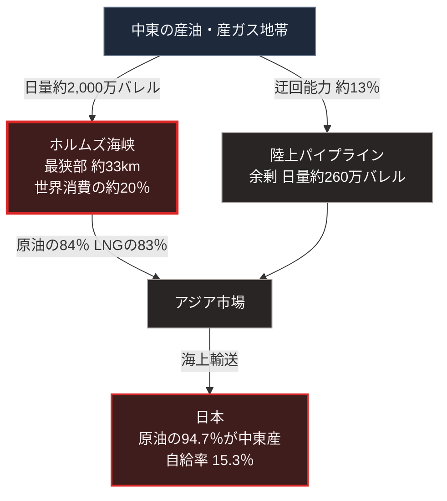

### 序論：本章が扱う範囲

本章は、イランおよびイスラエルを当事者とする近年の武力行使について、次の3点を整理します。

第一に、攻撃対象として選択された施設の類型。第二に、海上交通の要衝が持つ構造的な意味。第三に、これらが日本の供給基盤に対して持つ含意です。

前章と同様、本章の情報源は国際機関および政府機関の公表資料に限定します。戦況の逐次的な記述は行いません。

### 1. 2025年6月の経緯と攻撃対象

2025年6月12日、国際原子力機関の理事会は決議を採択し、イランが保障措置協定に基づく義務を履行していないと認定しました。同決議は、未申告の場所における核物質と活動について、イランが2019年以降、機関への完全かつ適時の協力を怠ってきたと記述しています [ [ 311 ] ](https://www.iaea.org/sites/default/files/25/06/gov2025-38.pdf) 。

同年6月13日、イスラエルはイランに対する軍事作戦を開始しました。国際原子力機関は同日の声明で、この作戦がイラン国内の核施設への攻撃を含むこと、そしてナタンズの濃縮施設が影響を受けたことをイラン当局が確認したと公表しました [ [ 312 ] ](https://www.iaea.org/newscenter/statements/statement-on-the-situation-in-iran-13-june-2025) 。

同年6月22日、アメリカはフォルドウ、ナタンズ、イスファハンの3か所の核施設を空爆しました。国際原子力機関は同日、これらの施設が攻撃を受けたことを確認しました [ [ 313 ] ](https://www.iaea.org/newscenter/pressreleases/update-on-developments-in-iran-5) 。同機関の事務局長は国際連合安全保障理事会に対し、フォルドウには地中貫通弾によるクレーターが確認できる一方、地下の損傷を評価できる者は機関を含めて存在しないと述べました [ [ 314 ] ](https://www.iaea.org/newscenter/statements/iaea-director-general-grossis-statement-to-unsc-on-situation-in-iran-22-june-2025) 。

同年6月24日、国際連合の事務総長はイランとイスラエルの間の停戦の発表を歓迎する声明を出しました [ [ 315 ] ](https://news.un.org/en/story/2025/06/1164851) 。

以上の経緯において、公的資料によって確認できる攻撃対象は、核関連施設と軍事施設です。エネルギー施設への攻撃については報道が存在しますが、本書の規範に合致する一次資料を確認できないため、本文では扱いません。

これとは別に、紅海においては海上を航行する船舶が攻撃対象となりました。この点は第3節で扱います。

国際原子力機関は、核関連施設の状態と査察に関する情報を継続的に公表しています [ [ 149 ] ](https://www.iaea.org/newscenter/pressreleases) 。国際連合安全保障理事会は、関連する決議および議長声明を公表しています [ [ 151 ] ](https://www.un.org/securitycouncil/) 。

### 2. ホルムズ海峡の構造的な位置

米国エネルギー情報局によれば、2024年においてホルムズ海峡を通過した石油の量は日量約2,000万バレルです。これは世界における石油系の液体燃料消費のうち、およそ20%に相当します [ [ 152 ] ](https://www.eia.gov/todayinenergy/detail.php?id=65504) 。

同局の分析によれば、2024年から2025年第1四半期において、この海峡を通過した量は、世界の海上石油貿易の4分の1を超えています。

同局はまた、2024年においてホルムズ海峡を通過した原油とコンデンセートの84%がアジア市場向けであったと推計しています。

液化天然ガスについては、2024年に世界の貿易量のおよそ20%がこの海峡を通過しました。主たる輸出元はカタールであり、日量約93億立方フィートです [ [ 153 ] ](https://www.eia.gov/todayinenergy/detail.php?id=65584) 。この海峡を通過した液化天然ガスの83%が、アジア市場へ向かっています。

### 3. 紅海における航行の変化

同局は、紅海を通過するタンカーの隻数が2024年に減少したことを報告しています [ [ 154 ] ](https://www.eia.gov/todayinenergy/detail.php?id=63446) 。

この変化は、船舶に対する攻撃の発生を受けて、運航者が喜望峰を経由する航路へ変更したことによるものです。この迂回は、航行距離と所要日数を増加させます。

### 4. 通行の要衝という構造

[第Ⅰ部D-1](war-why-states-fight)で整理した摩擦の類型のうち、「通行と接続をめぐる摩擦」に該当する事例です。

この類型の特徴は、物理的な要衝が限定されている点にあります。ホルムズ海峡の最狭部は約33キロメートルであり、航路帯はさらに狭い範囲に限られます [ [ 252 ] ](https://www.eia.gov/international/analysis/special-topics/World_Oil_Transit_Chokepoints) 。

代替経路は存在しますが、容量に制約があります。サウジアラビアとアラブ首長国連邦は、海峡を経由しない陸上パイプラインを保有しています。米国エネルギー情報局によれば、サウジアラビアの東西パイプラインの能力は日量500万バレルであり、2019年には一時的に700万バレルまで拡張されました。アラブ首長国連邦のパイプラインは日量180万バレルです。同局は、供給途絶時に海峡を迂回できる余剰能力を日量約260万バレルと推計しています [ [ 152 ] ](https://www.eia.gov/todayinenergy/detail.php?id=65504) 。海峡の通過量である日量約2,000万バレルに対して、この能力は約13%にとどまります。

### 5. 日本の原油輸入における中東の比率

資源エネルギー庁によれば、2023年度の原油輸入に占める中東地域の割合は94.7%です。同庁は、2023年のアメリカの中東依存度が9.3%、欧州OECD諸国が16.5%であることと比較し、日本の依存度が極めて高い水準にあると記述しています [ [ 316 ] ](https://www.enecho.meti.go.jp/about/energytrends/202506/html/s-1-3.html) 。

### 🗺️ 図：日本の一次エネルギー供給と要衝の関係

供給経路の集中と、迂回路の容量を示します。

#### 図の読み方

この図は、上段の産地から下段の日本へ至る縦の経路です。中段は左右2列に分かれます。左列が海峡、右列が陸上の迂回路です。左右の矢印に記した数量の差が、経路の集中を表します。

この図は、[第Ⅱ部A-1](japan-current-state)で示した日本のエネルギー自給率15.3%という数値が、何を意味するかを経路として表現したものです。残る約85%は輸入です。原油については、その94.7%が中東産です。したがって、原油の相当部分が左列の経路を通ります。すなわち、限定された物理的要衝を通過します。

右列の迂回路は存在しますが、容量が不足しています。海峡の通過量に対して約13%にとどまります。したがって、遮断が生じた場合、供給量の減少は避けられません。

ここで重要なのは、確率ではなく構造です。海峡の遮断される確率がどの程度かという問いを、本章では扱いません。扱うのは、遮断された場合に代替経路が存在するかという問いです。

[第Ⅰ部D-1](war-why-states-fight)で整理した枠組みに照らすと、この類型の摩擦は交渉による解決が困難です。要衝の管理権は、分割が困難な争点に近い性質を持つためです。フィアロン自身は争点の不可分性の適用に慎重ですが、海峡の通航という争点はその第三の条件に近い事例として位置づけられます。

[第Ⅲ部](future-method)では、この経路が部分的または全面的に制約された場合の影響を、シナリオの一要素として評価します。[第Ⅴ部](42_taoist-wu-wei-non-action)では、供給が制約された状況において、局所的にエネルギーを確保する方式を検討します。

---

### 現代社会構造への射程と本質（本章のまとめ）

本セクションは、著者による解釈です。前節までの記述とは区別して読んでください。

1.  **この事例が示していること**

    前章のウクライナの事例と本章の事例に共通するのは、攻撃対象が軍事施設に限定されないという点です。

    ウクライナでは発電設備と送電網が、中東では核関連施設と紅海を航行する船舶が対象となりました。前者は相手の継戦能力を、後者は経済活動を支える輸送経路を対象とした事例です。

2.  **本質**

    この2つの事例から抽出できるのは、次の構造です。現代の武力行使において、軍事力そのものだけでなく、それを支える供給基盤が標的に含まれる事例が観測されています。

    この選択には合理性があります。軍事力は分散と防護が可能ですが、大規模な供給設備は移動できず、代替に長期間を要するためです。

    [第Ⅰ部D-2](war-technology-evolution)で整理した費用構造の観点からも、同じ結論が導かれます。安価な手段で高価な設備を機能停止させられる場合、攻撃側の費用対効果は最大化されます。

3.  **日本にとっての含意**

    日本のエネルギー供給は、2つの異なる脆弱性を同時に抱えています。

    第一に、輸入経路の集中です。本章で示した海峡が、その中心にあります。

    第二に、国内における設備の集約です。受入基地、精製設備、そして大規模発電所は、限られた箇所に集中しています。

    この2つは独立した脆弱性です。したがって、一方への対処が他方を解決することはありません。[第Ⅴ部](42_taoist-wu-wei-non-action)では、両者に対する設計を分けて検討します。
